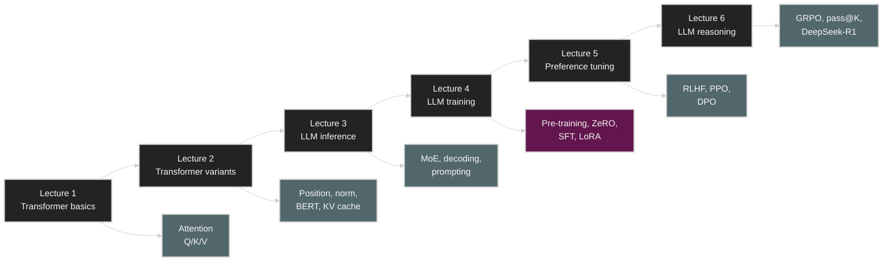

# CME295 Lecture Notes

This folder collects lecture notes based on CME295 lecture videos. Each lecture README contains a lecture summary, key concepts, practical-perspective notes, review questions with answers, and Mermaid/SVG diagrams.

## Lectures

| Lecture | Topic | Notes | Source |
| ------- | ----- | ----- | ------ |
| 01 | Transformer basics | [lec-01/README.md](lec-01/) | [YouTube](https://www.youtube.com/watch?v=Ub3GoFaUcds) |
| 02 | Transformer-based models and tricks | [lec-02/README.md](lec-02/) | [YouTube](https://www.youtube.com/watch?v=yT84Y5zCnaA) |
| 03 | LLMs, decoding, prompting, and inference | [lec-03/README.md](lec-03/) | [YouTube](https://www.youtube.com/watch?v=Q5baLehv5So) |
| 04 | LLM training, fine-tuning, and efficient adaptation | [lec-04/README.md](lec-04/) | [YouTube](https://www.youtube.com/watch?v=VlA_jt_3Qc4) |
| 05 | LLM tuning and human preferences | [lec-05/README.md](lec-05/) | [YouTube](https://www.youtube.com/watch?v=PmW_TMQ3l0I) |
| 06 | LLM reasoning and GRPO | [lec-06/README.md](lec-06/) | [YouTube](https://www.youtube.com/watch?v=k5Fh-UgTuCo) |

## Learning Path

## Lecture Overview

### Lecture 1: Transformer

Lecture 1 walks through NLP tasks, tokenization, representation learning, the limits of RNN/LSTM, and the need for attention, and then explains the Transformer encoder-decoder architecture. The core idea is that self-attention computes dependencies between tokens in parallel and behaves like information retrieval through its query/key/value structure.

Key diagrams:

* [self-attention-qkv.svg](lec-01/assets/self-attention-qkv.svg)
* [transformer-encoder-decoder.svg](lec-01/assets/transformer-encoder-decoder.svg)

### Lecture 2: Transformer-Based Models and Tricks

Lecture 2 covers what is needed to extend the Transformer into a real model family: positional encoding, RoPE, layer normalization, RMSNorm, MHA/MQA/GQA, encoder-only models, and BERT pre-training. If Lecture 1 explained the basic principles of the architecture, Lecture 2 organizes the design choices that make modern Transformers stable and efficient.

Key diagrams:

* [rope-rotation.svg](lec-02/assets/rope-rotation.svg)
* [mha-mqa-gqa-kv-cache.svg](lec-02/assets/mha-mqa-gqa-kv-cache.svg)

### Lecture 3: Large Language Models, Decoding, Prompting, and Inference

Lecture 3 covers how the decoder-only Transformer scales into an LLM. The focus is on inference-time behavior and serving optimization: Mixture of Experts, next-token decoding, greedy/beam/sampling, temperature, prompt structure, in-context learning, chain of thought, KV cache, PagedAttention, and speculative decoding.

Key diagrams:

* [moe-routing.svg](lec-03/assets/moe-routing.svg)
* [kv-cache-decoding.svg](lec-03/assets/kv-cache-decoding.svg)

### Lecture 4: LLM Training, Fine-Tuning, and Efficient Adaptation

Lecture 4 explains how LLMs are trained and tuned. The core topics are pre-training, scaling laws, FLOPs/FLOP/s, GPU memory footprint, data parallelism, ZeRO, model parallelism, FlashAttention, mixed precision, SFT, instruction tuning, evaluation, alignment, LoRA, and QLoRA.

Key diagrams:

* [zero-sharding.svg](lec-04/assets/zero-sharding.svg)
* [flashattention-io.svg](lec-04/assets/flashattention-io.svg)
* [mixed-precision-training.svg](lec-04/assets/mixed-precision-training.svg)
* [lora-qlora-adaptation.svg](lec-04/assets/lora-qlora-adaptation.svg)

### Lecture 5: LLM Tuning and Human Preferences

Lecture 5 covers preference tuning, which adjusts an SFT model to match human preferences. The core topics are pairwise preference data, reward models, the Bradley-Terry formulation, RLHF, PPO clip/KL penalty, reward hacking, best-of-N, and DPO.

Key diagrams:

* [preference-tuning-pipeline.svg](lec-05/assets/preference-tuning-pipeline.svg)
* [rlhf-dpo-tradeoff.svg](lec-05/assets/rlhf-dpo-tradeoff.svg)

### Lecture 6: LLM Reasoning and GRPO

Lecture 6 treats reasoning models as LLMs that generate a reasoning chain before the answer, and explains how to train reasoning behavior with verifiable rewards and GRPO on tasks where the answer can be verified, like math and code. The core topics are pass@K, sampling temperature, reasoning token cost, output length growth, the DeepSeek-R1-Zero/R1 training pipeline, and reasoning distillation.

Key diagrams:

* [reasoning-token-budget.svg](lec-06/assets/reasoning-token-budget.svg)
* [grpo-group-advantage.svg](lec-06/assets/grpo-group-advantage.svg)

## Concept Map

| Concept | First covered | Later use |
| ------- | ------------- | --------- |
| Tokenization | [Lecture 1](lec-01//#from-text-to-tokens) | pre-training data, SFT loss masking |
| Self-attention | [Lecture 1](lec-01//#self-attention) | MHA, KV cache, FlashAttention |
| Q/K/V | [Lecture 1](lec-01//#query-key-and-value) | MHA/MQA/GQA, RoPE, KV cache |
| Positional information | [Lecture 2](lec-02//#why-position-information-is-needed) | long context, RoPE, context rot |
| Transformer families | [Lecture 2](lec-02//#transformer-model-families) | decoder-only LLMs |
| Decoder-only LLM | [Lecture 3](lec-03//#decoder-only-backbone) | pre-training and SFT |
| MoE | [Lecture 3](lec-03//#mixture-of-experts) | expert parallelism |
| KV cache | [Lecture 3](lec-03//#kv-cache) | inference memory and throughput |
| Scaling laws | [Lecture 4](lec-04//#scaling-laws-and-chinchilla) | model/data/compute allocation |
| ZeRO | [Lecture 4](lec-04//#data-parallelism-and-zero) | distributed training memory |
| FlashAttention | [Lecture 4](lec-04//#flashattention) | exact attention with lower HBM IO |
| LoRA/QLoRA | [Lecture 4](lec-04//#lora) | efficient fine-tuning |
| Preference tuning | [Lecture 5](lec-05//#why-preference-tuning) | human preference alignment after SFT |
| Reward model | [Lecture 5](lec-05//#reward-model-training) | RLHF and best-of-N scoring |
| PPO | [Lecture 5](lec-05//#ppo-clip) | RLHF policy optimization |
| DPO | [Lecture 5](lec-05//#dpo) | supervised-style preference optimization |
| Chain of thought | [Lecture 3](lec-03//#chain-of-thought) | reasoning chains and test-time compute |
| Preference tuning / PPO | [Lecture 5](lec-05//#rlhf-pipeline) | GRPO comparison and reasoning RL |
| pass@K | [Lecture 6](lec-06//#pass-at-k) | coding/math reasoning evaluation |
| GRPO | [Lecture 6](lec-06//#grpo) | reasoning model RL training |
| DeepSeek-R1 | [Lecture 6](lec-06//#deepseek-r1-zero-and-deepseek-r1) | multi-stage reasoning training pipeline |

## Repository Notes

* Lecture notes are written in English, while technical terms stay in their standard English form.
* SVG diagrams use the shared editorial style from [AGENTS.md](https://github.com/kuanghl/ai-data-center-systems/blob/master/AGENTS.md): restrained palette, thin line boxes, minimal fill, and accent red only for critical paths.
* Mermaid diagrams include local `classDef` styling so they follow the same visual scheme in GitHub-rendered markdown.
* Each lecture README ends with review questions and answers for quick self-checking.
