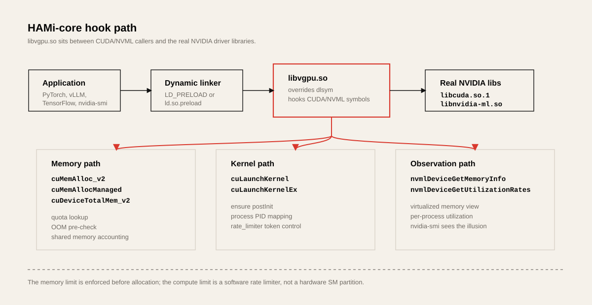

# HAMi-core Deep Dive: How `libvgpu.so` Splits a GPU

HAMi's Kubernetes components place the pod, set the GPU memory/core quotas, and then inject `libvgpu.so` into the container. But the core of GPU partitioning comes after that. Inside the container, `libvgpu.so` intervenes in the CUDA and NVML call paths and changes the GPU size the application sees and the resources it can use.

HAMi-core is the in-container GPU resource controller that takes on this role. The official README also describes HAMi-core as a library that intercepts API calls between the CUDA runtime and the CUDA driver. This article examines, centered on the code paths, exactly where the "virtual GPU" that HAMi-core creates takes shape and its limits.

The source baseline is `Project-HAMi/HAMi` `2487a24` and `Project-HAMi/HAMi-core` `8f3a89c`, checked on July 7, 2026. Since the implementation keeps changing, it is better to grasp the control flow and where the limits are applied rather than the specific function names.

## One-Line Summary

HAMi-core does not partition the GPU at the hardware level. Instead, it pre-loads `libvgpu.so` into the container and hooks the CUDA driver API and NVML API to do the following three things.

| Function | Implementation location | Nature |
| --- | --- | --- |
| memory virtualization | `cuDeviceTotalMem_v2`, NVML memory query hooks | makes the GPU memory size appear to the application as the quota |
| memory limiting | `cuMemAlloc_v2`, `cuMemAllocManaged`, allocator/usage aggregation | blocks allocations exceeding the quota with OOM |
| compute throttling | `cuLaunchKernel`, `cuLaunchKernelEx`, `rate_limiter` | applies software speed limits on the kernel execution path |

The most important point is that the strength of the memory and compute limits differs. Memory allocation is an explicit API event, so quota checks and usage aggregation are easy to apply. On the other hand, compute is close to a scheme that is adjusted in software at kernel execution time rather than physically partitioning SMs.



## Values That Cross From Kubernetes Into the Container

HAMi-core does not operate independently. The HAMi Device Plugin on the Kubernetes side injects the required values before the container starts. The NVIDIA Device Plugin's `Allocate` path puts roughly the following items into the container response in non-MIG mode.

| Injected item | Meaning |
| --- | --- |
| `CUDA_DEVICE_MEMORY_LIMIT_<index>` | memory quota per logical GPU. Example: `CUDA_DEVICE_MEMORY_LIMIT_0=12000m` |
| `CUDA_DEVICE_SM_LIMIT` | compute utilization ceiling. Example: `40` |
| `CUDA_DEVICE_MEMORY_SHARED_CACHE` | cache path for aggregating memory usage across processes |
| `CUDA_OVERSUBSCRIBE` | passes memory scaling/oversubscription settings |
| `LIBCUDA_LOG_LEVEL` | HAMi-core log level |
| `/usr/local/vgpu/libvgpu.so` or `libvgpu.so` at the hook path | the actual hook library |
| `/etc/ld.so.preload` | setting that makes container processes load `libvgpu.so` first |
| `/tmp/vgpulock` | lock directory shared by multiple processes |

So when the HAMi scheduler allocates "12GB of GPU memory, 40% of the cores" to this pod, the Device Plugin converts that decision into environment variables and mounts and passes them to the container. HAMi-core reads these values and starts applying the limits inside the application process.

This boundary is the core of HAMi.

```text
Kubernetes scheduler's decision
  -> pod annotation
  -> Device Plugin Allocate
  -> environment variable/mount injection
  -> libvgpu.so runtime hook
```

## Where the Hooks Are Applied

HAMi-core's entry point is `src/libvgpu.c`. The most striking part is that it redefines `dlsym` itself. Many CUDA frameworks either link CUDA driver symbols directly or look them up with `dlsym`. HAMi-core intercepts `dlsym(handle, symbol)` calls, and if the symbol name starts with `cu...` it first checks the CUDA hook table, and if it starts with `nvml...` it checks the NVML hook table.

Simplified, it looks like this.

```text
application calls dlsym("cuMemAlloc_v2")
  -> libvgpu.so's dlsym redefinition
  -> checks whether the symbol starts with "cu"
  -> returns HAMi-core's cuMemAlloc_v2 wrapper
  -> the wrapper performs quota checks and usage aggregation
  -> if allowed, calls the real cuMemAlloc_v2
```

`libvgpu.c` has a long list of entries like `DLSYM_HOOK_FUNC(cuMemAlloc_v2)`, `DLSYM_HOOK_FUNC(cuDeviceTotalMem_v2)`, and `DLSYM_HOOK_FUNC(cuLaunchKernel)`. Separately, `cuda_library_entry[]` in `src/cuda/hook.c` manages the list of CUDA symbols to hook. This list includes memory allocation, context, stream, kernel launch, CUDA graphs, and the virtual memory APIs.

NVML is hooked the same way. `__dlsym_hook_section_nvml()` intercepts observation APIs such as `nvmlDeviceGetMemoryInfo`, `nvmlDeviceGetUtilizationRates`, and `nvmlDeviceGetComputeRunningProcesses`. So `nvidia-smi` and framework NVML-based monitoring also see the memory view that HAMi-core creates.

## Initialization Has Two Stages

HAMi-core's initialization is divided into `preInit()` and `postInit()`.

| Stage | Trigger | Main work |
| --- | --- | --- |
| `preInit()` | CUDA symbol lookup or around `cuInit` | log initialization, obtaining the real `dlsym`, loading the real CUDA library, hook table initialization |
| `postInit()` | after `cuInit` succeeds or `ensure_post_init()` before kernel launch | allocator initialization, visible device mapping, host PID detection, utilization watcher initialization |

The reason initialization is split this way is that the actual state of a CUDA process differs before and after `cuInit`. Hooking CUDA library symbols must be done early, but which GPU context the process created and which host PID it appears as in NVML can only be known stably after CUDA initialization.

The especially important stage in `postInit()` is host PID detection. Since the in-container PID and the PID that NVML recognizes on the host can differ, HAMi-core compares NVML's running process list, keeps the base context, finds the newly appeared PID, and connects it to usage aggregation. If this process succeeds, `pidfound=1` is set and the kernel execution rate limiter can also be activated. On failure, it falls back to container-PID-based usage aggregation.

In recent code, the host PID detection in `postInit()` is serialized with a shared memory semaphore. Separately, `utils.c` retains an integrated lock implementation that takes `flock()` on `/tmp/vgpulock/lock`. These two synchronization approaches show the structural characteristic that HAMi-core, while being a process-local library, must aggregate common usage across nodes and processes.

## Memory Virtualization: Making the GPU Look Smaller

The first virtualization effect in GPU memory partitioning is "making it look as if this GPU only has as much total memory as the quota". For example, even if the physical GPU is 80GB, if the pod received `gpumem: 12000`, the application must behave as if it received a 12GB GPU.

On the CUDA driver API side, the `cuDeviceTotalMem_v2` hook plays this role. The original function returns the physical GPU's total memory, but the HAMi-core wrapper puts the `get_current_device_memory_limit(dev)` value into `bytes` and returns `CUDA_SUCCESS`.

This matters for application compatibility. Many frameworks look at `total_memory` before loading the model to decide batch size, workspace, and cache policy. If the full memory of the physical GPU is visible here, the framework can plan beyond the quota and later hit OOM.

The NVML hooks are needed for the same reason. The total/used/free memory values that `nvidia-smi` and monitoring agents see must match the quota, so that the user experience and billing metrics are consistent.

But this stage is, in the end, only virtualizing observed values. The actual physical GPU memory has not been partitioned into a separate address space. The real limit is applied on the allocation path.

## Memory Limiting: Return OOM Before Allocation

The center of memory quota enforcement is `src/cuda/memory.c` and `src/allocator/allocator.c`.

The representative path is as follows.

```text
cuMemAlloc_v2(dptr, bytesize)
  -> ENSURE_RUNNING()
  -> allocate_raw()
  -> add_chunk()
  -> oom_check(dev, bytesize)
  -> real cuMemAlloc_v2 or cuMemoryAllocate
  -> add_gpu_device_memory_usage()
```

`oom_check(dev, addon)` compares the current device memory usage against the quota. If adding the new allocation would exceed the limit, it returns a `CUDA_ERROR_OUT_OF_MEMORY`-family error. From the application's perspective, it looks like an ordinary CUDA OOM.

A striking point in recent allocator implementations is the structure that tries to perform expensive GPU allocations outside the lock. `add_chunk()` first does the OOM pre-check, calls the real `cuMemAlloc_v2` or `cuMemoryAllocate`, and then handles the tracking list and shared usage update inside a mutex. Since another process may have used memory in the meantime, it performs the OOM check once more right before tracking, and if the limit is exceeded it frees the allocation it just received.

This design has the following tradeoffs.

| Choice | Benefit | Remaining risk |
| --- | --- | --- |
| OOM pre-check before allocation | quickly blocks quota overruns | a race condition can arise between the check and the real allocation |
| GPU allocation outside the lock | reduces global lock hold time | re-check right before tracking is needed |
| shared usage aggregation | multiple processes can be grouped under one quota | cleanup of terminated process slots and lock contention are needed |

`cuMemAllocManaged`, `cuMemAllocPitch_v2`, and the host memory allocation family also have separate wrappers. Not every CUDA memory API is aggregated with exactly the same accuracy, so when a new CUDA API is added, the hook table and allocator path must be updated together. This is also why HAMi-core has a script that checks CUDA hook consistency.

## Multi-Process Usage Aggregation: Why a Shared Area Is Needed

Even within a single pod, there can be multiple GPU processes. Python data loaders, model workers, vLLM engine processes, and framework child processes can all use GPU memory. If the quota is at the container level, per-process usage must be summed.

For this, HAMi-core uses shared memory areas and semaphores. The `multiprocess` directory separates memory limits, utilization watchers, and shared area tools. The key point is that a process-local allocator list alone is not sufficient.

```text
process A allocates 4GB
process B allocates 5GB
process C attempts to allocate 6GB

quota = 12GB
current usage = 9GB
C must fail even though it has allocated 0GB so far
```

So the allocation path updates both the per-process local list and the shared usage. When a process terminates, the termination handler must clean up the slot, and if an abnormal termination occurs, stale slots must be cleaned up. This is also why `oom_check()` attempts `clear_proc_slot`-family cleanup on limit exceedance.

From an operational viewpoint, this structure means two things.

First, HAMi-core does not implement GPU memory quotas as only a process-local limit. Because it sees multiple processes sharing the same quota together, it suits workloads like inference worker pools.

Second, shared usage aggregation cannot avoid lock and cleanup problems. In high-density workloads, if many processes perform `cuInit` or memory allocation simultaneously, startup or allocation latency can grow.

## Compute Limiting: A Rate Limiter, Not an SM Partition

`CUDA_DEVICE_SM_LIMIT` or HAMi's `gpucores` is easily misunderstood as a hardware SM partition because of the name. But HAMi-core's non-MIG path does not work that way.

Looking at the kernel launch wrappers, `cuLaunchKernel` and `cuLaunchKernelEx` go through `ensure_post_init()`, `pre_launch_kernel()`, and `rate_limiter(...)` before calling the real CUDA execution function. The `rate_limiter` adjusts software tokens based on the current device, grid size, block size, cached SM limit, and utilization policy.

The important point is that this limit does not mean "exclusively assign 40% of the SMs to this container". A more accurate expression is the following.

```text
Observe and delay the kernel execution flow so that
the long-term average compute usage stays near the set limit.
```

So the failure patterns of memory quotas and compute quotas differ.

| Item | Memory quota | Compute quota |
| --- | --- | --- |
| intervention point | allocation API | kernel launch API |
| failure form | `CUDA_ERROR_OUT_OF_MEMORY` | execution delay, throughput reduction |
| enforcement | relatively clear | soft limit sensitive to workload characteristics |
| hardware isolation | none | none |
| main observation metrics | peak memory usage, OOM, model load success rate | p95/p99 latency, throughput, impact on neighboring workloads |

A workload that runs short, large kernels occasionally and a workload that runs small kernels very frequently can have different perceived performance even with the same `gpucores` value. Because the rate limiter sits on the kernel execution path.

## NVML Hooks: The World `nvidia-smi` Sees

If HAMi-core had hooked only CUDA, it could have limited the application's memory allocations, but the GPU state seen by users and operators would have been the physical GPU as-is. This is why the NVML hooks matter.

NVML is the main path through which `nvidia-smi`, DCGM-family exporters, and framework monitoring code read GPU state. HAMi-core hooks many NVML symbols such as `nvmlDeviceGetMemoryInfo`, `nvmlDeviceGetUtilizationRates`, and `nvmlDeviceGetComputeRunningProcesses`.

These hooks have two purposes.

| Purpose | Description |
| --- | --- |
| user experience | makes `nvidia-smi` inside the container display quota-based memory |
| usage aggregation | connects host PID, process utilization, and memory usage to HAMi-core shared state |

For this reason, HAMi-core is a "limiter" and at the same time an "observed-value transformer". Making users appear to have received a partitioned GPU is as important as actually splitting the GPU.

## How Much Isolation Can Be Trusted

Looking at HAMi-core's structure, the conclusion naturally follows that the isolation level should not be overestimated.

| Boundary | Meaning in HAMi-core non-MIG |
| --- | --- |
| memory capacity | quota applied on the CUDA allocation path |
| SM/compute | soft throttling on the kernel execution path |
| L2 cache/memory bandwidth | no strong separation |
| PCIe/NVLink bandwidth | no strong separation |
| fault isolation | weaker than hardware/virtualization boundaries like MIG/vGPU |
| security boundary | hard to treat as a strong boundary between untrusted tenants |

In other words, HAMi-core is very useful for utilization improvement and operational quota enforcement, but it is not a hardware partition. If cloud tenancy with external customers mixed in, strong fault isolation, or blocking interference between neighboring workloads matters, MIG, vGPU, or SR-IOV backends should be considered separately.

Conversely, in inference services, notebooks, batch inference, and small-model serving environments within the same organization, this tradeoff is quite attractive. VRAM that would be wasted if the whole GPU were allocated can be split into small quotas, and existing CUDA frameworks can run with almost no application modification.

## What to Verify Experimentally

When evaluating HAMi-core, it is better to directly observe failure patterns rather than the feature list in the documentation.

| Experiment | What to check |
| --- | --- |
| `cuDeviceTotalMem` check | does the total memory seen by the framework and `nvidia-smi` change when the quota changes |
| allocation OOM | does a `cuMemAlloc` larger than the quota fail regardless of physical headroom |
| multi-process quota | when the summed memory of processes A/B/C exceeds the quota, does C fail |
| abnormal termination cleanup | after force-killing a GPU process, are stale usage records cleaned up |
| kernel throttling | how do throughput and p99 latency change when the `gpucores` value changes |
| concurrent startup load | does latency spike when dozens to hundreds of processes call `cuInit` simultaneously |
| NVML consistency | do in-container `nvidia-smi`, the DCGM exporter, and framework metrics agree with each other |
| bypass paths | are bypass paths like `/etc/ld.so.preload`, static linking, and privileged containers controlled |

Especially in inference platforms, look at tail latency rather than average throughput. Since HAMi-core's compute limiting is software control on the kernel execution path, how much p95/p99 shakes when neighboring workloads are present better reflects the real user experience.

## Operational Tips

First, HAMi-core quotas should not be set only to the nominal SKU capacity; they should be set based on the workload's peak memory usage. In LLM serving, model weights, KV cache, CUDA graph capture, workspace, and memory allocator fragmentation all affect peak usage.

Second, it is better not to express `CUDA_DEVICE_SM_LIMIT` as an SLA. Telling users "you exclusively own 40% of the SMs" causes misunderstanding. The operational wording "a soft limit is applied to compute usage" is more accurate.

Third, it is better to separate node pools. Mixing HAMi-core software partition nodes with MIG nodes and whole-GPU nodes complicates scheduler policies and user expectations. Separating node pools by workload class also simplifies failure patterns.

Fourth, the observation system must be aligned to HAMi. Looking only at whole physical GPU utilization shows platform efficiency but not whether each tenant complies with its quota. Look together at per-pod requested quotas, actual memory usage, OOM, startup latency, and p99 latency.

Fifth, when upgrading the CUDA version, check the hook coverage. If CUDA driver APIs grow or the framework uses new allocation paths, the hook table and usage aggregation path may not keep up.

## Conclusion

The essence of HAMi-core is not "a library that deceives CUDA/NVML" but a runtime limiting layer that converts the GPU quotas set by Kubernetes into an enforceable policy inside CUDA processes. Memory is limited relatively directly through observed-value virtualization and OOM at allocation time. Compute is software control that limits speed on the kernel execution path.

So when evaluating HAMi-core, the following question is more accurate than the phrase "it splits GPUs".

```text
Can libvgpu.so stably observe and limit this workload's
memory allocation paths and kernel execution patterns?
```

If you can answer "yes" to this question, HAMi-core can greatly raise GPU utilization. If not, MIG, vGPU, whole-GPU allocation, and workload-level batching/placement must be reconsidered.

## References

- [Project-HAMi/HAMi-core](https://github.com/Project-HAMi/HAMi-core)
- [HAMi-core README](https://github.com/Project-HAMi/HAMi-core/blob/master/README.md)
- [HAMi-core `src/libvgpu.c`](https://github.com/Project-HAMi/HAMi-core/blob/master/src/libvgpu.c)
- [HAMi-core `src/cuda/memory.c`](https://github.com/Project-HAMi/HAMi-core/blob/master/src/cuda/memory.c)
- [HAMi-core `src/allocator/allocator.c`](https://github.com/Project-HAMi/HAMi-core/blob/master/src/allocator/allocator.c)
- [HAMi-core multiprocess memory limit](https://github.com/Project-HAMi/HAMi-core/blob/master/src/multiprocess/multiprocess_memory_limit.c)
- [HAMi NVIDIA device plugin allocation path](https://github.com/Project-HAMi/HAMi/blob/master/pkg/device-plugin/nvidiadevice/nvinternal/plugin/server.go)
