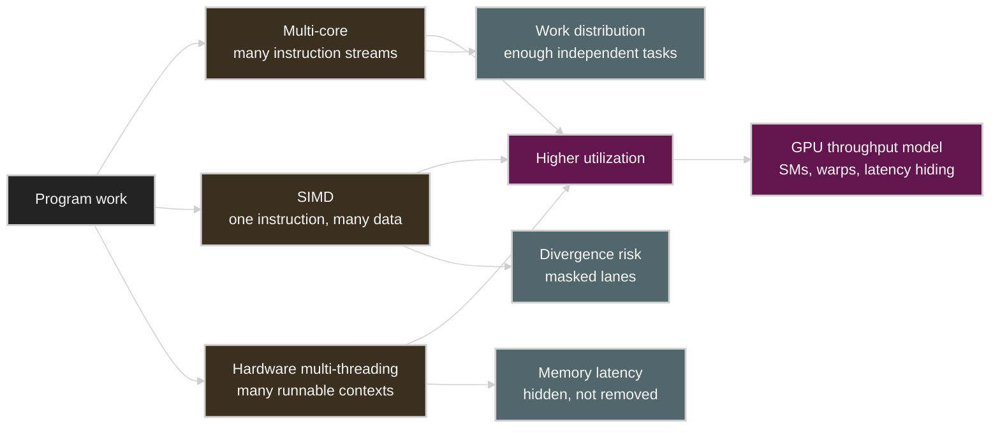
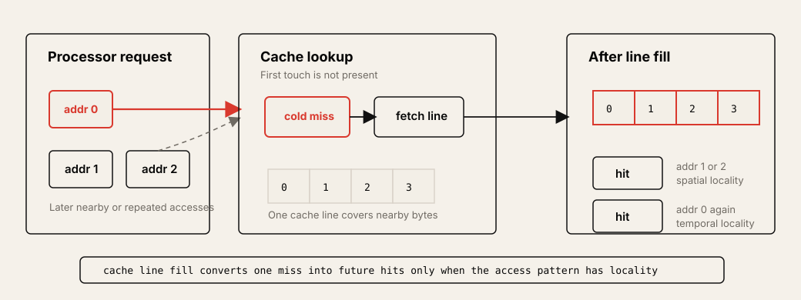
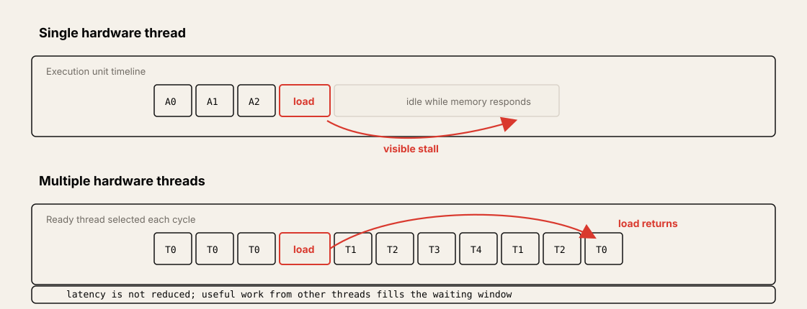

# Lecture 2: A Modern Multi-Core Processor

Source: [Stanford CS149 2023 Lecture 2](https://www.youtube.com/watch?v=CKmNpAO5rS4)

Course materials:

* [CS149 Fall 2023 Lecture 2 course page](https://gfxcourses.stanford.edu/cs149/fall23/lecture/multicore/)
* [Lecture 2 slides PDF](https://gfxcourses.stanford.edu/cs149/fall23content/media/multicore/02_basicarch_xX3ssOi.pdf)

## Table of Contents

* [Goal](#goal)
* [Lecture Overview](#lecture-overview)
* [Visual Map](#visual-map)
* [Processor Review](#processor-review)
* [Caches and Locality](#caches-and-locality)
* [Three Ways to Improve Processor Utilization](#three-ways-to-improve-processor-utilization)
* [Multi-Core Execution](#multi-core-execution)
* [SIMD Execution](#simd-execution)
* [Coherent and Divergent Execution](#coherent-and-divergent-execution)
* [Explicit and Implicit SIMD](#explicit-and-implicit-simd)
* [Hardware Multi-Threading](#hardware-multi-threading)
* [Latency Hiding](#latency-hiding)
* [NVIDIA V100 as a Throughput Processor](#nvidia-v100-as-a-throughput-processor)
* [GPU Systems Lens](#gpu-systems-lens)
* [Practical Tips and Notes](#practical-tips-and-notes)
* [Lecture Summary](#lecture-summary)
* [Key Terms](#key-terms)
* [Questions](#questions)
* [Answers](#answers)

---

## Goal

The goal of this lecture is to understand how modern processors provide parallelism at the hardware level. In Lecture 1, we looked at programs as instruction streams and distinguished between speedup and efficiency. Building on that perspective, Lecture 2 examines how multi-core, SIMD execution, and hardware multi-threading are combined within a single processor chip.

The core message is as follows.

> A modern parallel processor is not simply a machine with many cores. Multiple cores execute independent instruction streams, and the SIMD within each core applies one instruction to many data. In addition, by executing hardware threads in turn, it reduces idle time caused by memory latency. To achieve high utilization, a parallel program must provide enough of all three forms of parallelism.

This lecture covers the following:

* Review of programs and processor instructions
* Cache lines, cache hits/misses, temporal locality, spatial locality
* Multi-core execution and the independence of instruction streams
* SIMD execution and amortization of control logic
* Why SIMD lanes are wasted in conditional execution
* Coherence of instruction streams and divergent execution
* Explicit SIMD in CPUs and implicit SIMD in GPUs
* Memory latency hiding through hardware multi-threading
* The perspective of viewing the NVIDIA V100 as a throughput-oriented processor

---

## Lecture Overview

The lecture begins by reviewing the content of Lecture 1. A program is a list of processor instructions, and the processor fetches/decodes instructions and executes them in execution units, changing register and memory state. A superscalar processor finds instructions in the instruction stream that do not depend on each other and assigns them simultaneously to multiple execution units. However, there are limits to the parallelism that hardware can automatically discover from a single instruction stream.

It then moves on to caches. A cache is a hardware implementation detail that does not affect the output of a program, but it makes a big difference in performance. A cache keeps part of memory values on-chip and exploits temporal locality, which reuses the same data, and spatial locality, which uses adjacent addresses together. Since data is moved in units of cache lines, patterns that access an array sequentially are particularly favorable for the cache.

The heart of the lecture is the three ways a modern processor handles more parallel work. First, in multi-core, multiple cores independently execute different instruction streams. Second, SIMD applies one instruction to many data elements, spreading the cost of the control logic. Third, hardware multi-threading executes instructions from other hardware threads while one thread waits on a high-latency operation such as a memory load, reducing idle time of execution units.

The later half examines the preconditions and costs of each method. Multi-core requires enough independent work, SIMD requires many work items to follow the same instruction sequence, and hardware multi-threading requires enough runnable threads to execute during memory stalls. The NVIDIA V100 example shows that a GPU is a processor that raises throughput by exploiting these three conditions.

---

## Visual Map

The hardware model of Lecture 2 can be understood as a structure in which three forms of parallelism work complementarily to raise utilization.



---

## Processor Review

A processor executes an instruction stream. Simplified, a processor consists of the following elements.

| Component | Role |
| --------- | ---- |
| Fetch/decode | Brings in and interprets the instruction to execute next |
| Execution context | Stores program state, such as registers |
| Execution unit | Performs operations such as arithmetic, load/store, branch |
| Memory system | Provides the memory address space that instructions read and write |

The simple processor covered in Lecture 1 assumed that it executes one instruction per clock. A superscalar processor has multiple execution units and executes independent instructions in parallel in the same cycle.

```text
instruction stream
  -> dependency analysis
  -> independent instructions run in parallel
```

A processor cannot change the meaning of a program. Even if it performs out-of-order execution internally, the result observed by a single-threaded program must satisfy the dependencies and semantics of the source program. Because of this constraint, it is hard to fully utilize the execution units of a modern chip with superscalar execution alone.

## Caches and Locality

From the program's perspective, memory looks like a byte-addressable address space, but real DRAM is much slower than the processor's execution units. A cache keeps part of memory values on-chip to reduce this latency.

A cache usually operates in units of cache lines. For example, in a cache with a line size of 4 bytes, reading address `0x0` loads `0x0` through `0x3` into the cache together as one line. Therefore, the subsequent accesses to `0x1`, `0x2`, `0x3` all become hits.



| Locality | Meaning | Cache effect |
| -------- | ------- | ------------ |
| Temporal locality | Data already accessed is accessed again soon | Reuses the same cache line |
| Spatial locality | A nearby address is accessed soon | The line fetch brings in the next access ahead of time |

Cache misses can be divided into three types by cause.

| Miss type | Meaning |
| --------- | ------- |
| Cold miss | First access to the data, so it was not in the cache |
| Capacity miss | Data that would have remained if the cache were larger was evicted due to insufficient capacity |
| Conflict miss | Due to the cache organization, two or more data items compete for the same location |

A cache does not automatically solve all memory problems. For a cache to be effective, the program's access pattern itself must have locality. Random access, a large working set, or an unfavorable data layout can cause a low hit rate even with sufficient cache capacity.

## Three Ways to Improve Processor Utilization

Lecture 2 organizes the ways a modern chip raises utilization into three.

| Hardware mechanism | What it exploits | Program requirement |
| ------------------ | ---------------- | ------------------- |
| Multi-core | Independent instruction streams | Sufficient task/thread-level parallelism |
| SIMD | Same instruction over many data | Coherent instruction stream |
| Hardware multi-threading | Work to run while another thread stalls | Enough runnable threads to hide latency |

These three methods are not alternatives that replace each other, but a combination used together. A CPU uses multi-core, SIMD, and SMT together, and a GPU also exploits multiple SMs, warp-level SIMD, and many resident warps together.

## Multi-Core Execution

A multi-core processor is a structure with multiple execution cores. Each core fetches/decodes and executes the instruction stream assigned to it. Therefore, in multi-core, threads or tasks with different control flows can also be executed at the same time.

```text
core 0 -> instruction stream A
core 1 -> instruction stream B
core 2 -> instruction stream C
...
```

The advantage of this structure is flexibility. Each core can execute different branches and functions and access different memory addresses. This is because there is no constraint like SIMD that all lanes must follow the same instruction.

However, multi-core alone is not enough. As the number of cores grows, fetch/decode/control logic, caches, and execution resources also have to grow accordingly. Also, if a program does not provide enough independent work, cores end up idle. This is why work decomposition and scheduling are important in parallel programs.

## SIMD Execution

SIMD stands for single instruction, multiple data. After fetching/decoding one instruction, multiple execution lanes each perform the same operation on the data element they are in charge of.

```text
one instruction: y[i] = x[i] * 2

lane 0 -> x[0]
lane 1 -> x[1]
lane 2 -> x[2]
...
lane 7 -> x[7]
```

The core benefit of SIMD lies in spreading control overhead across many operations. Since one fetch/decode/control logic controls multiple ALU lanes, higher arithmetic throughput can be obtained within the same silicon budget.

| Property | Multi-core | SIMD |
| -------- | ---------- | ---- |
| Instruction streams | Multiple streams possible | One shared stream |
| Control flow flexibility | High | Low |
| Area efficiency for data-parallel math | Low or medium | High |
| Best fit | Independent tasks | Same operation over many elements |

Data-parallel loops, vector math, image processing, and dense linear algebra are well suited to SIMD. Conversely, in irregular workloads where each lane takes a different branch or has a different loop count, SIMD efficiency drops significantly.

## Coherent and Divergent Execution

To exploit SIMD efficiently, many data elements must follow the same instruction sequence. The lecture calls this instruction stream coherence or coherent execution.

```c
forall (int i from 0 to N) {
    float t = x[i];
    t = t * t;
    y[i] = t;
}
```

In this loop, all elements perform the same instruction, so it is well suited to SIMD. The problem arises when conditional execution is included.

```c
forall (int i from 0 to N) {
    float t = x[i];
    if (t > 0.0f) {
        t = t * t;
    } else {
        t = t + 30.0f;
    }
    y[i] = t;
}
```

A SIMD processor cannot execute a different instruction per lane in the same cycle. Therefore, when executing one branch path, it masks the lanes for which the condition is false, and when executing the opposite path, it masks the lanes for which the condition was true. In this process, some ALU lanes cannot perform useful work.

| Situation | SIMD behavior |
| --------- | ------------- |
| All lanes take same path | Full lane utilization |
| Half lanes take each path | Each path runs with some lanes masked |
| Each lane needs distinct control flow | Worst-case utilization can be very low |

Divergent execution refers to the state where instruction stream coherence is broken. The reason warp divergence lowers performance in GPU programming is the same principle.

## Explicit and Implicit SIMD

Modern CPUs and GPUs provide SIMD to programmers in different ways.

| Style | Where common | Programmer/compiler view |
| ----- | ------------ | ------------------------ |
| Explicit SIMD | CPU AVX, AVX-512, ARM Neon | Vector instructions appear in the binary |
| Implicit SIMD | Many GPUs | The programmer writes scalar threads, but hardware groups them into warps/wavefronts and executes them as SIMD |

In a CPU, the compiler auto-vectorizes loops, the programmer directly uses intrinsics, or the semantics of a parallel language convey vectorization opportunities to the compiler. On the other hand, in a GPU, the programmer writes scalar code that each thread executes, and the hardware groups multiple threads into a warp and executes the same instruction in a SIMD fashion.

The difference between the two lies in how the abstraction is provided. Even if GPU threads appear independent on the surface, within the same warp, instruction stream coherence is important for performance.

## Hardware Multi-Threading

Hardware multi-threading is a method in which a core simultaneously holds the execution contexts of multiple threads. While one thread waits on a long-latency memory operation, the core executes instructions from another ready thread.

The important point is that multi-threading does not reduce memory latency itself. Instead, it reduces the time that execution units remain idle due to latency.

| Mechanism | Meaning | Example |
| --------- | ------- | ------- |
| Interleaved multi-threading | Each cycle, picks one ready thread and executes its instruction | Temporal multi-threading |
| Simultaneous multi-threading | Issues instructions from multiple threads to execution units in one cycle | Intel Hyper-Threading |

For hardware multi-threading to be effective, there must be a ready thread in the core to execute in place of the waiting thread. This is why throughput processors have many hardware thread contexts.

## Latency Hiding

The latency hiding example in the lecture shows the following principle.

```text
thread does:
  arithmetic arithmetic arithmetic load
load latency:
  12 cycles
```

If there is only one thread, after the load the core waits without executing the next instruction. On the other hand, if there are multiple hardware threads, while thread 0 waits on the load, it can execute the arithmetic instructions of threads 1, 2, and 3. As in the lecture example, when a 12-cycle load comes after three arithmetic instructions, having five threads can raise utilization to 100%.



The more arithmetic per memory access, the fewer threads are needed for latency hiding. For example, if the same 12-cycle load comes after six arithmetic instructions, the latency can be hidden with fewer threads.

| Workload property | Threads needed for latency hiding |
| ----------------- | --------------------------------- |
| Low arithmetic per memory access | More threads needed |
| High arithmetic per memory access | Fewer threads needed |
| Long memory latency | More independent work needed |
| Short memory latency or good cache locality | Fewer threads needed |

This perspective is the starting point for understanding GPU occupancy and arithmetic intensity. Many resident warps prepare other execution targets so that latency can be hidden, and arithmetic intensity indicates the amount of useful work performed between memory stalls.

## NVIDIA V100 as a Throughput Processor

Lecture 2 introduces the NVIDIA V100 as an example of a modern throughput-oriented processor. The V100 is composed of multiple SMs, and each SM has many warp execution contexts and a wide SIMD execution resource.

The features of the V100 SM described in the lecture slides are as follows.

| V100 SM concept | Meaning |
| --------------- | ------- |
| Warp | SIMD execution group in which 32 data items or threads move together |
| Many warp contexts | State kept in order to execute other warps during memory stalls |
| SIMD ALUs | Apply the same instruction to many data lanes |
| Tensor cores | Specialized execution unit for workloads with many matrix operations |
| Large register file | Simultaneously hold the contexts of many resident warps |

According to the slides, the entire V100 is composed of 80 SMs, and GPU memory provides high bandwidth through HBM. The key point is that a GPU is not a processor that lowers the latency of individual operations, but a processor that holds many independent work items and executes them in turn to maximize overall throughput.

## GPU Systems Lens

The concepts of Lecture 2 form the basic framework for analyzing GPU performance.

| Lecture 2 concept | GPU/CUDA interpretation |
| ----------------- | ----------------------- |
| Multi-core | Multiple SMs process block/warp-level work in parallel |
| SIMD | Lanes within a warp execute the same instruction |
| Instruction stream coherence | The less warp divergence, the more efficiently SIMD lanes can be utilized |
| Hardware multi-threading | SM holds multiple resident warps and picks ready warps to execute |
| Latency hiding | Executes other warps during memory stalls |
| Cache locality | Coalesced access, L1/L2 reuse, shared-memory tiling |
| Arithmetic per memory access | Determines arithmetic intensity and required occupancy |

In LLM inference and training, the content of this lecture leads to the following questions.

* Does the kernel provide enough warps/blocks to supply work to all SMs?
* Does warp divergence grow large due to branches or loops of different lengths?
* Are memory accesses coalesced and is there reuse in the cache or shared memory?
* Are Tensor Cores and SIMD lanes actually performing useful work?
* In a memory-bound kernel, does raising occupancy further help latency hiding?
* Can a kernel with low arithmetic intensity be improved by fusion or tiling?

## Practical Tips and Notes

### Examine utilization in three layers

When evaluating GPU or CPU performance, simply saying that parallelism exists is not enough. You must check the following three layers individually.

| Layer | First check |
| ----- | ----------- |
| Across cores | Is work assigned to every core/SM? |
| Within SIMD lanes | Are lanes/warps performing the same useful instruction? |
| Over time | Is there other work left to execute during memory stalls? |

If performance is lower than expected, first distinguish which layer the idle resources are in.

### Divergence is an efficiency bug, not a correctness bug

Even if branches diverge, the correctness of the computation can be preserved. The problem is that if lanes in the same SIMD group follow different paths, some lanes become masked-off and cannot participate in the computation. Therefore, in CUDA, it is important to design data layout and work assignment so that branch coherence within the same warp can be raised.

### More threads is not always better

Hardware multi-threading is useful for latency hiding, but if the execution units have already reached 100% utilization, the effect of adding more threads is limited. On the contrary, register pressure, cache pressure, and scheduling overhead may grow.

### Arithmetic intensity changes the amount of latency hiding required

If there is a lot of arithmetic per memory access, memory latency can be hidden easily with few threads. Conversely, a kernel that is mostly load/store is likely to be constrained by bandwidth and latency even if resident warps are increased.

### Cache is the result of the access pattern

Cache hit rate is not determined by the hardware cache size alone. The array traversal method, data layout, tiling, and reuse distance determine cache behavior. GPU shared memory tiling and coalescing can also be seen as techniques that explicitly apply the same principle.

## Lecture Summary

This lecture explained a modern parallel processor as a combination of multi-core, SIMD, and hardware multi-threading. Multi-core executes different instruction streams in parallel, and SIMD applies the same instruction to many data to raise arithmetic throughput. Hardware multi-threading executes instructions from other threads during memory stalls, reducing idle time due to latency.

An efficient parallel program must satisfy the following three conditions.

* There must be enough parallel work to utilize all cores and execution units.
* There must be many work items following the same instruction sequence so that SIMD lanes are not wasted.
* There must be enough runnable work to hide memory latency.

A GPU is a throughput processor that intensively exploits these principles. CUDA's block, warp, occupancy, coalescing, divergence, and shared memory can all be understood based on the hardware model explained in this lecture.

## Key Terms

| Term | Meaning |
| ---- | ------- |
| Multi-core processor | A processor with multiple execution cores |
| Instruction stream | The flow of instructions that a processor executes in order |
| Cache line | A data block moved at once between the cache and memory |
| Temporal locality | The property of reusing the same data at a close time |
| Spatial locality | The property of using nearby memory addresses consecutively |
| Cache hit | When the requested data is in the cache |
| Cache miss | When the requested data is not in the cache and must be brought in from memory |
| SIMD | An execution method that applies one instruction to many data elements |
| SIMD lane | A data-parallel execution slot that performs a SIMD instruction |
| Instruction stream coherence | The property of multiple work items following the same instruction sequence |
| Divergent execution | A state in which work items within the same SIMD group take different control flows |
| Explicit SIMD | SIMD in which vector instructions are specified at the compiler or binary level |
| Implicit SIMD | A method in which hardware executes as SIMD under a scalar thread abstraction |
| Hardware multi-threading | A method in which a core holds multiple thread contexts and executes them in turn |
| Latency hiding | A technique that executes other work during a long-latency operation to maintain utilization |
| Arithmetic intensity | The ratio of arithmetic work to the number of bytes accessed or transferred by memory |
| Warp | A thread group executed together in a SIMD fashion on an NVIDIA GPU |

## Questions

1. What are the three main parallel execution forms that a modern processor exploits?
2. How is a cache line related to spatial locality?
3. How do temporal locality and spatial locality differ?
4. What is different between multi-core execution and SIMD execution from the perspective of instruction streams?
5. Why is SIMD area-efficient?
6. Why do conditional branches lower SIMD utilization?
7. What is instruction stream coherence?
8. How do explicit SIMD and implicit SIMD differ?
9. Does hardware multi-threading reduce memory latency, or hide it?
10. If arithmetic per memory access increases, how does the number of threads needed for latency hiding change?
11. Why is a GPU like the V100 called a throughput-oriented processor?
12. CUDA's warp divergence is connected to which concepts of Lecture 2?

## Answers

1. Multi-core execution, SIMD execution, and hardware multi-threading.
2. Because the cache brings in adjacent addresses together in line units, sequential access can lead to multiple cache hits after one miss.
3. Temporal locality is the property of reusing the same data within a short time, and spatial locality is the property of using nearby addresses consecutively.
4. In multi-core, each core can execute a different instruction stream, but in SIMD, multiple lanes share one instruction stream.
5. Because one fetch/decode/control path controls multiple ALU lanes, control overhead can be spread across many data operations.
6. Because if the branch path differs per lane, some lanes are masked and cannot perform useful work.
7. It is the property of multiple parallel work items following the same instruction sequence.
8. In explicit SIMD, vector instructions appear in the compiler/binary, while in implicit SIMD, even if the programmer writes scalar threads, the hardware groups multiple threads and executes them as SIMD.
9. It does not reduce it; it hides it. The latency of a memory operation stays the same, but by executing other threads while waiting, it reduces idle time.
10. It decreases. Because the arithmetic work performed between memory stalls increases.
11. Because it is designed to maximize overall throughput rather than the latency of individual operations, by exploiting many SMs, SIMD lanes, and resident warps.
12. Instruction stream coherence and divergent execution.
