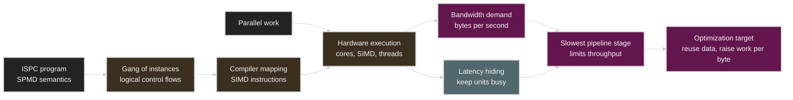
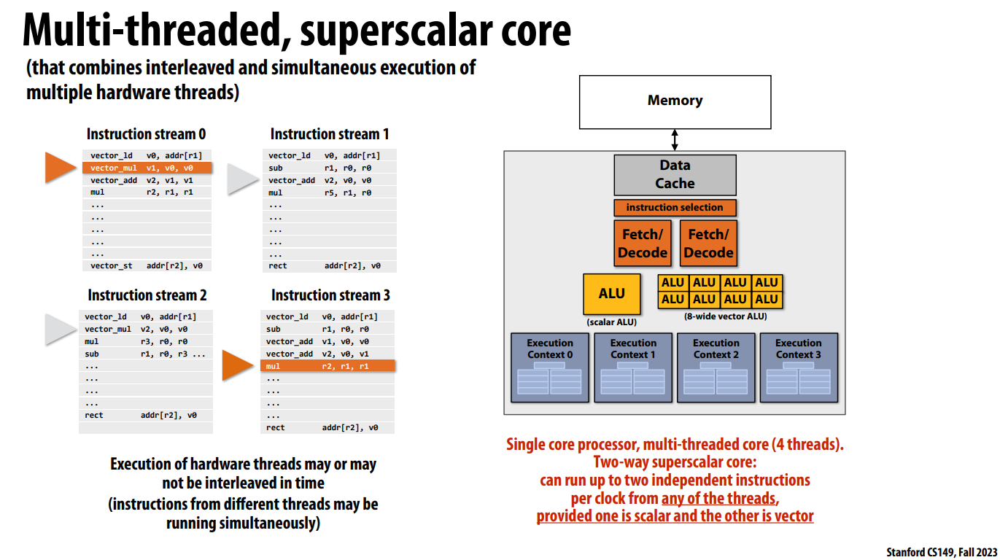
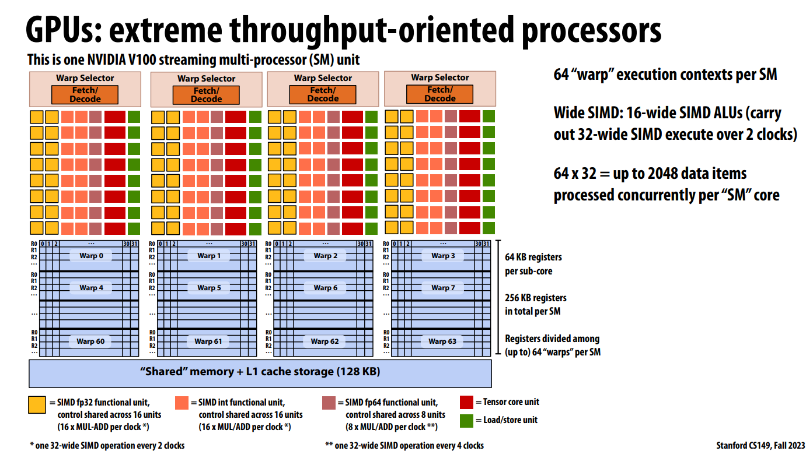
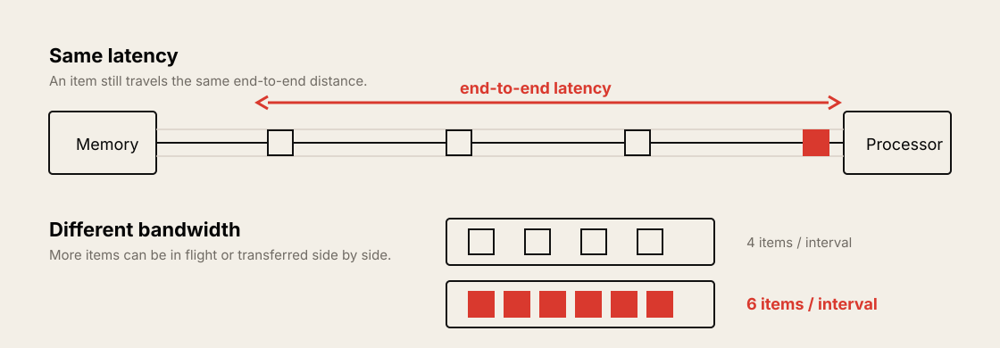
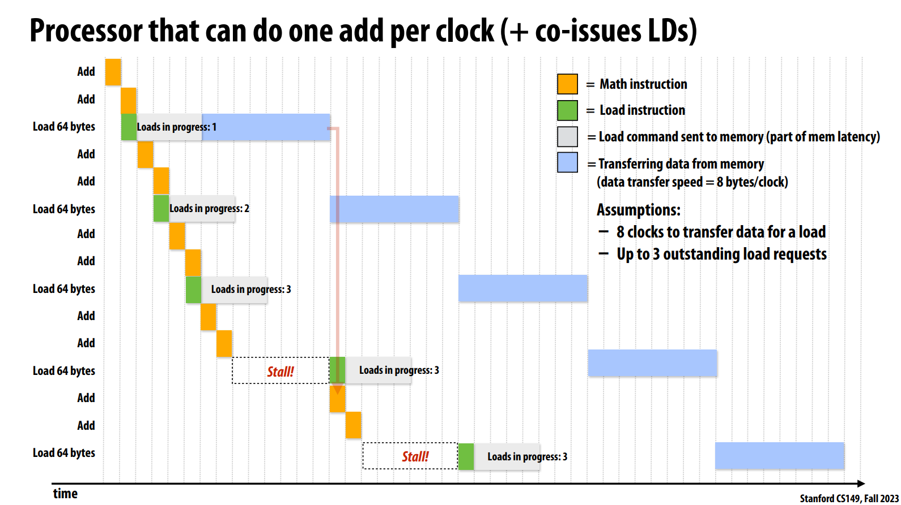
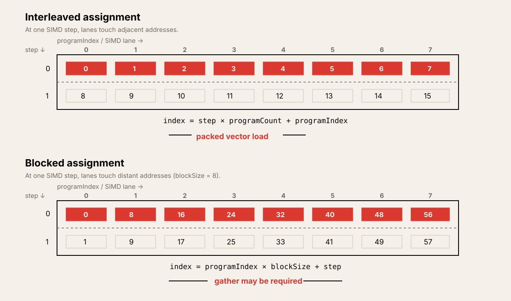

# Lecture 3: Multi-Core Architecture, Part II and ISPC

Source: [Stanford CS149 2023 Lecture 3](https://www.youtube.com/watch?v=F4bVSyz_jxo)

Course materials:

* [CS149 Fall 2023 course page](https://gfxcourses.stanford.edu/cs149/fall23)
* [Lecture 2 slides PDF (review material)](https://gfxcourses.stanford.edu/cs149/fall23content/media/multicore/02_basicarch_xX3ssOi.pdf)
* [Lecture 3 slides PDF](https://gfxcourses.stanford.edu/cs149/fall23content/media/multicore2-ispc/03_multicore2-ispc.pdf)
* [ISPC documentation](https://ispc.github.io/)
* [The Story of ISPC](https://pharr.org/matt/blog/2018/04/30/ispc-all)

> The video lecture covers a review of hardware multi-threading, latency and
> bandwidth, and ISPC's `foreach`. The data race, reduction, cross-instance
> operation, and ISPC task sections in these notes supplement the lecture
> slides that follow the video.

## Table of Contents

* [Goal](#goal)
* [Lecture Overview](#lecture-overview)
* [Visual Map](#visual-map)
* [Hardware Parallelism Review](#hardware-parallelism-review)
* [Hardware Multi-Threading and Latency Hiding](#hardware-multi-threading-and-latency-hiding)
* [Latency and Bandwidth](#latency-and-bandwidth)
* [Pipelining and the Slowest Stage](#pipelining-and-the-slowest-stage)
* [Memory Bandwidth-Bound Execution](#memory-bandwidth-bound-execution)
* [Arithmetic Intensity and Data Reuse](#arithmetic-intensity-and-data-reuse)
* [Abstraction vs. Implementation](#abstraction-vs-implementation)
* [ISPC and the SPMD Programming Model](#ispc-and-the-spmd-programming-model)
* [ISPC Gang and Program Instances](#ispc-gang-and-program-instances)
* [Uniform and Varying Values](#uniform-and-varying-values)
* [Interleaved and Blocked Assignment](#interleaved-and-blocked-assignment)
* [The `foreach` Abstraction](#the-foreach-abstraction)
* [Parallel Loop Correctness](#parallel-loop-correctness)
* [Reduction and Cross-Instance Operations](#reduction-and-cross-instance-operations)
* [SPMD Abstraction and SIMD Implementation](#spmd-abstraction-and-simd-implementation)
* [ISPC Tasks and Multi-Core Execution](#ispc-tasks-and-multi-core-execution)
* [The Abstraction Ladder](#the-abstraction-ladder)
* [GPU Systems Lens](#gpu-systems-lens)
* [Practical Tips and Notes](#practical-tips-and-notes)
* [Lecture Summary](#lecture-summary)
* [Key Terms](#key-terms)
* [Questions](#questions)
* [Answers](#answers)

---

## Goal

This lecture has two goals. First, understand that in a modern throughput
processor, latency and bandwidth are different constraints. Second, distinguish
the semantics of a parallel programming model from the implementation that maps
it onto real hardware.

The core message is as follows.

> Many threads can hide memory latency, but they cannot increase memory
> bandwidth. And an ISPC programmer writes an SPMD program in which many program
> instances execute independently, while the compiler implements it as SIMD
> instructions on a single core. To understand performance precisely, look at
> the programming abstraction and the hardware implementation at the same time,
> but do not confuse the two.

This lecture covers the following.

* The combination of multi-core, SIMD, superscalar, and hardware multi-threading
* The relationship between the number of hardware threads and latency hiding
* The difference between latency and bandwidth
* Pipeline throughput and the slowest-stage bottleneck
* Why vector multiplication can be memory-bound even when it is sufficiently parallel
* The ratio of arithmetic work to memory traffic
* Distinguishing the semantics of a programming model from its scheduling/implementation
* ISPC's SPMD abstraction, gang, and program instance
* `programCount`, `programIndex`, `uniform`, and varying values
* Interleaved/blocked iteration assignment and memory access cost
* How `foreach` abstracts iteration assignment
* Independence, data races, and reduction in parallel loops
* SPMD-to-SIMD compilation and multi-core execution via ISPC tasks

## Lecture Overview

The first half of the lecture follows the end of the [Lecture 2 slides](https://gfxcourses.stanford.edu/cs149/fall23content/media/multicore/02_basicarch_xX3ssOi.pdf)
and reviews the hardware model in more detail. Hardware multi-threading reduces
idle cycles in execution units by running other threads while one thread waits
for memory. However, if utilization has already reached 100%, adding more
hardware threads does not increase throughput. On the contrary, it requires more
chip area to store execution contexts, can increase the completion latency of
individual threads, and can cause interference between threads over caches and
execution resources.

The lecture then distinguishes latency from bandwidth. Latency is the time it
takes for one request to complete, while bandwidth is the amount of data that
can be completed per unit time. Through the analogies of a highway, a laundry
pipeline, and connected pipes, it explains that the overall throughput of a
pipeline is limited by the rate of its slowest stage.

Applying this principle to element-wise vector multiplication on a V100 yields
an important conclusion. Millions of independent elements are enough to fill
cores, SIMD lanes, and hardware threads, but each multiply must read two values
and write one result. In FP32, that is 12 bytes of memory traffic per
operation. To keep the V100's 5,120 FP32 ALUs running continuously at 1.6 GHz
would require about 98 TB/s, but the HBM2 bandwidth given in the slides is 900
GB/s. Therefore this computation stays below 1% of peak compute efficiency due
to a bandwidth shortage, not a parallelism shortage.

The second half uses ISPC to explain the gap between abstraction and
implementation. When an ISPC function is called, a gang of many program
instances logically executes the same program on different data. That is the
SPMD semantics. In practice, the ISPC compiler transforms the gang's execution
into SIMD instructions such as AVX. `foreach` raises the level of abstraction
so the programmer only declares the independence of iterations and leaves the
per-instance assignment to the compiler.

Based on the video's progress, the main segments are as follows.

| Time | Topic |
| ---- | ----- |
| `00:00–16:49` | Hardware multi-threading, latency hiding, the number of threads needed |
| `16:50–38:00` | The combination of multi-core, SIMD, superscalar, and SMT; CPU/GPU comparison |
| `38:01–46:20` | The vector multiplication thought experiment; latency and bandwidth |
| `46:21–53:27` | Pipelining explained with a highway and laundry |
| `53:28–01:03:12` | Memory bandwidth-bound execution and the arithmetic-to-memory ratio |
| `01:03:13–01:16:12` | Abstraction vs. implementation, ISPC gang, `foreach` |

## Visual Map

Lecture 3 connects hardware resource limits and programming abstraction in a
single flow.



---

## Hardware Parallelism Review

A modern processor does not use a single parallel mechanism; it combines
parallelism at several levels.

| Mechanism | Unit of parallel work | Main role |
| --------- | --------------------- | --------- |
| Multi-core | Different instruction streams | Task/thread parallelism across the whole chip |
| Superscalar | Independent instructions within one stream | Instruction-level parallelism inside the core |
| SIMD | Multiple data lanes processed by one instruction | Data-parallel arithmetic throughput |
| Hardware multi-threading | Multiple execution contexts resident on a core | Reducing idle cycles between stalls |

The conceptual core of the lecture shows a structure that can pick
instructions from multiple hardware contexts and issue them simultaneously to
scalar and vector execution units, as follows.



This figure shows the conceptual implementation of a single core, not the whole
multi-core processor. Even with four resident execution contexts, the issue
width is at most two instructions, so it does not mean four threads execute
simultaneously every clock. Also, this example limits the two simultaneously
issued instructions to one scalar and one vector, but the specific combination
and selection rules can vary by processor implementation.

Suppose a hypothetical processor has 16 cores, 4 hardware threads per core, and
8-wide SIMD.

* The number of software thread contexts that can be resident at the same time
  is `16 × 4 = 64`.
* Each selected thread can execute an 8-wide vector instruction.
* Filling up to the maximum latency-hiding margin may require `16 × 4 × 8 =
  512` independent data items.
* But the peak arithmetic width of any one cycle and the total amount of
  resident work are not the same concept. Not all 64 threads execute
  instructions in the same cycle.

This distinction matters even more on a GPU. Judging the amount of parallel
work needed by only looking at the GPU's peak ALU count misses the resident
warps and the latency-hiding requirements. One reason small DNNs or small tensor
operations are inefficient on a large GPU is that there are not enough work
items to fill all execution contexts.



This figure shows a single SM, not the entire V100 GPU. `64 warps × 32 threads
= 2,048 threads` is the maximum scale of execution contexts that can be
resident on the SM for latency hiding, not a statement that 2,048 threads use
the ALUs in the same clock. The warp scheduler picks ready warps, and the
16-wide SIMD units in the figure process a 32-thread warp's instruction over 2
clocks. The actual number of resident warps can be smaller than this maximum
depending on the kernel's register and shared-memory usage.

A CPU core can also use these four mechanisms together. For example, one core
can fetch instructions from two hardware threads and issue multiple
independent scalar/vector instructions to several execution units at the same
time. Hardware threads become an additional source of independent instructions
for the superscalar scheduler.

## Hardware Multi-Threading and Latency Hiding

The basic principle of hardware multi-threading is simple.

```text
thread 0: compute -> long-latency load -> wait
thread 1:                           compute while thread 0 waits
thread 2:                                                compute
```

Suppose a core repeats a pattern of computing for `C` cycles and stalling for
`L` cycles. If we simplify by assuming there is no scheduling overhead and the
threads execute the same pattern with appropriate staggering, the number of
threads needed for full utilization can be reasoned as follows.

```text
threads needed ≈ ceil((C + L) / C) = 1 + ceil(L / C)
```

The lecture's examples are as follows.

| Compute cycles `C` | Stall cycles `L` | One-thread utilization | Threads for 100% utilization |
| ------------------ | ---------------- | ---------------------- | ---------------------------- |
| 3 | 12 | `3 / 15 = 20%` | 5 |
| 6 | 12 | `6 / 18 = 33%` | 3 |

Threads beyond the fifth are not always useful. In the first example, the core
is already 100% utilized with 5 threads, so scaling up to 8-way
multi-threading does not raise peak throughput further.

Hardware multi-threading has the following costs.

* It needs execution-context storage for each thread's registers and program counter.
* Because multiple threads share the same execution units, the completion
  latency of individual threads can grow.
* If register file capacity is fixed, the number of threads and the registers
  per thread are a trade-off.
* Interference between threads can occur in shared resources such as the cache,
  branch predictor, and execution queues.

> [!TIP]
> When evaluating the number of hardware threads, compare it not against the
> peak thread count but against "the number of runnable contexts the current
> workload needs to hide latency." Threads added after utilization is already
> saturated can increase resource pressure rather than throughput.

## Latency and Bandwidth

Latency and bandwidth appear together, but they are not the same metric.

| Term | Question | Typical unit |
| ---- | -------- | ------------ |
| Latency | How long does one request take to complete? | ns, cycles, seconds |
| Bandwidth | How much data is transferred per unit time? | bytes/s, items/cycle |
| Throughput | How much work is completed per unit time? | ops/s, requests/s |

In the highway analogy, if the distance between San Francisco and Stanford is 50
km and cars travel at 100 km/h, the latency of one car is 0.5 hour. If only one
car per lane is allowed, throughput is 2 cars/hour.

There are several ways to raise throughput.

* Raising the speed to 200 km/h reduces latency to 0.25 hour and increases
  throughput to 4 cars/hour.
* Increasing the number of lanes to four keeps the individual latency at 0.5
  hour but increases throughput to 8 cars/hour.
* Piping several cars inside a lane at safe intervals lets you deliver far more
  cars per unit time without changing the latency.



The memory system is the same. Prefetching and outstanding requests help hide
the effect of long latency and fill the pipeline. But if the pipeline is
already full and the transfer width itself is insufficient, even a
zero-latency prefetcher would not change the bandwidth ceiling.

## Pipelining and the Slowest Stage

The laundry example shows how a pipeline's latency and throughput separate.

| Stage | Time per load |
| ----- | ------------- |
| Wash | 45 minutes |
| Dry | 60 minutes |
| Fold | 15 minutes |

The end-to-end latency of one load is `45 + 60 + 15 = 120 minutes`. But if you
process several loads overlapping, the dryer can dry the previous load while the
washer handles the next one, and a person can fold the one before that. Once
the pipeline reaches steady state, the overall throughput is limited to 1
load/hour by the slowest dryer.

```text
pipeline throughput = min(each stage throughput)
                    = 1 / max(each stage service time)
```

If fast upstream stages keep producing more work than a slow downstream stage
can absorb, an intermediate queue grows. If the buffer is finite, upstream
eventually has to stop as well, and the long-run average throughput converges
to the slowest stage's rate.

This principle applies directly to a compute pipeline.

```text
memory system -> cache/load-store unit -> ALU -> result store
       the slowest sustained rate determines end-to-end throughput
```

An instruction pipeline uses the same idea. In a 4-stage pipeline where fetch,
decode, execute, and write-back each take one cycle, the latency of one
instruction can be 4 cycles, but once the pipeline is full the throughput can be
1 instruction/cycle. Therefore "it performs one multiply per cycle" usually
means the steady-state throughput is 1 operation/cycle, not that the operation
latency is 1 cycle.

## Memory Bandwidth-Bound Execution

The lecture considers the following repeating sequence.

```text
load 64 bytes -> add -> add -> repeat
```

The assumptions are as follows.

* The ALU performs 1 math operation/cycle.
* The load/store unit can issue in parallel with the math unit.
* Memory delivers 8 bytes/cycle.
* Delivering one 64-byte load requires 8 cycles of link occupancy.
* The number of outstanding load requests is limited.

At first, the processor can issue load requests quickly. But while memory
processes one 64-byte request, the processor keeps producing the next request.
When the outstanding-request queue fills, the core can no longer issue loads
and stalls.



In the figure, the green blocks are load issues, the gray intervals are part of
the latency while the command is being delivered to memory, and the blue blocks
are the transfer segments where the 64 bytes of data actually occupy the link.
The three outstanding requests overlap the gray intervals to hide latency, but
the blue transfers serialize at the bandwidth of 8 bytes/cycle. Therefore, after
reaching the request limit, subsequent loads are delayed, and increasing
concurrency further does not raise the steady-state bandwidth.

The important observations in this steady state are as follows.

* The memory link is already 100% busy.
* More hardware threads and outstanding requests can fill the queue further but
  cannot increase memory's 8 bytes/cycle.
* The core's idle regions are determined not by memory latency or queue depth
  but by the difference between the compute consumption rate and the memory
  supply rate.
* This is memory bandwidth-bound execution.

Distinguishing latency-bound from bandwidth-bound changes the remedy.

| Symptom | Latency-bound response | Bandwidth-bound response |
| ------- | ---------------------- | ------------------------ |
| Memory pipeline is empty | Prefetch, more concurrency, more outstanding requests | Secondary effect |
| Memory link continuously saturated | Little benefit from adding threads | Reduce traffic, reuse, compression, higher bandwidth |
| Core waiting on memory | Hide latency with other ready work | Must reduce the number of bytes per work itself |

## Arithmetic Intensity and Data Reuse

Element-wise FP32 vector multiplication produces the following traffic.

```text
C[i] = A[i] * B[i]

read A[i]  = 4 bytes
read B[i]  = 4 bytes
write C[i] = 4 bytes
total      = 12 bytes per multiply
```

Using the V100 numbers from the Lecture 3 slides, the calculation is as follows.

```text
peak FP32 rate ≈ 5,120 ALUs × 1.6 GHz
               ≈ 8.2 trillion multiplies/s

required bandwidth ≈ 8.2 × 10^12 × 12 bytes
                   ≈ 98 TB/s

available HBM2 bandwidth ≈ 0.9 TB/s
```

Therefore, looking only at the compute-to-bandwidth ratio, the expected ALU
utilization is roughly `0.9 / 98`, i.e. below 1%. In a real execution, instruction
overhead, cache behavior, and write policies also play a role, but the order of
magnitude of the bottleneck is already revealed by this calculation.

This example shows that "there is a lot of parallelism" and "the machine is used
efficiently" are different things. Even if every element is independent and
SIMD-friendly, if data cannot be supplied fast enough, the ALUs spend most of
their time waiting.

To improve performance, you must reduce off-chip memory accesses per work.

* Reuse data that the same thread has already read: temporal locality
* Cooperatively reuse data read by multiple threads from cache/shared memory
* Perform additional operations in registers instead of writing an intermediate
  value to memory and reading it back
* With kernel fusion, the consumer uses the producer's result directly without
  materializing it in off-chip memory
* Keep a small working set in on-chip memory with tiling

> [!WARNING]
> A cache only reduces traffic when reuse exists. In a vector multiply that
> streams millions of elements exactly once each, even using every cache line
> fully does not make the compulsory traffic disappear. Prefetching also only
> hides latency; it does not increase the bandwidth of an already saturated
> memory link.

## Abstraction vs. Implementation

The central question of the second half of the lecture is to distinguish "what
does the program compute?" from "how does the parallel machine perform that
computation?".

| View | Main question |
| ---- | ------------- |
| Semantics | What result does this operation and program mean? |
| Implementation | Which thread/core/lane performs which operation, and when? |
| Scheduling | Among several valid execution orders, which mapping is chosen? |

One semantics can have many valid implementations. For example, even if
program instance 0 executes all independent loop iterations sequentially, the
result can be correct, and dividing them among several instances in
interleaved, blocked, or dynamic ways can give the same result.

When reading a parallel program, trace it in two steps.

1. Using only the rules of the abstraction, confirm what result should come out.
2. Assuming the target implementation, track which core, thread, and SIMD lane
   does which work at which point in time.

Mixing the two steps commonly leads to the following confusions.

* Assuming a logical program instance is identical to an OS thread.
* Thinking that because scalar operations appear in SPMD source code, only
  scalar instructions are executed.
* Assuming the execution order of `foreach` iterations follows source order.
* Judging correct semantics and fast implementation by the same criterion.

## ISPC and the SPMD Programming Model

ISPC stands for Intel SPMD Program Compiler. It uses a source syntax similar to
C, but its core programming model is SPMD (single program, multiple data).

In SPMD, you define one function body, and multiple logical instances execute
that body on different data.

```text
one ISPC function
    -> program instance 0 handles some data
    -> program instance 1 handles some data
    -> ...
    -> program instance W-1 handles some data
```

When an ordinary C++ caller invokes an exported ISPC function, the following
logically happens.

1. A gang of `programCount` program instances begins.
2. All instances execute the same ISPC function body.
3. Each instance can have its own `programIndex` and private local state.
4. After all instances finish, the ISPC function returns.
5. The C++ caller's single control flow resumes.

A program instance is a logical execution entity of the abstraction. The reason
it is not called an OS thread or hardware thread is to avoid fixing the
implementation in advance. Looking only at the result semantics, you can also
imagine executing instances one by one sequentially or with several OS threads.
The actual target implementation of ISPC is to execute one gang with SIMD
instructions.

## ISPC Gang and Program Instances

A gang is the set of logical program instances that execute one ISPC function
together. Each instance can choose a different control-flow path depending on
varying conditions. The compiler implements this semantics with SIMD lane masks
and convergence.

| ISPC concept | Meaning |
| ------------ | ------- |
| Gang | The set of instances executed together in one ISPC function invocation |
| Program instance | A logical control flow executing the SPMD function |
| `programCount` | The number of instances in the gang |
| `programIndex` | The current instance's ID, `0 ... programCount-1` |

If the gang size is 8, each instance executes the same code while observing a
different `programIndex`. You can use this to divide up array work directly.

```c
// Simplified ISPC form to illustrate the concept
for (uniform int base = 0; base < N; base += programCount) {
    int i = base + programIndex;
    output[i] = transform(input[i]);
}
```

Instance 0 handles `0, 8, 16, ...`, and instance 1 handles `1, 9, 17, ...`.
Combining the results of all instances processes the entire array.

What matters here is the number of copies of local variables. Values that
differ per instance, such as `i` and `input[i]`, exist per logical instance.
On the other hand, arguments and loop bounds shared by all instances can be
represented as a single value.

## Uniform and Varying Values

The ISPC type system expresses whether a value is the same across the whole
gang or different per instance.

| Kind | Meaning | Example |
| ---- | ------- | ------- |
| `uniform` | One value identical for all instances | `N`, pointer base, loop bound |
| `varying` | A value that differs per instance | `programIndex`, per-element input, lane-local accumulator |

A scalar value without an explicit modifier is generally interpreted as
varying. `programCount` is uniform and `programIndex` is varying.

```c
uniform int width = programCount;
int lane = programIndex;
int index = blockStart + lane;
```

`uniform` matters for compiler optimization beyond simple documentation.
When the compiler knows a value is the same in all lanes, it can choose a
cheaper implementation such as a scalar register, a scalar branch, or a
broadcast. But a programmer cannot mistakenly make a value that is actually
varying into a uniform one. If you try to assign different lane values into a
uniform destination, the meaning becomes ambiguous and a compile-time type
error can occur.

The boundary between uniform and varying is also where the SIMD
implementation below the abstraction becomes visible. To understand ISPC
semantics, you must always check "is this variable one per gang, or one per
instance?".

## Interleaved and Blocked Assignment

Even the same array operation can assign work to instances differently.

| Assignment | Instance 0 example | Instance 1 example |
| ---------- | ------------------ | ------------------ |
| Interleaved | `0, 8, 16, 24, ...` | `1, 9, 17, 25, ...` |
| Blocked | `0, 1, 2, 3, ...` | The next contiguous block |

Looking only at the logical work distribution, both schemes can be correct
because each element is processed exactly once. But in a SIMD implementation,
performance differs greatly depending on which addresses the instances access at
any one moment.



With interleaved assignment, the lanes of the same loop step access contiguous
addresses.

```text
step 0: lane addresses = 0, 1, 2, 3, 4, 5, 6, 7
step 1: lane addresses = 8, 9, 10, 11, 12, 13, 14, 15
```

This pattern is easy to implement with a single packed vector load. In contrast,
blocked assignment gives each instance a contiguous block, but at the same SIMD
instruction moment the lanes access far-apart addresses.

```text
step 0: lane addresses = 0, 8, 16, 24, 32, 40, 48, 56
```

This pattern may require a gather instruction. Therefore, the statement
"each thread has contiguous data" is not enough to judge SIMD memory
efficiency. You must look at the addresses that the lanes of the actual vector
instruction access at the same moment.

## The `foreach` Abstraction

`foreach` is ISPC's core construct for declaring a parallel iteration set.

```c
foreach (i = 0 ... N) {
    output[i] = transform(input[i]);
}
```

The semantics of this code are as follows.

* The whole gang performs the iterations `0 ... N-1`.
* Each iteration must be able to execute independently of the others.
* The implementation decides which program instance handles which iteration.
* The programmer focuses on the meaning of the iterations instead of doing
  manual per-instance assignment.

Valid implementations that the compiler/runtime can choose include the
following.

1. One instance executes all iterations.
2. Iterations are assigned to instances in an interleaved fashion.
3. They are divided into contiguous blocks.
4. A shared counter is used for dynamic assignment.

Of course, the real ISPC compiler chooses a mapping suited to SIMD. The
important point is that `foreach` semantics does not promise any single
specific mapping.

This abstraction hides low-level scheduling details and states the programmer
intent "for each element, perform this operation independently." The compiler
can use this information to vectorize more reliably.

## Parallel Loop Correctness

Because `foreach` iterations execute potentially in parallel, merely reading
the source code like a sequential loop does not guarantee correctness. You must
check whether the memory effects of each iteration are independent of each
other.

A safe example is an iteration `i` that reads only `input[i]` and writes only
`output[2*i]` and `output[2*i+1]`. Its output range does not overlap with
other iterations' output ranges.

On the other hand, the following pattern is dangerous.

```c
foreach (i = 0 ... N) {
    if (i > 0 && input[i] < 0)
        output[i - 1] = input[i];
    else
        output[i] = input[i];
}
```

Iterations `i` and `i-1` can both write to the same `output[i-1]`. Since it is
not determined which write arrives last, the output is undefined.

When reviewing a parallel loop, check the following.

* Do different iterations write to the same location?
* Does one iteration read a value written by another iteration without
  synchronization?
* Is an update a read-modify-write without atomic or reduction semantics?
* Does correctness happen to depend only on a particular `programCount` or the
  current mapping?

> [!WARNING]
> The claim "the current compiler assigns interleaved, so there is no
> collision" cannot serve as grounds for `foreach` correctness. The result
> must be the same under other valid schedules that the abstraction allows.

## Reduction and Cross-Instance Operations

Operations that combine the values of many iterations into one, such as the sum
of an entire array, are different from a simple independent map.

You cannot directly add each lane's varying value into a uniform accumulator
that exists only once for the whole gang. Since there is no way to implicitly
convert multiple lane values into a single uniform value, the ISPC compiler
rejects it with a compile-time type error. Conversely, if you make only
per-instance varying accumulators, the partial sums are multiple, so you cannot
immediately return them as the single uniform scalar return value the C++
caller expects.

A correct reduction consists of two steps.

```c
float partial = 0.0f;

foreach (i = 0 ... N)
    partial += input[i];

uniform float total = reduce_add(partial);
return total;
```

1. Each instance accumulates its elements into a private varying accumulator.
2. `reduce_add` combines the gang's partial values into a single uniform
   result.

ISPC provides several primitives for communication between instances.

| Operation | Meaning |
| --------- | ------- |
| `reduce_add(x)` | Returns the sum of `x` over currently active instances as a uniform value |
| `reduce_min(x)` | Returns the minimum over currently active instances as a uniform value |
| `broadcast(x, k)` | Delivers the value of instance `k` to all instances |
| `rotate(x, offset)` | Moves instance values circularly within the gang |

These operations can be implemented with instruction sequences such as SIMD
horizontal reduction, shuffle, and permute. The programmer uses the
cross-instance semantics, and the compiler chooses the implementation that
fits the target ISA.

## SPMD Abstraction and SIMD Implementation

The most important distinction in ISPC can be summarized in one sentence.

> The programmer writes SPMD, and the compiler generates SIMD.

| Layer | ISPC view |
| ----- | --------- |
| Source abstraction | `programCount` logical instances execute the same program |
| Per-instance state | `programIndex`, varying local variables |
| Compiler mapping | Maps instances to vector lanes |
| Generated code | Vector instructions such as AVX2, AVX-512, ARM Neon |
| Control flow | Implements varying branches using lane masks |

The gang size is usually tied to the hardware SIMD width or a small multiple
of it. The compiler generates the exported ISPC function as an object file that
can be linked from C/C++. The C++ caller invokes it like an ordinary function,
but the function body contains vector instructions.

With a varying condition, each logical instance can choose a different branch.
On SIMD hardware, when one path executes, only the lanes that chose that path
are enabled, and the mask is switched for the other path. Therefore the
semantics are preserved, but divergent control flow lowers lane utilization.

This model also connects to GPUs. An NVIDIA GPU programmer writes a scalar
thread program, but the hardware groups threads that share the same program
counter into a warp and executes them similarly to SIMD. ISPC provides a
similar SPMD-on-SIMD abstraction at the compiler level, targeting the CPU
vector ISA.

## ISPC Tasks and Multi-Core Execution

The gang described so far is a way in which one CPU thread executes SIMD
instructions on one core. Therefore, using only gangs utilizes SIMD lanes but
does not automatically utilize multiple CPU cores.

ISPC provides a separate task abstraction to express multi-core execution.

```text
C++ caller
  -> launch multiple ISPC tasks
      -> task scheduler / worker pool
          -> an available worker executes one gang
          -> other workers execute additional gangs
```

Tasks and gangs are different parallelism levels.

| Level | Purpose | Hardware mapping |
| ----- | ------- | ---------------- |
| Task parallelism | Execute several work chunks independently | CPU cores / software worker threads |
| Gang parallelism | Data-parallel work within one chunk | SIMD lanes within one core |

Tasks are enqueued asynchronously and may execute immediately or on another
processor. No fixed one-to-one mapping between task index and physical core is
guaranteed, nor is the order of task execution. Actual placement and load
balancing are decided by the connected task system.

To get full CPU utilization on a workload like Assignment 1, you need a
hierarchical decomposition: divide the large input into tasks to feed multiple
cores, and within each task let an ISPC gang use SIMD.

## The Abstraction Ladder

ISPC is a relatively low-level language. It exposes `programIndex`,
`programCount`, uniform/varying, and cross-instance operations, so the
programmer can create precise cooperation and memory mappings. At the same
time, if misused, it can also write programs that are correct only for a
certain gang size, or programs with data races.

Higher abstractions remove some low-level control.

| Abstraction level | Programmer expresses | System decides |
| ----------------- | -------------------- | -------------- |
| Manual ISPC indexing | Exact work and address per instance | SIMD instruction selection |
| ISPC `foreach` | Independent iteration set | Instance assignment and vector mapping |
| Collection `map` | Element-wise function | Loop, indexing, partition, scheduling |
| NumPy/PyTorch tensor op | Whole-array/tensor transformation | Kernel selection, fusion, device mapping |

Low-level control gives optimization opportunities but also increases the
burden of correctness and portability. High-level abstractions give the
compiler/runtime more scheduling freedom, but it can be hard to observe whether
the desired memory mapping or fusion was actually chosen.

From the perspective of Lecture 3, a programming model is a framework for
thinking about the organization of a parallel program, and one abstraction
allows several valid implementations. When reading later lectures as well, you
should ask separately, "What semantics does this API guarantee, and how does
the current system map them?".

## GPU Systems Lens

The concepts of Lecture 3 apply directly to interpreting GPUs and AI
workloads.

The GPU/LLM interpretation in this section and the Practical Tips that follow
are additional notes applying the lecture's concepts to the systems viewpoint of
this repository. They should not be taken as direct claims of the lecture video
or slides.

| Lecture 3 concept | GPU/AI systems interpretation |
| ----------------- | ----------------------------- |
| Latency hiding | Issue another ready warp while one warp waits for memory |
| Bandwidth ceiling | The bytes/s HBM can supply limits kernel throughput |
| Pipeline bottleneck | The slowest stage among HBM, interconnect, Tensor Cores, and collectives determines the overall rate |
| Arithmetic intensity | If FLOPs per byte is below the machine balance, it is memory-bound |
| ISPC gang | A logical SPMD group similar to a CUDA warp |
| Varying control flow | Warp divergence and lane masking |
| `foreach` | Independent thread/iteration semantics of an element-wise kernel |
| Cross-instance operation | Warp shuffle, vote, reduction |
| ISPC task | A larger work decomposition level like a CUDA block or CPU worker task |
| SPMD vs. SIMD | The distinction between the CUDA thread abstraction and the warp/SIMT hardware implementation |

Applied to LLM training and inference, the following questions matter.

* Does the kernel's FLOPs/byte match the compute-to-HBM balance of the target
  GPU?
* Do KV cache reads, activation materialization, and optimizer state traffic
  saturate HBM bandwidth?
* Can kernel fusion or tiling reduce intermediate traffic?
* In tensor-parallel collectives, is network bandwidth playing the role of the
  compute pipeline's dryer?
* Do more warps hide memory latency, or do they only compete over already
  saturated bandwidth?
* Are you confusing logical thread semantics with the warp-level
  implementation and missing races or divergence?

## Practical Tips and Notes

### Distinguish latency-bound from bandwidth-bound first

Both states can look like "the core waits for memory" in a profiler. But the
prescription differs.

| Observation | Likely issue | First check |
| ----------- | ------------ | ----------- |
| Low memory throughput, many dependency stalls | Latency/insufficient concurrency | Occupancy, outstanding requests, dependency chains |
| HBM throughput near sustained peak | Bandwidth saturation | Bytes per output, reuse, fusion, data type |
| Slow only on small inputs | Insufficient parallel work or launch overhead | Active blocks, number of waves, kernel duration |
| Throughput unchanged even when raising occupancy | Bandwidth or compute pipeline saturation | Roofline position, achieved bandwidth/FLOPs |

### Use sustained bandwidth, not peak bandwidth

Datasheet bandwidth is the interface's theoretical peak. The sustained bandwidth
a real kernel achieves is lower depending on access pattern, transaction
granularity, ECC, contention, and read/write mix. For roofline-style
computations, it is safer to use a copy or streaming benchmark measured on the
same workload class as the baseline.

### Do the byte accounting first

Before kernel optimization, write down the following per output element.

```text
mandatory reads + mandatory writes + temporary traffic + metadata/index traffic
```

Then compute the effective bandwidth from the measured runtime and data
volume.

```text
effective bandwidth = bytes transferred / execution time
```

If the value is close to the hardware's sustained limit, reducing traffic takes
priority over adding threads or instruction-level tuning.

### Treat `foreach` independence as a proof obligation

Do not think of `foreach` as a fast version of an ordinary `for`. Review
whether the result is identical for every iteration order and parallel
interleaving. If write sets overlap, change the partition or use explicit
parallel primitives such as atomics, reductions, or prefix sums.

### Look at data assignment from the lane-time perspective

Even if a blocked partition looks good in terms of locality from the software
thread's viewpoint, if the addresses that SIMD lanes access simultaneously form
a stride pattern, gathers can occur. Check both of the following questions.

* Which addresses does one instance visit over time?
* Which set of addresses do all lanes visit in the same instruction?

### Uniform annotation is a measurable optimization hint

Representing a value that is the same across the whole gang as uniform can
reduce vector registers and mask operations. However, do not add annotations
indiscriminately; confirm the actual effect through the generated assembly,
ISPC's performance warnings, or benchmarks.

> [!TIP]
> When debugging ISPC code, spread a small `programCount` and small array on
> paper and make a table of per-instance `programIndex`, local values, and
> read/write addresses. Only when this trace is correct can you analyze the
> SIMD assembly and performance.

### Quick Reference

| Symptom | First check |
| ------- | ----------- |
| Many threads but low ALU utilization | HBM bandwidth and bytes/op |
| Not faster even when adding threads | Whether latency is already hidden or another stage is saturated |
| ISPC blocked version is slow | SIMD gather and per-lane address stride |
| `foreach` result differs between runs | Overlapping writes or read-after-write between iterations |
| Uniform/varying type error occurs | Whether a per-gang single value and per-instance multiple values are mixed |
| ISPC uses only one core | Whether only gangs are used and task parallelism is not launched |
| Cannot return the reduction result | Whether `reduce_add` is needed after per-instance partials |

## Lecture Summary

This lecture showed that a parallel processor's performance cannot be explained
by latency hiding alone. Hardware multi-threading raises execution unit
utilization by running other work during stalls, but it does not increase peak
throughput or memory bandwidth. In a steady state with a full pipeline, the
overall throughput is limited by the rate of the slowest stage.

Element-wise vector multiplication can be memory-bound even with sufficient
independent work and SIMD coherence. The gap between the roughly 98 TB/s the
compute pipeline demands on a V100 and the actual 900 GB/s HBM2 bandwidth
shows that the key to performance is not simply creating more parallel work
but reducing memory traffic per work and raising data reuse.

ISPC is a concrete example for understanding parallel programming
abstractions. The programmer uses SPMD semantics in which many program
instances execute the same function on different data, and the compiler
implements it with SIMD instructions. `foreach` declares an independent
iteration set and leaves scheduling to the system. For correctness, the result
must be the same without races under every valid mapping, and operations that
require communication between instances, like reductions, must use dedicated
primitives.

The three sentences to remember in the end are as follows.

* Hiding latency and solving the bandwidth limit are different things.
* Pipeline throughput is determined by the slowest sustained stage.
* You must distinguish what a parallel abstraction means from how the hardware
  implements it.

## Key Terms

| Term | Meaning |
| ---- | ------- |
| Latency | The time from the start to completion of one operation or request |
| Bandwidth | The amount of data a system can transfer per unit time |
| Throughput | The amount of work completed per unit time |
| Pipelining | A method of executing different stages of multiple work items overlapping |
| Bottleneck | The slowest stage that limits the pipeline's overall sustained throughput |
| Memory bandwidth-bound | A state in which the compute rate is limited by the memory's data supply rate |
| Arithmetic intensity | The number of arithmetic operations performed per byte of memory traffic |
| SPMD | A model in which multiple logical instances execute one program on different data |
| SIMD | An implementation that applies one instruction to multiple data lanes simultaneously |
| Gang | A set of ISPC program instances executed together |
| Program instance | A logical entity executing an ISPC SPMD function |
| `programCount` | The number of program instances in the gang |
| `programIndex` | The ID of the current program instance |
| `uniform` | The identical value shared by all instances of the gang |
| Varying | A value that differs per program instance |
| `foreach` | An ISPC construct that declares an independent iteration set for the whole gang to perform |
| Gather | A vector load that collects data from non-contiguous addresses of several SIMD lanes |
| Reduction | An operation that combines values from multiple instances into a single result |
| Cross-instance operation | An operation that combines or moves values between instances within a gang |
| ISPC task | A coarse-grained parallel work unit for utilizing multiple CPU cores |

## Questions

1. What do latency and bandwidth each measure?
2. Why does hardware multi-threading not increase memory bandwidth?
3. How many threads does a workload that computes for 3 cycles then stalls for
   12 cycles need for full utilization?
4. What costs can occur when hardware threads are increased beyond the needed
   number?
5. What determines a pipeline's steady-state throughput?
6. Why can a 4-stage instruction pipeline have 1 instruction/cycle throughput
   while instruction latency is 4 cycles?
7. Why does element-wise FP32 multiplication on a V100 stay below 1% compute
   efficiency even though it is SIMD-friendly?
8. Why can caches and prefetching not eliminate the bandwidth bottleneck in a
   streaming workload?
9. How do the semantics and implementation of a programming abstraction
differ?
10. In ISPC's SPMD model, what are a gang and a program instance?
11. Are `programCount` and `programIndex` uniform or varying, respectively?
12. Why can interleaved assignment be better than blocked assignment for a
    packed vector load?
13. What does ISPC `foreach` guarantee, and what does it not guarantee?
14. If different `foreach` iterations can write to the same output location,
    why does it become an undefined result?
15. In an array sum, why are both a varying partial accumulator and
    `reduce_add` needed?
16. What does it mean that "the ISPC programmer writes SPMD and the compiler
    generates SIMD"?
17. Why can an ISPC gang alone not use all CPU cores?
18. What metrics can you check first to distinguish latency-bound from
    bandwidth-bound in an LLM kernel?

## Answers

1. Latency is the completion time of one request, and bandwidth is the amount
   of data that can be transferred per unit time.
2. Hardware multi-threading only executes other work until memory responds; it
   does not widen the bytes/cycle the memory interface itself delivers.
3. `ceil((3 + 12) / 3) = 5` threads.
4. Increased execution-context storage, fewer registers per thread, increased
   latency of individual threads, and interference in caches and execution
   resources can occur.
5. The stage with the lowest sustained throughput, i.e. the bottleneck,
determines it.
6. Because different instructions can be simultaneously in different stages of
   the pipeline, once the pipeline is full, one completes every cycle.
7. One multiply reads two FP32 inputs and writes one output, requiring 12
   bytes, and the roughly 98 TB/s required by the ALU peak rate is far larger
   than the 900 GB/s HBM2 bandwidth.
8. Caches cannot remove compulsory traffic that has no reuse, and prefetching
   only starts transfers earlier; it cannot raise the bytes/s of an already
   saturated link.
9. Semantics define what result the program should compute, and implementation
   decides how to place those operations across cores, threads, lanes, and
   time.
10. A gang is the set of logical instances executed together in one invocation,
    and a program instance is a logical entity that executes the same SPMD
    function with its own data and state.
11. `programCount` is uniform and `programIndex` is varying.
12. Because the SIMD lanes at the same moment access contiguous addresses, it
    is easy to implement with a single packed load. In blocked assignment the
    addresses between lanes are far apart, so a gather may be needed.
13. It guarantees the semantics that the whole gang performs the iteration
    set, but it does not guarantee the mapping of which instance handles which
    iteration or the execution order.
14. Because the write order changes with the parallel schedule, and it is not
    defined which value remains last.
15. The varying partial enables per-instance local accumulation, and
    `reduce_add` combines the multiple partials into a single uniform scalar
    the caller can receive.
16. In the source you reason with the semantics of several logical control
    flows, but in the generated binary those instances are mapped to vector
    lanes and execute one vector instruction together.
17. Because one gang is executed as SIMD by one CPU thread on one core. Using
    multiple cores requires separate ISPC tasks or software task
    parallelism.
18. Look at achieved HBM bandwidth, memory-pipeline utilization, occupancy,
    outstanding requests, and FLOPs/byte together. If bandwidth is close to
    the sustained peak, reducing traffic takes priority over concurrency.
