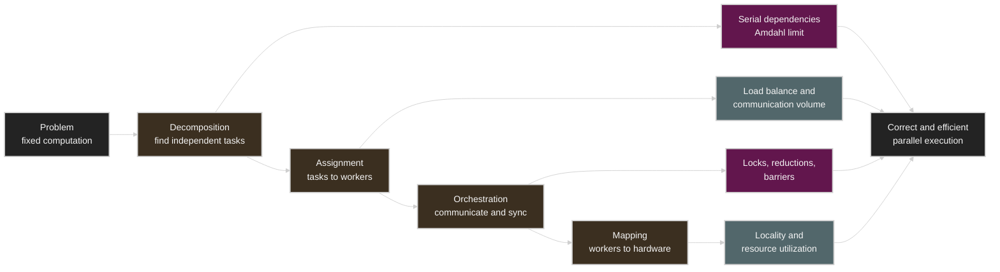
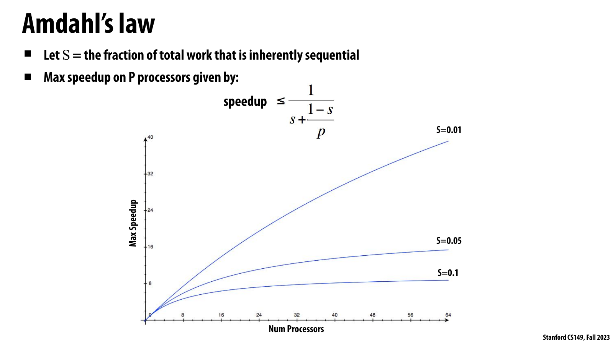

# Lecture 4: Parallel Programming Basics

Source: [Stanford CS149 2023 Lecture 4](https://www.youtube.com/watch?v=0-ztm8SKq70)

Course materials:

* [CS149 Fall 2023 course page](https://gfxcourses.stanford.edu/cs149/fall23)
* [Lecture 4 slides PDF](https://gfxcourses.stanford.edu/cs149/fall23content/media/progbasics/04_progbasics.pdf)
* [ISPC documentation](https://ispc.github.io/)

> The first roughly 40 minutes of the video review Lecture 3's ISPC programming
> model, `foreach`, reduction, and task system, and experiment with thread-pool
> overhead. The official Lecture 4 topic, the parallel programming case study,
> begins at `40:21`. The one-barrier transformation of the three-barrier solver
> and the programming-model comparison left as homework at the end of the video
> are supplemented with reference to the lecture slides.

## Table of Contents

* [Goal](#goal)
* [Lecture Overview](#lecture-overview)
* [Visual Map](#visual-map)
* [From ISPC Review to Parallel Programming Basics](#from-ispc-review-to-parallel-programming-basics)
* [The Four Responsibilities of a Parallel Program](#the-four-responsibilities-of-a-parallel-program)
* [Speedup and Amdahl's Law](#speedup-and-amdahls-law)
* [Image Example: Parallel Map and Reduction](#image-example-parallel-map-and-reduction)
* [Decomposition and Dependency Analysis](#decomposition-and-dependency-analysis)
* [Assignment: Static and Dynamic](#assignment-static-and-dynamic)
* [Orchestration and Mapping](#orchestration-and-mapping)
* [Task Granularity and Thread Pools](#task-granularity-and-thread-pools)
* [The 2D Grid Solver](#the-2d-grid-solver)
* [Why Naive Gauss-Seidel Is Hard to Parallelize](#why-naive-gauss-seidel-is-hard-to-parallelize)
* [Red-Black Ordering](#red-black-ordering)
* [Work Assignment and Communication](#work-assignment-and-communication)
* [Data-Parallel Expression](#data-parallel-expression)
* [Shared Address Space and SPMD](#shared-address-space-and-spmd)
* [Mutual Exclusion and Atomicity](#mutual-exclusion-and-atomicity)
* [Local Accumulation and Reduction](#local-accumulation-and-reduction)
* [Barrier Synchronization](#barrier-synchronization)
* [Reducing Three Barriers to One](#reducing-three-barriers-to-one)
* [Comparing Programming Models](#comparing-programming-models)
* [GPU Systems Lens](#gpu-systems-lens)
* [Practical Tips and Notes](#practical-tips-and-notes)
* [Lecture Summary](#lecture-summary)
* [Key Terms](#key-terms)
* [Questions](#questions)
* [Answers](#answers)

---

## Goal

The goal of this lecture is to systematize the thinking process of turning a
sequential program into a parallel program. The core is not choosing threads or
APIs first, but finding the computation's dependencies, exposing independent
work, then placing that work onto workers and hardware and designing the
communication and synchronization it needs.

The four steps the lecture presents are as follows.

```text
problem
  -> decomposition: find independent tasks
  -> assignment: divide tasks among workers
  -> orchestration: organize communication and synchronization
  -> mapping: map workers to hardware execution units
```

The core message is as follows.

> Parallel programming is not the task of tacking threads onto sequential code.
> It is the task of analyzing dependencies, changing the algorithm or update
> order when needed, and creating sufficient parallelism and low
> communication/synchronization cost together. Maximum speedup is limited by the
> remaining serial work, and for correct results, every shared update and phase
> dependency must be explicitly preserved.

This lecture covers the following.

* The definition of speedup and Amdahl's Law
* The roles of decomposition, assignment, orchestration, and mapping
* Dependency analysis for finding independent tasks
* Static and dynamic assignment
* Why tasks and worker threads must be distinguished
* Task granularity, thread creation cost, and thread pools
* The dependency structure of a 2D Gauss-Seidel grid solver
* Algorithm redesign using red-black coloring
* Work assignment and communication volume
* Data-parallel vs. shared-address-space/SPMD expressions
* Mutual exclusion, atomicity, and lost updates
* Local accumulation and reduction
* Barrier synchronization and reducing three barriers to one

## Lecture Overview

The first part of the lecture reviews the ISPC programming model from Lecture
3, the `foreach` abstraction, reduction, and the task system, and then
experiments with thread-pool overhead. The point is that a task is a unit of
work, not a thread, and that creating a thread per task can cause
oversubscription and thread lifecycle cost.

The main body introduces the four responsibilities of building a parallel
program and then applies Amdahl's Law to an image brightness/average example.
Parallelizing only the first phase limits the overall speedup to 2. Turning the
average into a partial reduction brings the speedup close to `P` when the input
is much larger than the number of processors. This example emphasizes that you
must look at the dependencies of the whole algorithm to reduce the serial
fraction.

The second half uses an in-place 2D Gauss-Seidel solver as the case study. The
original traversal depends on the left cell and the new values of the previous
row, so it exposes only diagonal wavefront parallelism. But that form has little
parallelism at the start and end and needs synchronization at every diagonal.
Using domain knowledge to divide the checkerboard into red/black, you can update
all red cells in parallel and then all black cells in parallel.

Expressing the same solver in a data-parallel model and a
shared-address-space/SPMD model compares the difference in abstraction. The
data-parallel version leaves assignment, reduction, and the phase-end wait to
the system. The SPMD version has each thread compute its own row block and use
locks and barriers directly. Finally, it looks at optimizations that reduce lock
frequency using local partials and reduce three barriers to one by making the
`diff` accumulator into multiple copies.

Based on the video's progress, the main segments are as follows.

| Time | Topic |
| ---- | ----- |
| `00:00–15:15` | Assignment 1 questions; review of ISPC semantics and SIMD implementation |
| `15:16–28:05` | `foreach`, races, varying partials, `reduce_add` |
| `28:06–40:20` | ISPC tasks, the difference between tasks and threads, thread-pool overhead demo |
| `40:21–48:42` | Parallelization workflow, speedup, Amdahl's Law, image example |
| `48:43–53:31` | Assignment, orchestration, hardware mapping |
| `53:32–01:03:38` | Grid solver dependencies, red-black ordering, communication |
| `01:03:39–01:12:34` | Data-parallel vs. shared address space, locks and reduction |
| `01:12:35–01:17:14` | Barrier semantics, three-barrier dependency, replication hint |

## Visual Map

Lecture 4 explains a parallel program as the following decision flow.



---

## From ISPC Review to Parallel Programming Basics

The reason the lecture reviews ISPC at length before the main body is that the
habit of reading a parallel abstraction precisely applies directly to the later
case study.

| Concept | Semantic meaning | Typical implementation |
| ------- | ---------------- | ---------------------- |
| ISPC gang | A set of program instances executing a function together | One CPU thread executing SIMD instructions |
| `foreach` | The whole gang performs an independent iteration set | Static interleaving of iterations onto SIMD lanes |
| Reduction | Combining per-instance partials into one uniform value | Horizontal add or shuffle sequence |

`foreach` and tasks leave different levels of assignment to the system.

```text
task list
  -> worker thread 0 executes a gang
  -> worker thread 1 executes a gang
  -> ...

inside each gang
  -> foreach iterations are assigned to program instances
  -> program instances are implemented with SIMD lanes
```


The lecture slides visualize the point that even if `launch[100]` creates 100
logical tasks, the runtime keeps a small worker thread pool. Each worker, upon
finishing its current task, picks up an uncompleted task through the shared
task list's next pointer. Because task decomposition and worker provisioning
are separated, even if the task count is much larger than the number of
hardware contexts, there is no need to create the same number of OS threads.

Therefore, declaring one million tasks does not require one million OS threads.
A task is something to do, and a worker is an execution agent that repeatedly
picks up that work. This distinction is also the distinction between
decomposition and assignment introduced shortly.

The lecture recommends the following order when reading a programming model.

1. First understand what result and ordering the language construct guarantees.
2. Confirm that the program is correct under every assignment and schedule that
   the contract allows.
3. Only then analyze how the compiler, runtime, and hardware currently implement
   it.
4. Evaluate optimizations that rely on a specific implementation together with
   measurement and portability cost.

## The Four Responsibilities of a Parallel Program

The process of building a parallel program can be divided into four
responsibilities.

| Responsibility | Main question | Primary goal |
| -------------- | ------------- | ------------ |
| Decomposition | Which work is independent? | Creating enough parallel tasks |
| Assignment | Which worker performs each task? | Load balance and low communication |
| Orchestration | When do workers exchange what and wait? | Correct dependencies and low sync cost |
| Mapping | On which hardware unit does a worker run? | Locality and resource utilization |

These responsibilities are shared among the programmer, compiler, runtime, OS,
and hardware. For example, if the programmer declares that the pixel iterations
of an image are independent, the compiler can assign iterations to vector
lanes. The OS maps software threads to CPU hardware contexts, and GPU hardware
maps CUDA blocks to available SMs.

The four steps are not completely independent. If decomposition is too
fine-grained, the task count grows but so does scheduling overhead. Even if
assignment looks even, if related data is far apart, communication can
increase. Adding a barrier makes correctness easy to express, but fast workers
may wait for slow ones and utilization can drop.

> [!TIP]
> In a parallel code review, draw the task graph before asking "how many
> threads?". Representing nodes as work and edges as dependencies that must be
> preserved lets you look at decomposition and orchestration problems
> separately.

## Speedup and Amdahl's Law

For a fixed computation, the speedup using `P` processors is as follows.

```text
Speedup(P) = T(1) / T(P)
```

Suppose fraction `S` of the sequential execution time is essentially serial due
to dependencies, and the remaining `1-S` is perfectly distributed across `P`
processors.

```text
T(P) / T(1) = S + (1 - S) / P

Speedup(P) = 1 / (S + (1 - S) / P)
```

Even as `P` grows without bound, only the parallel part approaches 0; the
serial part remains.

```text
lim(P -> infinity) Speedup(P) = 1 / S
```

| Serial fraction `S` | Infinite-processor upper bound |
| ------------------- | ------------------------------ |
| 10% | 10x |
| 5% | 20x |
| 1% | 100x |
| 0.1% | 1,000x |



The original graph shows the `S=0.01`, `0.05`, `0.1` curves bending toward
different ceilings as processors are increased up to `P=64`. As more
processors are added, the slope of the curves shrinks, so the marginal benefit
of "adding more cores and the speedup gained" also drops quickly according to
the serial fraction.

The lecture slides cite Summit supercomputer's `27,648 GPUs × 5,376 FP32
ALUs/GPU = 148,635,648 ALUs` as an example. If 0.1% of an application is
serial, the Amdahl upper bound is 1,000x even while holding over 100 million
parallel ALUs. The more processors you add, the greater the relative impact of
small serial regions, global synchronization, and sequential reductions.

Amdahl's Law is not a model that fully predicts actual runtime. Parallel
overhead, load imbalance, memory bandwidth, cache behavior, and communication
are not included in the formula. Therefore the formula is an optimistic upper
bound, and actual speedup is usually lower.

## Image Example: Parallel Map and Reduction

Suppose you perform two operations on an `N × N` image.

1. Double the brightness of every pixel.
2. Compute the average of all pixels.

If the two phases each have about `N²` work, the sequential time is about
`2N²`.

Parallelizing only the first phase with `P` processors and leaving the second
phase serial gives the following.

```text
T(P) = N²/P + N²

Speedup(P) = 2N² / (N²/P + N²)
          -> 2  as P grows
```

Even if the brightness update scales perfectly, the overall speedup does not
exceed 2. The average phase, half of the total work, is serial.

To parallelize the average as well, each processor builds a partial sum of about
`N²/P` pixels and the final step combines the `P` partials. If the final combine
is simply done serially, it is as follows.

```text
phase 1: N²/P
phase 2: N²/P + P

T(P) ≈ 2N²/P + P
```

If `N` is much larger than `P`, the overhead of combining `P` partials becomes
small relative to the total work, and the speedup approaches `P`. But if the
input is small or `P` is very large, the final combine becomes the bottleneck
again. A real system can reduce the combine depth to near `O(log P)` with a
tree reduction.

The general principle this example gives is as follows.

* Element-wise transforms are easy to find independent iterations for.
* Aggregation requires cross-worker communication.
* Even if you parallelize a reduction, the partial combine overhead does not
disappear.
* Adding parallelism to only one phase is hard to get end-to-end speedup from.

## Decomposition and Dependency Analysis

Decomposition is the step of dividing a problem into tasks that can be
performed in parallel. Generally, you must create enough tasks to keep all
execution units of the machine busy. But the fact that there are many tasks
does not by itself create parallelism. Tasks connected by dependency edges must
respect the required order.

When finding dependencies, it helps to write down the read/write set of each
operation.

| Relationship | Example | Consequence |
| ------------ | ------- | ----------- |
| Read-after-write | `B` reads a value `A` wrote | `A -> B` order required |
| Write-after-read | `B` overwrites a value `A` will read | Changing the order changes `A`'s input |
| Write-after-write | Two tasks write to the same location | Final value depends on order |
| Disjoint access | Use locations that do not overlap | Parallel execution possible |

Dependencies are also the reason it is hard for a general-purpose compiler to
automatically and perfectly parallelize an arbitrary sequential program. If
addresses are determined by input data or function side effects are complex,
proving independence at compile time is difficult. So in most parallel
programs, the programmer provides the decomposition using domain knowledge.

Decomposition also includes algorithm choice. If the existing sequential
execution order creates many dependencies, you can change the dependency graph
itself by choosing a different algorithm or update order that computes the same
acceptable solution. The grid solver's red-black ordering is exactly this case.

## Assignment: Static and Dynamic

Assignment is the step of distributing decomposed tasks to workers. Here a
worker varies by context: a CPU thread, an ISPC program instance, a SIMD lane,
a GPU thread/block, and so on.

The two main goals of assignment are as follows.

* Balance the load so that every worker performs useful work for a similar
  amount of time.
* Appropriately group tasks that exchange data with each other to reduce
  communication and locality cost.

| Strategy | Decision time | Strength | Risk |
| -------- | ------------- | -------- | ---- |
| Static assignment | Before execution or at compile time | Low scheduling overhead, predictable | Imbalance on irregular work |
| Dynamic assignment | During execution | Adapts to changing task cost | Queue/atomic overhead, loss of locality |

The lecture's examples show that the assignment responsibility differs by
abstraction.

* Manual ISPC indexing has the programmer statically assign iterations to
  program instances.
* ISPC `foreach` has the programmer declare only independence, and the compiler
  chooses the assignment. The current implementation is static, but the
  abstraction allows a wider choice.
* The C++ thread example statically assigns the front/back halves of an array
  to two threads with blocked assignment.
* The ISPC task runtime can dynamically assign so that a completed worker takes
  the next task from a queue.

The assignment policy should be a performance choice, not a correctness one.
A `foreach` program that is correct only if a particular worker handles a
particular iteration violates the abstraction contract.

## Orchestration and Mapping

Orchestration organizes the cooperation of parallel workers.

* Communication structure of shared values and messages
* Locks, atomics, and barriers to preserve dependencies
* Data layout and ownership in memory
* Task execution order and scheduling
* Collective patterns such as reduction, broadcast, and halo exchange

The purpose of orchestration is to minimize communication, synchronization, and
scheduling overhead while preserving correctness and locality. If
synchronization is expensive on the machine, you can group into larger phases or
use local accumulation to lower the synchronization frequency.

Mapping corresponds logical workers to physical execution resources.

| Mapping agent | Example |
| ------------- | ------- |
| Operating system | Places a software thread on a CPU core's hardware context |
| Compiler | Places ISPC program instances on vector lanes |
| Runtime | Places tasks on worker threads or device queues |
| Hardware | Places a CUDA thread block on an available GPU SM |

Placing related workers on the same core or a nearby memory domain can reduce
data sharing and communication cost. Conversely, you can also place unrelated
work with different resource demands together to use the compute pipeline and
memory pipeline complementarily. A good mapping varies by workload and hardware
topology.

## Task Granularity and Thread Pools

A task is a description of work, and a thread is a worker that executes tasks.
Making them one-to-one, when there are many tasks, thread creation,
destruction, OS scheduling, and context switching costs can exceed the useful
work.

```text
bad for many small tasks
task 0 -> create thread 0 -> run -> join
task 1 -> create thread 1 -> run -> join
...

typical runtime design
fixed-size worker pool
  -> worker gets next task
  -> executes task
  -> gets another task
```

The lecture demo deliberately amplified overhead by using a function that does
almost nothing as a task.

| Strategy | Lecture demo observation |
| -------- | ------------------------ |
| Sequential function calls | Fastest |
| Eight-worker thread pool | About 23x slower than sequential |
| One C++ thread per task | About 300x slower than the thread pool |

This result is an extreme example showing that parallel execution is not always
faster. Once tasks become heavy enough, the worker pool's parallel execution
becomes faster than sequential. The key variable is the ratio of useful work
per task to dispatch/synchronization overhead.

The lecture also distinguishes OS context switching from hardware
multi-thread switching. The OS is very expensive because it saves the
architectural state of a software thread and schedules another thread. A
hardware multi-threaded core is designed to select instructions among resident
contexts and is much faster. An application oversubscribing a huge number of OS
threads to hide memory latency does not have the same effect as hardware
multi-threading.

## The 2D Grid Solver

The lecture's main case study is a Gauss-Seidel-style solver that iteratively
solves a PDE on an `(N+2) × (N+2)` grid. Each cell except the border is
in-place updated to the average of its current value and its up/down/left/right
neighbors.

```text
A[i,j] = 0.2 * (
    A[i,j]   + A[i,j-1] + A[i-1,j]
               + A[i,j+1] + A[i+1,j]
)
```

The total change of one sweep is accumulated into `diff`, and iteration stops
when the average change is smaller than the tolerance.

```c
while (!done) {
    float diff = 0.0f;

    for (int i = 1; i <= N; ++i) {
        for (int j = 1; j <= N; ++j) {
            float old = A[i][j];
            A[i][j] = update_from_neighbors(A, i, j);
            diff += abs(A[i][j] - old);
        }
    }

    done = diff / (N * N) < tolerance;
}
```

This code must not be treated simply as a target for nested loop
parallelization. Because of the in-place update, it reads both new values from
the current sweep and not-yet-updated old values, and the traversal order
determines the dependencies and numerical path.

## Why Naive Gauss-Seidel Is Hard to Parallelize

In a row-major traversal, a cell waits for the left cell of the same row and
the cells of the previous row to be updated first.

```text
dependency direction

      from previous row
             ↓
left  ->  current cell
```


In the original dependency diagram, the horizontal arrows mean the left element
of the same row must complete first, and the vertical arrows mean the element of
the previous row must complete first. These dependencies form relations within a
single `while (!done)` iteration, not across the whole solver.

Cells on the same anti-diagonal do not directly depend on each other, so
wavefront parallelism exists.

```text
time 0: 1 cell
time 1: 2 cells
time 2: 3 cells
...
middle: O(N) cells
...
end: 1 cell
```

A possible implementation divides the cells of a diagonal into tasks, updates
them in parallel, and moves to the next diagonal after all tasks finish. It is
correct, but has the following problems.

* There is little independent work at the start and end, so machine utilization
  is low.
* The diagonal length keeps changing, making assignment and load balancing
  complex.
* Synchronization is needed between almost every diagonal.
* Many short phases make barrier overhead and straggler waits large.

Finding parallelism in a dependency graph does not automatically yield a good
parallel algorithm. You must also evaluate the amount, shape, and
synchronization frequency of the parallelism.

## Red-Black Ordering

Gauss-Seidel's dependency comes from the fact that the update order is fixed to
the traversal order. The lecture's redesign idea is to change the update order
using the checkerboard property of the grid.

```text
R B R B R
B R B R B
R B R B R
B R B R B
R B R B R
```

Cells of the same color are never neighbors. A red cell updates using its four
black neighbors, and a black cell updates using its four red neighbors.

```text
one iteration

  1. update all red cells in parallel
  2. update all black cells in parallel
  3. convergence check
```

The grid uses a checkerboard (red-black) coloring in which each cell is not a
neighbor of a cell of the same color, and the update order of one iteration
alternates red and black cells. In the red phase, all red cells can be
updated in parallel using the black cells' values, and in the black phase, all
black cells can be updated in parallel using the just-updated red cells.

The two phases are large, so parallelism and utilization improve. Also, the
number of phase boundaries is fixed, so the frequency of synchronization
required between them is lower than diagonal wavefront. This is an example of
algorithm redesign: it is not a case of simply adding threads to the same
sequential order, but a case of changing the order and creating a larger
independent phase.

This reordering changes the intermediate floating-point results and operation
order, so it is not guaranteed to be bitwise identical to the original
traversal. If the domain requires a specific sequential semantics, this change
should be verified separately.

## Work Assignment and Communication

Once the red/black phases exist, the grid can be distributed to `P` workers.

| Strategy | Description | Advantage | Risk |
| -------- | ----------- | --------- | ---- |
| Row block | Give each worker a contiguous row block | Simple, high locality, few halo cells | Row-block cost can vary |
| Interleaved rows | Give rows in a round-robin fashion | Evenly distributes row cost | Communication frequency increases |
| 2D block | Give each worker a rectangular tile | Minimizes halo-to-volume ratio | Tile boundary and ownership are complex |

If a worker owns a block, most neighbor reads are inside the block, and only
the halo cells of the boundary row/column need to be read from other workers.

```text
worker 0 tile          worker 1 tile
+-------------------+ +-------------------+
| halo | interior   | | halo | interior   |
+-------------------+ +-------------------+

communication is concentrated at the boundary halo
```

Blocked assignment reduces the number of cells crossing worker boundaries. The
lecture notes that the communication of a 2D block partition is proportional to
the boundary length, not the tile area, and that the boundary-to-area ratio
shrinks as tiles get larger.

The communication cost of a red/black parallel solver is not determined by the
phase structure alone. It is determined by how the grid is assigned to workers
and how much boundary data crosses workers. The same algorithm can be
expressed with a different communication volume depending on assignment.

## Data-Parallel Expression

The same red/black solver can be expressed in a data-parallel model that
declares independent iterations. The lecture uses ISPC-style pseudocode.

```c
while (!done) {
    float my_diff = 0.0f;

    foreach (red cells) {
        float old = A[i][j];
        A[i][j] = 0.2f * (A[i][j]
                         + A[i][j-1] + A[i-1,j]
                         + A[i][j+1] + A[i+1,j]);
        my_diff += abs(A[i][j] - old);
    }

    diff = reduce_add(my_diff);

    foreach (black cells) {
        float old = A[i][j];
        A[i][j] = 0.2f * (A[i][j]
                         + A[i][j-1] + A[i-1,j]
                         + A[i][j+1] + A[i+1,j]);
        my_diff += abs(A[i][j] - old);
    }

    diff += reduce_add(my_diff);

    done = diff / (N * N) < tolerance;
}
```

The programmer declares which element sets are independent, and the system
handles the following.

* Assigning iterations to program instances
* Combining `my_diff` partials with `reduce_add`
* Waiting at the end of the phase so that the next phase can start

In this expression, the programmer does not directly manage which worker
executes which cell or when the next phase starts. On the other hand, the
hidden scheduling and reduction implementation can affect performance, so
performance tuning requires understanding the abstraction.

## Shared Address Space and SPMD

The same solver can also be expressed in a model where multiple threads read
and write the same memory address space. The lecture uses an SPMD structure in
which each thread computes its own row block.

```c
float diff = 0.0f;

while (!done) {
    diff = 0.0f;

    for (int k = my_row; k < my_row + my_block; ++k) {
        for (int j = 1; j <= N; ++j) {
            lock(&A[k][j]);
            A[k][j] = 0.2f * (A[k][j]
                             + A[k][j-1] + A[k-1][j]
                             + A[k][j+1] + A[k+1][j]);
            my_diff += abs(A[k][j] - old);
            unlock(&A[k][j]);
        }
    }

    lock(&diff);
    diff += my_diff;
    unlock(&diff);
    barrier();

    lock(&diff);
    done = diff / (N * N) < tolerance;
    unlock(&diff);
    barrier();

    lock(&diff);
    diff = 0.0f;
    unlock(&diff);
    barrier();
}
```

The SPMD version requires the programmer to explicitly handle the following.

* Which row block each thread owns
* Mutual exclusion of shared cells
* Combining local `my_diff` into the global `diff`
* The phase boundary where all threads must wait

The lecture emphasizes that the difference between the two versions is not the
computation itself but the distribution of responsibilities. The
shared-address-space/SPMD model gives more control over placement and
synchronization, but the programmer must also prove correctness and manage
performance. The data-parallel model is concise, but it leaves assignment,
reduction, and phase wait to the system.

## Mutual Exclusion and Atomicity

When multiple threads update the same location, the update must be protected so
that the final value is not determined by an arbitrary interleaving. The
lecture uses `x++` as the basic example.

```text
thread 0          thread 1
load x            load x
add 1             add 1
store x+1         store x+1
```

If both threads load the old value before either stores, one increment is lost
and `x` increases by only 1 instead of 2. This is a lost update and is
representative of a race condition.

Two related but different properties are as follows.

| Property | Meaning |
| -------- | ------- |
| Mutual exclusion | Only one thread at a time enters a critical section |
| Atomicity | An operation appears to happen as a single indivisible action |

A lock can provide mutual exclusion around a compound update. A hardware atomic
operation can make a single read-modify-write indivisible. Which is appropriate
depends on the update, the critical section size, and the contention expected
on the target hardware.

> [!WARNING]
> A lock protects a region of code, and an atomic operation protects a single
> hardware-supported update. They are not always interchangeable, and using a
> lock for every increment can add unnecessary serialization.

## Local Accumulation and Reduction

The SPMD pseudocode has two shared update paths: a lock on each grid cell and
a lock on `diff`. If every worker enters the shared critical section for every
cell, lock contention and serialization can dominate performance.

The lecture's optimization is as follows.

* Each thread accumulates its own `my_diff` without a lock.
* Only at the end of the phase does it enter the shared critical section once
  to combine the local partial into the global `diff`.

```text
before
worker 0: lock -> update diff -> unlock  (per cell)
worker 1: lock -> update diff -> unlock  (per cell)
...

after
worker 0: my_diff += ...   (no shared lock)
worker 1: my_diff += ...   (no shared lock)
...
worker 0: lock -> diff += my_diff -> unlock  (once per phase)
worker 1: lock -> diff += my_diff -> unlock  (once per phase)
```

The number of shared critical section entries drops from the number of cells
`O(N²)` to the number of workers `O(P)`. The same principle can be applied to
the grid update itself: if a thread owns a block, most neighbor updates stay
inside the thread's owned region, and only the boundary needs synchronization.

This is a general pattern: reduce the frequency of shared access by accumulating
partial results locally, and combine them at a phase boundary.

## Barrier Synchronization

The shared-memory solver has three barriers per iteration.

```text
1. diff = 0
   barrier A

2. compute local work and add partial into diff
   barrier B

3. read diff and decide whether converged
   barrier C

4. next iteration
```

Each barrier has a different correctness purpose.

| Barrier | Dependency it preserves | Without it |
| ------- | ----------------------- | ---------- |
| A: after reset | contributions begin after all resets finish | a late reset erases an already-added partial |
| B: after contribution | convergence check after all partials finish | may terminate too early on an incomplete `diff` |
| C: after check | next iteration begins after everyone has read the previous `diff` | a fast thread resets/updates `diff` and corrupts a slow thread's check |

Barrier wait time is determined by the slowest participating worker. Therefore,
if the load imbalance inside a phase is large, the idle time of fast workers
grows.

## Reducing Three Barriers to One

The reason three barriers are needed is that every iteration resets, updates,
and reads the same `diff` storage. The lecture slides replicate `diff` so that
successive iterations use different accumulators, removing this storage
dependency.


The left shows why three phase boundaries are needed when one `diff` is
continuously reused for reset, accumulate, check, and the next iteration's
reset. The right is a rolling-state structure in which `diff[0..2]` take turns
as the current, next, and cooldown roles, placing only one barrier at the point
where the current slot's contribution and the next slot's clear finish.

```c
float diff[3] = {0.0f, 0.0f, 0.0f};
int index = 0;

while (true) {
    float my_diff = compute_local_change();

    lock(mutex);
    diff[index] += my_diff;
    unlock(mutex);

    diff[(index + 1) % 3] = 0.0f;
    barrier(all_threads);

    if (diff[index] / (N * N) < tolerance)
        break;

    index = (index + 1) % 3;
}
```

One slot collects the current iteration's contribution, another slot is cleared
for a future iteration, and the previous slot may still be used by another
thread's decision. The one barrier guarantees that both the current
contributions and the next-slot initialization have finished. Because the
current and next states do not reuse the same address, the need for separate
barriers to preserve reset-before-update and check-before-next-update is
reduced.

The general principle of this optimization is as follows.

> Replicating or versioning storage so that successive phases use different
> states can reduce false dependencies and synchronization. In exchange, the
> memory footprint, indexing complexity, and initialization cost increase.

In a real language memory model, even multiple threads writing `0` to the same
slot can be a data race. The lecture's pseudocode is for explaining the
algorithmic dependency. A production implementation must implement
initialization in a language-defined way such as a designated initializer
thread, atomic store, or per-thread partial array.

## Comparing Programming Models

Expressing the same red-black grid solver in two programming models makes the
distribution of responsibilities clear.

| Dimension | Data-parallel model | Shared address space + SPMD |
| --------- | ------------------- | --------------------------- |
| Logical control | single control flow outside `for_all` | all threads execute the same function |
| Decomposition | programmer declares independent elements | programmer computes per-thread regions |
| Assignment | system places iterations onto workers | programmer/runtime decides explicitly |
| Communication | array load/store and built-in reduce | shared variable load/store |
| Synchronization | implicit wait at loop end | explicit lock, atomic, barrier |
| Reduction | built-in collective | local partial + explicit combine |
| Main advantage | concise, large room for system optimization | fine-grained control of placement and synchronization |
| Main risk | hidden scheduling/placement cost | race, deadlock, excessive serialization |

Both models can read and write grid data through shared memory load/store. The
difference is who expresses and manages parallelism and synchronization.
Higher-level abstractions reduce programmer burden and give the system more
freedom, while lower-level abstractions trade more control for correctness
proofs and tuning responsibility passed to the programmer.

## GPU Systems Lens

This section and the following Practical Tips are additional notes applying the
lecture's concepts to this repository's GPU/AI systems perspective. Do not read
them as direct claims from the lecture video or slides.

| Lecture 4 concept | GPU/AI systems interpretation |
| ----------------- | ----------------------------- |
| Decomposition | split tensor elements, tiles, tokens, experts, requests into independent work |
| Assignment | distribute work to threads/blocks/SMs/GPUs or ranks |
| Orchestration | kernel boundaries, events, collectives, atomics, barriers |
| Mapping | runtime/hardware places blocks on SMs, collective chunks on links |
| Amdahl serial fraction | host launches, sequential layers, global reductions, synchronization tails |
| Red-black reordering | change algorithm/data layout to create larger independent phases |
| Local partial | warp/block-local reduction followed by a global combine |
| Blocked assignment | raise tile locality and reduce halo/collective traffic |
| Barrier wait | fast workers idle due to block/rank imbalance |
| State replication | double/triple buffering, versioned accumulators, pipeline stage buffers |

In CUDA, you must not assume that all threads in a grid can synchronize with a
standard in-kernel barrier. `__syncthreads()` works only within one block. The
global dependency between the red and black phases is usually expressed with a
separate kernel launch, cooperative groups' limited grid sync, or an algorithm
redesign. A kernel boundary provides global phase ordering, but it also
introduces launch overhead and intermediate memory traffic.

In AI workloads, the decomposition level has multiple layers.

```text
request / batch
  -> model layer
    -> tensor operation
      -> tile / block
        -> warp / lane work
```

At each level, you must not confuse task count with worker count. For example,
even if there are many tokens, if the tile assignment of one kernel is
unbalanced or MoE expert traffic is skewed, stragglers appear among SMs or
GPUs. Amdahl's Law's serial fraction appears not only in explicit single-thread
code but also in control-plane steps where all workers wait and in the tail of
global collectives.

## Practical Tips and Notes

### Track dependencies by data version, not by code

In an in-place algorithm, old/new values are mixed inside the same array name,
so dependencies are hard to see. Mark which iteration and phase version each
read requires.

```text
read A[t] or A[t-1]?
write A[t] before which consumer?
```

If needed, separate old/new arrays with double buffering. The memory footprint
grows, but dependencies, races, and barrier placement can become simpler.

### Fix the baseline and the numerator

Speedup depends on what you put in the numerator. Dividing by the original
sequential runtime while using a different algorithm, precision, or
convergence tolerance for the parallel version can be misleading. Record the
following together.

* The same input and output tolerance
* Whether warm-up is included
* The scope of allocation, transfer, and initialization
* Whether it is one-thread parallel code or the best sequential code
* Whether it is end-to-end time or kernel-only time

### Measure task granularity as useful work versus overhead

Change the task size and measure the following.

```text
useful compute time / (dispatch + queue + synchronization time)
```

If tasks are too small, overhead dominates; if too large, parallelism and load
balance worsen. Looking at per-worker task count and busy time together lets
you tell which side it is.

### Make reduction hierarchical

A structure where every thread adds directly to one global atomic becomes a hot
spot. On a GPU, build hierarchy like lane partial -> warp reduction -> block
reduction -> global reduction. Each stage reduces the number of communication
participants and the shared update frequency.

### Do not judge barrier cost by call count alone

Even with the same number of barriers, the cost varies greatly with phase load
imbalance. In the profiler, look at barrier stall time, worker arrival-time
spread, and tail block/rank. Fixing the work distribution before the barrier
can be more effective than changing the barrier primitive.

### Check the boundary-to-volume ratio of blocked partitions

For workloads that need neighbor data such as stencils, convolutions, and
attention tiles, compute the halo/boundary size relative to the partition
volume. If blocks are too small, parallel tasks increase, but so does the ratio
of duplicated load or inter-device communication.

### Verify numerical convergence and reproducibility separately

Parallel reduction and red-black ordering change the order of
floating-point addition/update. Instead of looking only at bitwise equality or
the final loss, check the following.

* Final solution within the allowed tolerance
* Convergence iteration count and monotonicity expectation
* Variation across multiple schedules/runs
* NaN/Inf occurrences and worst-case residual

> [!WARNING]
> "The same mathematical formula" does not mean "the same floating-point
> trajectory." After applying an algorithmic reordering, re-verify not only
> performance but also the convergence criterion and numerical acceptance
> test.

### Quick Reference

| Symptom | First check |
| ------- | ----------- |
| Speedup saturates early even when adding cores/GPUs | serial fraction, global reduction, launch/sync tail |
| Only some workers keep busy | task count, task cost variance, static assignment |
| Dynamic scheduling is actually slower | task granularity and queue/atomic overhead |
| Grid/stencil communication is large | blocked partition, halo size, boundary-to-volume ratio |
| `x++` result is smaller than expected | lost update, non-atomic read-modify-write |
| Long stall at the barrier | phase imbalance, straggler, previous communication |
| Global atomic is the bottleneck | per-worker partials and hierarchical reduction |
| Removing the barrier makes the result wobble | cross-iteration dependency among reset/update/read |
| Reordered solver's values differ | floating-point order and convergence tolerance |

## Lecture Summary

This lecture organized the work of building a parallel program into four
responsibilities: decomposition, assignment, orchestration, and mapping. The
first thing to do is find dependencies and expose independent work. Then
distribute tasks to workers, organize communication and synchronization, and
map workers to real hardware. Each responsibility can be shared between the
programmer and the system.

Amdahl's Law shows that the serial fraction limits the maximum speedup.
Parallelizing only the image brightness phase leaves the average, half of the
total work, serial, capping speedup at 2. You must parallelize the reduction
with partial sums to expect speedup close to the processor count, but combine
overhead and real system bottlenecks remain.

The 2D Gauss-Seidel solver shows the importance of dependency analysis and
algorithm redesign. The original in-place order has diagonal parallelism, but
the phases are short and synchronization is frequent. Changing the update order
with red-black coloring creates a large independent phase per color. This change
modifies intermediate floating-point results, so you must verify the solution
semantics and tolerance the domain allows.

The data-parallel model leaves assignment, reduction, and implicit phase wait
to the system. The shared-address-space/SPMD model has the programmer express
work partition, locks, and barriers directly. Shared read-modify-write needs
atomicity, and using thread-local partials instead of per-cell locks greatly
reduces contention. The example reducing three barriers to one shows that state
replication is a general parallel optimization that removes storage
dependencies.

Finally, remember these four sentences.

* Dependency analysis is the starting point of parallel program design.
* Maximum speedup is limited by the remaining serial work.
* Task, worker, and hardware execution unit are separate concepts.
* Parallelism that ignores locality, communication, and synchronization does
  not guarantee a fast program.

## Key Terms

| Term | Meaning |
| ---- | ------- |
| Speedup | `T(1) / T(P)`, the improvement ratio of `P`-processor time to one-processor time |
| Amdahl's Law | The law that the serial fraction determines the upper bound of parallel speedup |
| Decomposition | The step of dividing a problem into tasks that can be performed independently |
| Dependency | A relationship where one operation needs another operation's result/order |
| Task | A logical unit of work to be performed |
| Worker | An entity such as a thread, program instance, or process that takes a task and executes it |
| Assignment | The step of distributing tasks to workers |
| Static assignment | A work distribution fixed before execution |
| Dynamic assignment | A work distribution decided during execution according to worker state |
| Orchestration | The step of coordinating communication, synchronization, scheduling, and data organization |
| Mapping | The step of corresponding logical workers to physical execution resources |
| Granularity | The size of work contained in one task or synchronization phase |
| Thread pool | A runtime structure in which fixed worker threads repeatedly execute tasks |
| Oversubscription | A state where runnable software threads greatly outnumber hardware execution contexts |
| Gauss-Seidel method | A method of iteratively solving a system by immediately reflecting new values |
| Wavefront parallelism | Parallelism that progresses along the dependency frontier in diagonal/phase units |
| Red-black ordering | An ordering that makes same-color updates into independent phases via checkerboard coloring |
| Shared address space | A model where multiple threads read and write the same memory address namespace |
| SPMD | A model where multiple workers execute the same program with different data/IDs |
| Mutual exclusion | The property that only one thread at a time enters a critical section |
| Atomicity | The property that an operation appears as one indivisible action without intermediate interleaving |
| Race condition | An error where the result depends on the timing/order of concurrent access |
| Barrier | A primitive that blocks progress to the next phase until all participating workers arrive |
| Reduction | An operation that combines multiple partial values into one result |
| State replication | A technique that reduces contention or dependency by using multiple copies/versions |

## Questions

1. What are the four responsibilities of building a parallel program?
2. What should you find first in decomposition?
3. What is the Amdahl's Law speedup formula for `P` processors?
4. If the serial fraction is 5%, what is the maximum speedup when the processor
   count grows without bound?
5. Why is speedup limited to 2 when only the image brightness phase is
   parallelized?
6. What new overhead appears when the average is changed to a partial
   reduction?
7. How do a task and a worker thread differ?
8. Why can sequential execution be faster than a thread pool for very small
   tasks?
9. What is the main trade-off between static and dynamic assignment?
10. What work is included in orchestration?
11. Why can naive nested-loop parallelization of an in-place Gauss-Seidel
    traversal be wrong?
12. What are the two performance problems of diagonal wavefront parallelism?
13. Why does red-black ordering create a large parallel phase?
14. Why might a red-black solver not be bitwise-identical to the original
    traversal?
15. Why can blocked assignment reduce communication in a grid solver?
16. How do the data-parallel model and the shared-address-space/SPMD model
    divide assignment and synchronization responsibility differently?
17. Explain how a lost update occurs when two threads execute `x++`
    simultaneously.
18. What improves when using a thread-local `my_diff` instead of a per-cell
    global lock?
19. What ordering does a barrier impose on computation?
20. In the shared solver, what dependency does each of the after-reset,
    after-contribution, and after-check barriers preserve?
21. Why can replicating the `diff` accumulator reduce the number of barriers?
22. Why can't `__syncthreads()` alone express the grid-wide dependency between
    red/black phases in CUDA?

## Answers

1. Decomposition, assignment, orchestration, and mapping.
2. You must find the dependencies between operations and the independent work
   that has no such dependency.
3. `Speedup(P) = 1 / (S + (1-S)/P)`.
4. `1 / 0.05 = 20x`.
5. Because the average phase, which is `N²` of the total `2N²` work, remains
   serial and becomes a lower bound independent of the processor count.
6. Communication and combine work appear to join each processor's partial sum
   into the final result. A naive serial combine is `O(P)`, and a tree
   reduction has about `O(log P)` depth.
7. A task is the logical work to be done, and a worker thread is an execution
   agent that repeatedly runs tasks. The task count and the thread count do not
   need to be equal.
8. Because dispatch, queue, synchronization, and thread management costs
   exceed the task's useful work.
9. Static assignment has low overhead and predictable locality, but can be
   imbalanced on irregular work. Dynamic assignment adapts to balance, but can
   incur queue/atomic overhead and loss of locality.
10. It includes designing the communication structure, synchronization, data
    organization, scheduling, and reduction.
11. Because in-place updates depend on left/previous-row values already updated
    in the current sweep, running iterations in an arbitrary order uses a
different dependency than the sequential algorithm.
12. The diagonals at the start and end are short, so parallelism is small, and
    frequent synchronization is needed between diagonals.
13. In a checkerboard, same-color cells are not neighbors of each other, so red
    cells among themselves and black cells among themselves can be updated
    independently.
14. Because the update order changes, so the intermediate values read in each
    iteration and the order of floating-point operations change.
15. Because most neighbor access stays within one contiguous partition, and
    inter-processor communication is concentrated only at partition
    boundaries.
16. In the data-parallel model, declaring independent elements lets the system
    handle assignment, reduction, and phase-end wait. In the
    shared-address-space/SPMD model, the programmer specifies per-thread
    regions, locks, and barriers.
17. If both threads load the old value and each adds 1 and stores the same new
    value, one increment is overwritten and the final value increases by only
    1.
18. The number of shared critical section entries drops from the cell count
    `O(N²)` to the worker count `O(P)`, reducing lock contention and
    serialization.
19. It imposes a global phase ordering where no thread may start work after the
    barrier until all threads' work before the barrier is finished.
20. The first barrier makes all resets finish before contributions, the second
    makes all contributions finish before the check, and the third makes all
    checks finish before the next iteration's reset/update.
21. Because successive iterations no longer reset/update/read the same storage,
    the cross-iteration storage dependency disappears. You pay for the memory
    footprint and version management cost.
22. Because `__syncthreads()`'s synchronization scope is only one thread block.
    A whole-grid dependency needs a separate kernel boundary or a supported
    grid-wide synchronization mechanism.
