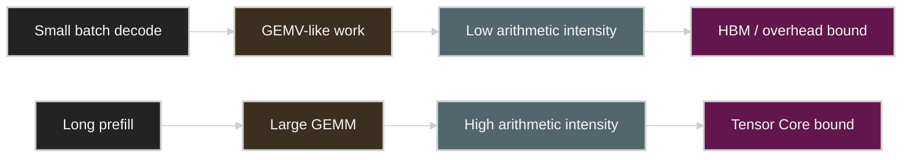

# Domain-Specific Architectures for AI Inference

> Source: [Domain specific architectures for AI inference](https://fleetwood.dev/posts/domain-specific-architectures), published 2025-08-03.
>
> This is a Korean lecture-note adaptation, not a line-by-line full translation. The goal is to preserve the article's main argument and connect it to this repository's inference performance measurements.

## Reading Map

The core question of this note is simple.

> If you redesigned an accelerator for Transformer inference only, what structure would you need that differs from a GPU?

To answer this question, the author first analyzes the bottlenecks of Transformer inference and derives hardware design principles from there. The conclusion is as follows.

1. Hardware must directly support low-precision data types.
2. Memory transfer must be designed asynchronously from the start.
3. Dedicated hardware for tensor-aware memory transfer is needed.
4. A large scratchpad is more advantageous than an ordinary cache hierarchy.
5. On a single accelerator, memory bandwidth is extremely important.
6. Scale-out must be considered from the start.
7. Communication-dedicated hardware must complement the compute hardware.

This list ties together Week 2's GPU memory hierarchy, Week 3's KV cache, and Week 4's quantization in a single viewpoint.

## Source Structure

The original is a long essay, but read as a lecture note it has the following flow.

1. It sets the optimization goals of AI inference as energy and capital efficiency.
2. It reduces Transformer inference to a memory movement problem.
3. It derives single-chip design principles such as lower precision, async transfer, DMA/TMA, and scratchpad.
4. It re-analyzes prefill/decode, matmul, attention, and KV cache from the arithmetic intensity perspective.
5. It extends beyond a single accelerator to model parallelism, MoE, AllToAll, and communication hardware.
6. It reasons about how test-time compute scaling will change hardware design targets.
7. It reads DSA cases such as TPU, Tenstorrent, Groq, and Cerebras against the design principles.

So this note is less an "introduction of a specific accelerator" and more a **note that back-derives hardware design constraints from the inference workload**.

## 1. In AI Inference, Memory Comes Before Compute

The note views the cost of AI inference in terms of energy and capital. In a world where many users keep calling models for long periods, raising FLOPS alone is not enough. The place where a system actually burns money is usually data movement.

Simplified, the Transformer forward pass repeats the following pattern.

```text
Read a large weight tensor from HBM/DRAM.
Move it to a nearby memory or compute unit.
Multiply it with the activation.
Store the intermediate result again.
Repeat in the next layer.
```

In the decode phase, the batch is small and few tokens are generated at a time. So it is closer to GEMV than GEMM, and the bytes read for weights dominate performance. This is the same thing Week 2 and Week 4 of this repository keep emphasizing.

```text
decode latency ~= model weight bytes / effective memory bandwidth + overhead
```

So the first design goal of an inference accelerator is not "more compute units" but "removing unnecessary data movement."

### 1.1 Why Look at Memory Cost First

A common mistake in AI accelerator discussion is putting peak FLOPS at the center. But what matters in inference is not "how many operations can be done" but "how fast and with how little energy can the values needed for the computation be brought in."

In decode in particular, producing one token reads the weights of each layer almost once. With a small batch, the degree of reusing the same weights across many tokens is low. So no matter how fast the Tensor Core is, if the weights cannot be brought in from HBM, it sits idle.

A simple example is the following.

| Model | Precision | Weight bytes | Minimum time to read from 3 TB/s HBM |
|---|---:|---:|---:|
| 7B | BF16 | 14 GB | 4.7 ms |
| 70B | BF16 | 140 GB | 46.7 ms |
| 70B | INT4 | 35 GB | 11.7 ms |

These values are theoretical lower bounds. In a real system, kernel launch, dequantization, KV cache read, sampling, scheduler, network, and framework overhead are added on top. Still, computing the lower bound tells you quickly what is impossible.

### 1.2 Prefill and Decode Through Arithmetic Intensity

The original compares arithmetic intensity, i.e. `operations / bytes moved`, against the hardware ratio. Put simply, it is the following.

```text
algorithm intensity > hardware ops:byte ratio  -> possibly compute-bound
algorithm intensity < hardware ops:byte ratio  -> possibly memory-bound
```

Prefill processes the prompt sequence in parallel. It has many large matrix multiplications, and the same weight tile can be reused across many token activations. So with a sufficiently long prompt and batch, it approaches compute-bound.

Decode produces one next token at a time. With a small batch, it reads many weights while the activation vector is small and the amount of computation is small. So it easily becomes memory-bound.

| Phase | Typical shape | Reuse | First-order bottleneck |
|---|---|---|---|
| Prefill | GEMM | high | Tensor Core compute or HBM tile supply |
| Decode | GEMV-like | low | HBM bandwidth, KV cache bandwidth, launch overhead |
| Batched decode | small/medium GEMM | medium | HBM or compute depending on batch size |

In the Week 2 lab, the fact that the cuBLAS path switched from GEMV to Tensor Core GEMM as the batch grew is the same phenomenon. The algorithm did not change; the shape grew large enough to feed the hardware.



## 2. Lower Precision: Quantization Is Not Just Model Compression

Lower precision produces three effects at once.

| Effect | Meaning for inference |
|---|---|
| Capacity | A larger model or a longer KV cache fits in the same HBM. |
| Bandwidth | More weights/tokens can be read at the same bandwidth. |
| Silicon area | Smaller multipliers fit more in the same die area, or the area can be redirected to SRAM. |

Rephrased in the Week 4 viewpoint, it is the following.

| Format | Meaning in decode | Meaning in prefill |
|---|---|---|
| BF16/FP16 | weight bytes are large. | A stable baseline. |
| FP8/INT8 | Can reduce both bandwidth and compute. | The Tensor Core path can get faster. |
| INT4/W4A16 | Greatly reduces decode weight traffic. | The dequantization path can become the bottleneck. |
| FP4/NVFP4 | The core frontier after Blackwell. | Whether hardware supports it matters. |

The important interpretation is this.

> Quantization is both a "technology for making things fit in memory" and a "technology for reducing the bytes that must be read from HBM."

### 2.1 Lowering Precision Also Changes the Silicon

An important point in the original is that precision reduction is not merely a memory optimization. As bit width shrinks, the circuit area and energy cost of the multiplier drop sharply. So the hardware architect has two choices.

1. Pack more compute units into the same die area.
2. Reduce some compute units and give that area to SRAM/scratchpad, DMA, and communication engines.

GPUs evolved toward keeping many compute units because of generality and ecosystem. In contrast, a DSA, if the target workload is clear, can invest area more aggressively in SRAM, data movement engines, and low-precision datapaths.

### 2.2 Precision Has a Floor

A lower bit width is not always better. LLM weights and activations carry information, and too low a precision harms model quality. So the important question for a DSA is not "what is the lowest precision" but "what is the lowest precision and format that still satisfies the target quality."

| Question | Example |
|---|---|
| Can only the weights be lowered? | W4A16, AWQ, GPTQ |
| Can the activations also be lowered? | W8A8, SmoothQuant, FP8 |
| Is the accumulator precision sufficient? | INT8 multiply + FP16/FP32 accumulate |
| Does the format handle outliers? | FP8 E4M3 vs INT8 scale |
| Is the kernel actually fast? | fused Marlin/AWQ vs slow dequant path |

As the Week 4 lab concluded, reducing the bit width alone does not automatically reduce latency. Without a fused low-bit kernel and hardware support, the dequantization overhead eats the gain.

## 3. First-Class Asynchronicity

The accelerator must be designed so that compute units do not sit idle while waiting for memory transfers. For this, double buffering, pipelining, prefetching, and overlap are needed.

A simple structure is the following.

```text
buffer A: computing
buffer B: fetching the next tile from memory
swap
buffer B: computing
buffer A: fetching the next tile
```

CUDA kernels, the Tensor Memory Accelerator, the TPU VMEM pipeline, and NCCL overlap are all ways of solving the same problem at different layers.

When drawing the roofline in the Week 2 lab, there are cases where the arithmetic intensity is sufficient yet the peak is not reached. In that case, the cause may not be a simple bandwidth shortage but a failure to overlap transfer and compute.

### 3.1 View Async as the Base Structure, Not a Feature

Asynchronicity is not a single library optimization. The hardware must be able to answer the following questions from the start.

| Question | Why it matters |
|---|---|
| Can compute and HBM loads run at the same time? | Reduces Tensor Core starvation. |
| Can data be prefetched into local SRAM? | Hides the latency of the next tile. |
| Can network receive overlap with local compute? | Important in tensor parallelism and MoE. |
| Is the copy engine independent of the compute unit? | Does not waste SMs on data movement. |

Hopper's TMA, CUDA `cp.async`, the TPU's VMEM pipeline, and NCCL communication overlap all come from the same requirement.

## 4. Tensor-Aware Memory Transfer

An ordinary DMA moves bytes. What an AI accelerator wants is to move tensors.

Tensor-aware transfer must have the following properties.

| Need | Why it matters |
|---|---|
| Layout awareness | It must understand row-major, column-major, tile layouts, and packed low-bit formats. |
| Async scheduling | Compute and copy must be overlapped. |
| Local and remote movement | Movement inside a chip, between chips, and between nodes must be handled with the same mental model. |
| Optional transform | If transpose, reduce, unpack, and scale can be handled during the copy, compute unit waste is reduced. |

The TMA on the NVIDIA H100, RDMA, GPUDirect, SHARP, and the communication engines of DSAs can all be read in this direction.

### 4.1 "Process While Copying"

From the DSA viewpoint, ideal memory movement is not a plain copy. When the tensor arrives at its destination, it must be ready to go straight into compute.

Possible transforms are the following.

| During movement | Why useful |
|---|---|
| unpack INT4/FP4 | Connects low-bit storage with high-precision compute. |
| transpose / swizzle | Matches the Tensor Core tile layout. |
| scale / zero-point apply | Converts the quantized tensor into the runtime format. |
| reduce / accumulate | Offloads part of AllReduce or expert aggregation. |
| gather / scatter | Important in MoE routing and paged KV cache. |

The case of MoE systems like DeepSeek V3 using some SMs for communication management shows that without such dedicated hardware, compute silicon can be taken away by communication orchestration.

## 5. Scratchpad Instead of the Cache Hierarchy

The CPU cache is tuned for hard-to-predict workloads. But Transformer inference reads very large tensors sequentially, multiplies them, and moves on to the next layer. It is not often that the same weight tensor is reused within a very short time.

So an ordinary cache policy can be inefficient.

```text
CPU-like cache:
  "A value read recently is likely to be used again soon."

Transformer decode:
  "The layer weights just read are not used again until the next token."
```

In this case, the more suitable structure is the scratchpad. A scratchpad is not a cache that the hardware fills and empties on its own; it is fast local memory explicitly managed by software or the compiler.

The TPU's VMEM, the GPU's shared memory/SMEM, and the local SRAM of the Tenstorrent Tensix core can all be viewed from this perspective.

### 5.1 When the Cache Fits and When It Does Not

The cache is not always bad. It is useful for data with clear reuse, such as attention tiles, repeated metadata, hot routing tables, and small activations. The problem is when huge tensor streams like LLM weights are put into the cache.

| Data | Cache usefulness | Better approach |
|---|---|---|
| Layer weights in decode | low | stream + quantize + prefetch |
| Attention tile | high | FlashAttention-style tiling |
| KV cache page metadata | medium/high | cache-friendly layout |
| MoE routing table | high | local cache or SRAM |
| Large intermediate activation | low | remove the HBM round-trip with fusion |

So the DSA is closer to the argument that **the predictable parts of the workload should be moved to the scratchpad and compiler/runtime control**, rather than a call to abolish the cache.

### 5.2 The Cost of the Scratchpad

SRAM is fast but expensive. It consumes a lot of die area and power, so it cannot be grown indefinitely. So scratchpad design is the following trade-off.

```text
larger scratchpad
  -> keep more tiles/weights/KV pages on-chip
  -> reduce HBM traffic
  -> but compete for area with compute units, IO, yield, and cost
```

The core differentiator of a DSA startup is where to land on this trade-off. GPUs strike a balance for broad workloads, while TPUs and inference DSAs can invest more boldly in SRAM and data movement for the more regular AI workload.

## 6. The KV Cache Is a Second Model

The note uses attention and the KV cache to explain the bottleneck of long-context inference.

In MHA, the K and V of every head are stored per layer. As the context grows, the KV cache pressures both HBM capacity and bandwidth at the same time.

```text
KV cache bytes/token
  ~= 2(K,V) * layers * heads * head_dim * bytes_per_value
```

MQA, GQA, and MLA are all attempts to reduce this term.

| Method | What it reduces | Trade-off |
|---|---|---|
| MQA | the number of K/V heads | model quality or an architecture constraint |
| GQA | shrinks the K/V head count at group granularity | a compromise between MHA and MQA |
| MLA | compresses K/V into a latent representation | increased projection compute |
| KV quantization | bytes per value | requires accuracy and kernel support validation |

Restating the Week 3 KV cache content from the hardware perspective:

> Long context starts as a KV cache bytes/token problem, not an attention FLOPS problem.

### 6.1 Computing KV Cache Capacity

For a decoder-only Transformer, the KV cache per token is approximately the following.

```text
bytes/token = 2 * n_layers * n_kv_heads * head_dim * bytes_per_value
```

Here `2` means K and V. In MHA, `n_kv_heads = n_attention_heads`, and in GQA/MQA it becomes much smaller.

For example, a model with 80 layers, 64 KV heads, and head_dim 128 in BF16 is:

```text
2 * 80 * 64 * 128 * 2 bytes = 2,621,440 bytes/token ~= 2.5 MB/token
```

If 1,000 concurrent requests have an average context of 4,000 tokens, the KV cache alone is about 10 TB. This is why paged KV cache, prefix caching, chunked prefill, and disaggregation matter in a real serving system.

### 6.2 The KV Cache Is Also a Bandwidth Problem

Capacity is not the only problem. Decode attention must read the past KV cache for every token. As the context grows, the per-token latency can increase.

| Optimization | Capacity effect | Bandwidth effect |
|---|---|---|
| MQA/GQA | fewer KV heads | fewer read bytes |
| MLA | compress into a latent cache | fewer read bytes, more projection compute |
| KV quantization | fewer bytes/value | fewer read bytes, requires quality/kernel validation |
| PagedAttention | less fragmentation | better locality and allocator stability |
| Prefix caching | less duplicate prefill | shared prefix reuse |

This is why DSA design treats the KV cache as a separate first-class workload. Even if weight streaming alone is fast, if long-context decode is slow, serving quality does not come out.

## 7. Scale-Out: The Ops:Comms Ratio

If the model does not fit on a single accelerator, sharding is needed. At that point, the new bottleneck is the ratio of compute to communication.

```text
ops:comms ratio = accelerator compute throughput / interconnect bandwidth
```

Tensor parallelism must exchange activations inside a layer. Expert parallelism must send tokens to the devices where the experts live and gather them back. If this communication is not hidden by compute, the GPU or accelerator sits idle.

| Parallelism | Main communication | Practical reading |
|---|---|---|
| Tensor parallelism | AllReduce / AllGather / ReduceScatter | It is advantageous to keep it within NVLink/NVSwitch. |
| Pipeline parallelism | activation transfer | Relatively easy to cross between nodes. |
| Expert parallelism | AllToAll | Fabric latency and routing are extremely important. |
| Data parallelism | gradient AllReduce | Important in training. |

In MoE models, the AllToAll of expert parallelism is especially important. Without communication-dedicated hardware, compute SMs must be spent on communication processing, which is a waste of Tensor Cores.

### 7.1 The Intuition of Tensor Parallelism

Tensor parallelism splits the weight matrix across multiple devices. Then the compute and memory each device carries shrink, but communication arises to align activations at the layer boundary.

```text
benefit:
  reduced per-device weight capacity pressure
  reduced per-device compute

cost:
  AllReduce / AllGather / ReduceScatter
  latency and bandwidth overhead
```

In decode, the batch is small, so there is little chance that compute can hide the communication. So raising the TP degree blindly can actually make things slower.

### 7.2 The Intuition of Expert Parallelism

In MoE, the selected expert differs per token. If experts are split across devices, tokens must be sent to the devices where the experts live.

```text
route tokens -> AllToAll -> expert FFN -> AllToAll/aggregate -> continue
```

This traffic is more irregular than the AllReduce of dense TP. If the token distribution is uneven, some experts/devices become the bottleneck. So for an MoE DSA, the following capabilities matter beyond simple bandwidth.

| Need | Reason |
|---|---|
| Low-latency AllToAll | Token dispatch is reflected directly in decode latency. |
| Efficient gather/scatter | The token order and expert order must keep being swapped. |
| Load balancing support | If traffic piles up on a hot expert, tail latency grows. |
| Communication/computation overlap | The next dispatch must be prepared during the expert FFN. |

## 8. What Test-Time Compute Scaling Changes

The later half of the original deals with the fact that the inference paradigm is not fixed. As ways of spending more compute during inference — reasoning models, search, verifiers, speculative decoding, multi-sample generation — increase, the hardware target changes too.

### 8.1 Serial vs Parallel Test-Time Compute

Test-time compute grows in two main directions.

| Mode | Example | Hardware implication |
|---|---|---|
| Serial | long chain-of-thought, multi-step reasoning | long decode latency, KV cache growth |
| Parallel | sampling multiple candidates, verifier/reranker | increased batch and throughput, scheduling matters |

Serial scaling pressures per-request latency and KV cache capacity. Parallel scaling can raise hardware utilization by growing the batch, but it also demands more memory and scheduler sophistication.

### 8.2 Speculative Decoding and the DSA

Speculative decoding has a draft model propose several tokens and the target model verify them at once. If the acceptance rate is high, the number of decode steps of the target model can be reduced.

From the DSA viewpoint, the following questions arise.

| Question | Why it matters |
|---|---|
| Should the draft model live on the same accelerator? | memory capacity and scheduling trade-off |
| Is the target verification handled as a prefill-like batch? | Tensor Core utilization can improve |
| How much compute is wasted on rejected tokens? | a low acceptance rate reduces the gain |
| Is KV cache rollback/update fast? | a serving runtime and memory layout problem |

In other words, speculative decoding is an algorithmic trick, but the real gain depends on how well the hardware and runtime handle the verification batch.

### 8.3 The Bottleneck in the Age of Reasoning Models

When reasoning models produce long answers and many internal tokens, the number of decode tokens grows. In that case, not only single-token latency but also tokens per joule, KV cache retention, and multi-turn cache reuse become important.

| Workload shift | Hardware pressure |
|---|---|
| Longer outputs | increased decode bandwidth and energy |
| More parallel samples | pressure on the scheduler, batch packing, and memory capacity |
| Verifier/reranker | heterogeneous model serving needed |
| Tool use / agent loops | increased latency variance and CPU/GPU orchestration |

When designing or buying a DSA, looking only at the current benchmark is dangerous. Depending on whether the future workload is serial reasoning, parallel sampling, or MoE-heavy serving, a different accelerator may turn out to be the good one.

## 9. Domain-Specific Architecture Cases

The original contrasts several architectures with the design principles. Here, the summary is based on publicly known features.

### 9.1 TPU

The TPU is a representative DSA centered on matrix multiplication. The MXU systolic array, VMEM scratchpad, HBM, and ICI topology are the core.

Where the TPU fits the original's design principles well is the following.

| Principle | TPU interpretation |
|---|---|
| Low precision | per-generation lower precision support such as BF16 and INT8 |
| Async transfer | HBM -> VMEM -> MXU pipeline |
| Scratchpad | VMEM plays the role of programmer/compiler-controlled local memory |
| Scale-out | ICI torus topology |
| Communication-aware | sharding axis and topology matching matter |

The TPU is strong at regular large matmuls and compiler-managed workloads. In exchange, it may be more constrained than a GPU for irregular kernels, the custom CUDA ecosystem, and dynamic serving features.

### 9.2 Tenstorrent

The Tenstorrent family of architectures emphasizes many small compute tiles with local SRAM, a NoC, and Ethernet-oriented scale-out. The interesting point in the original is that it separates compute cores from data movement cores.

Read from the DSA viewpoint, the message is the following.

```text
It is not enough to place many compute cores;
the cores/network that manage data movement must be designed together.
```

This approach is likely advantageous for workloads with complex communication patterns, such as MoE, AllToAll, and distributed inference. However, the software stack and compiler maturity determine the real performance.

### 9.3 Groq

The Groq LPU is known for deterministic execution and an SRAM-centered design. Rather than relying on large HBM bandwidth, it emphasizes compile-time scheduling and predictable latency.

Workloads where this design is attractive are the following.

| Good fit | Reason |
|---|---|
| Low-latency single stream | deterministic scheduling can reduce tail latency. |
| Fixed model graph | compile-time optimization becomes stronger. |
| Small/medium model serving | the benefits of on-chip memory and predictable dataflow are large. |

Conversely, it may be constrained for very large frontier models, dynamic routing, and ecosystem integration.

### 9.4 Cerebras

The Cerebras WSE goes in the direction of reducing "the cost of leaving the chip" through a wafer-scale chip and a large on-chip SRAM. This can be seen as the case that pushes the original's memory movement axiom the furthest.

If the model or working set fits on-chip well, HBM/scale-out traffic can be reduced greatly. But wafer-scale hardware is special in cost, packaging, software stack, and workload fit alike.

### 9.5 Is the GPU Not a DSA?

Modern GPUs were originally for graphics, but through Tensor Cores, FP8, TMA, NVLink, NVSwitch, NCCL, and the Transformer Engine, they are in fact becoming increasingly specialized for AI workloads.

The strengths of the GPU are the following.

| Strength | Why it matters |
|---|---|
| Ecosystem | PyTorch, CUDA, Triton, vLLM, TensorRT-LLM |
| Flexibility | Responds quickly to new architectures and custom kernels |
| Scale-up fabric | Strong at TP via NVLink/NVSwitch |
| Procurement | Good cloud/on-prem availability |

The weakness is the cost of generality. Because it is tuned for every workload, looking at a specific inference workload alone, a DSA can win on SRAM, communication offload, and deterministic scheduling.

## 10. The Hardware/Software Co-Design Viewpoint

If you read a DSA note as only a hardware story, you have read only half of it. The actual inference performance depends on how well the software stack brings out the hardware properties.

| Layer | Required capability |
|---|---|
| Compiler | graph fusion, layout transform, tiling, async scheduling |
| Runtime | batching, KV paging, prefill/decode scheduling |
| Kernel library | low-bit GEMM/GEMV, attention, MoE dispatch |
| Distributed runtime | collectives, topology-aware placement, overlap |
| Observability | bandwidth, queueing, memory pressure, tail latency |

For example, even if the hardware supports INT4, if the runtime handles dequantization with a slow kernel, the latency does not go down. Even if the hardware provides a fast interconnect, if the scheduler does not place the TP group to match the topology, the collectives become the bottleneck.

## 11. Criteria for Evaluating a Domain-Specific Accelerator

After reading this note, it is better not to start looking at an accelerator from the peak FLOPS on the spec sheet. The following order is more practical.

1. Confirm whether the target workload is prefill, decode, or training.
2. Look at the HBM capacity and bandwidth.
3. Look at the SRAM/scratchpad capacity and the software control scheme.
4. Look at the native support for low precision formats.
5. Look at the host-device, device-device, and rack-scale interconnects.
6. Look at how well it handles collectives and AllToAll.
7. Confirm whether the compiler/runtime ecosystem lowers the actual model graph well.

### 11.1 A Pre-Purchase/Adoption Questionnaire

From the actual platform team's standpoint, the following questions are more direct.

| Area | Question |
|---|---|
| Model fit | Do the target model and KV cache fit? Did you include concurrency? |
| Decode | What are the tok/s and p99 latency at batch=1, batch=8, and batch=64? |
| Prefill | How does the TTFT change on long prompts? |
| Quantization | Which formats are native, and which kernel/runtime supports them? |
| MoE | Did you measure AllToAll and expert imbalance? |
| Networking | Do the scale-up and scale-out topologies match the serving parallelism? |
| Software | Of PyTorch/vLLM/TensorRT-LLM/JAX/XLA, which is production-ready? |
| Operations | Are telemetry, failure handling, rolling deploy, and isolation possible? |
| Cost | Did you look at tokens/sec/$, tokens/sec/W, rack power, and cooling together? |

### 11.2 Points to Watch When Reading a Benchmark

DSA vendor benchmarks usually show the workload that fits best. So you must confirm the following.

| Benchmark claim | Missing question |
|---|---|
| High TOPS/FLOPS | What about memory bandwidth and utilization? |
| High tokens/sec | What about batch size and the latency SLA? |
| Low latency | What about concurrency and sequence length? |
| INT4 speedup | What about quality and the exact quantization method? |
| MoE support | What about AllToAll p99 and expert imbalance? |
| Scale-out result | What about topology, collective algorithm, and failure domain? |

## 12. Practical Interpretation in This Repository

After reading this appendix, the Week 2-4 experiments can be interpreted like the following.

| Measurement | DSA lens |
|---|---|
| Week 2 GEMV/GEMM transition | The batch shape changes the arithmetic intensity and changes the hardware path. |
| Week 2 GPU-Util mismatch | "Kernel running" and "useful roofline utilization" are different. |
| Week 3 KV cache | The context length pressures memory capacity and bandwidth at the same time. |
| Week 4 INT4 projection | On edge devices, the reduction in weight bytes is likely to lead directly to latency. |
| Week 4 bnb slowdown | A low-bit format alone is not enough; a fused kernel/runtime is needed. |

The core is always the same.

```text
1. Confirm the workload phase.
2. Compute the bytes moved.
3. Estimate the arithmetic intensity.
4. Compare it with the hardware ratio.
5. Confirm the software overhead and kernel path.
6. Then choose the optimization.
```

## 13. Repository Connections

| Repository topic | Connection |
|---|---|
| Week 2 hardware foundations | Extends memory hierarchy, Tensor Core, and HBM bandwidth into DSA design principles. |
| Week 3 KV cache | Provides the basis for looking at the KV cache from both capacity and bandwidth. |
| Week 4 quantization | Gives the viewpoint that low precision affects bandwidth, capacity, and silicon area all. |
| AI Systems Performance Engineering Chapter 4 | Connects directly to scale-out, RDMA, collectives, and communication overlap. |

## 14. Check Questions

1. Why does the latency not go down in the decode phase even if the peak FLOPS are high?
2. Why is quantization a bandwidth optimization, not just a memory capacity one?
3. Why is a general cache hierarchy not always suitable for Transformer inference?
4. Why is AllToAll important in MoE inference?
5. What item should be confirmed before FLOPS when evaluating a new AI accelerator?
6. How do prefill and decode differ from the arithmetic intensity viewpoint?
7. Under what conditions is a scratchpad advantageous over a cache?
8. How does test-time compute scaling change the design goal of an inference accelerator?
9. Why must you confirm the batch size and the latency SLA together when looking at a DSA benchmark?
10. Why does low-bit inference fail if either the hardware support or the runtime/kernel support is missing?
