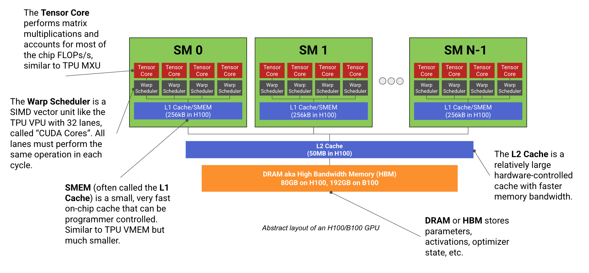
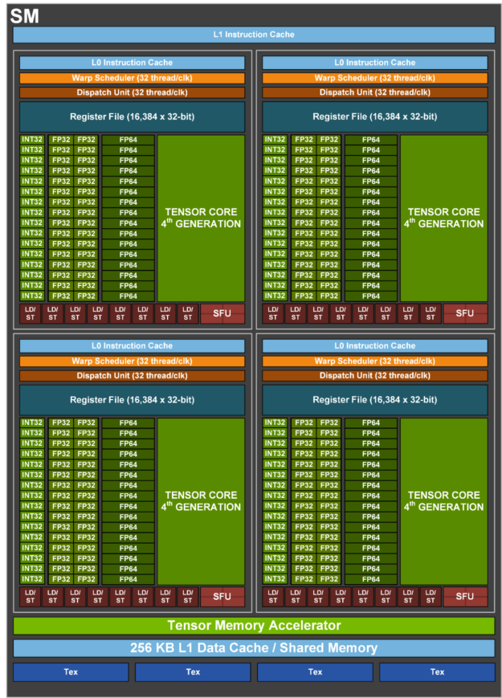
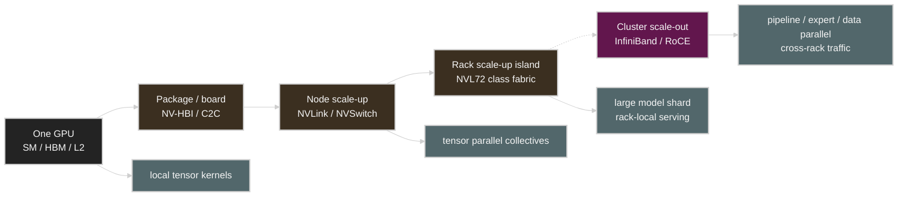

# How to Think About GPUs

> Source: [How to Think About GPUs](https://jax-ml.github.io/scaling-book/gpus/), part of *How To Scale Your Model*, published 2025-08-18.
>
> This is an English lecture-note adaptation, not a line-by-line full translation. The goal is to translate the GPU mental model and connect it to LLM inference, quantization, and distributed serving notes in this repository.
>
> Figures from the JAX Scaling Book are reused under the repository's [MIT License](assets/jax-scaling-book/LICENSE).

## Reading Map

This article explains NVIDIA GPUs from the perspective of LLM scaling. The key is to not treat the GPU as one big computer.

> A GPU is a system in which many SMs, Tensor Cores, CUDA cores, registers, SMEM, L2, HBM, NVLink/NVSwitch, and InfiniBand are connected hierarchically.

LLM performance depends on where in this hierarchy traffic gets stuck.

## 1. The Basic Unit of a GPU: the SM

Modern ML GPUs such as H100/B200 contain many SMs (Streaming Multiprocessors). Each SM behaves like an independent small processor, and inside it there are Tensor Cores, CUDA cores, a register file, and shared memory.



Source: [JAX Scaling Book, "How to Think About GPUs"](https://jax-ml.github.io/scaling-book/gpus/), MIT License. The original caption describes this as an abstract layout of an H100/B200-style GPU with many SMs connected to HBM.

| Unit | Role |
|---|---|
| Tensor Core | handles most of the matrix multiplication. |
| CUDA cores | handle elementwise ops, control-heavy ops, and reductions. |
| Warp scheduler | picks warps to execute and hides latency. |
| Register file | holds thread-local values. |
| SMEM/L1 | keeps tiles, activations, and temporary data nearby. |

Since most LLM FLOPS are matmul, the Tensor Core is the most important. But overall performance is not determined by the Tensor Core alone. If you cannot feed tiles to the Tensor Core in time, peak FLOPS mean nothing.



Source: [JAX Scaling Book, "How to Think About GPUs"](https://jax-ml.github.io/scaling-book/gpus/), MIT License. The original figure cites a Wccftech H100 SM diagram and explains SM subpartitions, Tensor Cores, warp schedulers, register files, CUDA cores, and L1 data cache.

## 2. Tensor Cores and Low Precision

With each GPU generation, Tensor Cores handle larger tiles and lower precision.

| Generation intuition | Important change |
|---|---|
| Volta/Turing | Tensor Cores arrive in earnest |
| Ampere | TF32/BF16/FP16 paths expand |
| Hopper | FP8, TMA, warpgroup-level programming |
| Blackwell | FP4/NVFP4, larger Tensor Cores, TMEM |

Lower precision changes performance in two ways.

1. It reads more elements over the same memory bandwidth.
2. It processes more multiply-accumulate per unit of silicon area.

Connecting to Week 4's message:

```text
Prefill:
  large GEMM -> Tensor Core throughput matters -> FP8/FP4 path matters

Decode:
  small GEMV-like work -> HBM bytes matter -> reducing W4/W8 weight traffic matters
```

### 2.1 From A100 to B300: What Changed

The history of NVIDIA GPU generations is not simply a story of FLOPS going up. From the LLM perspective, memory capacity, HBM bandwidth, low-precision formats, and the scale-up interconnect all changed together.

| Generation | Public memory signal | Low-precision / compute signal | Interconnect signal | Inference implication |
|---|---|---|---|---|
| A100 | 80GB HBM2e, over 2TB/s memory bandwidth | TF32, FP16/BF16, INT8/INT4 Tensor Core | NVLink generation used for 8-GPU nodes | 70B-class serving usually needs sharding/quantization, and decode is sensitive to HBM traffic. |
| H100 | HBM3, about 3TB/s class memory bandwidth | FP8 Transformer Engine, TMA, Hopper programming model | NVLink/NVSwitch, Quantum-2 InfiniBand ecosystem | The FP8 prefill/training path and faster collectives become important. |
| H200 | 141GB HBM3e, 4.8TB/s memory bandwidth | Hopper compute with larger/faster memory | Hopper NVLink/NVL system family | Even with the same Hopper compute, the larger KV cache and model fit favor inference. |
| B200 / DGX B200 | DGX B200: 8 GPUs, 1,440GB total HBM3e, 64TB/s total HBM bandwidth | Blackwell FP4/FP8 Tensor Core path | 5th-gen NVLink, 14.4TB/s aggregate NVLink bandwidth in DGX B200 | The FP4/NVFP4 weight path and large memory bandwidth push decode cost/token down. |
| B300 / DGX B300 | DGX B300 user guide: 8 x 288GB Blackwell Ultra GPUs | DGX B300: 144 PFLOPS FP4 inference class system number | 5th-gen NVLink, 14.4TB/s aggregate NVLink bandwidth in DGX B300 | A larger per-node memory envelope widens headroom for long-context, MoE, and high-concurrency inference. |

This table is a way of reading, not a procurement table. From A100 to H200, "the ability to put more model/KV state on one GPU" improved dramatically, and in the Blackwell generation FP4 and the rack-scale NVLink domain become the center of inference economics. Even at the same parameter count, the number of GPUs needed changes with context length, batch size, KV cache format, and quantization format.

## 3. SIMT and Warp Divergence

GPUs use the SIMT (Single Instruction, Multiple Threads) model. Efficiency is high when the threads in the same warp execute the same instruction. When a branch condition splits, warp divergence occurs and some lanes sit idle.

Dense matmul in LLMs is very regular and fits GPUs well. The following workloads need more care.

| Workload | Risk |
|---|---|
| token sampling | branching, small kernels, CPU/GPU sync |
| MoE routing | irregular dispatch, AllToAll, load imbalance |
| sparse attention | irregular memory access |
| small batch decode | low occupancy, launch overhead |

So a serving system must not only make one kernel fast; it must align batching, scheduling, routing, and fusion together.

## 4. The GPU Memory Hierarchy

The GPU memory hierarchy is the performance language of LLM inference.

| Level | Scope | Practical meaning |
|---|---|---|
| Registers | thread/subpartition | fastest but very small. |
| SMEM/L1 | SM-local | holds tiles and temporary buffers. |
| TMEM | Blackwell Tensor Core feeding | a new space for feeding the larger Tensor Core. |
| L2 | GPU-wide shared cache | the last on-chip cache shared among SMs. |
| HBM | device memory | the main store for weights, activations, and KV cache. |
| NVLink/NVSwitch | GPU-GPU | important for tensor parallelism and collectives. |
| PCIe/InfiniBand | host/node/rack | important for scale-out and the storage/host path. |

As emphasized in Week 2, optimization is the work of pulling traffic from slow levels of the hierarchy to fast ones.


### 4.1 Model fit: KV cache can hit its limit before weights

The most common mistake when looking at GPU memory fit is calculating only the model weights. Weights are just the starting point; in production serving, KV cache, activation/workspace, fragmentation, and runtime reserve all go in together.

```text
weight memory ~= parameters x bytes_per_parameter

KV cache memory ~= layers
                x sequence_length
                x kv_heads
                x head_dim
                x 2  # key and value
                x bytes_per_element
                x batch_or_concurrency
```

For example, even if a 70B model barely fits in one GPU memory budget under weight-only quantization, adding long context and high concurrency makes the KV cache hit the limit first. The reason the large memory of H200 and Blackwell matters for inference is not only to load larger models, but to hold longer context and more concurrent requests for the same model.

| Fit question | Why it matters |
|---|---|
| Do only the weights fit, or does the KV cache fit too? | "loadable" and "serviceable" are different things. |
| What is the target context length? | decode capacity is sensitive to KV bytes/token. |
| What is the batch/concurrency? | KV cache grows with the number of requests. |
| What is the quantization format? | Weight memory and compute path shrink, but the KV dtype may stay the same. |
| How much fragmentation and reserve do you plan for? | Even PagedAttention does not eliminate allocator overhead and block waste. |

## 5. Why GPUs Have Many SMs

GPUs execute hundreds of small tasks in parallel to hide latency. While a warp blocked on a memory load waits, other warps run.

This works well when the batch is large and there are enough tiles. Conversely, when the decode batch is small, the following problems appear.

| Symptom | Explanation |
|---|---|
| GPU-Util is high but throughput is low | kernels keep running but do not make enough use of the Tensor Core/HBM. |
| batch=1 decode is slow | there is not enough work to hide launch overhead and memory latency. |
| a small model is inefficient on an H100 | the problem size does not fill the GPU. |

This connects exactly to the Week 2 lab result. `nvidia-smi` GPU-Util only tells you "is the GPU busy", not "is it doing useful work close to peak".

## 6. GPU Networking: Inside and Outside the Node

GPU scale-out must be viewed in two layers.

| Scope | Fabric | Typical use |
|---|---|---|
| Intra-node | NVLink / NVSwitch | tensor parallelism, fast AllReduce |
| Inter-node | InfiniBand / Ethernet RDMA | data parallelism, pipeline parallelism, expert parallelism |
| Rack-scale | NVSwitch fabric like NVL72 | a larger scale-up island |

Tensor parallelism communicates frequently inside a layer, so it is best bound to the fast scale-up fabric. Pipeline parallelism only passes activations at layer boundaries, so it is relatively more suitable for scale-out. MoE expert parallelism has a lot of AllToAll and is strongly affected by the fabric and routing.

### 6.1 Read Interconnect Terms Separately

When reading GPU interconnect documentation, you must distinguish similar names.

| Term | Scope | Practical reading |
|---|---|---|
| NV-HBI | die-to-die inside a Blackwell package | the internal link that makes a dual-die GPU look like one accelerator. |
| NVLink-C2C | CPU-GPU chip-to-chip | close to the CPU-GPU coherent connection in Grace Hopper/Blackwell. |
| NVLink | GPU-GPU link | important for tensor parallel collectives, P2P, and fast scale-up traffic. |
| NVSwitch | switch fabric among many GPUs | builds an 8-GPU node or a larger scale-up island like NVL72. |
| PCIe | host/device/NIC standard I/O | the practical limit of the CPU path, NIC, storage, fallback, and non-NVLink P2P. |
| InfiniBand / RoCE | node/rack/cluster network | carries scale-out training/serving, DP/PP/EP traffic. |

Mixing up this hierarchy breaks performance estimates. Whether a tensor parallel AllReduce stays inside the NVLink domain or crosses rack-out RDMA changes latency and throughput a lot even with the same number of GPUs.



A rack-scale design like Blackwell NVL72 is more accurately read as an attempt to widen a fast scale-up island to the rack level, rather than "the scale-out network got faster". Still, the whole cluster does not become one NVLink domain; once you go outside the island, the scheduling, routing, and congestion problems of InfiniBand/RoCE reappear.


Source: [JAX Scaling Book, "How to Think About GPUs"](https://jax-ml.github.io/scaling-book/gpus/), MIT License. The original caption uses this as a typical H100 network: 8 GPUs form an NVLink domain through NVSwitches, and nodes are connected with switched InfiniBand.

## 7. Looking at Collectives with a Roofline

For LLM scaling, the compute roofline alone is not enough. You need a communication roofline.

```text
compute time ~= FLOPs / GPU compute throughput
communication time ~= bytes / collective bandwidth
```

For performance to scale well, compute time must be able to hide communication time. Otherwise, adding more GPUs does not increase speed.

| Parallelism | Communication pattern | Bottleneck lens |
|---|---|---|
| Data parallelism | gradient AllReduce / ReduceScatter | batch tokens per GPU must be sufficient. |
| Tensor parallelism | activation AllReduce / AllGather | NVLink bandwidth and latency matter. |
| Pipeline parallelism | activation send/recv | bubble and stage balance matter. |
| Expert parallelism | token AllToAll | load balance and fabric routing matter. |

## 8. The Difference Between GPUs and TPUs

The original text explains the GPU by comparing it to the TPU. Both share the broad structure of "matrix multiply unit + fast memory + network", but there are important differences.

| Dimension | GPU | TPU |
|---|---|---|
| Compute granularity | many SMs executing in parallel | centered on a relatively large MXU |
| Flexibility | CUDA ecosystem and thread-level flexibility | compiler-managed regular execution |
| Memory | register/SMEM/L2/HBM/TMEM hierarchy | centered on VMEM/HBM |
| Network | NVLink/NVSwitch/IB ecosystem | ICI/DCN topology |
| Best fit | broad workloads, custom kernels, production serving | regular large matmul, JAX/XLA compiled workloads |

The GPU's strength is flexibility. Its weakness also comes from flexibility. Even the same computation can swing a lot in performance depending on kernel choice, layout, batch shape, and whether fusion is applied.

## 9. Practical Tips and Notes from the Inference Perspective

### Prefill

Prefill processes a long prompt in parallel. There are many large GEMMs and attention ops, and the Tensor Core can be filled well. Lower-precision compute paths like FP8/FP4 deliver direct benefit.

### Decode

Decode generates tokens one at a time. If the batch is not large enough, GEMV and small attention kernels dominate. Then HBM bandwidth, KV cache layout, kernel launch overhead, and the batching scheduler matter.

### Quantization

Weight-only quantization is especially effective for decode. Weight+activation quantization or FP8 matters more in the prefill compute path. Which yields the bigger gain depends on the workload mix.

### Distributed Serving

TP can be placed inside the fast scale-up fabric, and PP can be pushed to the slower scale-out fabric. MoE needs separate verification. Until you see what traffic pattern expert routing creates on the fabric, peak FLOPS cannot predict it.

### Power and cooling are architecture constraints

In Blackwell-class systems, choosing a GPU is choosing power/cooling/topology. An 8-GPU system like DGX B200 lists up to about 14.3kW of system power on the NVIDIA product page. For servers in this class, you must look not only at "how many FLOPS does the GPU have" but also at the following.

| Question | Why it matters |
|---|---|
| What is the rack power budget in kW? | Power feed and cooling hit the limit before the GPU count does. |
| Is air cooling possible, or is liquid cooling required? | Deployment lead time and facility requirements change. |
| What is tokens/sec/rack, not just tokens/sec/GPU? | Serving capacity must include rack power and network. |
| What rack layout is needed to widen the NVLink domain? | Cabling, switches, NICs, and serviceability are part of the topology. |
| How do p99 and throughput change under a power cap? | The perf/W optimum may differ from the max-TDP setting. |

## 10. Repository Connections

| Repository topic | Connection |
|---|---|
| Week 2 hardware foundations | directly connects to SM, Tensor Core, memory hierarchy, and GPU-Util interpretation. |
| Week 3 KV cache | explains HBM traffic and KV cache layout in the decode path. |
| Week 4 quantization | explains why FP8/FP4/W4A16 act differently on prefill/decode. |
| AI Systems Performance Engineering Chapter 4 | connects to NCCL, NVLink, RDMA, and the collective roofline. |
| AI Systems Performance Engineering Chapter 3 | connects how CPU pinning, NUMA locality, and the Topology Manager under Kubernetes affect GPU serving p99 and training step time. |
| NPU appendix | provides the basis for comparing the GPU scale-up fabric with the NPU compiler/runtime envelope. |

## 11. Check Questions

1. How do the roles of Tensor Cores and CUDA cores differ on a GPU?
2. Why is a large GPU like an H100 inefficient when the decode batch is small?
3. Why can real throughput be low even when `nvidia-smi` GPU-Util is high?
4. Why is tensor parallelism usually grouped inside NVLink/NVSwitch?
5. Why does the benefit of quantization appear differently in prefill and decode?
6. Why are "the model weights fit in GPU memory" and "production serving is possible" different statements?
7. How should traffic that stays inside the NVLink/NVSwitch domain be evaluated differently from traffic that crosses InfiniBand/RoCE?
8. Why do power/cooling become architecture constraints in the Blackwell generation?

## References

| Topic | Source |
|---|---|
| JAX Scaling Book GPU chapter | <https://jax-ml.github.io/scaling-book/gpus/> |
| NVIDIA A100 product page | <https://www.nvidia.com/en-us/data-center/a100/> |
| NVIDIA H100 product page | <https://www.nvidia.com/en-us/data-center/h100/> |
| NVIDIA H200 product page | <https://www.nvidia.com/en-us/data-center/h200/> |
| NVIDIA DGX B200 product page | <https://www.nvidia.com/en-us/data-center/dgx-b200/> |
| NVIDIA DGX B300 product page | <https://www.nvidia.com/en-us/data-center/dgx-b300/> |
| NVIDIA DGX B300 user guide | <https://docs.nvidia.com/dgx/dgxb300-user-guide/introduction-to-dgxb300.html> |
| NVIDIA Blackwell architecture | <https://www.nvidia.com/en-us/data-center/technologies/blackwell-architecture/> |
