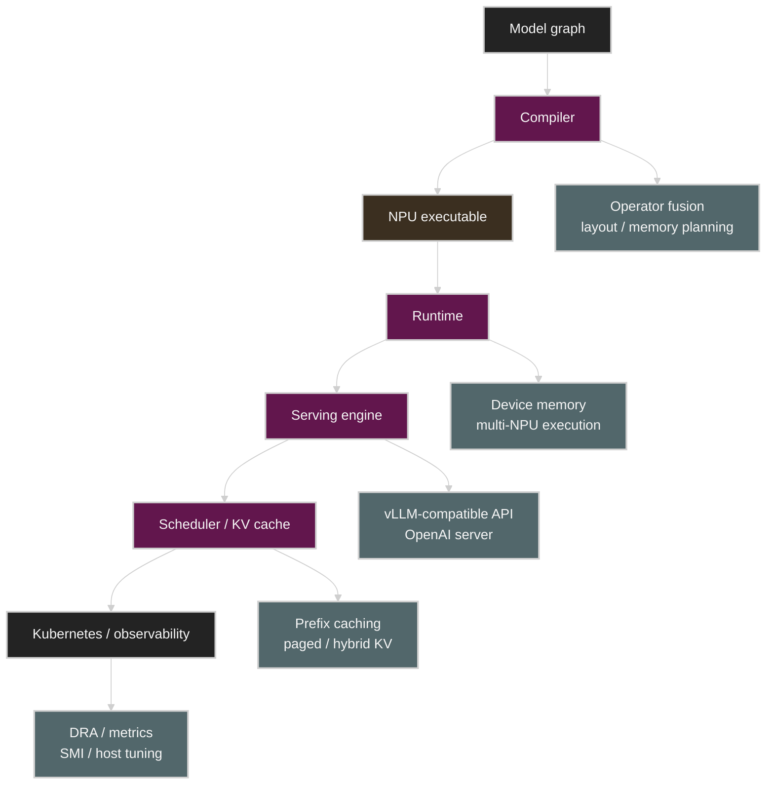
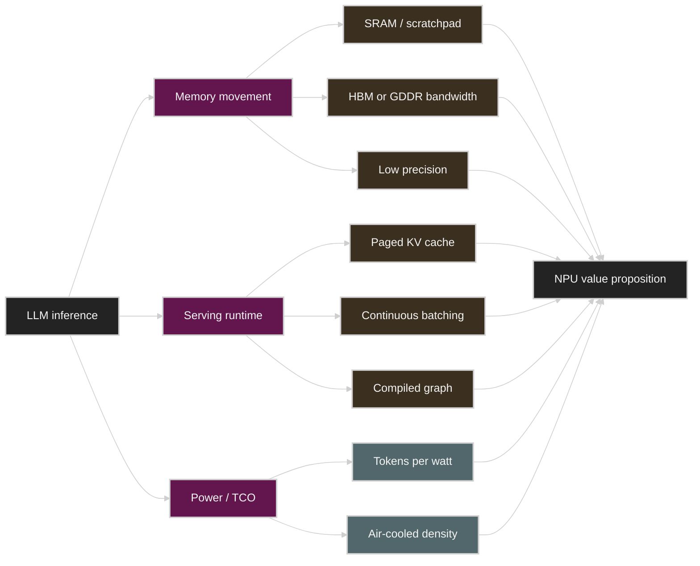
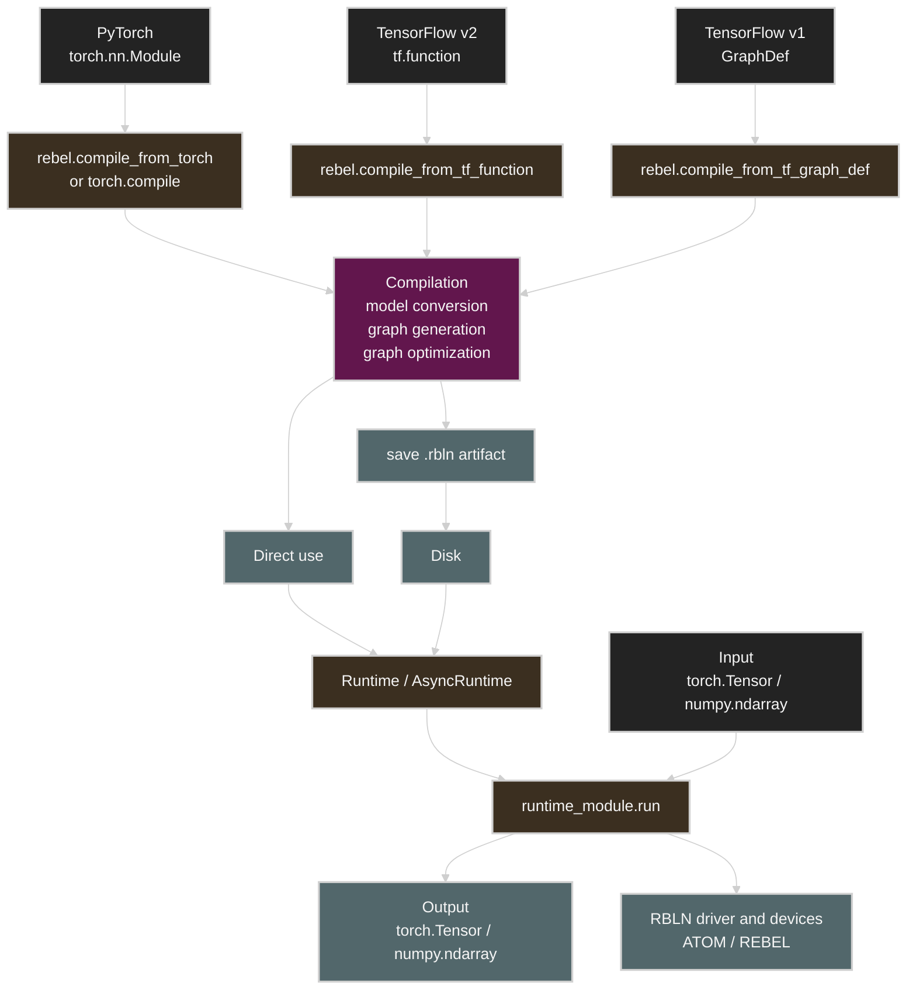

# How to Think About NPUs

> Sources: Rebellions public docs and articles, FuriosaAI public docs and repositories, and public product pages listed in the References section.
>
> This is a Korean lecture-note adaptation and research note, not a vendor benchmark reproduction. The goal is to explain how NPUs fit into the LLM inference hardware landscape and how to evaluate claims from Rebellions, FuriosaAI, and similar inference accelerators.
>
> The NPU market changes quickly. Treat product numbers in this note as public-reference snapshots, and re-check official docs before using them for procurement or capacity planning.

## Reading Map

The central question of this article is the following.

> If we introduce an NPU instead of a GPU or TPU for LLM inference, what can we expect and what must we verify?

The name NPU is broad. A small neural engine inside a mobile SoC is called an NPU, and a datacenter inference accelerator is also called an NPU. The NPU in this note is the latter.

```text
NPU in this note:
  datacenter or server-grade neural processing unit
  optimized primarily for inference
  exposed through compiler/runtime/serving stack
  evaluated by latency, throughput, watts, memory, and software maturity
```

In the Korean AI accelerator ecosystem, Rebellions and FuriosaAI are good case studies. Both claim "more efficient inference than a GPU", but their approaches are different.

| Vendor | Public product family | Architectural emphasis | Serving emphasis |
|---|---|---|---|
| Rebellions | ATOM, REBEL family | multi-core NPU SoC, SRAM hierarchy, NoC, RSD scale-out | vLLM RBLN, Flash/custom attention, APC, dynamic batching, distributed serving |
| FuriosaAI | RNGD | Tensor Contraction Processor, HBM3, large SRAM, SR-IOV | Furiosa-LLM, PagedAttention, prefix caching, hybrid KV cache, llm-d |

The important question is not the simple one of "is the NPU faster than a GPU?". A better question is the following.

```text
For this workload and SLO:
  does the NPU reduce the limiting cost?
  does its software stack expose that advantage?
  does the operating model fit our serving system?
```

## 1. Placing the NPU Between GPU/TPU/DSA

GPU, TPU, NPU, and DSA are not completely separate categories. Modern GPUs are very specialized for AI workloads with Tensor Cores, FP8/FP4, TMA, and NVLink. The TPU is Google's compiler-managed DSA. An NPU usually refers to a specialized accelerator that a vendor designed for neural network inference.

From the perspective of this appendix, it is practical to read it as follows.

| Category | Strong mental model | Main risk |
|---|---|---|
| GPU | flexible throughput machine with mature ecosystem | power, cost, memory movement, CUDA dependence |
| TPU | compiler-managed matrix machine with topology-aware scaling | workload fit, ecosystem boundary |
| NPU | inference-first DSA with custom memory/runtime stack | software maturity, model coverage, portability |
| DSA | workload-specific hardware/software co-design | benchmark narrowness, adoption risk |

For the NPU to win, it usually has to show one or more of the following in a real workload.

1. Higher tokens/sec/W at the same latency SLO.
2. More concurrent requests at the same rack power.
3. Lower p99 latency for the same model.
4. A bigger model or a longer context with the same memory budget.
5. A simpler operational envelope: air cooling, lower power, better partitioning, easier multi-tenancy.

Conversely, if it cannot answer the following questions, its production value is weak even with high peak TOPS.

1. Are the supported models and operator coverage sufficient?
2. Do graph breaks, CPU fallbacks, and unsupported ops create a latency tail?
3. Are vLLM, an OpenAI-compatible server, Kubernetes, metrics, and the profiler actually usable?
4. Are serving primitives like PagedAttention, continuous batching, quantization, and prefix cache implemented to match the hardware?
5. Are collectives, placement, and failure handling verified on multi-device and multi-node?

An NPU must be evaluated as the whole stack below, not as a single chip.



## 2. The Bottleneck the NPU Aims At

The bottlenecks of LLM inference usually appear along four axes.

| Bottleneck | NPU design response |
|---|---|
| Weight traffic | low precision, high memory bandwidth, better data movement |
| KV cache capacity | larger memory, paged cache, GQA/MLA-friendly layout, cache compaction |
| Kernel/runtime overhead | compiled graph, fused operators, specialized runtime |
| Power and TCO | lower TDP, better perf/W, server/rack density |

The GPU is strong in flexibility. In exchange, to support a broad workload, its silicon and software maintain generality. The NPU can make bolder choices the narrower the target workload becomes toward inference.



The point to watch in this diagram is that the NPU's advantage does not come from the datapath of a single chip alone. In LLM serving, the chip, compiler, runtime, attention kernel, KV cache manager, and scheduler are one product surface.

## 3. Rebellions: ATOM, RSD, vLLM RBLN

The message that repeats in Rebellions' public materials is **an SoC and scale-out serving stack tailored to the inference workload**.

The official RBLN NPU architecture docs describe ATOM as a multi-core SoC. Based on the public docs, ATOM includes Neural Engines, a Command Processor, an on-chip local/global scratchpad memory hierarchy, a NoC bus fabric, PCIe 5.0, and a GDDR6 interface. The ATOM white paper presents Samsung 5nm, FP16 32 TFLOPS, INT8 128 TOPS, 8 Neural Engines, and a total of 64MB on-chip SRAM. For the RBLN-CA12 card, 16GB GDDR6, 256GB/s memory bandwidth, PCIe Gen5 x16, 60-130W TDP, and up to 16 hardware-isolated multi-instances are public.

The memory hierarchy should be read a bit more granularly. Each Neural Engine has 4MB of scratchpad memory, and an L1 Neural Cache and 32MB L2 Shared Memory are mentioned. So the product-level number of "64MB on-chip SRAM" and the architecture-level description of "4MB local scratchpad + 32MB shared memory" must be read together.

This structure resembles the GPU memory hierarchy, but the interpretation differs slightly.

| ATOM component | Inference interpretation |
|---|---|
| Neural Engine | the basic compute tile that executes dense neural network compute |
| Local scratchpad | per-engine SRAM that keeps tiles, activations, and temporary state close |
| L1 Neural Cache | a cache layer that reduces data access latency near the Neural Engine |
| L2 Shared Memory | a 32MB on-chip memory layer shared between engines |
| NoC | the data movement fabric between engines and memory |
| GDDR6 DRAM | the off-chip backing store for model weights, activations, and cache state |
| Command Processor | compiled execution and scheduling control path |
| Task Manager | a control block that resolves local dependencies at the hardware level to help parallel execution |
| Multi-Instance | a partitioning surface that divides one card across several isolated inference tasks |

### 3.1 ATOM from a Roofline Perspective

The roofline questions are the same when looking at an NPU like ATOM.

```text
critical intensity = peak ops/s / memory bandwidth bytes/s
```

However, on an NPU, looking only at a single HBM roofline is not enough.

| Roofline | What to measure |
|---|---|
| local SRAM roofline | tile reuse, local scratchpad occupancy, engine utilization |
| global SRAM roofline | cross-engine reuse and synchronization cost |
| off-chip DRAM roofline | weight streaming and KV cache bandwidth |
| inter-device roofline | model parallelism, tensor/expert traffic |
| host path roofline | pre/post-processing, graph breaks, CPU fallback |

That is why Rebellions' docs emphasize the SRAM hierarchy and NoC. In LLM inference, off-chip memory access easily dominates energy and latency. If you can create more reuse in on-chip memory, tokens/sec/W can improve.

### 3.2 The Execution Surface through the RBLN Profiler

The RBLN v0.10.4 docs publish the command taxonomy the profiler records. This taxonomy matters for not treating the NPU as a black box and asking "where is the time being spent".

| Profiler command | What it means | Inference bottleneck lens |
|---|---|---|
| `Host` | work that is better run on the CPU or offloaded to the host CPU because the NPU does not support it | unsupported op, shape adjustment, CPU fallback |
| `Neural Engine Clusters` | compute work executed on the Neural Engines | useful compute, engine utilization |
| `Neural DMA` | transfers between device DRAM and Neural Engine scratchpads | weight/input/kernel tile movement |
| `Task DMA` | transfers between device DRAM and shared memory | intermediate tensor and shared-memory traffic |
| `External HDMA` | transfers between host DRAM and device DRAM | host-device bottleneck, graph boundary |
| `Device HDMA` | transfers between device DRAM or shared memory in an RSD configuration | inter-device tensor movement |
| `Device Sync` | synchronization between different devices in an RSD configuration | collective latency, dependency scheduling |

This table plays the same role as separating SM throughput, DRAM throughput, and kernel launch overhead in a GPU profiler. On an NPU as well, simply looking at end-to-end latency does not reveal the cause.

```text
Good NPU profiling question:
  Is time spent in Neural Engine compute,
  Neural DMA / Task DMA movement,
  Host fallback,
  Device HDMA,
  or Device Sync?
```

The vLLM profiling guide in RBLN v0.10.4 points in the same direction. It explains that TTFT and TPOT alone are not enough, and that the PyTorch-level profiler and the RBLN profiler should be used together to inspect low-level behavior. For online inference, after starting the OpenAI-compatible server, the profiling interval can be controlled with the `/start_profile` and `/stop_profile` endpoints.

### 3.3 RSD: A Scalable Design, Not a Single Chip

In public materials, Rebellions describes RSD (Rebellions Scalable Design) as a scale-out architecture. The LLM serving article explains that RSD includes disaggregated prefill, multi-node execution, and MoE support.

This is an important direction. LLM inference does not end with the performance of a single accelerator.

| Serving feature | Why it matters |
|---|---|
| Disaggregated prefill | prefill and decode have different resource profiles. Separating them reduces interference. |
| Multi-node execution | scales memory capacity and throughput for large models or high concurrency. |
| MoE support | expert routing creates AllToAll, load balancing, and irregular dispatch. |
| Cache-aware scheduling | KV cache locality and memory compaction determine throughput/p99. |

What looks more concrete in the RSD white paper is compiler-managed tensor parallelism. Rebellions explains that the RBLN Compiler splits model tensors across multiple devices at compile time and includes inter-device data movement information in the command stream that the Command Processor executes.

| RSD mechanism | Inference interpretation |
|---|---|
| Automatic multi-device splitting | the compiler handles splitting/reconnection so the developer does not manually perform graph surgery for tensor parallelism. |
| Inter-device communication optimization | aims to reduce the overhead and memory footprint of collective patterns such as broadcast, reduce, and partial sums. |
| Intra-device layer pipelining | an attempt to overlap operations inside a device to reduce idle time and communication stalls. |
| PCIe Gen5 x16 card-to-card path | uses direct inter-card communication, not just host connectivity, as part of the scale-out path. |
| vLLM + router server | presents an operating model that bundles multiple vLLM instances into a rack-level serving surface and distributes the workload. |

In the language of Weeks 1-4, RSD is an attempt to answer the following problem.

```text
prefill:
  large GEMM, higher arithmetic intensity, compute-heavy

decode:
  weight/KV traffic, lower arithmetic intensity, latency-sensitive

serving:
  schedule both phases without wasting memory, fabric, or power
```

### 3.4 The Meaning of vLLM RBLN

The biggest risk in NPU adoption is software. Rebellions has published the `vllm-rbln` plugin and chosen the direction of attaching to the vLLM entry point and ecosystem. The official vLLM RBLN docs describe it as a vLLM hardware plugin that provides LLM inference and serving on the RBLN NPU.

The advantage of this approach is clear.

| Integration layer | Adoption value |
|---|---|
| vLLM API | reduces changes to existing serving code. |
| OpenAI-compatible serving path | lowers the application integration cost. |
| model zoo | provides compile and deployment examples. |
| attention support | provides execution paths such as Naive Attention, Flash Attention, and custom attention kernels. |
| profiling support | inspects low-level bottlenecks through the PyTorch-level profiler and the RBLN profiler. |

But when evaluating, you must not stop at "it carries the vLLM name". In practice you must verify the following.

1. Supported model architectures: do the Llama, Qwen, Mixtral, and DeepSeek families work with the required shapes?
2. Attention variants: are there no graph breaks with GQA, MLA, sliding window, and long context?
3. Quantization paths: among FP16, FP8, INT8, and INT4, which formats are native and which carry dequant overhead?
4. Continuous batching: is p99 stable even when the arrival distribution changes?
5. Memory compaction: is KV fragmentation managed when long and short requests are mixed?

The especially useful serving surfaces in the RBLN v0.10.4 docs are the following.

| vLLM RBLN feature | Practical meaning |
|---|---|
| Attention modes | adjusts the attention implementation and KV partitioning with `rbln_attn_impl` and `rbln_kvcache_partition_len`. |
| Automatic Prefix Caching | reuses the KV cache of a common prefix to reduce duplicate prefill computation. Can be turned on and off the same way as in vLLM. |
| Dynamic decoder batch sizes | pre-compiles multiple decoder batch sizes with `rbln_decoder_batch_sizes` and selects the decoder closest to the actual request count. |
| Custom kernel | provides a path for writing kernels in Triton and compiling them through the RBLN IR into a target binary. |
| OpenAI-compatible server | provides application-level integration and profiling endpoints. |
| Disaggregated Encoder | a beta feature that separates the visual encoder from the language-model PD instance in multimodal serving. |

`rbln_decoder_batch_sizes` is an important hint for NPU serving. Ordinary GPU serving often handles dynamic shapes with runtime kernel selection or CUDA Graph capture sizes. RBLN is closer to preparing multiple decoder shapes at compile time and selecting one to match the request count.

```text
Example intuition:
  compile decoder batch sizes: [1, 2, 4, 8]
  incoming active requests: 3
  runtime selects batch-4 decoder instead of always using batch-8
```

This approach can reduce padding waste for small batches, but the compile matrix and supported shapes must be managed operationally. When evaluating an NPU runtime, you must look not only at "maximum batch throughput" but also at how often each compiled decoder is selected under the traffic distribution.

Custom kernel support is also interesting. The v0.10.4 docs describe a pipeline that lowers a Triton kernel to the RBLN IR and has the `rebel-compiler` compile it into a target binary. Flash attention, flash causal attention, and sliding window attention kernels are mentioned as examples. However, there are constraints such as using `tl.static_range`, not supporting `tl.range`, and using `keep_dims=True` in reductions, so you must not assume that CUDA/Triton kernels can be moved over as-is.

The Disaggregated Encoder is a different axis from prefill/decode disaggregation. In multimodal models, the scheduling profiles of the visual encoder and the language model differ, so the encoder instance and the PD (Prefill+Decode) instance are separated into distinct vLLM processes. The v0.10.4 docs mark this feature as beta and explain that production use is not yet recommended. Therefore, this feature should be read as "an important direction, but a surface that still needs stability verification".

The benchmark numbers in Rebellions' white papers must be read carefully. The T5-3B and SDXL-Turbo results in the ATOM white paper present a power efficiency comparison against the A100, but the ATOM results are marked as projected data. The Llama3-8B rack-level TPS/Watt and TPS/$ comparisons in the RSD white paper also carry the premise of being estimates based on internal testing or public information. So these numbers are best used as material for reading the design targets the vendor emphasizes, namely "low-power inference and scale-out efficiency", rather than as procurement-grade benchmarks.

### 3.5 The Order of Reading the RBLN Public Software Stack

Rebellions' public GitHub organization does not have a repository that shows the compiler internals as-is. `rebel-compiler` is distributed as a binary package that requires separate access. Therefore, when reading the public repositories, it is more practical to focus on "what integration surface and production path did they expose" rather than "how does the compiler optimize internally".

The RBLN compiler API docs show this integration surface more directly. The RBLN compiler can compile with PyTorch and TensorFlow graphs as input, and based on the public docs presents PyTorch `torch.nn.Module`, TensorFlow v2 `tf.function`, and TensorFlow v1 `GraphDef` as input surfaces. The compile pipeline is described as Model Conversion, Graph Generation, and Graph Optimization, and the result can be used immediately in the RBLN Runtime or saved as a `.rbln` file for reuse. The runtime execution surface is the form of creating `Runtime()` or `AsyncRuntime()` and then calling `run()`, and it supports `torch.Tensor` and `numpy.ndarray` as input/output data types.



_Source: adapted from RBLN Compiler API overview._

From the LLM inference perspective, the following four repositories are the most important.

| Repository | Stack layer | What to inspect first | What it tells you |
|---|---|---|---|
| `vllm-rbln` | serving runtime integration | `vllm_rbln/`, `docs/`, `benchmarks/` | vLLM plugin, OpenAI-compatible serving, batching, attention, prefix caching, benchmark surface |
| `rbln-model-zoo` | validated examples and deployment recipes | `model_registry.yaml`, `vllm/`, `huggingface/`, `serving/` | which models and framework paths are actually provided as public examples |
| `optimum-rbln` | Hugging Face export and inference bridge | `src/optimum/rbln`, `examples/`, `tests/` | the path of converting Transformers/Diffusers models into RBLN compile artifacts |
| `torch-rbln` | low-level PyTorch extension | `torch_rbln/`, `docs/`, `aten/`, `c10/rbln/` | the `rbln` device, eager/debug workflow, `torch.compile` integration, and the direction of operator coverage |

In practice, it is better to look at `vllm-rbln` first. That is because the NPU's adoption risk appears in the serving stack more than in the chip itself. `vllm-rbln` exposes the RBLN NPU as a vLLM hardware plugin and shows the batching, attention implementation, prefix caching, profiling, and benchmark flows that matter in LLM serving. In particular, files like `docs/bucketing.md`, `docs/sub_block_prefix_caching.md`, `benchmarks/benchmark_serving.py`, and `benchmarks/benchmark_throughput.py` are more useful for understanding the operating surface than for peak benchmarks.

`rbln-model-zoo` must be read as a map that confirms "what works". The README emphasizes Hugging Face, PyTorch, TensorFlow, and C/C++ APIs along with over 500 model examples. The value of this repository lies in coverage and recipes rather than architecture explanation. Looking at `vllm/decoder-only`, `vllm/multimodal`, `huggingface/transformers`, `serving/triton_inference_server`, `serving/rayserve`, and `serving/torchserve` tells you which ecosystem touch points the RBLN stack prioritizes.

`optimum-rbln` is an adapter between the Hugging Face ecosystem and the NPU compiler/runtime. It provides a flow that converts an existing `transformers` or `diffusers` pipeline into an RBLN class, stores the exported/compiled artifact, and reuses it for inference. So it is useful when evaluating model portability, compile-time shape selection, and Hugging Face API compatibility.

The Single NPU and Multi-NPU support lists in Optimum RBLN should not be read as a simple superset/subset relationship. Single NPU support generally shows local compile/inference coverage, while Multi-NPU support is closer to a distributed execution contract where model partitioning, inter-device communication, memory fit, and RSD-specific validation must all line up together.

The Qwen3-VL-2B-Instruct example shows this difference well. Judging by the 2B parameter count in the model name, it looks small, but the Qwen3-VL tutorial explains that this model is split into a top-level causal LM and a `visual` Vision Transformer submodule, and that each component is compiled as a separate graph and executed by a separate runtime. The RBLN config of the public example also uses `tensor_parallel_size=8` for both the visual encoder and the language model, and sets a large serving envelope such as visual `max_seq_len=16384`, language-model `max_seq_len=262144`, and `kvcache_partition_len=16384`. Therefore, this should be read not as "8 NPUs are always required because of the 2B model weights", but as a validated RSD configuration that includes long multimodal context, a large visual token budget, KV cache partitioning, and tensor-parallel execution.

The tutorial also directly addresses the waste potential of this large envelope. The ViT of Qwen3-VL runs per image or video frame, and the graph shape is fixed at compile time. Compiling with `visual.max_seq_len=16384` computes for 16,384 patches even when the actual input is 1,024 patches. To reduce this, the tutorial presents compiling multiple ViT graphs together, like `visual.max_seq_len=[1024, 3136, 16384]`, and selecting at runtime the smallest bucket that can hold the actual patch count. For example, with Qwen3-VL's `patch_size=16` and `spatial_merge_size=2`, a 1024x1024 image corresponds to 1,024 merged patches, 1792x1792 to 3,136, and 4096x4096 to 16,384.

The decoder has the same problem. A decoder compiled with `batch_size=8` computes for 8 slots even when the actual active batch is 3, so the tutorial explains compiling multiple decoder graphs together, like `decoder_batch_sizes=[1, 2, 4, 8]`, and selecting the graph that fits the actual batch. It also explains that on a 16-device server, placing `visual` on devices 0-7 and the LM on devices 8-15 keeps the two submodules from occupying the same device memory at the same time, reducing memory pressure for large batches and long contexts.

Even so, it is a critical signal in evaluation against the GPU. If the actual workload is small images, short prompts, and short outputs, a single high-memory GPU may be enough, and an 8-NPU configuration can be disadvantaged in cost, slots, and operational complexity. For the RBLN stack to be persuasive, its tokens/sec/W, p99 latency, concurrency, and server cost on 8 NPUs must beat the GPU baseline under the same workload/SLO.

| Qwen3-VL-2B RSD question | Why it matters |
|---|---|
| Can you compile with a smaller `max_seq_len`? | if the target context is short, you can reduce the memory reservation and compile envelope. |
| Can you match the visual `max_seq_len` to the actual image/video resolution? | the patch/token budget determines visual encoder cost and activation memory. |
| How many ViT input-length buckets should you keep? | more buckets reduce padding waste but increase compile time and device memory usage. |
| Does `decoder_batch_sizes` fit the traffic's active batch distribution? | you can reduce unused slot computation in the decode phase. |
| Should `visual` and the LM share the same device pool or be separated? | it is a trade-off between memory pressure and the available NPU count. |
| Can you lower `tensor_parallel_size` to 1, 2, or 4? | the minimum NPU count determines deployment economics. |
| How do p99 and tokens/sec/W on 8 NPUs compare to a single GPU? | the criterion for judging production value, not mere support. |
| Do the compile-time shapes fit the traffic distribution? | an envelope that is too large can create padding, memory, and scheduling waste. |

`torch-rbln` shows the lowest software layer. As a PyTorch out-of-tree extension, it provides the `rbln` device, `torch.rbln`, and the `torch.compile` surface. The README states the beta status and the possibility of API changes, so it is better read as material for understanding unsupported ops, eager debugging, operator lowering, and the direction of PyTorch integration, rather than as a starting point for production serving.

The C/C++ language binding is published as a runtime API for applications that cannot use the Python runtime or require very low latency. Installation itself does not help much with compiler internals analysis, but it is useful for understanding the deployment boundary of loading a `.rbln` artifact and calling inference from a C/C++ service process. Therefore, if the goal is analyzing the LLM serving stack and model coverage, its priority is low, and it is worth looking at when considering embedded services, custom C++ servers, removing Python overhead, or non-Python production integration.

Bundling these four repositories into a single stack gives the following picture.

```text
torch-rbln:
  PyTorch device and operator integration

optimum-rbln:
  Hugging Face model export, compile, and inference bridge

vllm-rbln:
  LLM serving engine integration and runtime features

rbln-model-zoo:
  validated model examples, deployment recipes, and coverage map
```

The core questions when evaluating are the following.

| Question | Where to look |
|---|---|
| Is our model architecture in the public examples? | `rbln-model-zoo/model_registry.yaml`, `vllm/`, `huggingface/` |
| Is the vLLM feature needed for the serving SLO implemented? | `vllm-rbln/docs/`, `vllm_rbln/`, `benchmarks/` |
| How are compile artifacts created and reused? | `optimum-rbln/examples/`, `src/optimum/rbln/` |
| Where can unsupported operators or fallbacks be checked? | `torch-rbln/docs/`, `torch_rbln/`, profiler output |
| What cannot be known from the public repositories alone? | `rebel-compiler` internal optimizations, closed binary behavior, actual hardware capacity |

Therefore, a good order for reading RBLN public materials is: confirm model coverage with `rbln-model-zoo`, look at serving behavior with `vllm-rbln`, then check the compile/export path with `optimum-rbln`, and go down to lower-level PyTorch integration with `torch-rbln` when needed. Conversely, trying to infer the compiler internals and exact hardware scheduling from public sources alone weakens the grounding.

## 4. FuriosaAI: RNGD, TCP, Furiosa-LLM

The core keywords in FuriosaAI's public materials are **Tensor Contraction Processor (TCP), HBM3, large SRAM, low power, and cloud-native integration**.

The official RNGD overview describes RNGD as FuriosaAI's second-generation NPU. Based on the latest developer docs, RNGD uses the TCP architecture and presents TSMC 5nm, 1.0GHz, BF16 256 TFLOPS, FP8 512 TFLOPS, INT8 512 TOPS, INT4 1024 TOPS, and HBM3 1.5TB/s. The same docs publish 48GB HBM3, 256MB SRAM, PCIe Gen5 x16, passive cooling, 150W TDP, SR-IOV, 8 virtual functions, ECC, and secure boot with root of trust.

> [!NOTE]
> There was a period when the TDP labeling looked different between the Furiosa product page and the developer docs. This note uses 150W based on the RNGD hardware specification in the 2026.2.0 developer docs. For procurement or capacity planning, always re-check the latest official datasheet and the actual server wall power.

### 4.1 TCP: Aims at a Broader Primitive than Matrix Multiply

GPU and TPU explanations usually start from the matrix multiplication unit. Furiosa describes RNGD as a Tensor Contraction Processor. Tensor contraction includes matmul but can be read as a more general multi-dimensional tensor operation.

From the LLM inference perspective, this claim means the following possibilities.

| Claim direction | Practical interpretation |
|---|---|
| tensor contraction native execution | the compiler can lower not only matmul but also attention, projection, reduction, and layout transforms more directly. |
| compiler-managed layout | tensor layout and on-chip memory placement become part of the performance model. |
| large SRAM + HBM3 | a design that exploits SRAM reuse and HBM bandwidth together. |
| low TDP | takes tokens/sec/W and rack density as the main metrics. |

The point to watch is that the description "TCP is more general" alone does not reveal real performance. The actual questions are always the same.

```text
Does the target model graph lower cleanly to TCP primitives?
Do unsupported ops fall back to the CPU?
Does the compiler handle dynamic serving shapes well?
```

### 4.2 The RNGD Memory Story

RNGD's public product numbers show the important axes of NPU evaluation well.

| Public spec | Why it matters |
|---|---|
| 48GB HBM3 | directly affects model fit and KV cache capacity for the 7B/13B/32B families |
| 1.5TB/s HBM3 bandwidth | the first-order bound on decode weight/KV traffic |
| 256MB SRAM | the potential for on-chip tile/cache/scratchpad reuse |
| PCIe Gen5 x16 | matters for the host-device path, P2P, and multi-card serving |
| SR-IOV, 8 virtual functions | the basis for multi-tenant partitioning and isolation |
| 150W TDP | the center of the perf/W and air-cooled deployment argument |

These numbers are hard to compare directly with GPUs. For example, the H100/B200 may have larger raw compute and bandwidth, but the TDP and cost also differ. The value of an NPU usually lies in "cheaper and more efficient at the target SLO" rather than "absolute fastest".

### 4.3 Furiosa-LLM and the vLLM-compatible API

FuriosaAI provides Furiosa-LLM as an LLM/multimodal LLM inference engine. Based on the official docs, the main features include a vLLM-compatible API, PagedAttention-based KV cache management, continuous batching, FP8 quantization, data/tensor/pipeline parallelism, an OpenAI-compatible server, tool calling, reasoning parser, structured output, and chunked prefill. Speculative decoding is marked as planned for 2026.3.

This is a similar direction to Rebellions.

```text
Hardware alone:
  interesting chip

Hardware + LLM runtime:
  deployable inference system

Hardware + runtime + Kubernetes + metrics:
  production candidate
```

The Furiosa software stack docs also clearly separate the roles of the Furiosa Compiler and Runtime.

| Component | Practical meaning |
|---|---|
| Kernel driver / firmware / PE runtime | Linux device exposure, low-level PE scheduling, host runtime communication |
| Furiosa Compiler | graph optimization, operator fusion, memory allocation, scheduling, cross-layer data movement optimization |
| Furiosa Runtime | compiled executable loading, NPU program scheduling, NPU/host memory allocation, multi-NPU entry point |
| Furiosa Model Compressor | calibration and quantization toolkit |
| Furiosa-LLM | vLLM-compatible serving engine for LLM and multimodal LLM workloads |

Quantization must be read especially carefully. Based on the 2026.2 docs, Furiosa-LLM presents FP8 quantization as a main feature and marks INT4, INT8, GPTQ, and AWQ as planned. Therefore, in benchmark comparisons, "the RNGD hardware publishes INT4 TOPS" and "the current serving stack provides a production INT4 model path" must be separated.

Furiosa's public GitHub materials also show the production surface.

| Public artifact | What to learn from it |
|---|---|
| `furiosa-sdk` | compiler, profiler, Python bindings, quantizer, serving library |
| `furiosa-perf` | Furiosa NPU and vLLM benchmark workflow comparison surface |
| `furiosa-apps` | reference applications and integrations |
| DRA driver guide | Kubernetes Dynamic Resource Allocation integration |

### 4.4 Prefix caching and hybrid KV cache

The most important serving detail in the Furiosa-LLM docs is the KV cache-related features.

| Feature | What it optimizes |
|---|---|
| PagedAttention | KV cache memory management and attention memory efficiency |
| Prefix caching | repeated prefix prefill cost and TTFT |
| Hybrid KV cache management | memory over-provisioning in mixed global/sliding-window attention models |
| Chunked prefill | prefill/decode scheduling balance |

Prefix caching is useful for workloads where prefixes repeat, such as common system prompts, instruction templates, shared conversation history, and document QA. The Furiosa docs explain that the prefix cache is managed automatically by the scheduler and finds matching prefixes using token-level matching and a radix tree. The 2026.2 release note states that prefix caching is enabled by default.

Hybrid KV cache management is more subtle. Some models mix global attention layers and sliding-window attention layers. Global attention grows the KV cache with the full sequence length, while sliding-window attention is bounded by the window size. Managing everything in a single KV pool can hold more memory than necessary for the sliding-window layers.

For this, Furiosa-LLM separates the global-attention pool and the sliding-window pool and reclaims blocks pushed out of the active window in the sliding-window early. This is a direction that reduces capacity and fragmentation in long-context serving.

```text
Global attention:
  cache grows with full prefix length

Sliding-window attention:
  cache is bounded by window size

Hybrid KV manager:
  allocate separate pools
  reclaim expired sliding-window blocks early
  keep global blocks reusable for prefix history
```

### 4.5 Model parallelism and llm-d integration

Furiosa-LLM describes TP, PP, and DP all. This is a concept familiar from GPU serving too, but on an NPU you must look at memory capacity, inter-device bandwidth, and even Kubernetes placement together.

| Parallelism | Furiosa-LLM reading |
|---|---|
| Tensor parallelism | splits layers across multiple devices to reduce per-device weight/KV/activation memory and exploit aggregate compute/bandwidth. |
| Pipeline parallelism | splits layer stages per device to load large models. |
| Data parallelism | keeps multiple replicas and manages request routing and cache locality. |

TP can help memory and latency, but it adds collective communication. The fact that a too-large TP degree can actually become slower due to all-reduce/all-gather overhead is the same for GPUs/TPUs.

The especially important change in the 2026.2 release note is the DP Router and prefix-aware routing. The DP Router separately controls request distribution in front of the DP replicas, and prefix-aware routing aims to raise the cache hit rate by sending requests to replicas that hold the same prefix cache.

The Furiosa docs also describe llm-d integration. llm-d is a Kubernetes-native distributed inference framework that provides intelligent inference scheduling, prefill/decode disaggregation, and wide expert parallelism. Furiosa-LLM provides Model Server Protocol metrics, exposing queued requests, running requests, KV cache utilization, and so on.

However, the limitation is also stated. Based on the latest docs, Furiosa-LLM explains that it has not yet implemented the KV cache events needed for llm-d's precise prefix-cache-aware scoring. Therefore, "prefix-aware routing exists" and "precise cache-event-based scoring is complete" must be distinguished.

### 4.6 Cloud-native operations and host tuning

The Furiosa docs handle Kubernetes and device management quite actively.

| Surface | Why it matters |
|---|---|
| Kubernetes deployment guide | brings up the Furiosa-LLM OpenAI-compatible server as a cluster workload. |
| Cloud Native Toolkit | supports NPU workload deployment and management in container/Kubernetes environments. |
| Device Plugin / DRA Driver / NPU Operator / Metrics Exporter | scheduler integration, health, metrics, lifecycle management |
| Furiosa SMI | inspects NPU information, topology, utilization, and performance data. |
| Host PCI tuning | reduces PCIe/DMA/P2P variance with hugepages, PCI ACS, and latency-performance profiles. |

The DRA driver is marked alpha. It requires Kubernetes 1.34+ and CDI and provides device discovery, health tracking, and Kubernetes DRA resource registration. Therefore, in production environments, API stability, the upgrade path, and the relationship with the Device Plugin must be verified separately.

The Host PCI tuning docs are also practical. Hugepages can reduce TLB/page-walk overhead for large pinned allocations or DMA buffers. Disabling PCI ACS can make the P2P path between endpoints under the same switch more direct, but it lowers endpoint isolation. In multi-tenant or strict security environments, whether to apply it must be decided carefully.

### 4.7 Virtualization and multi-tenancy

The RNGD docs explain that the physical chip can be split into virtual functions through SR-IOV. Based on the latest developer docs, multi-instance support is 8, and the SR-IOV virtual function count is also published as 8. Secure boot with root of trust and ECC are also stated.

This feature matters in datacenter operations. LLM serving is not always running a single huge model.

| Use case | Why partitioning matters |
|---|---|
| many small models | the accelerator can be split and assigned to small tenants. |
| mixed SLO workloads | latency-sensitive jobs and throughput jobs can be isolated. |
| enterprise serving | requirements for hardware isolation, secure boot, and model encryption arise. |
| Kubernetes scheduling | with only coarse allocation, as with GPUs, utilization can drop. |

However, partitioning is not free. You must verify how each partition's memory bandwidth, SRAM slice, scheduler overhead, and context isolation affect the actual p99.

## 5. Comparing Rebellions and FuriosaAI with the Same Questions

The two companies' architecture names differ, but the evaluation frame is the same.

| Evaluation axis | Rebellions | FuriosaAI | What to verify |
|---|---|---|---|
| Compute primitive | Neural Engine based NPU SoC | Tensor Contraction Processor | target model graph lowering |
| On-chip memory | local/global SRAM hierarchy | 256MB SRAM public product spec | tile reuse, graph breaks, SRAM pressure |
| Off-chip memory | GDDR6 on ATOM public docs; newer products may differ | 48GB HBM3 on RNGD | model fit, KV fit, bandwidth-bound decode |
| Runtime | RBLN SDK, vLLM RBLN | Furiosa SDK, Furiosa-LLM | API compatibility, model coverage |
| Serving primitives | Flash/custom attention, APC, dynamic decoder batch sizes, RSD | PagedAttention, prefix caching, hybrid KV cache, chunked prefill | p50/p99 under mixed workloads |
| Scale-out | RSD, multi-node, disaggregated prefill, MoE support | TP/PP/DP, DP Router, llm-d, prefill/decode disaggregation | placement, collectives, failure recovery |
| Operations | model zoo, docs, plugin integration | SMI, DRA alpha, metrics exporter, NPU Operator, host PCI tuning | installability, observability, upgrades |

The core of this table is not "which company is better". It is translating the design intent that public materials speak of into the same experimental language.

## 6. How to Read NPU Benchmarks

The most dangerous number when reading an NPU benchmark is peak TOPS. Peak TOPS is necessary information, but it is not sufficient.

### 6.1 Conditions That Must Be Looked at Together

| Reported metric | Required context |
|---|---|
| tokens/sec | batch size, input length, output length, concurrency |
| latency | separate TTFT, TPOT/ITL, E2E, p50/p95/p99 |
| power | whether it is chip power or server wall power |
| memory | model weights, KV cache, max context, fragmentation |
| quantization | format, calibration, quality metric, native support |
| model | architecture, GQA/MLA/MoE, hidden size, vocab, tokenizer |
| serving | continuous batching, prefix cache, scheduler policy |
| comparison GPU | exact GPU SKU, power cap, software stack, quantization parity |

### 6.2 Useful benchmark matrix

If you actually evaluate an NPU, you need at least the following matrix.

| Scenario | Why |
|---|---|
| batch=1 short prompt | look at launch/runtime overhead and single-stream latency. |
| high concurrency short prompt | look at continuous batching and scheduler overhead. |
| long prompt prefill | look at the compute path and attention kernel. |
| long context decode | look at KV cache bandwidth/capacity. |
| mixed prompt/output length | look at the production distribution and p99 tail. |
| quantized model | look at the native low precision path and quality trade-off. |
| multi-device | look at the communication roofline and placement. |
| rolling upgrade/failure | look at operational maturity. |

### 6.3 How to Compare Fairly with GPUs

Comparing GPUs and NPUs requires an equal footing.

```text
Bad comparison:
  NPU INT4 optimized runtime vs GPU BF16 generic runtime

Better comparison:
  same model
  same quality target
  same input/output distribution
  same SLO
  best available production runtime on each platform
  wall power and server cost included
```

Quantization parity is especially important. If the NPU uses an INT4 native path and the GPU uses BF16, the NPU may look better. Conversely, if the GPU uses TensorRT-LLM/FP8 or AWQ fused kernels and the NPU is still on an FP16 path, the GPU may look better. The comparison must include the workload and the current maturity of the software stack.

## 7. Pre-Adoption Questionnaire for NPUs

### 7.1 Hardware fit

| Question | Why it matters |
|---|---|
| Do the target model weights fit in memory? | if sharding is needed, latency and complexity increase. |
| How much concurrency is there including the KV cache? | serving capacity can be blocked by KV before weights. |
| Does the HBM/GDDR bandwidth satisfy the decode target? | decode is sensitive to bytes/token. |
| How is the SRAM exposed? | the compiler/runtime must be able to create reuse. |
| Is the host-device path a bottleneck? | you must check graph breaks, tokenizer, sampling, and CPU fallback. |

### 7.2 Software fit

| Question | Why it matters |
|---|---|
| Does the vLLM-compatible API support all the required features? | API compatibility and feature compatibility are different. |
| Is the model conversion/compile time operationally acceptable? | with frequent model updates, the compile path matters. |
| Can the profiler answer roofline questions? | a black-box accelerator raises the debugging cost. |
| How are dynamic batch shapes handled? | if the compiled decoder shapes do not match the request distribution, padding waste occurs. |
| Does the custom kernel path handle the operators that need it? | even with a Triton-like surface, you must check the supported operations and compile constraints. |
| How are unsupported operators handled? | CPU fallback can wreck p99 latency. |
| Is the quantization toolchain connected to quality validation? | looking only at speedup can miss quality regressions. |

### 7.3 Operations fit

| Question | Why it matters |
|---|---|
| Are there a Kubernetes device plugin, DRA, and metrics exporter? | production operation is hard without scheduler integration. |
| Are DRA and Device Plugin not both enabled at once? | duplicate device exposure confuses scheduling and debugging. |
| Can devices be selected by product type, NUMA, PCIe topology, and UUID conditions? | on multi-card/multi-NPU servers, placement affects latency and bandwidth. |
| Is multi-tenancy isolation possible? | enterprise serving brings the noisy neighbor problem. |
| Have failure handling and rolling deploy been verified? | an accelerator reset and job eviction policy are needed. |
| Is vendor support and the release cadence stable? | a fast-moving SDK carries a large upgrade risk. |
| Is there a fallback path? | when the NPU is unavailable, a GPU/CPU fallback strategy is needed. |

## 8. Connection to This Repo

| Repository topic | NPU connection |
|---|---|
| Week 1 performance metrics | the NPU must also be read through TTFT, TPOT, throughput, goodput, and p99. |
| Week 2 hardware foundations | interpret SRAM/HBM/GDDR/NoC with a roofline. |
| Week 3 KV cache | PagedAttention, memory compaction, and long-context decode are the core verification items. |
| Week 4 quantization | check whether the NPU's native FP8/INT8/INT4 paths lead to real latency and quality. |
| DSA appendix | the NPU is a real case of an inference DSA. |
| GPU/TPU appendix | compare GPU flexibility, the TPU compiler model, and the NPU product stack. |

## 9. Practical Tips and Notes

### An NPU Is a Different Product Surface, Not a Cheap GPU Substitute

An NPU can be seen as an accelerator plugged into a GPU slot, but actual adoption is decided including the compiler/runtime/serving stack. Operating by directly fixing a single CUDA kernel is hard, and it depends more on the vendor toolchain and supported model paths.

### tokens/sec/W and p99 Matter More Than Peak TOPS

In the inference business, sustained serving matters, not peak. A good benchmark shows the following together.

```text
tokens/sec
tokens/sec/W
TTFT p50/p95/p99
TPOT or ITL p50/p95/p99
quality metric after quantization
server wall power
```

### Public Materials Are Good for Reading Design Intent, Insufficient for Capacity Planning

Vendor docs are useful for understanding the architecture and intended use case. But capacity planning requires actual workload replay.

For example, the result changes even if the following conditions differ slightly.

| Variable | Effect |
|---|---|
| input/output length distribution | changes the TTFT and TPOT balance |
| concurrency | changes batching efficiency and queueing delay |
| quantization method | changes quality and the runtime path |
| model architecture | whether GQA/MLA/MoE are supported |
| SLO | the throughput optimum and latency optimum differ |

### It Is Realistic to See the NPU as a Candidate for Heterogeneous Serving

Serving clusters in the near future are likely to become more heterogeneous than GPU-only or NPU-only.

| Workload | Possible placement |
|---|---|
| frontier training | GPU/TPU-centric |
| high-QPS stable inference | NPU candidate |
| experimental models and custom kernels | GPU candidate |
| small edge models | edge NPU/Jetson/CPU candidate |
| regulated enterprise serving | NPU candidate with secure virtualization |

## 10. Check Questions

1. What is the difference between the server-grade NPU and the mobile NPU described in this note?
2. Why is it not enough to look only at peak TOPS in an NPU benchmark?
3. What does the Rebellions ATOM local/global SRAM hierarchy mean for LLM inference?
4. Why does the Rebellions RSD emphasize disaggregated prefill and MoE support?
5. How does the Furiosa RNGD TCP claim differ from the matrix-multiply-centric GPU/TPU description?
6. What operational questions do the Furiosa RNGD's 48GB HBM3, 256MB SRAM, and 150W TDP each connect to?
7. Why does having a vLLM-compatible API not guarantee production compatibility?
8. How must quantization and runtime conditions be matched to compare NPUs and GPUs fairly?
9. Why must CPU fallback and unsupported operators always be checked before adopting an NPU?
10. In what workloads can the NPU become a more persuasive choice than the GPU?

## References

| Topic | Source |
|---|---|
| Rebellions ATOM architecture and profiler commands | <https://docs.rbln.ai/v0.10.4/ko/software/profiler/architecture.html> |
| Rebellions ATOM white paper page | <https://rebellions.ai/atom-architecture-finding-the-sweet-spot-for-genai/> |
| Rebellions LLM serving with NPU | <https://rebellions.ai/llm-serving-with-npu/> |
| Rebellions Scalable Design | <https://rebellions.ai/rebellions-scalable-design/> |
| RBLN Compiler API overview | <https://docs.rbln.ai/v0.10.4/ko/software/api/index.html> |
| RBLN C/C++ language binding installation | <https://docs.rbln.ai/v0.10.4/ko/software/api/language_binding/c/installation.html> |
| RBLN Optimum overview | <https://docs.rbln.ai/v0.10.4/ko/software/optimum/index.html> |
| RBLN Optimum Qwen3-VL-2B tutorial | <https://docs.rbln.ai/v0.10.4/ko/software/optimum/tutorial/qwen3-vl-2b.html> |
| vLLM RBLN documentation | <https://docs.rbln.ai/latest/software/model_serving/vllm_support/vllm-rbln.html> |
| vLLM RBLN attention modes | <https://docs.rbln.ai/v0.10.4/ko/software/model_serving/vllm_support/features/attention-modes.html> |
| vLLM RBLN Automatic Prefix Caching | <https://docs.rbln.ai/v0.10.4/ko/software/model_serving/vllm_support/features/prefix-caching.html> |
| vLLM RBLN dynamic decoder batch sizes | <https://docs.rbln.ai/v0.10.4/ko/software/model_serving/vllm_support/tutorial/vllm-dynamic-batching.html> |
| vLLM RBLN custom kernel | <https://docs.rbln.ai/v0.10.4/ko/software/model_serving/vllm_support/features/triton_rbln/custom_kernel.html> |
| vLLM RBLN profiling guide | <https://docs.rbln.ai/v0.10.4/ko/software/model_serving/vllm_support/features/profiler.html> |
| vLLM RBLN Disaggregated Encoder | <https://docs.rbln.ai/v0.10.4/ko/software/model_serving/vllm_support/features/disaggregated-encoder.html> |
| RBLN NPU DRA driver | <https://docs.rbln.ai/v0.10.4/ko/software/system_management/kubernetes/npu_dra_driver.html> |
| Optimum RBLN GitHub | <https://github.com/RBLN-SW/optimum-rbln> |
| vLLM RBLN GitHub | <https://github.com/RBLN-SW/vllm-rbln> |
| torch-rbln GitHub | <https://github.com/RBLN-SW/torch-rbln> |
| RBLN Model Zoo | <https://github.com/RBLN-SW/rbln-model-zoo> |
| FuriosaAI RNGD overview | <https://developer.furiosa.ai/latest/en/overview/rngd.html> |
| FuriosaAI RNGD product page | <https://furiosa.ai/rngd> |
| FuriosaAI software stack | <https://developer.furiosa.ai/latest/en/overview/software_stack.html> |
| FuriosaAI supported models | <https://developer.furiosa.ai/latest/en/overview/supported_models.html> |
| Furiosa SDK 2026.2 release notes | <https://developer.furiosa.ai/latest/en/whatsnew/release-2026.2.html> |
| Furiosa-LLM overview | <https://developer.furiosa.ai/latest/en/furiosa_llm/intro.html> |
| Furiosa-LLM prefix caching | <https://developer.furiosa.ai/latest/en/furiosa_llm/prefix-caching.html> |
| Furiosa-LLM hybrid KV cache | <https://developer.furiosa.ai/latest/en/furiosa_llm/hybrid-kv-cache.html> |
| Furiosa-LLM model parallelism | <https://developer.furiosa.ai/latest/en/furiosa_llm/model-parallelism.html> |
| Furiosa-LLM Kubernetes deployment | <https://developer.furiosa.ai/latest/en/furiosa_llm/k8s_deployment.html> |
| Furiosa Cloud Native Toolkit | <https://developer.furiosa.ai/latest/en/cloud_native_toolkit/intro.html> |
| Furiosa DRA driver docs | <https://developer.furiosa.ai/latest/en/cloud_native_toolkit/kubernetes/dra_driver.html> |
| Furiosa-LLM with llm-d | <https://developer.furiosa.ai/latest/en/cloud_native_toolkit/llm_d.html> |
| Furiosa SMI | <https://developer.furiosa.ai/latest/en/device_management/system_management_interface.html> |
| Furiosa host PCI tuning | <https://developer.furiosa.ai/latest/en/device_management/host_tuning.html> |
| Furiosa SDK GitHub | <https://github.com/furiosa-ai/furiosa-sdk> |
| Furiosa performance tooling | <https://github.com/furiosa-ai/furiosa-perf> |
| Furiosa DRA driver guide | <https://github.com/furiosa-ai/furiosa-dra-driver-guide> |
| Furiosa Hot Chips 2024 announcement | <https://furiosa.ai/blog/furiosaai-rngd-hot-chips-2024> |
