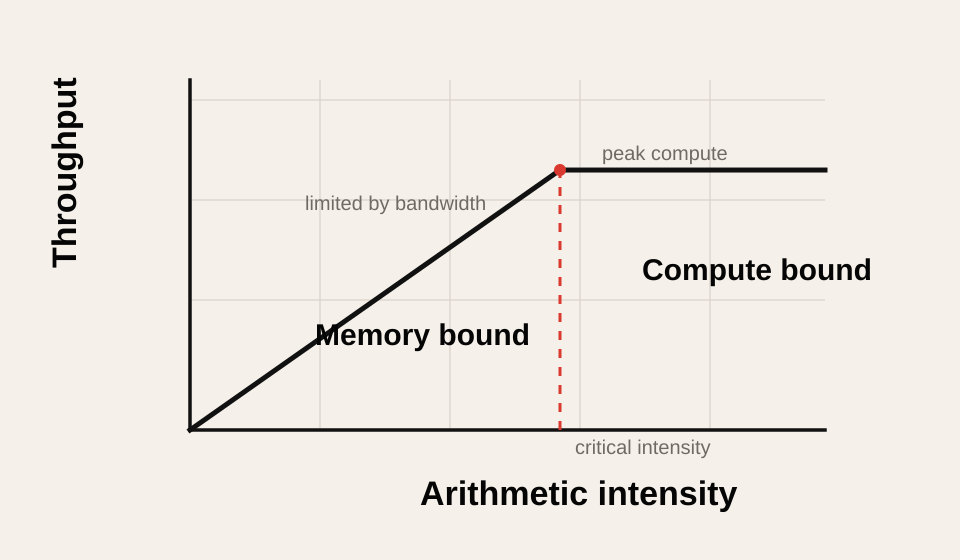
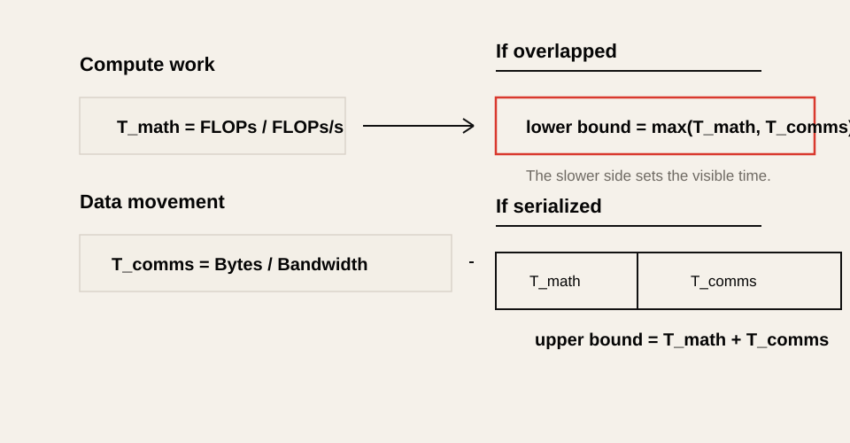

# All About Rooflines

> Source: [All About Rooflines](https://jax-ml.github.io/scaling-book/roofline/), part of *How To Scale Your Model*, published 2025-02-04.
>
> This is a Korean lecture-note adaptation, not a line-by-line full translation. The goal is to explain the roofline model and connect it to the inference measurements in this repository.
>
> Selected figures from the JAX Scaling Book are reused under the repository's [MIT License](assets/jax-scaling-book/LICENSE). Additional SVG diagrams are redrawn locally in this repository's editorial diagram style.

## Reading Map

This note organizes the performance model needed before reading the TPU/GPU/DSA notes.

The core question is the following.

> Why does an operation take 50ms instead of 5ms?

The answer is usually determined by three ceilings.

| Constraint | Unit | Meaning |
|---|---|---|
| Compute throughput | FLOPs/s or OPs/s | the amount of computation the accelerator can process per second |
| Memory / network bandwidth | bytes/s | the speed at which data can be moved |
| Memory capacity | bytes | the size that data can physically fit into |

The roofline model is a method that uses the compute throughput and bandwidth among these together to quickly judge whether a workload is compute-bound or memory-bound.



In this figure, the x-axis is arithmetic intensity and the y-axis is the achievable throughput. In the left diagonal region, bandwidth limits performance. In the right horizontal region, the compute peak limits performance.

The original shows the same idea with a log-log plot and multiple bandwidth lines.


Source: [JAX Scaling Book, "All About Rooflines"](https://jax-ml.github.io/scaling-book/roofline/), MIT License. The original figure shows how algorithms with different arithmetic intensities move between bandwidth-bound and compute-bound regions as available bandwidth changes.

## 1. Where Does the Time Go?

The first things to compute are two times.

```text
T_math = Computation FLOPs / Accelerator FLOPs/s
```

```text
T_comms = Communication Bytes / Bandwidth Bytes/s
```

Here `communication` does not necessarily mean only the network. Reading values from HBM to the Tensor Core is communication, and sending activations between GPUs is also communication.

| Case | Communication meaning |
|---|---|
| Single GPU matmul | HBM -> SM/Tensor Core data movement |
| TPU matmul | HBM -> VMEM -> MXU data movement |
| Tensor parallelism | activation collective between GPUs/TPUs |
| MoE expert parallelism | token AllToAll |
| CPU offload | host memory / PCIe / network path |

The actual runtime depends on how much compute and communication can be overlapped.

```text
Lower bound = max(T_math, T_comms)
Upper bound = T_math + T_comms
```

With complete overlap, only the larger side shows. With no overlap at all, the two must be added. Real systems are usually in between.



This figure shows that the roofline is a **model that captures the lower and upper bounds of time**, rather than a model that predicts latency exactly. When the kernel, runtime, and collectives overlap compute and communication well, the result approaches `max(T_math, T_comms)`; when they cannot overlap, it approaches `T_math + T_comms`.

## 2. Compute-Bound and Memory-Bound

When `T_math > T_comms`, compute takes longer. In this case the accelerator is busy, and increasing bandwidth further may not bring much gain. This is called compute-bound.

When `T_comms > T_math`, data movement takes longer. In this case the Tensor Core or MXU can sit idle waiting for values. This is called memory-bound, bandwidth-bound, or communication-bound.

| Bound | First-order limit | Useful optimization |
|---|---|---|
| Compute-bound | FLOPs/s | faster Tensor Core path, lower precision compute, better tiling |
| Memory-bound | HBM bytes/s | quantization, fusion, caching, layout, prefetch |
| Network-bound | interconnect bytes/s | topology-aware sharding, overlap, better collectives |
| Capacity-bound | memory bytes | quantization, sharding, offload, KV cache reduction |

In LLM inference, prefill and decode often have different bounds.

| Phase | Typical behavior |
|---|---|
| Prefill | many large GEMMs, so it can approach compute-bound. |
| Decode | with a small batch, it becomes a GEMV-like pattern and is easily memory-bound. |
| Batched decode | lands in the middle region depending on the batch and sequence mix. |

## 3. Arithmetic Intensity

The core metric of the roofline model is arithmetic intensity.

```text
Arithmetic Intensity = Computation FLOPs / Communication Bytes
```

Put in words, it is the following.

> How many FLOPs are performed while moving one byte?

The higher the value, the more easily it becomes compute-bound; the lower, the more easily it becomes memory-bound.

The point to watch is that arithmetic intensity is not **operations per data element** but **FLOPs per moved byte**. For example, one BF16 value is 2 bytes. If you read one BF16 value from HBM and perform only 1 FLOP with that value:

```text
1 FLOP / 2 bytes = 0.5 FLOPs/byte
```

So the arithmetic intensity is 0.5, not 1. An arithmetic intensity of 1 FLOP/byte means that, on average, one floating-point operation is performed for every byte moved from memory or the network. In other words, it is a low-reuse workload that cannot reuse the fetched data much, and on modern GPUs/TPUs it is usually memory-bound.

Hardware also has a reference intensity.

```text
Hardware critical intensity = Peak FLOPs/s / Bandwidth bytes/s
```

If the algorithm's arithmetic intensity is larger than the hardware critical intensity, it can become compute-bound. If smaller, it becomes bandwidth-bound.

```text
Algorithm intensity > Hardware intensity  -> compute-bound
Algorithm intensity < Hardware intensity  -> bandwidth-bound
```

## 4. Why Is the Dot Product Memory-Bound?

Consider a BF16 dot product.

```text
x: bf16[N]
y: bf16[N]
output: bf16[1]
```

Approximate bytes that must be read:

```text
x read = 2N bytes
y read = 2N bytes
output write = 2 bytes
```

FLOPs performed:

```text
N multiplications + (N - 1) additions ~= 2N FLOPs
```

So when N is large enough:

```text
Arithmetic intensity ~= 2N / 4N = 0.5 FLOPs/byte
```

0.5 FLOPs/byte is far below the critical intensity of modern GPUs/TPUs. So the dot product struggles to fill the compute unit. The time to read values dominates.

This intuition extends to the GEMV of decode. Multiplying a single vector by a large weight matrix reads a lot of weights while reusing them little.

## 5. Why Does Batch Matter for Matmul?

The most important operation in the Transformer is matrix multiplication.

```text
X[B, D] @ W[D, F] -> Y[B, F]
```


For BF16, it reads and writes approximately the following bytes.

```text
X read: 2BD bytes
W read: 2DF bytes
Y write: 2BF bytes
```

FLOPs are approximately:

```text
2BDF FLOPs
```

So the arithmetic intensity is:

```text
2BDF / (2BD + 2DF + 2BF)
= BDF / (BD + DF + BF)
```

In the Transformer, `D` and `F` are usually large and `B` is relatively small. When the `DF` term dominates:

```text
Arithmetic intensity ~= B
```

The important point here is that `B` does not mean only the ordinary request batch size. The `B` in the roofline is the **local token batch size**.

```text
local token batch = local sequence count * sequence length tokens
```

For example, if there are 512 sequences, each sequence length is 4096, and they are split across 2048 accelerators:

```text
global tokens = 512 * 4096 = 2,097,152
local tokens = 2,097,152 / 2048 = 1024
```

What matters in the performance model is not the number of sequences itself but the number of tokens each accelerator processes at once.

## 6. Critical Batch Size

The original explains that the critical intensity is about 240 FLOPs/byte on the TPU v5e MXU.

```text
TPU v5e BF16 FLOPs/s ~= 1.97e14
TPU v5e HBM bandwidth ~= 8.2e11 bytes/s
critical intensity ~= 1.97e14 / 8.2e11 ~= 240
```

Since the matmul intensity is roughly `B`:

```text
B > 240  -> possibly compute-bound
B < 240  -> possibly bandwidth-bound
```

For GPUs, this value is close to about 300. For example, based on the H100 BF16 dense spec:

```text
H100 BF16 FLOPs/s ~= 9.9e14
H100 HBM bandwidth ~= 3.35e12 bytes/s
critical intensity ~= 295
```

So we get the intuition that on the H100, a BF16 matmul needs a local token batch of roughly 300 or more to become compute-bound.

This connects to the core observation of the Week 2 lab.

| Shape | Hardware behavior |
|---|---|
| batch=1 decode | GEMV-like, low intensity, memory/overhead-bound |
| medium batch decode | approaches HBM bandwidth-bound |
| large prefill | Tensor Core GEMM, possibly compute-bound |

The original also has an example plotting the same roofline calculation against actual batch size changes. Comparing `D=F=4096` with `D=F=1024`, a smaller matrix has a different bytes ratio and tiling efficiency even at the same batch, pushing the point where it reaches peak further back.


Source: [JAX Scaling Book, "All About Rooflines"](https://jax-ml.github.io/scaling-book/roofline/), MIT License. The original exercise compares roofline throughput for different matrix sizes as batch size increases.

## 7. Looking at Quantization Through the Roofline

Quantization changes two things in the roofline.

1. It reduces the bytes that must be moved.
2. If the hardware supports low-precision compute, it also changes the peak OPs/s.

For example, suppose we switch a BF16 matmul to INT8 weight-only.

```text
bf16 activation: 2BD bytes
int8 weight: DF bytes
bf16 output: 2BF bytes
```

For small `B`, the weight read `DF` dominates, so halving the weight bytes raises the arithmetic intensity. The critical batch size for crossing into compute-bound can therefore go down.

But if INT8 compute is used natively, the peak OPs/s also goes up. In that case the hardware critical intensity rises along with it. So it should not be simplified to "bytes went down, so it is unconditionally compute-bound."

The experimental conclusion of Week 4 points in the same direction.

| Case | Roofline interpretation |
|---|---|
| AWQ INT4 fused kernel speeds up | the bytes reduction translates into latency reduction on the real kernel path |
| bitsandbytes NF4 slows down | dequant/kernel overhead outweighs the bytes reduction |
| Orin INT4 projection | in the edge bandwidth-bound regime, the bytes reduction is a direct gain |

## 8. Network Communication Roofline

The roofline is not a model used only for HBM. It applies as-is to communication between accelerators.

For example, suppose a matrix multiplication is split across two chips. Each chip does only half of the compute, but the partial results must be exchanged and combined.

What must be compared at this point is:

```text
T_math = local FLOPs / local FLOPs/s
T_comms = bytes sent across interconnect / interconnect bandwidth
```

On a single GPU you look at the HBM roofline, but with tensor parallelism you must look at the NVLink/ICI/InfiniBand roofline.


| Parallelism | Dominant roofline |
|---|---|
| Tensor parallelism inside node | NVLink / NVSwitch collective roofline |
| TPU sharding inside slice | ICI roofline |
| Pipeline parallelism across nodes | activation transfer roofline |
| Expert parallelism | AllToAll network roofline |
| Data parallelism training | gradient AllReduce roofline |

This viewpoint is the same story as the `ops:comms ratio` in the DSA note.

```text
ops:comms ratio = compute throughput / communication bandwidth
```

## 9. Order for Applying the Roofline to Inference

When looking at a real inference system, compute in the following order.

1. Split the workload phases: prefill, decode, batched decode, verification.
2. Find the major kernels of each phase: GEMM, GEMV, attention, sampling, collective.
3. Roughly compute the FLOPs.
4. Compute the moved bytes: weights, activations, KV cache, network tensor.
5. Derive the arithmetic intensity.
6. Compare it with the hardware critical intensity.
7. Use profiling to check overhead and overlap failures.

A simple decision table is the following.

| Observation | Likely next step |
|---|---|
| Low intensity, high HBM traffic | quantization, fusion, better layout |
| High intensity, low Tensor Core utilization | tiling, batch size, kernel choice |
| Collective time dominates | sharding strategy or topology change |
| Capacity-bound | quantization, sharding, KV cache compression |
| GPU-Util high but FLOPs low | check SM throughput/HBM throughput with the profiler |

## 10. Connections to This Repository

| Repository topic | Roofline connection |
|---|---|
| Week 1 performance metrics | interpret throughput, latency, and utilization as upper/lower bounds. |
| Week 2 hardware foundations | directly measure the GEMM/GEMV roofline plot. |
| Week 3 KV cache | compute the bytes/token of decode attention. |
| Week 4 quantization | explain the conditions under which a bytes reduction leads to a latency reduction. |
| DSA appendix | the mathematical basis of the memory movement and ops:comms design principle. |
| GPU/TPU appendix | compare the hardware critical intensity per GPU/TPU. |

## 11. Practical Tips and Notes

### The roofline is a fast filter, not an exact predictor

The roofline lets you judge within 10 seconds whether "this claim makes sense." But to predict latency accurately, you must look at more.

| Missing factor | Example |
|---|---|
| Kernel launch overhead | small batch decode |
| Memory latency | random access is slow even when bandwidth is sufficient |
| Cache hit rate | L2/SMEM reuse |
| Dequant overhead | low-bit inference |
| Scheduler overhead | serving batch packing |
| Collective latency | small message AllReduce |
| Overlap failure | compute and communication get serialized separately |

So the roofline is not a "tool that replaces profiling" but a "tool that decides where to start profiling."

### The x-axis is often viewed on a log scale

The original roofline plots are usually drawn log-log. This is because arithmetic intensity and throughput differ by several orders of magnitude. The SVG in this note is drawn as a simple linear-style figure for conceptual explanation, but in real analysis the log scale is more useful.

### Memory-bound is not always bad

Decode can be inherently memory-bound. In that case, the goal is not to force it into compute-bound, but to reduce bytes/token and overhead within the memory-bound regime.

For example:

| Technique | What it reduces |
|---|---|
| W4A16 quantization | weight bytes |
| GQA/MQA/MLA | KV cache bytes |
| PagedAttention | fragmentation and allocation waste |
| FlashAttention | attention intermediate HBM traffic |
| Kernel fusion | intermediate tensor round-trips |

## 12. Check Questions

1. What do `T_math` and `T_comms` each mean?
2. Why can the runtime lower bound be viewed as `max(T_math, T_comms)`?
3. When the arithmetic intensity is low, which bound is it easily caught by?
4. Why is the arithmetic intensity of the dot product low?
5. Why does the intensity of the Transformer matmul become roughly the local token batch `B`?
6. What does it mean that the critical batch size of the H100 BF16 matmul is roughly 300?
7. Which part of the roofline does quantization change?
8. In tensor parallelism, why must the interconnect roofline be looked at instead of the HBM roofline?
9. What overheads are not explained by the roofline?
10. Explain the GEMV/GEMM transition of Week 2 from the roofline perspective.
