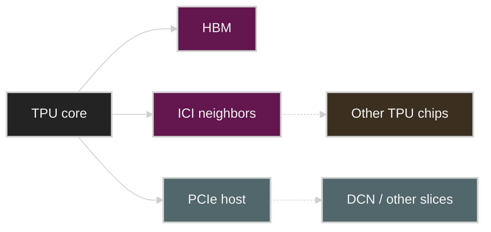

# How to Think About TPUs

> Source: [How to Think About TPUs](https://jax-ml.github.io/scaling-book/tpus/), part of *How To Scale Your Model*, published 2025-02-04.
>
> This is an English lecture-note adaptation, not a line-by-line full translation. The goal is to translate the hardware mental model and connect it to LLM inference and scaling notes in this repository.
>
> Figures from the JAX Scaling Book are reused under the repository's [MIT License](assets/jax-scaling-book/LICENSE).

## Reading Map

The simplest sentence for understanding a TPU is the following.

> A TPU is an accelerator combining a huge matrix multiplication unit, fast HBM, a small high-speed scratchpad, and inter-chip interconnects.

Compared to a GPU, a TPU is simpler and tuned for more regular workloads. This simplicity is a strength, but it does not mean it is automatically advantageous for every problem. To get performance on a TPU, you must understand the bandwidth hierarchy of HBM, VMEM, MXU, ICI, and DCN together.

## 1. Basic TPU Structure

A TPU core can be understood as three main components.


Source: [JAX Scaling Book, "How to Think About TPUs"](https://jax-ml.github.io/scaling-book/tpus/), MIT License. The original caption describes the TPU chip components: TensorCore, MXU, VPU, and VMEM.

| Component | Role | GPU analogy |
|---|---|---|
| MXU | systolic array that performs matrix multiplication | Tensor Core |
| VPU | vector work such as activations, elementwise ops, and reductions | CUDA cores / vector unit |
| VMEM | on-chip scratchpad memory | local memory larger than shared memory / SMEM |

The most important of these are the MXU and VMEM. A TPU brings tensors from HBM into VMEM, streams VMEM tiles through the MXU to perform matmul, and sends the results back through VMEM to HBM.

```text
HBM -> VMEM -> MXU/VPU -> VMEM -> HBM
```

The bandwidth of this path is the basic limit of TPU performance.

## 2. Systolic Array Intuition

A systolic array is a regular compute fabric designed for matrix multiplication. Weights or activations flow between processing elements and are reused many times.

Ordinary matrix multiplication tends to read the same value from memory many times. A systolic array brings a value to a nearby location once and reuses it inside the array.

```text
Goal:
  reduce data movement and reuse values near the compute units.

Consequence:
  very strong for regular matmul, but when shapes do not fit well, padding and utilization problems appear.
```

The TPU MXU has a fixed tile shape. So even when matrix dimensions are small, padding may be needed to match the hardware tile size. This point matters for small batches, small hidden dimensions, and irregular expert shapes.

## 3. VMEM: The Core Scratchpad of TPU Performance

VMEM is much smaller than HBM but connected to the MXU much faster. The original text emphasizes that when understanding a TPU, VMEM must be seen as a separate memory space.

| Memory | Capacity | Bandwidth intuition | Use |
|---|---|---|---|
| HBM | large | relatively slow | weights, activations, KV cache |
| VMEM | small | very fast | tiles, temporary buffers, prefetched data |
| Registers | very small | fastest | operands near the MXU/VPU |

An algorithm that fits VMEM well can feed the compute units well even at low arithmetic intensity. Conversely, if it does not fit VMEM, HBM bandwidth becomes the bottleneck.

Compared to the GPU memory hierarchy in Week 2, TPU VMEM is closer to a large scratchpad explicitly managed by the compiler/runtime than to a simple cache.


Source: [JAX Scaling Book, "How to Think About TPUs"](https://jax-ml.github.io/scaling-book/tpus/), MIT License. This figure is used in the original article to show the bandwidth relationships among TPU memory and compute paths.

## 4. Pipelines and Overlap

TPU matmul overlaps the following work.

1. Bring the next tile from HBM into VMEM.
2. Supply the current tile from VMEM to the MXU.
3. The MXU performs multiply-accumulate in the systolic array.
4. Send the result tile back to VMEM and HBM.

If this pipeline lines up well, the MXU keeps working without waiting for memory transfers. If the pipeline breaks, the TPU also becomes memory-bound.

This is the same family of ideas as `cp.async`, TMA, and double buffering on a GPU.

## 5. TPU Networking: ICI and DCN

A TPU thinks of chip-to-chip links as ICI and wider datacenter links as DCN.

| Link | Meaning | Performance intuition |
|---|---|---|
| HBM <-> TPU core | in-chip memory path | the most important and fastest local path |
| ICI | direct connection between TPU chips | used for collectives within a slice |
| PCIe | between host and TPU tray | host path much slower than HBM |
| DCN | network between slices or hosts | scale-out path slower than ICI |

The important point is that ICI is not a complete all-to-all crossbar but a network with a topology. Communication to a far chip may have to hop through intermediate chips. So matching the sharding axis to the physical topology matters.


Source: [JAX Scaling Book, "How to Think About TPUs"](https://jax-ml.github.io/scaling-book/tpus/), MIT License. The original article uses this to explain TPU ICI wraparound links and torus-style neighbor connectivity.



## 6. Reading a TPU with the Roofline

When looking at TPU performance, do not look only at peak FLOPS. Look at the following ratios together.

```text
compute / HBM bandwidth
compute / ICI bandwidth
compute / DCN bandwidth
```

If an operation's arithmetic intensity is lower than the hardware ratio, it becomes bandwidth-bound.

For example, if the decode batch is small, it reads a lot of weights and KV cache while doing little computation. In that case, even a TPU is bottlenecked by HBM bandwidth or the interconnect. Conversely, a large prefill matmul easily becomes compute-bound if there is enough batch and sequence length.

## 7. Low Precision on a TPU

A TPU also delivers higher throughput at lower-precision matmul. Generations supporting formats like INT8 and INT4 can process more operations than BF16.

However, lower precision is not always free.

| Risk | What to check |
|---|---|
| Quality loss | calibration set, task metric, perplexity |
| Padding/utilization | whether shapes fit the MXU tile well |
| VPU fallback | whether elementwise/reduction becomes bottlenecked on the fp32 path |
| Communication | whether smaller tensors also reduce the collective bottleneck |

Connecting to Week 4's quantization, the core question is the same when using lower precision on a TPU.

> Does the benefit of reducing bytes exceed dequantization, padding, fallback, and communication overhead?

## 8. How to Read the Difference Between TPU and GPU

| Dimension | TPU | GPU |
|---|---|---|
| Programming model | more static, compiler-centric | more flexible, CUDA ecosystem-centric |
| Main compute unit | MXU systolic array | Tensor Cores inside the SM |
| Local memory | strongly a VMEM scratchpad | SMEM/L1, L2, registers, TMEM |
| Network | ICI topology is important | NVLink/NVSwitch/InfiniBand hierarchy |
| Strength | large regular matmul, predictable pipeline | flexibility, kernel ecosystem, broad support |

Seeing a TPU only as a GPU substitute misses the point. A TPU is very efficient when the workload fits well, but shape, sharding, and topology enter the performance model more directly.

## 9. Repository Connections

| Repository topic | Connection |
|---|---|
| Week 2 hardware foundations | re-reads the memory hierarchy and roofline the TPU way. |
| Week 3 KV cache | understands what pressure long-context decode puts on HBM/ICI bandwidth. |
| Week 4 quantization | verifies that lower precision's effect on both throughput and bytes holds on a TPU too. |
| AI Systems Performance Engineering Chapter 4 | connects to topology-aware sharding, collective bandwidth, and cross-host communication. |

## 10. Check Questions

1. What roles do MXU, VPU, and VMEM each play on a TPU?
2. Why is VMEM important for performance even though it is smaller than HBM?
3. How does a systolic array reduce data movement?
4. What is the difference between ICI and DCN, and why does it affect sharding?
5. When using lower precision on a TPU, what verification besides performance is needed?
