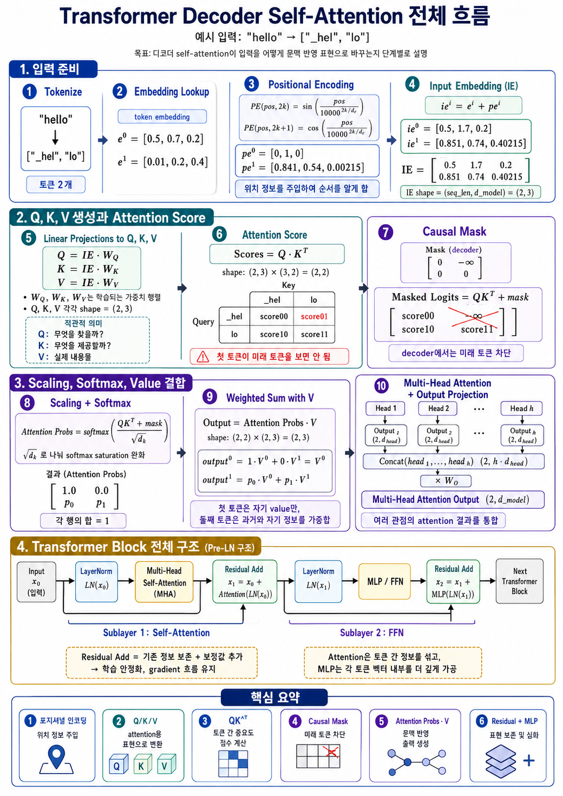

# Transformer

## LLM Inference Pipeline

An LLM does not complete a sentence all at once. Based on the input context, it computes the probability distribution of the next single token, selects one of them, and then repeats generation by appending the selected token back to the context.

```text
input context
 → compute next token probability
 → select next token
 → append to context
 → repeat
```

Autoregressive generation expresses the whole-sentence probability as the product of next-token probabilities at each point.

```math
P(x_1, x_2, ..., x_T) = \prod_{t=1}^{T} P(x_t \mid x_{\lt t})
```

The overall inference flow of a decoder-only LLM is as follows.

```text
User Input
 → Tokenizer
 → Token IDs
 → Embedding
 → Positional Encoding / RoPE
 → Transformer Blocks
 → LM Head
 → Logits
 → Softmax
 → Probability Distribution
 → Decoding Strategy
 → Next Token
 → Detokenizer
 → Streaming Output
```

## Decoder Self-Attention Flow



The figure above summarizes the process by which decoder-only self-attention turns input tokens into context-aware representations.

1. Convert the input string into token IDs and look up the token embeddings.
2. Add positional information, or inject positional information into `Q` and `K` like RoPE does.
3. Create `Q`, `K`, and `V` from the input embeddings by linear projection.
4. Compute the attention scores with `QK^T`.
5. Apply the causal mask so each token cannot see future tokens.
6. Scale by `sqrt(d_k)` and produce attention probabilities with softmax.
7. Multiply the attention probabilities by `V` to form the weighted sum of values.
8. Handle the multi-head attention output together with the residual connection, LayerNorm, and MLP/FFN inside the Transformer block.

## Tokenization

An LLM does not process strings directly; it first splits the text into token units. The figures in this appendix and the following self-attention example assume `"hello"` is split into the two tokens `["_hel", "lo"]`.

```text
"hello"
 → ["_hel", "lo"]
 → [101, 102]
```

The token IDs above are example values for explaining shapes. Actual token splits and IDs vary depending on the tokenizer and vocabulary in use.

If the vocabulary size is `V`, each token ID is usually within the following range.

```math
0 \leq token\_id < V
```

For example, the vocabulary size can differ by model, like `32,000`, `50,257`, or `128,000`.

## Embedding Lookup

Since a token ID is just an integer, it must be converted into a dense vector the model can compute with. An embedding matrix is used for this.

```math
E \in \mathbb{R}^{V \times d_{model}}
```

The embedding vector for token ID `x_i` is obtained by looking up the corresponding row of the embedding matrix.

```math
e_i = E[x_i]
```

If the number of input tokens is `n`, the embedding result has the following shape.

```math
X \in \mathbb{R}^{n \times d_{model}}
```

As in the small example in the figure, if `seq_len = 2` and `d_model = 3`, it is as follows.

```math
X \in \mathbb{R}^{2 \times 3}
```

## Positional Encoding and RoPE

Transformer self-attention fundamentally sees tokens in parallel. Since it does not read them in order like an RNN, without separate positional information it is hard to know the token order.

```text
I love you
You love I
```

The two sentences contain the same tokens but differ in order, so their meanings change. Therefore a Transformer adds positional information to each token.

The original Transformer paper used sin/cos-based positional encoding.

```math
PE_{(pos, 2k)} = \sin \left(\frac{pos}{10000^{2k / d_{model}}}\right)
```

```math
PE_{(pos, 2k+1)} = \cos \left(\frac{pos}{10000^{2k / d_{model}}}\right)
```

The final input embedding is made by adding the token embedding and the positional encoding.

```math
x_i = e_i + pe_i
```

For example, as follows.

```math
e^0 = [0.5, 0.7, 0.2]
```

```math
pe^0 = [0, 1, 0]
```

```math
ie^0 = e^0 + pe^0 = [0.5, 1.7, 0.2]
```

Modern GPT and LLaMA-family models use RoPE, Rotary Positional Embedding, far more than simple sinusoidal positional encoding. RoPE rotates the `Q` and `K` vectors according to position, instead of simply adding a position vector to the embedding. The purpose is the same.

```text
Tell the Transformer the order and relative position information of the tokens.
```

## Input Embedding Matrix

Stacking each token's input embedding as a row gives the input matrix.

```math
IE =
\begin{bmatrix}
0.5 & 1.7 & 0.2 \\
0.851 & 0.74 & 0.40215
\end{bmatrix}
```

The shape is as follows.

```math
IE \in \mathbb{R}^{seq\_len \times d_{model}}
```

In the example, it is as follows.

```math
IE \in \mathbb{R}^{2 \times 3}
```

## Q, K, V Generation

In self-attention, Query, Key, and Value are created from the input `X`.

```math
Q = XW_Q
```

```math
K = XW_K
```

```math
V = XW_V
```

The shape of each projection matrix is as follows.

```math
W_Q \in \mathbb{R}^{d_{model} \times d_k}
```

```math
W_K \in \mathbb{R}^{d_{model} \times d_k}
```

```math
W_V \in \mathbb{R}^{d_{model} \times d_v}
```

Intuitively, `Q`, `K`, and `V` play the following roles.

```text
Q = Query = what do I want to find?
K = Key   = what information can I be searched by?
V = Value = what content do I actually provide?
```

That is, `Q/K` are for computing the matching score, and `V` is close to the payload actually delivered.

For example, if the shapes are as follows:

```math
X \in \mathbb{R}^{2 \times 3}
```

```math
W_Q, W_K, W_V \in \mathbb{R}^{3 \times 3}
```

the result is as follows.

```math
Q, K, V \in \mathbb{R}^{2 \times 3}
```

Since the attention score is computed with `QK^T`, the last dimension of `Q` and `K` must be the same.

```math
QK^T \in \mathbb{R}^{seq\_len \times seq\_len}
```

By contrast, `d_v` does not have to equal `d_k`, because `V` is not a target of score computation but a target of the weighted sum.

## Attention Score

The basic attention score is computed as follows.

```math
Scores = QK^T
```

Each element has the following meaning.

```math
score_{ij} = Q_i \cdot K_j
```

That is, it indicates how well the Query of the `i`-th token matches the Key of the `j`-th token.

If there are 2 tokens, the attention score matrix can be seen as follows.

```text
              Key: _hel      Key: lo
Query: _hel   score00        score01
Query: lo     score10        score11
```

The core is as follows.

```text
row = Query, the observer
column = Key, the observed target
```

For example, `score01` is the following inner product.

```math
score_{01} = Q_{hel} \cdot K_{lo}
```

```math
score_{01} = q_0 k_0 + q_1 k_1 + q_2 k_2
```

The larger the value, the better the Query and Key match.

## Causal Mask

A decoder-based LLM predicts the next token. Therefore, at the current position it must not see future tokens.

For example, in `["_hel", "lo"]`, the first token `_hel` must not see the second token `lo`. But when `QK^T` is computed, a score corresponding to `_hel -> lo` is produced. Since that value is an information leak, the causal mask blocks the future tokens.

If there are 2 tokens, the mask is as follows.

```math
Mask =
\begin{bmatrix}
0 & -\infty \\
0 & 0
\end{bmatrix}
```

The masked score is computed as follows.

```math
MaskedScores = QK^T + Mask
```

```math
\begin{bmatrix}
score_{00} & score_{01} \\
score_{10} & score_{11}
\end{bmatrix}
+
\begin{bmatrix}
0 & -\infty \\
0 & 0
\end{bmatrix}
=
\begin{bmatrix}
score_{00} & -\infty \\
score_{10} & score_{11}
\end{bmatrix}
```

The reason the mask value is $-\infty$ rather than `0` is because of softmax.

```math
softmax(z_i) = \frac{e^{z_i}}{\sum_j e^{z_j}}
```

If a position you want to block is set to $-\infty$ before softmax, the probability becomes 0 as follows.

```math
e^{-\infty} = 0
```

```math
softmax([a, -\infty]) = [1, 0]
```

A causal mask for sequence length 5 has the following pattern.

```math
Mask =
\begin{bmatrix}
0 & -\infty & -\infty & -\infty & -\infty \\
0 & 0 & -\infty & -\infty & -\infty \\
0 & 0 & 0 & -\infty & -\infty \\
0 & 0 & 0 & 0 & -\infty \\
0 & 0 & 0 & 0 & 0
\end{bmatrix}
```

```text
diagonal and lower-left = allowed
upper-right = future tokens, so blocked
```

## Scaling and Softmax

The attention score is not put directly into softmax; it is divided by `sqrt(d_k)`.

```math
ScaledScores = \frac{QK^T + Mask}{\sqrt{d_k}}
```

The larger the dimensions of `Q` and `K`, the larger the inner product values tend to be.

```math
Q_i \cdot K_j = \sum_{m=1}^{d_k} q_m k_m
```

If `d_k` is large, the variance of the scores grows, and softmax can be pushed too far in one direction.

```math
softmax([20, 1]) \approx [1, 0]
```

Therefore the score scale is stabilized by dividing by `sqrt(d_k)`.

The attention probability matrix `A` is as follows.

```math
A = softmax\left(\frac{QK^T + Mask}{\sqrt{d_k}}\right)
```

Each row sums to 1.

```math
\sum_j A_{ij} = 1
```

That is, for each Query token it becomes a probability distribution over how much to look at each Key token.

## Weighted Sum with V

The attention probability `A` is multiplied by the Value matrix `V`.

```math
O = AV
```

The shapes are as follows.

```math
A \in \mathbb{R}^{seq\_len \times seq\_len}
```

```math
V \in \mathbb{R}^{seq\_len \times d_v}
```

```math
O \in \mathbb{R}^{seq\_len \times d_v}
```

For example, given the following attention probability:

```math
A =
\begin{bmatrix}
1.0 & 0.0 \\
p_0 & p_1
\end{bmatrix}
```

the output is as follows.

```math
O^0 = 1.0 \cdot V^0 + 0.0 \cdot V^1 = V^0
```

```math
O^1 = p_0 \cdot V^0 + p_1 \cdot V^1
```

The essence of attention is the following structure.

```text
Attention Probability = how much to refer to whom
Value                 = the information actually fetched
Output                = the weighted sum of the Values
```

Written as a formula, it is as follows.

```math
Attention(Q, K, V) =
softmax\left(
\frac{QK^T + Mask}{\sqrt{d_k}}
\right)V
```

## Multi-Head Attention

A single attention head tends to learn only one viewpoint of relationships. With multiple heads, different relationships can be learned in parallel.

```text
Head 1 = grammatical relationships
Head 2 = nearby token relationships
Head 3 = long-range dependencies
Head 4 = syntactic boundaries
```

These roles are not designated by a person but naturally differentiate during training.

Each head has its own independent projection matrix.

```math
Q_h = XW_Q^h
```

```math
K_h = XW_K^h
```

```math
V_h = XW_V^h
```

The output of each head is as follows.

```math
head_h = Attention(Q_h, K_h, V_h)
```

The outputs of the multiple heads are concatenated.

```math
H = Concat(head_1, head_2, ..., head_n)
```

Generally the following relationship holds.

```math
head\_dim = \frac{d_{model}}{num\_heads}
```

```math
num\_heads \times head\_dim = d_{model}
```

For example, if `d_model = 4096`, `num_heads = 32`, and `head_dim = 128`, it is as follows.

```math
32 \times 128 = 4096
```

The concatenated result is mixed again by an output projection.

```math
MHA(X) = Concat(head_1, ..., head_h)W_O
```

```math
W_O \in \mathbb{R}^{d_{model} \times d_{model}}
```

The resulting shape is as follows.

```math
MHA(X) \in \mathbb{R}^{seq\_len \times d_{model}}
```

## Residual Connection and LayerNorm

The attention output does not completely replace the original input; it adds contextual information to the existing representation like a correction term.

```math
x_1 = x_0 + MHA(x_0)
```

In the Pre-LN structure of modern LLMs, it is usually as follows.

```math
x_1 = x_0 + MHA(LN(x_0))
```

The main purposes of the residual connection are preserving the existing representation, improving gradient flow, stabilizing training of deep models, and the effect of effectively skipping unnecessary blocks.

```math
x + 0 \approx x
```

LayerNorm stabilizes the distribution of values within each token vector.

```math
\mu = \frac{1}{d}\sum_{i=1}^{d} x_i
```

```math
\sigma^2 = \frac{1}{d}\sum_{i=1}^{d}(x_i - \mu)^2
```

```math
\hat{x}_i =
\frac{x_i - \mu}{\sqrt{\sigma^2 + \epsilon}}
```

```math
LN(x_i) = \gamma \hat{x}_i + \beta
```

BatchNorm depends on statistics of the whole batch, but in LLM inference the batch size can be 1 and the sequence length also varies. LayerNorm normalizes only within each token vector, so it is stable regardless of batch size.

```text
BatchNorm = normalization over the batch dimension
LayerNorm = normalization over the hidden dimension
```

The Transformer in the original paper is close to a Post-LN structure, but modern LLMs usually use the Pre-LN structure a lot.

```text
Post-LN: x → Attention → Add → LayerNorm
Pre-LN : x → LayerNorm → Attention → Add
```

Pre-LN tends to have better training stability in deep models.

## MLP / FFN

Attention mixes information between tokens, and the MLP/FFN non-linearly processes the inside of each token vector.

```text
Attention = handling relationships between tokens
MLP / FFN = per-token hidden representation transformation
```

A general FFN is as follows.

```math
FFN(x) = W_2 \cdot \phi(W_1x + b_1) + b_2
```

The structure is as follows.

```text
Linear
 → Activation
 → Linear
```

The dimensions are usually expanded and then reduced as follows.

```math
d_{model} \rightarrow d_{ff} \rightarrow d_{model}
```

Generally `d_ff` is larger than `d_model`, and the traditional Transformer often used about `4 * d_model`.

The traditional Transformer used ReLU, but modern LLMs use GELU and the SwiGLU family a lot.

```math
GELU(x) = x\Phi(x)
```

The SwiGLU family uses a gating structure.

```math
SwiGLU(x) = Swish(xW_1) \odot (xW_2)
```

As with after attention, a residual is also attached after the MLP.

```math
x_1 = x_0 + MHA(LN(x_0))
```

```math
x_2 = x_1 + MLP(LN(x_1))
```

## Transformer Block

A modern LLM-style Pre-LN Transformer block is as follows.

```text
Input x0
  ↓
LayerNorm
  ↓
Multi-Head Self-Attention
  ↓
Residual Add
  ↓
LayerNorm
  ↓
MLP / FFN
  ↓
Residual Add
  ↓
Output x2
```

The formulas are as follows.

```math
x_1 = x_0 + MHA(LN(x_0))
```

```math
x_2 = x_1 + MLP(LN(x_1))
```

This block is repeated `N` times.

```math
x^{(0)} \rightarrow x^{(1)} \rightarrow ... \rightarrow x^{(N)}
```

## LM Head and Logits

After passing through all the Transformer blocks, the final hidden state comes out.

```math
H \in \mathbb{R}^{seq\_len \times d_{model}}
```

For next-token prediction, the hidden state of the last position is usually used.

```math
h_t \in \mathbb{R}^{d_{model}}
```

The LM Head converts the hidden state into logits of vocabulary size.

```math
logits = h_t W_{LM}
```

```math
W_{LM} \in \mathbb{R}^{d_{model} \times V}
```

Therefore:

```math
logits \in \mathbb{R}^{V}
```

Logits are not yet probabilities.

```text
logit[token_id] = the raw score of that token coming next
```

For example, if in a toy tokenizer `"_hel"` is displayed on screen as `"hel"`, the logits of the next-token candidates for the current context `["_hel"]` can be seen as follows.

```text
lo       logit = 5.2
p        logit = 2.1
met      logit = 0.7
cat      logit = -2.0
```

Putting the logits into softmax gives a probability distribution.

```math
P(x_i) =
\frac{e^{z_i}}{\sum_{j=1}^{V} e^{z_j}}
```

The sum of all probabilities is 1.

```math
\sum_{i=1}^{V} P(x_i) = 1
```

## Decoding Strategies

There are several ways to select the next token.

Greedy decoding always selects the token with the highest probability.

```math
x_t = \arg\max_i P(x_i \mid x_{\lt t})
```

Its advantage is that it is deterministic, fast, and reproducible. Its disadvantage is that the output can become repetitive and monotonous.

Top-k sampling keeps only the top `k` tokens by probability and samples from among them.

```math
S_k = TopK(P, k)
```

```math
P'(x_i) =
\begin{cases}
\frac{P(x_i)}{\sum_{j \in S_k}P(x_j)} & \text{if } i \in S_k \\
0 & \text{otherwise}
\end{cases}
```

Top-p, or nucleus sampling, selects the smallest set of tokens whose cumulative probability is at least `p` and samples from within it.

```math
S_p = \{x_1, ..., x_m\}
```

```math
\sum_{i=1}^{m} P(x_i) \geq p
```

Temperature adjusts the sharpness of the logits before softmax.

```math
P(x_i) =
\frac{e^{z_i / T}}{\sum_j e^{z_j / T}}
```

```text
T < 1 = more conservative, focuses on high-probability tokens
T = 1 = original distribution
T > 1 = flatter distribution, more diversity
```

Beam search keeps multiple candidate sequences at the same time and selects the best sequence. It can be advantageous for structured tasks such as translation, summarization, and constrained generation, but in open-ended chat it can produce too generic or repetitive results, and it also increases the computational cost.

In real LLM services, multiple strategies are usually combined.

```text
temperature = 0.7
top_p = 0.9
top_k = 40
```

Greedy is close to a deterministic mode where sampling is effectively turned off.

## Detokenization and Streaming Output

The selected token ID is converted back into text.

```text
token_id = 102
 → "lo"
```

Then the new token is appended to the existing context.

```text
["_hel"]
 + ["lo"]
 → ["_hel", "lo"]
 → "hello"
```

And, based on this whole context, the next token is predicted again. In streaming output, tokens are shown to the user as soon as they are generated.

```text
"_hel" → "hel"
"lo"   → "hello"
```

## Prefill and Decode

Prefill is the stage that processes the entire user prompt once at the start.

```text
entire input prompt → pass through Transformer → build KV Cache
```

Its characteristics are as follows.

```text
processes all input tokens in parallel
attention matrix is seq_len × seq_len
GEMM-centric
compute-heavy tendency
initial KV cache construction
```

From a formula perspective, it is as follows.

```math
Q \in \mathbb{R}^{n \times d_k}
```

```math
K \in \mathbb{R}^{n \times d_k}
```

```math
QK^T \in \mathbb{R}^{n \times n}
```

Decode is the subsequent stage that generates one token at a time. The Query is computed only for the 1 new token, and the past `K/V` are reused from the cache.

```math
Q_{new} \in \mathbb{R}^{1 \times d_k}
```

```math
K_{cache} \in \mathbb{R}^{n \times d_k}
```

```math
Q_{new}K_{cache}^T
\in
\mathbb{R}^{1 \times n}
```

Its characteristics are as follows.

```text
generates one token at a time, sequentially
reuses the KV cache
GEMV-centric
memory-bandwidth-bound tendency
with batch=1, SM busy can come out low
```

## KV Cache

In the decode stage, recomputing the `K` and `V` of the entire prompt every time would be inefficient. So the `K` and `V` of past tokens are stored in the cache.

```text
store past K, V
 → reuse when generating a new token
 → eliminate redundant computation
```

`K` and `V` are stored per layer and per head. The approximate shape is as follows.

```math
K_{cache}
\in
\mathbb{R}^{layers \times batch \times heads \times seq\_len \times head\_dim}
```

```math
V_{cache}
\in
\mathbb{R}^{layers \times batch \times heads \times seq\_len \times head\_dim}
```

As decode progresses, the cache grows in the `seq_len` direction.

The advantages of the KV cache are that it avoids recomputing the `K/V` of past tokens, reduces decode latency, and makes long-context processing possible. The disadvantages are that memory usage increases, the HBM bandwidth bottleneck grows in long contexts, and cache management becomes complex in batch serving.

## From a Serving Optimization Perspective

FlashAttention is a family of fused-kernel techniques that optimize the memory access of attention computation. Ordinary attention can store the intermediate attention matrix in HBM at a large size.

```math
S = QK^T
```

```math
A = softmax(S)
```

```math
O = AV
```

FlashAttention computes this at block granularity, efficiently using SRAM/shared memory to reduce HBM read/write. The causal mask can also be handled inside the kernel rather than writing a separate large mask matrix to memory.

Quantization is a technique that expresses model weights, activations, KV cache, and so on at lower precision to reduce memory usage and bandwidth.

```text
FP16
BF16
FP8
INT8
INT4
```

Weight quantization reduces model size and weight memory bandwidth, and KV cache quantization reduces the KV cache read bandwidth of the decode stage.

Paged KV Cache manages the KV cache at page granularity, like the virtual memory pages of an OS. In a serving environment where the sequence length differs per request, it reduces fragmentation and is favorable for dynamic batching.

Speculative decoding is a scheme where a small draft model quickly proposes multiple token candidates and a large target model verifies them.

```text
Draft model: generates several candidate tokens
Target model: verifies the candidates in parallel
Accepted tokens are used as-is
If rejected, correct
```

The goal is to raise the perceived speed of decode, which must generate one token at a time sequentially. However, it requires a draft model, and its effect varies with the acceptance rate.

Continuous batching is a serving technique that dynamically groups new requests with in-progress requests to raise GPU utilization and throughput.

Prefix caching is a technique that, when multiple requests share the same system prompt or long prefix, reuses the KV cache of that prefix to reduce prefill cost and first-token latency.

Tensor parallelism is a scheme that shards a large matrix multiplication across multiple GPUs, and pipeline parallelism is a scheme that places layers across multiple GPUs. These are needed when a large model cannot fit on a single GPU, but the inter-GPU communication cost and pipeline bubble must be considered.

## Why Decode Feels Slow

The decode stage generates one token at a time, so it is inherently sequential.

```math
x_t \sim P(x_t \mid x_{\lt t})
```

Token `t` must be generated before token `t+1` can be generated. Also, in decode, the KV cache and model weights are read repeatedly at every step.

```text
with batch=1, memory read dominates the computation
GEMV-centric
HBM bandwidth bottleneck
even if GPU Util is high, SM busy can be low
```

That is, the following two are not the same.

```text
the GPU looks busy
≠
the compute units are packed and computing
```

In reality, the memory wait time can be large.

## Summary of Key Formulas

Embedding:

```math
x_i = E[token_i] + pe_i
```

When using RoPE:

```math
Q, K \leftarrow RoPE(Q, K)
```

Q, K, V:

```math
Q = XW_Q
```

```math
K = XW_K
```

```math
V = XW_V
```

Scaled dot-product attention:

```math
Attention(Q, K, V)
=
softmax
\left(
\frac{QK^T + Mask}{\sqrt{d_k}}
\right)V
```

Multi-head attention:

```math
head_i = Attention(Q_i, K_i, V_i)
```

```math
MHA(X) = Concat(head_1, ..., head_h)W_O
```

Transformer block, Pre-LN:

```math
x_1 = x_0 + MHA(LN(x_0))
```

```math
x_2 = x_1 + MLP(LN(x_1))
```

MLP:

```math
MLP(x) = W_2 \phi(W_1x + b_1) + b_2
```

LM Head:

```math
logits = h_t W_{LM}
```

Softmax:

```math
P(x_i) =
\frac{e^{z_i}}{\sum_{j=1}^{V}e^{z_j}}
```

Temperature:

```math
P(x_i) =
\frac{e^{z_i / T}}{\sum_j e^{z_j / T}}
```

Autoregressive generation:

```math
P(x_1, ..., x_T)
=
\prod_{t=1}^{T}
P(x_t \mid x_{\lt t})
```

## Overall Flow Summary

```text
1. user input text
2. Tokenizer converts to token IDs
3. Embedding lookup converts to dense vectors
4. inject positional information
5. repeat the Transformer block N times
   - LayerNorm
   - Multi-Head Self-Attention
   - Residual Add
   - LayerNorm
   - MLP / FFN
   - Residual Add
6. pass the last hidden state through the LM Head
7. generate logits over the whole vocabulary
8. convert to a probability distribution with Softmax
9. select the next token by Greedy / Top-k / Top-p / Temperature / Beam Search, etc.
10. convert the selected token ID to text
11. append to the context
12. repeat until EOS comes out
```

From a model-structure perspective, it can be summarized as follows.

```text
Embedding turns tokens into vectors.
Positional encoding puts in order information.
Self-Attention computes relationships between tokens.
MLP non-linearly processes the per-token representation.
Residual provides information preservation and training stability.
LayerNorm stabilizes the representation distribution.
LM Head turns the hidden state into vocabulary logits.
```

From an inference-engine perspective, it can be summarized as follows.

```text
Prefill processes the whole prompt in parallel.
Decode generates one token at a time, sequentially.
KV Cache avoids recomputing past K/V.
Decode has a strong memory bandwidth bottleneck.
FlashAttention reduces attention memory IO.
Quantization reduces memory and bandwidth.
Paged KV Cache improves serving memory management.
Speculative Decoding can raise decode speed.
Continuous Batching improves GPU throughput.
```

In the most compressed form, LLM inference repeats the following process until an EOS token or stopping condition comes out.

```text
represent the context as vectors,
the Transformer mixes the contextual information,
compute the next token probability,
select one token, and
append that token back to the context.
```

```math
x_t \sim softmax(LMHead(Transformer(x_{\lt t})))
```

## References

- [Transformer Explainer: LLM Transformer Model Visually Explained](https://poloclub.github.io/transformer-explainer/) - interactive GPT-2 small visualization for tokenization, embeddings, masked self-attention, output probabilities, and sampling controls.
