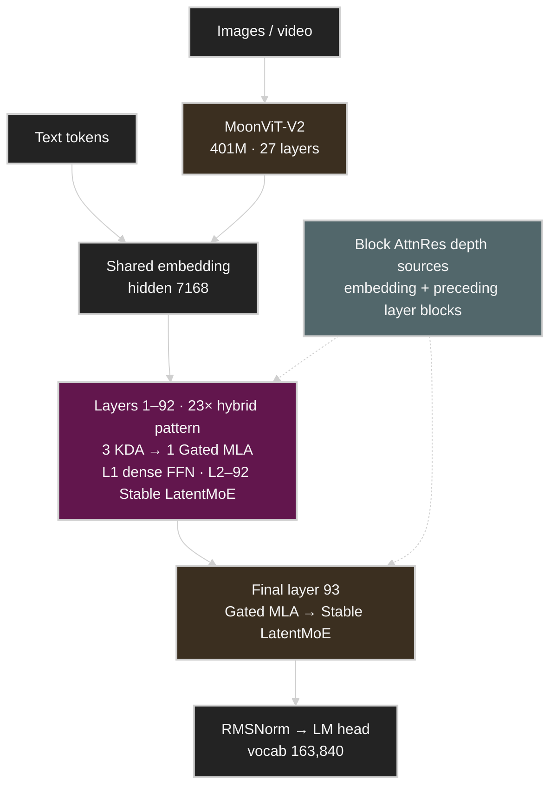
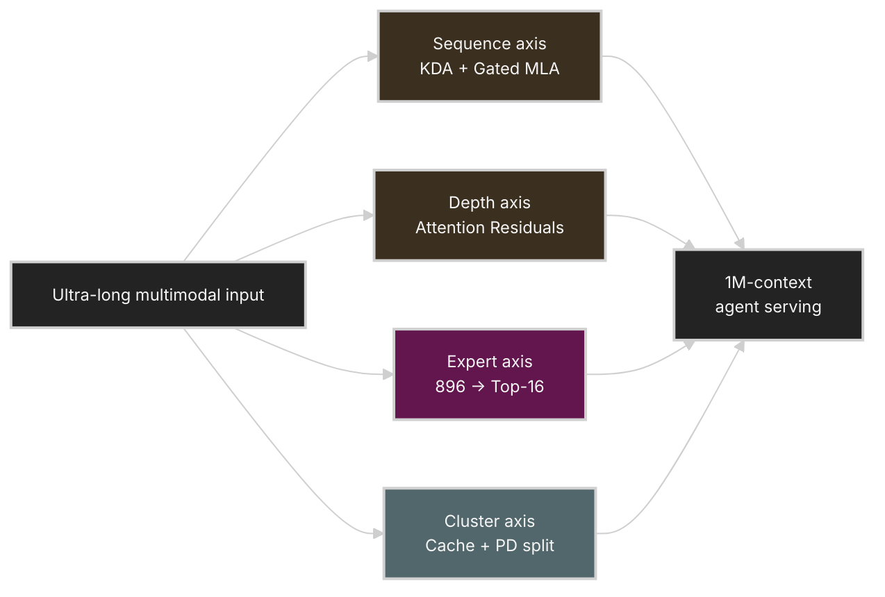
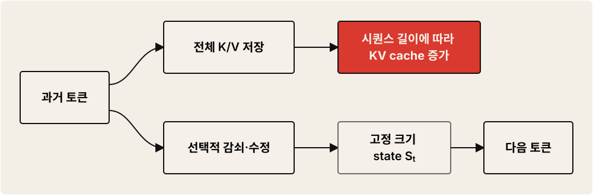
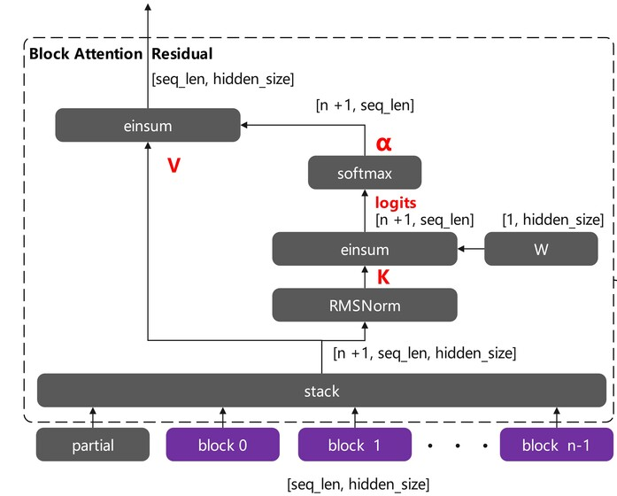
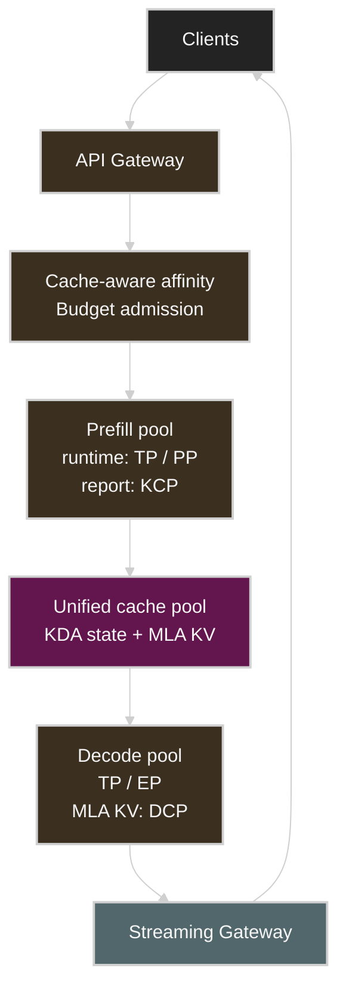

# Kimi K3 Technical Anatomy: 2.8T MoE, KDA, Attention Residuals, and 64-GPU Serving

> **Updated as of: July 28, 2026**
> Kimi K3's open weights and full technical report were released on July 27. This article is a public analysis updated against the official technical report, the Hugging Face model card and the actual `config.json`, and the API documentation. ([Technical Report][12], [Hugging Face][13])

**Official source:** [Kimi K3 Technical Report PDF][12]

## The Full Structure Confirmed by the Official Release

Before the release, an unofficial architecture draft with Kimi K2's numbers substituted was circulating. That draft is still useful in that it shows the connection structure of KDA, Gated MLA, Block AttnRes, LatentMoE, and the vision pathway on a single page. However, only `hidden_size=7168` matched the actual K3; the expert hidden dimension `2048`, attention heads `64`, vision hidden size `1152`, and `SiLU` labeling differed from the official values `3072`, `96`, `1024`, and `SiTU-GLU` respectively.

### The Full Structure at a Glance

The overview diagram below simplifies K3's full flow in the order of input modality, token mixing, depth mixing, and channel mixing. Each of the 23 hybrid patterns consists of three KDA layers and one Gated MLA layer, and a feed-forward network responsible for channel mixing follows every attention layer. Only the first layer uses a dense FFN; the rest use Stable LatentMoE.



*Figure: Kimi K3 full structure overview. Reconstructed based on the [Kimi K3 official technical report PDF][12] and the public `config.json`.*

### Detailed Operation-Path Diagram Reflecting the Official Structure

Unfolding the overview above along the four axes of token mixing (KDA·Gated MLA), depth mixing (Block AttnRes), channel mixing (Stable LatentMoE), and modality mixing (MoonViT-V2) yields the following detailed diagram. It keeps the per-operation-unit information level provided by [CalvinXKY/InfraTech's pre-release draft][2] while redrawing only the structure confirmed in the official report and the public checkpoint. It includes Block AttnRes's pseudo-query and depth softmax, KDA's Q/K/V·α/β generation and recurrent state, Stable LatentMoE's routed/shared expert paths and SiTU-GLU, Gated MLA's Q/KV LoRA and latent KV cache, and MoonViT-V2's residual block and projector flow.

[](assets/kimi-k3-architecture-detailed.svg)

*Figure: Kimi K3 operation-path detailed diagram. The RoPE·PE-cache MLA path from the pre-release draft was excluded because it does not match K3's `mla_use_nope=true`, and MTP is annotated to mark the difference between the technical report and the public checkpoint configuration. Sources: [Technical Report][12], [Kimi K3 Config][14].*

---

## Kimi K3 in One Sentence

**Kimi K3 is a very large sparse MoE model with 2.8 trillion total parameters but using only 16 of 896 experts per token, a native multimodal model designed to handle 1M-token contexts and long-running agent tasks by combining KDA-based linear attention, Gated MLA, and Attention Residuals.**

The specifications officially confirmed so far are as follows.

| Item | Kimi K3 |
| --- | --- |
| Total parameters | 2.78T, commonly written as 2.8T |
| Active parameters | 104.2B, commonly written as 104B |
| Layers | 93; the first layer is dense |
| hidden dimension | 7168 |
| attention heads | 96 |
| attention composition | 69 KDA + 24 Gated MLA |
| AttnRes | block size 12 |
| LatentMoE dimension | 3584 |
| expert hidden dimension | 3072 |
| routed / shared experts | 896 / 2 |
| routed experts per token | 16 |
| context length | 1,048,576 tokens |
| vocabulary | 163,840 |
| activation | SiTU-GLU |
| vision encoder | MoonViT-V2, 401M, 27 layers |
| model input modalities | text, image, video |
| training quantization | MXFP4 weights, MXFP8 activations |
| recommended self-deployment environment | high-bandwidth 64+ accelerator supernode |
| Thinking | always enabled |

> [!NOTE]
> The K2/K3 comparison table in the technical report lists one MTP layer for K3, but the public checkpoint's `config.json` has `num_nextn_predict_layers=0`. So this document does not assert that an embedded MTP is enabled in the public checkpoint. When using speculative decoding, you must check the separate draft checkpoint required by the runtime and the validation state of that release. ([Technical Report][12], [Kimi K3 Config][14])

Moonshot AI claims that with this structure and training method it achieved about 2.5x higher scaling efficiency than K2. This is closer in meaning to "the efficiency of converting increases in model size, data, and compute into actual capability improved" than to "exactly 2.5x higher performance at the same training compute". ([Kimi][1])

---

# 1. The Core of Kimi K3 Is Not Simply "2.8T"

The most eye-catching number in K3 is 2.8T, but what determines actual inference performance and cost is the following four elements.

1. **Kimi Delta Attention** along the sequence direction
2. **Attention Residuals** along the depth direction
3. **Stable LatentMoE** using 896 experts
4. **Prefix cache and disaggregated inference infrastructure** that connect long contexts to real service

In other words, K3 is not simply a model with 2.8x the parameters of K2. It is closer to a model that sparsifies or compresses the token axis, layer axis, expert axis, and cluster axis each in a different way.



## Talk Video: The Scaling Path from Kimi K2.5 to K3

The talk below is not the technical report of K3 itself, but Kimi co-founder and CEO Zhilin Yang directly explains the Muon optimizer, Day 0 co-design of infrastructure, Kimi Linear, and long-running agent systems applied while extending K2.5. It is useful for understanding the technical background in which K3's KDA and Attention Residuals appeared. ([NVIDIA GTC][11])

The full content of the talk is organized in detail along the three axes of token efficiency, long context, and agent swarms in the [Kimi K2.5 scaling lecture notes](kimi-k2-5-scaling.md).

<iframe
  src="https://www.youtube-nocookie.com/embed/CwePo4847ho"
  title="How We Scaled Kimi K2.5 | Zhilin Yang's full GTC 2026 Keynote"
  style="width: 100%; aspect-ratio: 16 / 9; border: 0;"
  loading="lazy"
  allow="accelerometer; autoplay; clipboard-write; encrypted-media; gyroscope; picture-in-picture; web-share"
  referrerpolicy="strict-origin-when-cross-origin"
  allowfullscreen>
</iframe>

*Video: [How We Scaled Kimi K2.5 | Zhilin Yang's full GTC 2026 Keynote][10] — Kimi AI official YouTube channel.*

---

# 2. Kimi Delta Attention: Attention That Does Not Keep Growing the KV Cache

## The Problem with Existing Softmax Attention

Self-attention in an ordinary Transformer stores the Key and Value of every past token in the KV cache when generating a new token.

As the context grows, the following costs increase.

* KV cache memory: proportional to sequence length
* prefill compute: generally quadratic in sequence length
* memory read volume during decode
* state-keeping cost of multi-turn agent tasks

With a 1M-token context, using only the existing full attention can make the KV cache and memory bandwidth a more serious bottleneck than the model weights.

## KDA Compresses Context into a Fixed-Size State

Rather than keeping every past K/V as-is, KDA has each attention head manage a matrix-form recurrent state. The simplified state update is as follows.

$$
S_t =
\left(I-\beta_t k_tk_t^\top\right)
\operatorname{Diag}(\alpha_t)S_{t-1}
+\beta_t k_t v_t^\top
$$

$$
o_t=S_t^\top q_t
$$

There are two important elements here.

* $\operatorname{Diag}(\alpha_t)$: decays the existing memory at different speeds per feature dimension.
* $\beta_t$: determines the degree to which existing key-value correspondences are revised and new ones recorded.

Whereas an ordinary Gated DeltaNet uses a single forget gate at the head level, KDA uses per-channel gates. In effect, it can more finely control which information to keep long and which to forget quickly. The recurrent state size of a KDA layer is fixed regardless of sequence length. ([arXiv][4])


*Figure: Kimi Delta Attention (KDA) detailed structure. Source: [CalvinXKY/InfraTech README][2]*

Expressed intuitively, it looks like the following.



*Figure: Comparison of Softmax Attention's linear KV cache growth and KDA's fixed-size recurrent state. Reconstructed based on the [Kimi Linear technical report][4].*

## Then Why Is MLA Still Needed

Linear attention is efficient, but because it compresses the context into a state of limited size, it can be relatively disadvantaged for the following tasks.

* accurately copying a specific string from a long document
* retrieving a distant token verbatim
* distinguishing among several similar keys
* re-searching for an exact symbol or line in a code repository

Kimi K3 also uses a 3:1 structure that inserts one Gated MLA layer for every three KDA layers. Repeating this pattern across the whole backbone and making the final 93rd layer a Gated MLA yields a total of 69 KDA and 24 Gated MLA layers. KDA efficiently compresses most of the context, while periodic MLA supplements an exact global retrieval path over the entire context. ([Technical Report][12])

The earlier model Kimi Linear reported reducing the KV cache by up to 75% under 1M-token conditions and achieving up to 6.3x higher decode throughput depending on the experimental setup. However, these numbers are results for the Kimi Linear 48B-A3B research model and should not be read directly as the real performance of the full K3 model. ([arXiv][4])

---

# 3. Attention Residuals: Layers Also Only Look at the Past They Need

The ordinary residual connection in a Transformer keeps adding the previous layer's output.

$$
h_l=h_{l-1}+f_l(h_{l-1})
$$

As layers get deeper, information from early and recent layers accumulates uniformly into a single hidden state of fixed size. This helps stabilize training, but in very deep models each layer's contribution can be diluted and a bottleneck can arise where information is compressed into a single representation.

AttnRes does not simply add all previous representations; the current layer performs attention over the past representations it needs.

$$
h_l=\sum_{i=0}^{l-1}\alpha_{i\rightarrow l}v_i
$$

That is, attention is applied not only in the token direction but also **in the model depth direction**.

```text
Existing Residual

Layer 0 ── + ── Layer 1 ── + ── Layer 2 ── + ── Layer 3
          all accumulated with the same weight


Attention Residual

Layer 0 ───────────┐
Layer 1 ────────┐  │
Layer 2 ─────┐  │  │
             ▼  ▼  ▼
        Depth Attention
             │
          Layer 3
```

## Block AttnRes

Full AttnRes, which stores every layer's output, grows in memory cost as depth increases. The `block 0`, `block 1`, `block n-1` structure shown in the K3 diagram represents Block AttnRes, which groups layers into several blocks and performs attention only on block representative representations.

* within a block: the existing residual accumulation
* between blocks: selecting needed blocks via learned attention
* the currently incomplete block: included as a `partial` representation



*Figure: Block Attention Residual's block representation aggregation structure. Source: [CalvinXKY/InfraTech README][2]*

The AttnRes research reported that with only about 8 blocks most of the benefits of Full AttnRes can be kept while greatly lowering the memory overhead. K3 divides its 93 layers with a block size of 12 so that the last block becomes a partial block, and if the embedding is included as an independent source block, the block-level representations depth attention handles total 9. ([Technical Report][12])

So K3 retrieves information in two directions.

* **Sequence direction:** KDA and MLA retrieve past tokens
* **Depth direction:** AttnRes retrieves past layer representations

This combination is the most interesting part of the K3 architecture.

---

# 4. Stable LatentMoE: Only 16 of 896 Experts Execute

K3 has 896 routed experts and selects 16 experts per token. In simple ratio terms, each token uses only about 1.79% of the routed experts. The actual active parameters, including shared experts and attention, are 104.2B, about 3.7% of the full 2.78T.

This structure lets you greatly increase the total parameters while limiting the per-token compute. However, **reducing compute and making deployment easier are entirely different problems**.

The full 2.8T of parameters must essentially fit in cluster memory. Counting MXFP4 at exactly 4 bits, the raw weight size is about 1.4TB.

```text
2.8 × 10¹² params × 4 bits ÷ 8
≈ 1.4 TB
```

The actual checkpoint in the public Hugging Face repository is about 1.56TB and consists of 96 `safetensors` shards. At runtime, in addition to this checkpoint, KDA state, the MLA KV cache, collective buffers, graph capture, and a runtime workspace are needed. ([Hugging Face Files][18])

## How LatentMoE Reduces Communication Volume

An ordinary MoE passes the full 7168-dimensional hidden representation to the routed experts. K3's LatentMoE first projects the routed path into a 3584-dimensional latent space, then returns to the full-width space after expert computation.

$$
z=W_{\downarrow}x\in\mathbb{R}^{3584}
$$

$$
u=\sum_{i\in T_k(x)}p_iE_i^{\text{routed}}(z)
$$

$$
y=\sum_{j=1}^{2}E_j^{\text{shared}}(x)
  +W_{\uparrow}\operatorname{RMSNorm}(u)
$$

The two shared experts handle the common transformation on the 7168-dimensional full-width path, and the 896 routed experts specialize in the 3584-dimensional latent space. The routed experts' FFN hidden dimension is 3072. Unlike the original LatentMoE, an RMSNorm is inserted between the expert aggregation and the up-projection to reduce scale variation and activation blow-up in the routed branch. ([Technical Report][12], [Kimi K3 Config][14])

## The More Experts, the More the Network Matters

Distributing the experts evenly across 64 accelerators gives each accelerator on average about 14 experts.

```text
896 experts ÷ 64 accelerators = 14 experts/accelerator
```

Since each token must be passed to 16 experts, the following flow repeats under expert parallelism.


*Figure: A conceptual diagram separating per-token Top-16 compute, the memory residency of 896 experts, and All-to-All communication cost.*

In a simple PCIe-based multi-node or ordinary Ethernet environment, All-to-All communication is more likely to be the bottleneck than compute. This is also why Moonshot AI recommends a supernode that bundles 64 or more accelerators into a single high-bandwidth communication domain. ([Kimi][1])

## Quantile Balancing

If the MoE router funnels tokens into a specific expert, only that GPU becomes slow and the whole placement waits — a straggler problem.

K3 determines Top-k dispatch by adding a per-expert bias to the sigmoid router score, without an auxiliary loss. Quantile Balancing directly computes the next step's bias from the quantiles of the router margin so that each expert receives its target token count. It is an approach that aims to reduce slow adaptation and load oscillation at the 896-expert scale, compared to methods using a fixed step size and empirical corrections. After training ends, the final bias is fixed and not updated during inference. ([Technical Report][12])

In addition, Moonshot AI stated that it used the following during the training phase.

* fully balanced expert parallelism
* static tensor shapes
* removal of host synchronization on the critical path
* Per-Head Muon optimizer

---

# 5. Gated MLA and SiTU-GLU

K3 is not a pure linear-attention model that uses only KDA. It uses 24 Gated MLA layers to supplement global retrieval capability and selectivity.

MLA is a scheme that reduces the KV cache by compressing the K/V into a low-dimensional latent representation. Where KDA compresses the context into a fixed-size recurrent state, MLA compresses the dimension of the KV representation itself.

So the roles of the two schemes are somewhat different.

| Scheme      | Main purpose                                    |
| --------- | -------------------------------------------- |
| KDA       | compress the KV state that grows with sequence length to near fixed size   |
| MLA       | compress the feature dimension of K/V into a latent space |
| Gated MLA | selectively pass through the needed attention information             |
| AttnRes   | selectively retrieve past layers along the depth direction                |

K3's MLA uses NoPE in all layers. Position and recency information is provided by the KDA layers in between, and MLA focuses on unrestricted global content interaction without positional encoding. Both the KDA and MLA outputs have a per-token, per-channel full-rank sigmoid gate applied. ([Technical Report][12])

The FFN activation of Stable LatentMoE is the Sigmoid Tanh Unit GLU, i.e. SiTU-GLU. Each branch's linear output is bounded by a tanh soft cap.

$$
\operatorname{softcap}(x,\beta)=\beta\tanh(x/\beta)
$$

$$
\operatorname{SiTU\text{-}GLU}(x)=
\left[
\beta_1\tanh\left(\frac{W_gx}{\beta_1}\right)
\odot\sigma(W_gx)
\right]
\odot
\left[
\beta_2\tanh\left(\frac{W_ux}{\beta_2}\right)
\right]
$$

K3 uses $\beta_1=4$ for the gate branch and $\beta_2=25$ for the up branch. Near the origin it behaves similarly to SwiGLU, but for large positive activations it bounds the product of the two branches, lowering the overflow risk in low-precision training and very deep expert chains.

---

# 6. The Native Multimodal Structure

K3 is a native multimodal model that handles not only text but also images and video in the same backbone and context. Visual input passes through MoonViT-V2 and a lightweight MLP projector into the same space as the text embeddings.

The public specifications of MoonViT-V2 are as follows.

| Item | Value |
| --- | --- |
| Parameters | 401M |
| vision layers | 27 |
| hidden dimension | 1024 |
| intermediate dimension | 4096 |
| attention heads | 12 |
| patch size | 14 |
| token merge | 2×2 pixel shuffle / `patchmergerv2` |
| normalization | RMSNorm |

MoonViT-V2 does not start from a contrastive pre-trained encoder like SigLIP; it was co-trained from scratch with next-token prediction. Images and video share the same parameters, with intra-frame spatial attention and inter-frame temporal attention separated, and video tokens compressed via temporal pooling. The 2×2 pixel shuffle reduces the number of visual tokens to a quarter before they enter the projector. The technical report presents handling inputs of up to 3584×3584 pixels within a 1M context as a design point. ([Technical Report][12], [Kimi K3 Config][14])

However, **the model's native capability and the support range of the currently public serving interface should be distinguished.**

| Usage path | Supported inputs |
| --- | --- |
| Model architecture / official technical report | text, image, video |
| Kimi official API | text, image, video |
| Public Hugging Face processor | text, image |
| Current SGLang open-source serving contract | text, image |

The public `KimiK3Processor` rejects any media type other than image, so you should not expect the same video input as the API when self-hosting. ([Hugging Face Processor][17], [SGLang][16])

The input methods supported by the API are clear.

* images: base64 or `ms://<file-id>`
* video: usable via `ms://<file-id>` after file upload
* ordinary internet image URLs are not supported
* recommended image resolution: up to 4K
* recommended video resolution: up to FHD
* the entire request body: within 100MB

The number of image and video tokens is computed dynamically based on resolution and the number of extracted frames. In production, it is safer to perform token estimation before the request. ([Kimi API Platform][6])

---

# 7. MXFP4 and MXFP8: QAT with Deployment in Mind

K3 applied Quantization-Aware Training starting from the SFT stage.

* Weights: MXFP4
* Activations: MXFP8

This differs from the approach of completing a BF16 model and then converting to 4 bits with PTQ. It is an approach that exposes quantization error early during training to reduce accuracy loss in low-precision inference.

The `compressed-tensors` configuration of the public checkpoint uses packed MXFP4 with a group size of 32. However, not every parameter is uniformly 4-bit. `self_attn`, the shared experts, the dense MLP projection, `lm_head`, the vision tower, and the multimodal projector are on the exclusion list of the public quantization config. Because of this mixed-precision configuration and the scale metadata, the actual checkpoint is 1.56TB rather than the simple calculated 1.4TB. ([Kimi K3 Config][14])

The important point from an MLOps perspective is that **just because the checkpoint is MXFP4 does not mean it automatically runs fast on any GPU**. Real performance depends on the following elements.

* the accelerator's level of MXFP4/MXFP8 support
* dequantization fusion
* expert GEMM kernels
* KDA kernel support
* the runtime's expert-parallel implementation
* overlap of collective communication and compute

Moonshot AI published a dedicated CUDA kernel called FlashKDA. The current implementation supports Hopper-family and Blackwell-family architecture targets and can be automatically dispatched as the KDA backend of `flash-linear-attention`. The official model card recommends vLLM, SGLang, and TokenSpeed as K3 inference engines. However, **being on the recommended engine list is different from a specific hardware recipe being validated on a production workload.** Because the kernel backend, supported accelerators, KDA state memory policy, and multimodal coverage differ per engine, you should check each engine's K3 recipe and validation state together, rather than a simple common launch command. ([GitHub][7], [Hugging Face][13])

---

# 8. What a 1M-Token Context Means

Supporting 1M tokens does not mean that stuffing 1M tokens into every request is efficient.

K3 also uses some Gated MLA layers, so not all attention state becomes completely fixed-size. Long inputs still incur the following costs.

* prefill latency
* activation memory
* MLA KV cache
* multi-node cache transfer
* input token cost
* time to first token, TTFT

So a real system needs the following combination.

```text
1M context capability
        +
document retrieval / context selection
        +
prefix cache
        +
conversation summarization
        +
prefill-decode disaggregation
```

Context caching in the Kimi API works automatically. If the previous request's prompt exceeds 256 tokens and the long prefix is preserved as-is in the next request, it attempts a cache hit. No separate cache ID or TTL configuration is required. ([Kimi API Platform][8])

The official API pricing also makes cache locality extremely important.

| Token type          |      Official launch price |
| ---------------- | ------------: |
| Cache-hit input  |  \$0.30 / MTok |
| Cache-miss input |  \$3.00 / MTok |
| Output           | \$15.00 / MTok |

Cache-hit input is 10x cheaper than cache-miss. Moonshot AI claims to achieve a 90%+ cache hit rate on its own coding workloads. This is a figure from the official service environment, so it is hard to assume the same is achieved in a typical self-deployment. ([Kimi][1])

---

# 9. Kimi K3 Serving Strategy for MLOps Engineers

## The Realistic Default: API First

The open weights and supported runtimes have been published, but considering the 1.56TB checkpoint, special kernels, large-scale parallelism, and cache operations, the strategy of first validating quality and workload characteristics via the API is still reasonable for most teams. Self-hosting is not set as the second stage because it is impossible, but because the required infrastructure scale and operational complexity are large.

The K3 API can be called in OpenAI Python SDK form.

```python
import os

from openai import OpenAI

client = OpenAI(
    api_key=os.environ["MOONSHOT_API_KEY"],
    base_url="https://api.moonshot.ai/v1",
)

response = client.chat.completions.create(
    model="kimi-k3",
    reasoning_effort="low",
    max_completion_tokens=8192,
    messages=[
        {
            "role": "system",
            "content": "You are a senior software architecture reviewer.",
        },
        {
            "role": "user",
            "content": "Review the following system design.",
        },
    ],
)

print(response.choices[0].message.content)
```

K3 cannot fully turn off thinking. Inference amount is adjusted with `reasoning_effort`'s `low`, `high`, `max`, and the default is `max`. Also, sampling parameters such as temperature, top-p, and n are fixed, so the main latency/cost control levers in operation become `reasoning_effort`, input length, and output limits. ([Kimi API Platform][8])

In production, it is better to split defaults per workload.

| Workload             | Recommended starting value                    |
| ------------ | ------------------------------------ |
| Simple classification/extraction | `low`                                |
| Code review / general analysis | `high`                               |
| Long-term planning / complex reasoning | `max`                                |
| JSON extraction      | `low` or `high` + strict JSON Schema |
| Long-running agent     | per-stage dynamic adjustment                            |

## Requests Must Be Structured So the Prefix Does Not Change

To improve cache efficiency, it is better to arrange requests in the following order.

```text
[Fixed System Prompt]
[Fixed tool definitions]
[Fixed codebase or document]
[Per-session conversation]
[Current user question]
```

If you insert a timestamp, request ID, or per-user dynamic information at the front of the system prompt for every request, the prefix hash changes and cache locality can break. Dynamic metadata should be placed as far back as possible.

## Multi-turn Messages Must Preserve the Original

The Kimi API requires that in tool-call or multi-turn requests you not store only the `content` of the previous assistant message but include the full message as-is in the next request. If fields such as `reasoning_content` or `tool_calls` are missing, the conversation state can break. ([Kimi API Platform][8])

The official limitations state this requirement more strongly. If the thinking history is missing, or an in-progress session started with a different model is switched to K3, generation quality can become very unstable. So pin the model and reasoning protocol version in the session metadata, and if a mid-course model switch is needed, it is safer to summarize the existing conversation and start a new K3 session. ([Kimi][1])

In the operational DB, it is better to separate things as follows.

```text
user-visible content
reasoning content
tool calls
tool results
token usage
cache status
model configuration
```

`reasoning_content` should be handled separately from user output, and log retention and access control should be separated.

## Long-running Agents Need Explicit Action Boundaries

K3 is trained to actively carry out long-horizon tasks to the end, so when it encounters an ambiguous request or a small obstacle it can make decisions broader than the user's intent on its own. Important actions such as external transmission, deletion, purchase, deployment, or permission changes should have their approval boundaries spelled out in the system prompt or `AGENTS.md`, and be restricted once more by runtime policy. This is both a general agent-safety practice and a K3-specific limitation published by Moonshot AI. ([Kimi][1])

---

# 10. Self-Hosting Architecture

The official weights and vLLM·SGLang·TokenSpeed support have been published, but it is difficult to approach self-serving K3 at the level of a single Kubernetes Deployment. The weights alone are 1.56TB, the KDA recurrent state and the MLA KV cache have different memory-scaling characteristics, and high-bandwidth All-to-All is required for 896-expert routing.

The diagram below is not a single officially validated topology, but a **logical reference structure** that connects the technical report's cache-aware scheduling and KDA Context Parallelism (KCP) with the public runtimes' PP·DCP·prefill-decode disaggregation at a glance.



The technical report describes KCP, the KDA-aware prefix cache, cache-aware affinity, and budget-based admission control as Moonshot's production design. On the other hand, the specific flags and combinations of PP·DCP·HiCache are implementation choices of public runtimes such as SGLang·vLLM. They should not be interpreted as official K3 deployment specifications at the same level. ([Technical Report][12], [SGLang][16], [vLLM Recipe][19])

The overall shape is a prefill-decode disaggregation structure similar to Moonshot AI's Mooncake family. Mooncake separates prefill and decode clusters and builds a distributed KV cache using CPU DRAM and SSDs as well. Currently Mooncake is integrated into the vLLM and SGLang ecosystems, and K2 has also been deployed on 128 H200s using large-scale expert parallelism and PD disaggregation. This is not a case that validated a specific public recipe for K3, but a prior operational example of disaggregated serving. ([GitHub][9])

## 64+ Accelerators Is a Recommended Configuration, Not an Absolute Minimum

Moonshot AI recommends a supernode that bundles 64 or more accelerators into a single high-bandwidth communication domain for inference efficiency. On the other hand, the SGLang cookbook also presents configurations starting from 8 B300·MI350X/MI355X, 16 B200·H200, or 32 H100 depending on HBM capacity and backend. So 64+ is the vendor-recommended value for production throughput and communication efficiency, and should be distinguished from the absolute minimum that can technically boot. ([Kimi][1], [SGLang][16])

However, the numbers from public recipes should not be used directly as a validated production baseline. The current SGLang cookbook marks every configuration cell as `Not Verified` and states that there is no full serving round with the final weights and current code combination. The vLLM recipe also retains pre-release-estimate and nightly-build wording. These configurations should be treated as **a workable starting point**, and throughput, accuracy, memory headroom, and prefix-cache behavior should be re-measured on the target hardware and workload. ([SGLang][16], [vLLM Recipe][19])

## KDA-aware Prefix Cache

The K3 technical report specifically published a cache protocol that manages the KDA state and the MLA KV cache together.

* MLA KV grows with the token count, but the KDA recurrent state is fixed size per request.
* Both cache types are placed in a paged block pool of the same byte size, sharing allocation, reference counting, and eviction.
* The MLA physical page and prefix hash granularity are separated, so a prefix hit can be found at, for example, a 512-token boundary even inside a large physical block.
* KDA state checkpoints are kept at sparse boundaries such as conversation turns, not at every hash boundary.
* A cache hit selects the longest boundary where the MLA prefix and checkpoints of all KDA cache groups exist simultaneously.
* If the prefill and decode TP degrees differ, the layout is converted on the transfer path and the two states are moved together.

So the "new protocol that moves and stores KDA state and MLA KV together" that was previously anticipated has been confirmed as a real serving design. However, since the report describes Moonshot's internal production architecture, the specific features and options supported in open-source runtimes must be checked per engine recipe. ([Technical Report][12], [SGLang][16])

## Inference Kernel Paths Added to the Public Report

The technical report published the implementation paths for decode and MoE in addition to FlashKDA prefill.

* KDA decode's speculative verification does not copy the large recurrent state at every draft position; it keeps only the small projected input and regenerates the accepted token's state on-chip.
* Block AttnRes prefill reduces duplicated materialization of block representations with sequence parallelism, and decode overlaps the inter-block pass on a side stream while fusing the intra-block merge and RMSNorm into the collective.
* Stable LatentMoE fuses the latent down projection and the router, and uses a WarpDecode-family token-centric kernel for small-batch decode of routed experts.

These optimizations describe K3's production serving design, but whether the same kernel path is selected in public engines must be confirmed per backend, accelerator, and runtime version. ([Technical Report][12])

## Parallelization Composition

In K3 deployment, the following parallelism axes are combined to fit the workload and hardware topology. In particular, KCP and DCP have similar names but different targets and public scopes.

### Expert Parallelism

Distributes the 896 experts across multiple accelerators. This is the most important parallelism axis.

### Tensor Parallelism

Splits the large matrix multiplications of attention projections, shared layers, and individual experts across multiple accelerators.

### Pipeline Parallelism

Splits the full layers into multiple stages. However, pipeline bubbles and the non-uniform output lengths of long agent requests must be considered.

### KDA Context Parallelism

The KCP in the technical report splits a long prefill sequence across multiple ranks, all-gathers the fixed-size KDA transitions and recurrent state fragments computed by each rank, and composes them with a prefix scan. The key is exchanging a fixed-size state instead of KV blocks proportional to sequence length. The current SGLang cookbook's default recipe for long-context prefill uses PP rather than KCP, so the report's algorithm and the public runtime flag should not be identified. ([Technical Report][12], [SGLang][16])

### Decode Context Parallelism

SGLang's DCP is a runtime parallelism axis that splits the **MLA KV cache** replicated across TP ranks to increase context capacity. The KDA state is not split by DP·EP·DCP, so the KDA state pool becomes the upper bound on the number of concurrent requests. The main levers for changing the per-accelerator burden of the KDA state are the attention TP width, the state dtype, and the cache strategy. So DCP should not be interpreted as KDA state sharding. ([SGLang][16])

### Data Parallelism

Replicates validated TP/EP groups as replicas to distribute requests. The minimum unit of autoscaling is not a single GPU, but the **entire serving replica group** with complete weights and collective topology. This group can be composed of 8, 16, 32, or 64+ accelerators depending on the hardware.

## Kimi K3 License Operations Check

Kimi K3 was published under a standalone license that broadly permits use, modification, distribution, fine-tuning, and derivative works. However, before self-hosting and commercialization the following conditions must be checked.

* If the combined 12-month revenue of a Model-as-a-Service business and its affiliates exceeds 20 million dollars, a separate contract with Moonshot AI is required before commercial use.
* If a commercial product using K3 or a derivative exceeds 100 million MAU or 20 million dollars in monthly revenue, `Kimi K3` must be clearly displayed in the UI.
* Exceptions to the two additional conditions above apply to internal use and use through Moonshot official products or certified inference partners.

This summarizes the operationally key conditions of the license text and is not legal advice. Legal review is required before an actual commercial release. ([Kimi K3 License][15])

---

# 11. Cautions for Kubernetes and Cluster Operations

## Autoscaling Unit

The approach of adding one or two GPUs like an ordinary inference pod is meaningless.

```text
Wrong approach:
GPU utilization 80% → add one GPU pod

Recommended approach:
Queue latency / Goodput degradation
    → add an entire validated TP/EP serving replica group
```

Since a replica group may require 8 to 64+ accelerators together, scale-out is slow and expensive. To respond to traffic spikes, warm standby, admission control, and reasoning-effort downgrade policies are needed. As with the budget-based admission control described in the technical report, assigning separate resource budgets to short requests and ultra-long requests can prevent a 1M-context burst from degrading the overall TTFT. ([Technical Report][12])

## Topology-aware Scheduling

Even with the same number of accelerators, expert parallel performance can drop sharply if they are placed across different racks or a slow network fabric.

The scheduler must know at least the following topology.

* NVLink/NVSwitch or an equivalent internal fabric
* rack and supernode boundaries
* RDMA NICs and NUMA affinity
* storage/cache node proximity
* the transfer path between prefill and decode

## Readiness Probe

An open HTTP port does not mean readiness is complete. At minimum, the following conditions must be checked.

```text
96 weight shards loaded and checksum verified
all rank collective initialization complete
896 expert placement verified
FlashKDA kernels dispatch normally
KDA state / MLA KV cache pools initialized
reasoning / tool-call parsers verified
all-to-all bandwidth test passed
text/image sample inference results verified
```

---

# 12. Observation Metrics That Must Be Collected

## User Experience

| Metric          | Meaning              |
| ------------- | --------------- |
| TTFT          | time until the first token    |
| TPOT          | average time between output tokens |
| E2E latency   | total time from request to completion |
| Goodput       | throughput that met the SLO    |
| Queue latency | wait time before model execution   |

## Cache

| Metric                     | Meaning                |
| ---------------------- | ----------------- |
| Prefix cache hit rate  | fraction of prefixes reused    |
| Cache-hit tokens       | input tokens reused from cache   |
| Cache transfer latency | cache/state transfer time |
| Eviction rate          | cache eviction frequency       |
| Recompute rate         | fraction recomputed due to cache miss    |
| KDA state pool occupancy | state slot utilization limiting the number of concurrent requests |
| MLA KV pool occupancy | token-dependent KV page utilization |
| Joint cache hit boundary | prefix length where MLA KV and KDA checkpoints were restored together |

## MoE

| Metric                 | Meaning                   |
| ------------------ | -------------------- |
| Tokens per expert  | per-expert token distribution        |
| Expert imbalance   | gap between the busiest expert and the average |
| All-to-All latency | token dispatch communication time |
| Straggler rank     | rank delaying the whole step  |
| Router entropy     | degree of skew in routing choices    |

## Accelerators and Network

* HBM usage and bandwidth
* SM utilization
* expert GEMM utilization
* NCCL/RDMA throughput
* retransmissions and link errors
* whether the KDA kernel fell back
* independent utilization of the prefill and decode pools

## Application

* latency and cost per `reasoning_effort`
* tool call success rate
* JSON Schema validation failure rate
* output truncation rate
* image/video preprocessing time
* token usage per input modality
* user cancellation and timeout rates

---

# 13. Recommended Adoption Order

## Stage 1: API-based Quality Validation

* evaluate with real codebases and documents
* compare quality and latency at `low`, `high`, `max`
* check the prefix cache hit rate
* collect the output token distribution
* validate tool calling and structured output

## Stage 2: Shadow Traffic

Call K3 concurrently with the currently running model, but do not expose K3's results to users.

* compare result quality
* long-running agent trajectory stability
* check cost and tail latency
* validate multimodal input handling

## Stage 3: Limited Routing

Route only the workloads where K3 shows strength.

```text
long codebase analysis        → K3
screenshot-based frontend fixes → K3
large-scale document synthesis          → K3
simple classification               → small model
short RAG queries             → medium model
```

## Stage 4: Self-Hosting PoC

Based on the public weights and license, and vLLM·SGLang·TokenSpeed support, run reproducibility validation on real hardware and workloads.

The items to validate first are as follows.

* 1.56TB checkpoint download/loading time and storage bandwidth
* minimum replica group per accelerator type
* supported GPUs and NPUs
* MXFP4 kernel compatibility
* expert parallel topology
* memory pool ratio between KDA state and MLA KV
* KDA-aware prefix cache hit and state checkpoint cost
* vision encoder memory
* the image-only limitation of the public processor
* single replica group throughput and goodput
* failure recovery time
* Kimi K3 License scope of application

---

# 14. What Matters More Than Benchmarks When Evaluating K3

Moonshot AI announced that K3 is at frontier level in coding, knowledge work, visual reasoning, and long-running agent tasks. However, the official benchmarks mix different agent harnesses such as KimiCode, Claude Code, and Codex, and most were run under `reasoning_effort=max` conditions. Some comparison models were also affected by fallbacks or safety guards. So rather than judging model superiority by a single score, re-evaluation should be done in the same harness and the same tool environment. ([Kimi][1])

The questions an MLOps engineer should actually check are the following.

* Is an agent task running for 30+ minutes stable to the end?
* Is the cache hit maintained on repeating code prefixes?
* Is quality preserved when the reasoning effort is lowered?
* Does TTFT at 1M context meet the real SLO?
* Does it self-recover after a tool call failure?
* Does expert imbalance create tail latency?
* Is the token cost predictable for multimodal input?

---

# Conclusion

The significance of Kimi K3 lies less in the number "the world's first 2.8T open model" than in the fact that it addressed the bottlenecks of multiple axes simultaneously to turn a very large model into a real agent service.

* KDA suppresses memory growth along the sequence direction.
* Gated MLA compensates for the exact-retrieval limits of linear attention.
* AttnRes reduces information dilution along the depth direction.
* Stable LatentMoE separates the total model size from the per-token compute.
* MXFP4/MXFP8 QAT lowers the storage and compute cost of the very large weights.
* Mooncake and prefix cache turn 1M context into a serviceable infrastructure problem.

On the other hand, from a self-serving perspective it is a very demanding model. You must operate together a 1.56TB checkpoint, 896-expert routing, per-hardware 8–64+ accelerator configurations, high-bandwidth All-to-All, KDA-dedicated kernels and two kinds of caches, and multimodal preprocessing. In particular, Moonshot's 64+ supernode recommendation should be understood as a recommendation for production inference efficiency rather than an absolute minimum spec.

So for most teams, the realistic strategy is to **first validate workload fit and cache economics via the API, and adopt self-hosting only after re-validating the public runtime recipe on the target hardware and real workload**.

## Key Resources

* Kimi K3 official technical blog and launch information ([Kimi][1])
* Kimi K3 official technical report ([Technical Report][12])
* Hugging Face model card and public configuration ([Hugging Face][13], [Kimi K3 Config][14])
* Kimi K3 License ([Kimi K3 License][15])
* SGLang Kimi K3 serving cookbook ([SGLang][16])
* vLLM Kimi K3 serving recipe ([vLLM Recipe][19])
* Kimi K3 API guide ([Kimi API Platform][8])
* Kimi Linear technical report ([arXiv][4])
* Attention Residuals technical report and implementation ([GitHub][5])
* FlashKDA implementation ([GitHub][7])
* Mooncake disaggregated inference architecture ([GitHub][9])
* Source of the unofficial KDA·Block AttnRes detailed diagrams ([GitHub][2])
* Zhilin Yang's GTC 2026 talk video ([YouTube][10], [NVIDIA GTC][11])

[1]: https://www.kimi.com/blog/kimi-k3 "Kimi K3 Tech Blog: Open Frontier Intelligence"
[2]: https://github.com/CalvinXKY/InfraTech/blob/main/models/kimi_k_3/README.md "InfraTech/models/kimi_k_3/README.md at main · CalvinXKY/InfraTech · GitHub"
[4]: https://arxiv.org/pdf/2510.26692 "Kimi Linear: An Expressive, Efficient Attention Architecture"
[5]: https://github.com/MoonshotAI/Attention-Residuals/blob/master/README.md "Attention-Residuals/README.md at master · MoonshotAI/Attention-Residuals · GitHub"
[6]: https://platform.kimi.ai/docs/api/chat "Create Chat Completion - Kimi API Platform"
[7]: https://github.com/MoonshotAI/FlashKDA "FlashKDA: high-performance Kimi Delta Attention kernels"
[8]: https://platform.kimi.ai/docs/guide/kimi-k3-quickstart "Kimi K3 - Kimi API Platform"
[9]: https://github.com/kvcache-ai/Mooncake "GitHub - kvcache-ai/Mooncake: Mooncake is the serving platform for Kimi, a leading LLM service provided by Moonshot AI. · GitHub"
[10]: https://www.youtube.com/watch?v=CwePo4847ho "How We Scaled Kimi K2.5 | Zhilin Yang's full GTC 2026 Keynote"
[11]: https://www.nvidia.com/en-us/on-demand/session/gtc26-s81695/ "How We Scaled Kimi K2.5 | GTC San Jose 2026"
[12]: https://github.com/MoonshotAI/Kimi-K3/blob/main/k3_tech_report.pdf "Kimi K3 Technical Report"
[13]: https://huggingface.co/moonshotai/Kimi-K3 "moonshotai/Kimi-K3 · Hugging Face"
[14]: https://huggingface.co/moonshotai/Kimi-K3/blob/main/config.json "Kimi K3 config.json"
[15]: https://huggingface.co/moonshotai/Kimi-K3/blob/main/LICENSE "Kimi K3 License"
[16]: https://docs.sglang.io/cookbook/autoregressive/Moonshotai/Kimi-K3 "SGLang Kimi K3 Cookbook"
[17]: https://huggingface.co/moonshotai/Kimi-K3/blob/main/kimi_k3_processor.py "Kimi K3 Hugging Face processor"
[18]: https://huggingface.co/moonshotai/Kimi-K3/tree/main "Kimi K3 Hugging Face files"
[19]: https://recipes.vllm.ai/moonshotai/Kimi-K3 "Kimi K3 vLLM Recipe"
