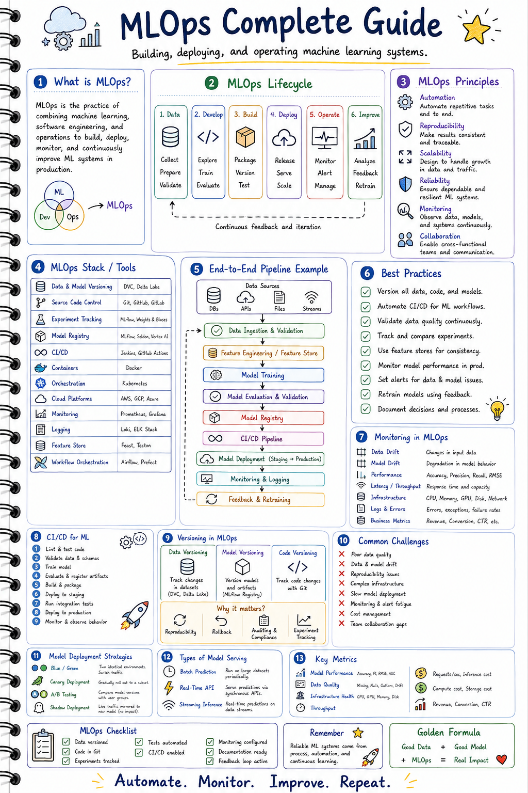
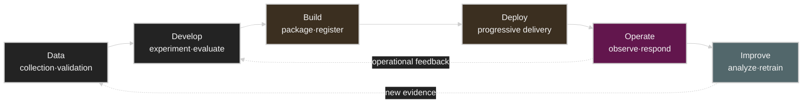
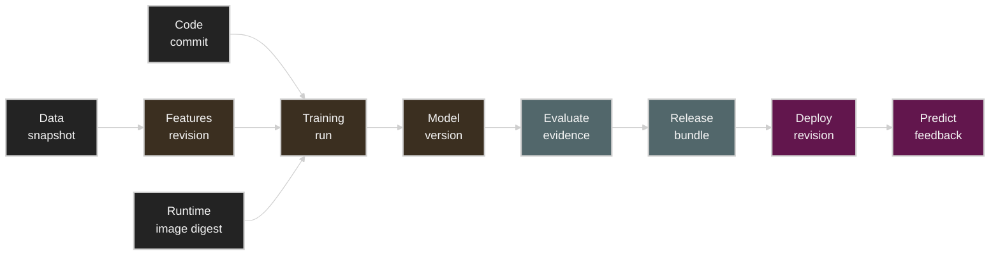
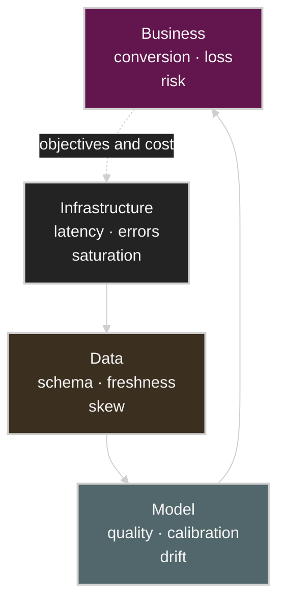
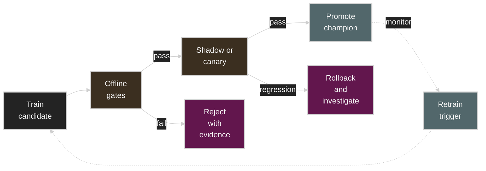
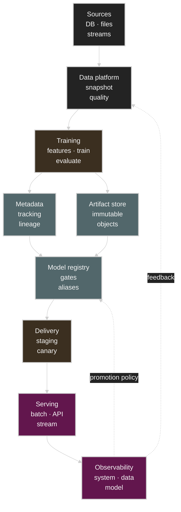

# MLOps: An Operating System for Controlling Change, Not a Model Deployment Technology

Infographics explaining MLOps usually lay out the `Data → Develop → Build → Deploy → Operate → Improve` cycle together with tools like experiment tracking, model registries, CI/CD, containers, orchestration, and monitoring on a single page. Useful for quickly grasping the whole terrain, but the hardest questions in real operations hide between the boxes in the diagram.



- What data and code produced the current production model?
- On what evidence do you promote a model that improved in offline evaluation to production?
- Is a change in data distribution alone enough to start retraining?
- How do you distinguish a new model's failure from an application failure?
- On rollback, do you revert only the model, or the preprocessing and feature definitions too?
- How do you detect model quality degradation without ground-truth labels that arrive late?

This article re-reads the infographic's items not as a tool list but through the systems lens of **change management, evidence collection, progressive delivery, and feedback control**. It explains things starting from traditional predictive models, and ends with the LLMOps extensions needed for LLM and RAG applications.

Written as of: July 2026

## Table of Contents

1. [The Real Problems MLOps Solves](#1-the-real-problems-mlops-solves)
2. [Lifecycle: Closed-Loop Control, Not a Linear Pipeline](#2-lifecycle-closed-loop-control-not-a-linear-pipeline)
3. [Data: Data Contracts and Point-in-Time Consistency](#3-data-data-contracts-and-point-in-time-consistency)
4. [Develop: Conditions for Reproducible Experiments](#4-develop-conditions-for-reproducible-experiments)
5. [Build: Turning Model Files into Release Units](#5-build-turning-model-files-into-release-units)
6. [Designing CI, CD, and CT Separately](#6-designing-ci-cd-and-ct-separately)
7. [Model Registry and Lineage](#7-model-registry-and-lineage)
8. [Feature Store: Preserving the Temporal Meaning of Features](#8-feature-store-preserving-the-temporal-meaning-of-features)
9. [Deploy: Deployment Strategy Is Not Experiment Strategy](#9-deploy-deployment-strategy-is-not-experiment-strategy)
10. [Operate: Watching Four Layers of Observability Together](#10-operate-watching-four-layers-of-observability-together)
11. [Improve: Control Comes Before Automation in Retraining](#11-improve-control-comes-before-automation-in-retraining)
12. [Reference Architecture and Tool Selection](#12-reference-architecture-and-tool-selection)
13. [Commonly Failing Designs and First-Check Items](#13-commonly-failing-designs-and-first-check-items)
14. [Production Readiness Checklist](#14-production-readiness-checklist)
15. [What Changes When Extending to LLMOps](#15-what-changes-when-extending-to-llmops)
16. [Conclusion](#16-conclusion)
17. [References](#17-references)

## 1. The Real Problems MLOps Solves

Defining MLOps merely as "DevOps for machine learning" easily misses the key difference. Ordinary software can be tested fairly clearly for expected behavior under the same code and inputs. In contrast, an ML system's behavior is determined not only by code but also by data, the learning algorithm, stochastic execution, model parameters, and the input distribution at serving time.

A production prediction can be simplified as follows.

$$
\hat{y} = f_{\theta}(T(x; \phi), c)
$$

- $x$: raw input
- $T$: preprocessing and feature transformation
- $\phi$: feature definitions and transformation parameters
- $\theta$: learned model parameters
- $c$: operational context such as runtime settings, thresholds, and routing policies

Even with the same code, $\theta$ can differ if the training data snapshot, feature computation time, library versions, random seed, or hardware kernels differ. Even with the same model, different thresholds or preprocessing definitions change business behavior. Therefore the unit of a production release is not a single `model.pkl` or checkpoint.

```text
ML release
= code revision
+ data snapshot
+ feature definitions
+ training configuration
+ model artifact
+ runtime environment
+ serving configuration
+ validation evidence
```

The first purpose of MLOps is to make this composite release **identifiable, reproducible, and roll-back-able**. The second is to verify that a new release is safe not only in offline scores but also in the online system and business objectives. The third is to feed signals gathered in operations back into the next data and experiments, while controlling the loop so that bad feedback does not amplify the model.

As Google's *Hidden Technical Debt in Machine Learning Systems* points out, in real ML systems data dependencies, feedback loops, configuration, and changes in the outside world can create more operational debt than the model code itself. Good MLOps does not stop at making model training fast; it surfaces this hidden coupling.

## 2. Lifecycle: Closed-Loop Control, Not a Linear Pipeline

The infographic's six stages are best read as follows.



The most important part of this flow is the dotted line returning `Operate → Improve → Data`. Without that line, you only have an automated model delivery pipeline; connect the line without any control and you get a dangerous automatic retraining loop.

Each stage must be a **validated state transition**, not just passing a file to the next stage.

| Current state | Transition condition | Evidence to produce |
| --- | --- | --- |
| Raw data → Validated data | passes schema, range, completeness, duplicate, and point-in-time checks | data quality report, snapshot ID |
| Experiment → Candidate | passes offline evaluation against the baseline model | run ID, evaluation results, per-slice performance |
| Candidate → Registered | passes packaging and security checks | artifact digest, SBOM, model signature |
| Registered → Staging | passes integration, load, and compatibility checks | test logs, capacity plan |
| Staging → Canary | passes approval policy and pre-deployment checks | approval record, change request, rollback target |
| Canary → Champion | passes online guardrails and target metrics | comparison dashboard, statistical decision |
| Champion → Retired | replacement model stabilized and retention policy met | retirement reason, retention and deletion record |

Pipeline maturity is hard to measure by the number of boxes or products used. A more useful question is "does each state transition leave a machine-readable policy and evidence?"

## 3. Data: Data Contracts and Point-in-Time Consistency

### A Data Version Is Not a File Name

A name like `dataset_final_v7.csv` is not sufficient for reproducibility. The data version referenced by a training run must at minimum carry the following information.

- storage location and an immutable snapshot or content digest
- the extraction query and source table version
- definitions of event time and processing time
- train/validation/test split rules
- label generation logic and the observable latency
- exclusion, sampling, and de-identification policies
- data owner, retention period, and access policy

For small file-based projects, a tool like DVC can link Git revisions with external artifact storage. At data lake scale, it is common to combine table snapshots, object versions, and catalog metadata. What matters is not a specific tool but **whether the same logical data version can be re-interpreted**.

### Data Contracts Are the Type System of the Pipeline

Schema checks alone cannot guarantee data quality. Even if the `age` column is an integer, the model will confidently produce wrong predictions if the unit changes from years to months. Data contracts need both syntactic and semantic conditions.

| Contract category | Example |
| --- | --- |
| Schema | column names, types, nullability |
| Domain | value ranges, units, enum sets |
| Distribution | mean, quantiles, category ratios, sparsity |
| Freshness | maximum lag relative to event time |
| Volume | rows per hour, missing/duplicate rates |
| Referential integrity | existence and uniqueness of entity keys |
| Privacy | sensitive-data classification, masking, retention |
| Ownership | producer, consumer, incident contact path |

Not every threshold should be treated as a hard fail. Schema corruption or a missing required key should stop the pipeline, but an expected seasonal distribution shift can be a warning and a review item.

### Temporal Leakage and Point-in-Time Correctness

Offline training data must contain only information that was knowable at prediction time. If you predict whether a customer churns at 10:00, you must not include a support status created at 10:05 in the training features. This principle is point-in-time correctness.

If the event time of feature $j$ is $t_j$, a feature usable at prediction time $t_p$ must basically satisfy the following condition.

$$
t_j \leq t_p
$$

In practice, late-arriving events, backfills, and window aggregations make it more complicated than a simple comparison. If the training data generator only reads the current latest table state, future information can mix into past samples, causing label leakage. Features like Feast's point-in-time join are mechanisms for joining the features that were actually available at the time, based on entity and timestamp.

> [!WARNING]
> A random train/test split can produce optimistic results for services whose behavior changes over time. For an online prediction problem, a time-ordered split and backtesting should be the default candidates to consider.

### Separate Data Quality from Data Usefulness

Data passing a contract does not make it useful to the model.

- Data quality: do the format and semantics satisfy the contract?
- Data representativeness: does it sufficiently reflect the population of the deployment environment?
- Label quality: are the ground-truth definition and measurement process consistent?
- Feature usefulness: is there a stable signal that predicts the target?
- Operability: can the same feature be provided within the required latency and cost?

Without this distinction, it is hard to explain why model quality keeps degrading even after the data validation stage has passed.

## 4. Develop: Conditions for Reproducible Experiments

An experiment tracking tool is not a UI that stores a metrics table. It is an experiment ledger that explains which inputs and execution environment produced a given result.

A run must be identified by at least the following tuple.

$$
Run = (C, D, F, H, E, S, P, M, A)
$$

- $C$: code revision
- $D$: data snapshot
- $F$: feature definition revision
- $H$: hyperparameters and training configuration
- $E$: container image, dependency lock, runtime environment
- $S$: seed and nondeterministic operation settings
- $P$: hardware and parallelism topology
- $M$: evaluation metrics and slice results
- $A$: produced artifacts and digests

### Reproducibility Has Levels

In environments with distributed GPU training or nondeterministic kernels, bitwise-identical results are not always realistic. A team must state the reproducibility level it needs.

| Level | Meaning | Typical use |
| --- | --- | --- |
| Artifact reproducibility | the same artifact can be retrieved again | deployment, rollback |
| Pipeline reproducibility | the pipeline can be re-run with the same inputs | audit, incident analysis |
| Statistical reproducibility | results repeat within an allowed distribution and margin | large-scale training |
| Bitwise reproducibility | outputs are identical bit for bit | some regulated/scientific computation |

"Recorded the seed" alone is not enough to call something reproducible. CUDA/cuDNN algorithms, collective ordering, dataloader parallelism, worker count, compiler optimization, and accelerator generation can all affect results.

### Stop Evaluating Experiments on a Single Average

Comparing only one overall accuracy or RMSE hides important regressions. A candidate model is better compared across the following axes.

- paired comparison against the baseline model
- quality per important slice: time, region, device, customer segment
- calibration and threshold sensitivity
- robustness, out-of-distribution, and missing-feature tests
- training time, peak memory, artifact size
- serving latency, throughput, accelerator memory
- compute and cost per request

Model selection is closer to constrained optimization than to maximizing a single metric.

$$
\max Q(m)
\quad \text{subject to} \quad
L_{p99}(m) \leq L_{SLO},\;
C(m) \leq C_{budget},\;
R_k(m) \geq R_{min,k}
$$

$Q$ is the quality objective, $L_{p99}$ is tail latency, $C$ is cost, and $R_k$ is an important slice or safety requirement.

## 5. Build: Turning Model Files into Release Units

Deploying a finished checkpoint directly turns the accidental state of the training environment into a production contract. The Build stage is the process of converting experiment results into a verifiable, immutable release.

### What to Include in the Release Bundle

- weights or serialized model
- preprocessing and postprocessing code
- input/output schemas and model signature
- tokenizer, vocabulary, normalization statistics
- dependency lock and container image digest
- default runtime configuration
- model card or operational notes
- evaluation report and approval status
- lineage pointing to the source run, data snapshot, and code revision
- SBOM, vulnerability scan results, signature or provenance

A common split of roles: model artifacts live in object storage, while the registry manages metadata and state. Avoid designs that store multi-GB or hundreds-of-GB checkpoints directly in the registry as relational database blobs.

### Deploy by Digest, Not Mutable Tags

If only mutable tags like `model:latest` or `image:prod` remain in the deployment spec, the same manifest can point at different artifacts over time. Human-readable aliases are useful for promotion, but the actual deployment history must record the immutable version and digest together.

```text
Human-facing pointer: fraud-model@champion
Resolved model:       fraud-model version 42
Artifact digest:      sha256:...
Container digest:     sha256:...
Feature view:         fraud_features revision 18
```

Rollback may not end with just moving the alias to an older model. If the new model requires a new feature schema or tokenizer, you must revert the model, preprocessing, feature definitions, and serving configuration as one compatible release bundle.

## 6. Designing CI, CD, and CT Separately

In the infographic, CI/CD looks like a single pipeline, but in ML systems CI, CD, and CT each handle different kinds of change.

| Loop | Main trigger | What is validated | Outcome |
| --- | --- | --- | --- |
| CI | code, pipeline definition, or feature logic change | unit, component, contract, and security tests | validated code and execution image |
| CD | a validated pipeline or model release | integration, load, compatibility, and rollout policy | staging/production deployment |
| CT | new data, schedule, drift, or quality degradation | data/model validation, candidate comparison | a new model candidate |

### CI: Test the Pipeline Before the Model Score

ML CI needs the following checks in addition to ordinary lint and unit tests.

- data schema and feature contract tests
- unit tests for preprocessing transformations
- a pipeline smoke test on a small fixed dataset
- train/serve preprocessing parity tests
- model serialization/deserialization tests
- model signature and API schema compatibility checks
- inference determinism or tolerance checks
- training throughput, memory, and serving latency regression checks
- dependency, container, secret, and license checks

Using the full dataset and a GPU cluster on every pull request is not cost-effective. It is better to split the test pyramid into fast synthetic/sampled tests, periodic integration training, and full-scale validation before release.

### CD: Deliver Both the Model and the Pipeline

In MLOps, deployment targets come in two kinds.

1. a prediction service or batch scoring job
2. a training/validation pipeline that will run repeatedly

If only the model is auto-deployed while the training pipeline stays in notebooks and manual commands, operators have a hard time reconstructing how the model was produced. Conversely, even if pipeline code is auto-deployed, unconditional automatic model promotion can propagate quality regressions straight to production.

### CT: Separate Retraining from Automatic Promotion

Continuous Training means repeatedly running the training pipeline in response to new data or performance signals. Creating a new candidate and promoting it to production should be governed by different policies.

```text
trigger → retrain → validate → register candidate
                                 ↓
                         promotion decision
                     automatic or human-approved
```

For high-risk services, you can automate up to candidate creation and require human approval for promotion. Low-risk services with sufficient online validation and automated rollback can use policy-based automatic promotion.

## 7. Model Registry and Lineage

### The Registry Is Not a Model File Warehouse

What a model registry must manage at its core: names, versions, evaluation evidence, lineage, lifecycle state, aliases, and approval records. Separating mutable pointers like `champion` and `challenger` — as in the MLflow Model Registry's aliases — from immutable model versions lets you swap the promoted target without changing serving code.

However, state names like `Staging` and `Production` do not create governance by themselves. It must be recorded who changed a state and on what validation evidence.

### Lineage Is a Graph for Tracing Causes Backward



With this graph, you can answer the following questions.

- Which model version and serving revision produced a specific prediction?
- Which data snapshot and feature revision was that model trained on?
- Which training slice contained the customer segment where the problem occurred?
- What other models used the same source data?
- Which models and deployments contain a vulnerable dependency?

OpenLineage represents lineage events of data work centered on runs, jobs, datasets, and facets. Even if the model registry and the data lineage system are operated separately, the graph must be connected using common run IDs, dataset IDs, and artifact URIs.

### Separate Audit Logs from Ordinary Logs

The retention and access policies of ordinary application logs may not be sufficient for model approval and policy change records. At minimum, review the following events as immutable audit targets.

- data access and snapshot creation
- model registration, approval, rejection, and alias moves
- deployment start, interruption, and rollback
- threshold and routing policy changes
- emergency overrides and privilege escalation
- access to inference payloads containing personal data

## 8. Feature Store: Preserving the Temporal Meaning of Features

The essence of a Feature Store is not "a database that gathers features in one place" but providing the following contract.

1. Feature definitions can be discovered and reused.
2. Historical features for training are generated in a point-in-time-correct way.
3. The latest features needed for online prediction are provided within the required latency.
4. Training and serving share the same transformation semantics.
5. Freshness, ownership, and lineage are tracked.

A typical structure splits into an offline store and an online store.

| Component | Purpose | Key metrics |
| --- | --- | --- |
| Offline store | large-scale historical features and training dataset generation | scan throughput, backfill time, PIT correctness |
| Online store | low-latency latest-feature lookup per entity | p99 latency, availability, freshness |
| Registry | feature definitions, schemas, owners, TTLs | change history, compatibility |
| Materialization | reflecting offline results into the online store | lag, failure rate, completeness |

### Three Types of Training-Serving Skew

- Transformation skew: training and serving use different transformation code.
- Data skew: the same feature name uses a different source or window.
- Time skew: training sees future information that serving cannot see.

Shared transformation code and a feature registry reduce the first two problems, but time skew remains without point-in-time joins and event-time design.

> [!TIP]
> Not every team needs a Feature Store. If you only use batch prediction, features are simple, and reuse demand is low, versioned SQL, table snapshots, and transformation tests may be a simpler solution. The operational cost of a Feature Store comes less from the online store itself than from backfills, freshness, ownership, and schema evolution.

## 9. Deploy: Deployment Strategy Is Not Experiment Strategy

Model serving broadly divides into batch, online API, and streaming inference.

| Form | Optimization target | Main failure modes |
| --- | --- | --- |
| Batch prediction | completion time, throughput, resumability | partial output, duplicate processing, stale input |
| Online API | tail latency, availability, autoscaling | cold start, overload, dependency timeout |
| Streaming inference | event-time processing, lag, ordering | replay, late events, state inconsistency |

Deployment strategy is a way to control the blast radius of a new release, while experiment strategy is a way to estimate causal effects on user behavior. Both use traffic splitting, but for different purposes.

| Strategy | Main purpose | Traffic character | Success judgment |
| --- | --- | --- | --- |
| Rolling update | replace while maintaining capacity | gradually replace instances | readiness, errors, latency |
| Blue/Green | fast switchover and rollback | switch to one of two environments | switch after pre-validation |
| Canary | limit the scope of failure | small fraction to the new version | guardrails and SLOs |
| Shadow | compare without user impact | duplicate requests, discard responses | output, latency, cost comparison |
| A/B test | measure business causal effect | randomized, fixed experiment group | pre-defined statistical analysis |

A Kubernetes Deployment rolling update manages Pod replacement and availability, but it does not judge the prediction quality of a new model. A serving layer like KServe can provide canary traffic splitting between model revisions in serverless deployment mode, but promotion conditions and statistical tests must be defined as a separate operational policy.

### What to Check in a Canary

- crashes, readiness, dependency errors
- p50/p95/p99 latency and timeouts
- GPU/CPU/memory usage and saturation
- prediction distribution and abstain rate
- guardrails per important slice
- user or business metrics
- cost per request and capacity headroom

A small canary sample can miss rare failures and tail latency. Conversely, a short seasonal change can be misread as a model regression. Minimum sample size, observation window, time zones, and rollback conditions must be defined before the rollout.

### Cautions for Shadow Deployment

Shadow is useful for safe comparison because it does not return the model's response to the user. However, do not duplicate downstream calls that have side effects, such as writes, notifications, payments, or inventory decrements. Duplicating and storing payloads that contain personal data also needs a separate policy.

## 10. Operate: Watching Four Layers of Observability Together

To observe a production model properly, you must connect the infrastructure, data, model, and business layers.



### Infrastructure and Serving Telemetry

- request rate and concurrency
- success/error/timeout rates
- per-stage latency for queue time, preprocessing, inference, and postprocessing
- p50, p95, p99 tail latency
- CPU, GPU, accelerator memory, host memory, disk, network
- batch size, cache hit rate, model load time, cold start
- autoscaler desired/current replicas and scale-up delay
- accelerator-seconds, energy, and cloud cost per request

Average latency hides tail problems. If percentiles must be aggregated across many replicas, histogram-family metrics are generally more suitable than the client-side quantiles of a Prometheus summary. Also verify that the bucket design expresses the SLO boundaries well enough.

### Data State: Schema and Freshness Before Drift

Many problems reported in the field as model drift are actually upstream schema changes, timestamp errors, null spikes, stale features, or missing joins. So the detection order is more efficient as follows.

1. schema and types
2. volume, missing, duplicates
3. freshness and event-time lag
4. categorical cardinality and unseen values
5. feature distribution
6. prediction distribution
7. actual model quality

### Distinguish the Drift Terms

- Covariate drift: $P(X)$ changes.
- Label shift: $P(Y)$ changes.
- Concept drift: $P(Y \mid X)$ changes.
- Training-serving skew: the generation process or implementation differs between training and serving.
- Model quality degradation: the actual business metric worsens.

Even if $P(X)$ changes, quality can hold if the change is in a region irrelevant to the decision boundary. Conversely, even a small overall distribution change can cause concept drift in a few important slices. So a drift alarm should be treated as **a signal to start an investigation or evaluation**, not as evidence of quality degradation.

PSI, one way to summarize a distribution difference, uses the per-bin reference ratio $p_i$ and current ratio $q_i$.

$$
PSI = \sum_i (q_i - p_i)\ln\left(\frac{q_i}{p_i}\right)
$$

But PSI values are sensitive to binning, sample size, smoothing, and seasonality. Instead of applying a fixed "retrain above 0.2" threshold to every feature, it is better to set the normal variation range with a historical backtest and to look at slices and business impact together.

### The Late-arriving Ground-Truth Label Problem

Ground truth can arrive days or months later, as with chargebacks in fraud detection, long-term revisits in recommendation, or actual failures in maintenance. Separate the immediately observable proxy from the delayed ground truth.

| Time axis | Observed signal | Use |
| --- | --- | --- |
| Immediate | schema, freshness, score distribution, abstain rate | pipeline anomaly detection |
| Short-term | clicks, manual review, user reports | early quality proxy |
| Long-term | confirmed labels, revenue, losses, revisits | actual performance and retraining decisions |

If the proxy detaches from the real objective, Goodhart's-law-style optimization errors occur. Do not auto-promote on proxy improvement alone; periodically re-validate the proxy's validity using long-term label cohorts.

### Logs, Metrics, Traces, and Prediction Records

- logs: detailed information on individual errors and state changes
- metrics: aggregated time series and SLO judgments
- traces: the path through the gateway, feature lookup, inference, and downstream calls
- prediction records: analysis/audit records linking model version, feature references, outputs, and outcomes

Storing full prediction payloads indefinitely creates privacy and cost problems. Instead of the raw payloads, use allowed features, hashes, sampling, redaction, encryption, and retention policies, and audit access.

## 11. Improve: Control Comes Before Automation in Retraining

There are several kinds of retraining trigger.

| Trigger | Benefit | Risk | Guardrails needed |
| --- | --- | --- | --- |
| Schedule | simple and predictable | cost even without change | freshness, minimum new data |
| New data arrival | aligned with the data flow | a bad batch propagates immediately | schema, quality, quarantine |
| Drift | reacts quickly to change | false positives, missing labels | persistence, slices, manual review |
| Quality degradation | directly tied to the objective | label delay | cohort consistency, confidence intervals |
| Manual request | controls high-risk changes | slow response | approval SLA, runbook |

### The Risk of Automatic Retraining Loops

Production model decisions often change the next training data. Only items exposed by a recommendation model receive click data, and transactions blocked by a fraud model are hard to observe afterward. Retraining on that as-is reinforces the selection bias.

```text
model decision
→ user/environment response
→ observed data
→ retraining dataset
→ next model
```

This loop may need designs such as exploration traffic, randomized holdouts, counterfactual logging, propensity scores, and separate label collection. "Train frequently on the latest data" can be a good strategy if there is no feedback bias, but on biased data it accumulates wrong confidence faster.

### Champion/Challenger State Machine



Not every failure should be solved by retraining.

- schema error → fix the upstream contract or transformation
- rising serving latency → fix runtime, batching, or capacity
- stale features → fix materialization and freshness
- concept drift → re-examine data and features/model
- business policy change → fix the objective, labels, or thresholds

Running retraining first without classifying the cause makes the new model repeat the same failure.

## 12. Reference Architecture and Tool Selection

### Control Plane and Data Plane

Viewing an MLOps platform as two planes makes the responsibility boundaries clear.

- Control plane: pipeline definitions, scheduling, metadata, registries, policies, approvals, deployment state
- Data plane: data processing, training jobs, artifact transfer, online/batch inference, telemetry generation

It is better to design so that a control plane failure does not immediately stop the existing prediction data plane. Conversely, data plane failures and costs must be reflected in the control plane as accurate state and lineage.



### Compare Tools by Capability, Not by Product Name

The infographic shows familiar names like Git, DVC, MLflow, Docker, Kubernetes, Airflow, Prometheus, and Grafana. In real platform design, define the following capabilities and integration contracts before a product list.

| Capability | Core question | Representative implementation candidates |
| --- | --- | --- |
| Source control | How are code and pipeline definitions reviewed? | Git-based repositories |
| Data versioning | Can snapshots and extraction logic be reproduced? | DVC, lakeFS, table snapshots/catalogs |
| Orchestration | Are retries, caching, backfills, and artifact handoffs explicit? | Airflow, Argo Workflows, Kubeflow Pipelines, Prefect |
| Experiment tracking | Does it connect run inputs, metrics, and artifacts? | MLflow, W&B, etc. |
| Artifact storage | Is it immutable, large-scale, and lifecycle-managed? | S3-compatible object storage, cloud object storage |
| Model registry | Are there versions, aliases, lineage, and approval state? | MLflow Registry, managed registries |
| Feature management | Are PIT joins and online freshness needed? | Feast, managed feature stores |
| Build and supply chain | Does it leave image digests, SBOMs, and signatures? | OCI registries, CI systems, signing/scanning tools |
| Serving | Does it support batch/online/streaming requirements and rollouts? | Kubernetes, KServe, Seldon, managed serving |
| Observability | Does it connect metrics/logs/traces with model context? | OpenTelemetry, Prometheus, Grafana, log backends |
| Lineage | Is the dataset-run-model-deployment graph connected? | OpenLineage/Marquez, data catalogs |

A row does not have to contain only one product. Conversely, if several products manage the same metadata with different IDs, operators end up with four UIs open and still unable to explain one failure. Standardizing the following common identifiers first is effective.

- correlation/request ID
- pipeline run ID
- experiment run ID
- dataset snapshot ID
- model name/version/digest
- deployment revision
- feature service/revision

### A Minimal Setup for Small Teams

If the number of models and the deployment frequency are low, there is no need to build a huge platform first.

```text
Git
+ versioned data snapshot
+ reproducible container
+ pipeline runner
+ experiment tracking
+ artifact store and registry
+ deployment manifest
+ service/data/model monitoring
+ rollback runbook
```

As the scale grows, add a feature store, an enterprise catalog, a policy engine, multi-tenant GPU scheduling, and a self-service portal. The goal of the platform is not tool adoption rate but enabling model teams to release quickly without leaving the standard path.

Other tracks in this repository go deeper into the data plane of this reference architecture.

- [Training](../training/): distributed training, MLPerf workloads, checkpoint and scaling bottlenecks
- [Efficient LLM Inference Systems](../inference/efficient-llm-inference-systems/): KV cache, batching, quantization, and model serving performance
- [Storage](../storage/): the storage data path of datasets and checkpoints
- [Network](../network/): RDMA, InfiniBand, RoCE, Clos fabrics
- [Systems Performance](../systems-performance/): GPU, OS, container, CUDA, and PyTorch tuning

## 13. Commonly Failing Designs and First-Check Items

### Packaged a Notebook as a Pipeline, but It Cannot Be Re-run

Symptoms:

- results change depending on cell execution order
- local files and global state are used implicitly
- manually edited data ends up in training

First checks:

- make the inputs, outputs, and parameters of each stage explicit
- pin the execution environment with an image and lockfile
- re-run end to end in a fresh environment on small data

### Experiment Tracking Exists, but No Data Lineage

Symptoms:

- metrics and hyperparameters are visible, but the dataset cannot be recovered
- the same dataset name changes content over time

First checks:

- require snapshot ID, query revision, and feature revision as mandatory tags on the run
- reference an immutable snapshot instead of a mutable path

### The Model Registry Becomes a Manual Approval Bulletin Board

Symptoms:

- a model is in Production state but has no evaluation report or approval reason
- it is unknown when and by whom an alias was changed

First checks:

- make the promotion API require the necessary evidence IDs
- leave state changes and emergency overrides in the audit log

### So Many Drift Alerts That They Get Ignored

Symptoms:

- dozens of features alert every day
- the correlation between drift and actual quality degradation is low

First checks:

- separate schema, freshness, and pipeline errors before drift
- prioritize important features and slices
- redesign the baseline with seasonality and sample size in mind
- attach an owner, runbook, and expected action to each alert

### Average Latency Is Fine, but Users Feel Slowness

Symptoms:

- the average is under the SLO, but timeouts and complaints increase
- the tail is long only for a specific model revision or feature lookup

First checks:

- separate p95/p99 from queue, preprocessing, feature lookup, and inference
- slice by replica, accelerator, model version, and request shape
- check the histogram buckets and timeout boundaries

### Performance Gets Worse After Automatic Retraining

Symptoms:

- despite the latest data, offline and online performance drop
- a specific user group sharply decreases in the training data

First checks:

- find the feedback loop where model decisions change data collection
- compare the label maturity window and sample selection
- reproduce the pipeline regression with the previous champion dataset
- separate automatic candidate generation from automatic promotion

### The GPU Is Allocated, but No Throughput Comes Out

Symptoms:

- GPU utilization is low or drops periodically
- stalls occur in the dataloader, feature lookup, checkpoint, or network

First checks:

- look at effective throughput and accelerator idle reasons, not allocation
- measure CPU/NUMA, local NVMe, network fabric, and batch shape together
- check whether training and serving peaks compete for the same resources

Quick reference table:

| Symptom | Layer to check first | First verification |
| --- | --- | --- |
| predictions suddenly skew one way | Data/Model | schema, nulls, feature freshness, score distribution |
| accuracy drops, drift is small | Model/Business | important slices, concept drift, label pipeline |
| only p99 rises | Infrastructure | queue, cold start, replica/accelerator variance |
| large variation between retrainings | Develop | seed, data order, runtime, hardware topology |
| errors persist after rollback | Build/Deploy | preprocessing, feature, and config compatibility |
| only cost increases | System/Business | batching, autoscaling, idle capacity, cost per request |
| alerts lead to no action | Operations | owner, severity, runbook, promotion linkage |

## 14. Production Readiness Checklist

### Data and Features

- [ ] there is an immutable data snapshot or a re-runnable extraction criterion
- [ ] schema, domain, freshness, and volume contracts exist
- [ ] the label definition and maturity window are documented
- [ ] time-based validation and leakage checks exist
- [ ] if there are online features, PIT joins and the freshness SLO are validated
- [ ] collection, access, and retention policies for personal data exist

### Training and Evaluation

- [ ] code, data, features, environment, seed, and topology are recorded on the run
- [ ] evaluation against the baseline model and guardrails per important slice exist
- [ ] latency, throughput, memory, and cost are evaluated in addition to quality
- [ ] pipeline smoke/integration/regression tests are automated
- [ ] the allowed statistical variation range is defined when nondeterminism exists

### Artifacts and Supply Chain

- [ ] model, preprocessing, tokenizer, and signature are managed as one compatible unit
- [ ] artifacts and containers are identified by immutable digests
- [ ] dependency locks, SBOMs, and vulnerability or signing policies exist
- [ ] the source run and data snapshot can be traced from a registry version
- [ ] alias changes and promotion approvals are left in the audit log

### Deployment and Recovery

- [ ] the runtime differences between staging and production are known
- [ ] the purposes and success conditions of canary/shadow/A/B are distinguished
- [ ] the minimum sample, observation window, and abort threshold are set before rollout
- [ ] a rollback target exists that includes features/config, not just the model
- [ ] the rollback command and owner are in a runbook and practiced regularly

### Observability and Operations

- [ ] system, data, model, and business metrics are linked to the model version
- [ ] tail latency and saturation are watched, not the average
- [ ] schema/freshness errors are distinguished from statistical drift
- [ ] the immediate proxy and the delayed ground truth are managed separately
- [ ] every alert has an owner, severity, runbook, and expected action
- [ ] prediction logging follows sampling, redaction, and retention policies

### Continuous Improvement and Governance

- [ ] the retraining trigger and the promotion trigger are separated
- [ ] the feedback loop and selection bias risks are analyzed
- [ ] high-risk changes have approval and segregation of duties
- [ ] criteria for model retirement, retention, and deletion exist
- [ ] after an incident, the retrospective covers data and policy, not just code

As the direction proposed by Google's *ML Test Score*, production readiness cannot be evaluated by model quality tests alone. Data, feature, infrastructure, and monitoring tests must exist together. The purpose of the checklist is not to adopt every item at once but to expose the gaps in the current system where the cost of failure is high.

## 15. What Changes When Extending to LLMOps

The MLOps principles of traditional predictive models apply to LLM applications as-is. Only the release unit and the evaluation/observation targets get broader.

```text
LLM application release
= base/fine-tuned model
+ prompt and system policy
+ tool definitions
+ retrieval corpus and index
+ embedding model
+ reranker
+ decoding configuration
+ safety policy
+ evaluation suite
+ application code and runtime
```

### Additional Targets for Version Control

| Component | Regression that a change can cause |
| --- | --- |
| System prompt / template | changes in format, refusals, and tool selection |
| Base model / endpoint | changes in quality, latency, tokenization, and cost |
| Retrieval corpus | freshness, permissions, contamination, and deletion-reflection issues |
| Chunking / embedding / index | changes in recall and context composition |
| Tool schema / MCP server | wrong calls, side effects, permission expansion |
| Guardrail / policy | false accept/reject and user experience changes |
| Decoding / context budget | changes in quality, determinism, latency, and cost |

### Do Not Reduce Evaluation to a Single Number

LLM applications are stochastic with no single ground truth, so combine the following evaluations.

- a fixed regression set and golden cases
- task success and structured output validity
- retrieval recall, context precision, and groundedness
- hallucination and citation correctness
- tool selection and argument correctness
- safety, privacy, and prompt-injection resistance
- human review of important user journeys
- latency, time-to-first-token, and tokens/sec
- input/output/cache tokens and cost per request

If you use LLM-as-a-judge, the judge model, prompt, sampling, and rubric are also versioned dependencies of the evaluation system. Periodically calibrate part of the automatic evaluation results against human evaluation, and be wary of the bias shared by the judge and the candidate.

### Extend Observability Around Traces

A single request passes through the gateway, retrieval, reranking, multiple model calls, and tool calls, so the final latency and cost alone rarely reveal the cause. Within allowed limits, attach the following context to traces.

- application release and prompt revision
- model/provider and request configuration
- retrieval query, index revision, and document IDs
- tool name, duration, and result status
- input/output/cache tokens
- safety filters and fallback paths
- user feedback and eventual outcomes

A common naming scheme like OpenTelemetry's semantic conventions makes traces easier to compare even across different providers or frameworks. However, raw prompts and responses can contain personal and business information, so explicit sampling and redaction policies are needed rather than collecting by default.

### What Rollback Means for an LLM

Even if you roll back only the model endpoint to an older version, retrieval quality may not recover if the embedding space and index are on a new version. An outage occurs if the prompt expects a new tool schema but only the tool server was rolled back. Therefore, LLMOps must manage **a compatible revision of the entire application graph** as the unit of deployment and rollback.

## 16. Conclusion

The infographic's closing phrase, "Automate, Monitor, Improve, Repeat," points the right direction, but completing it as an operating system requires one more word.

```text
Identify.
Validate.
Automate.
Observe.
Control.
Improve.
```

The core of MLOps is not deploying models often, but the following five capabilities.

1. Identify the data, code, model, and configuration that produced the production behavior.
2. Validate the quality, performance, and security evidence required for each state transition.
3. Automate repeatable execution and delivery.
4. Observe system, data, model, and business signals under the same release context.
5. Improve while controlling the bias and blast radius of the feedback loop.

Tools are the means of implementing these capabilities. Whichever of Git, DVC, MLflow, Feast, Kubernetes, KServe, Prometheus, and OpenLineage you choose, without common identifiers, immutable artifacts, explicit gates, progressive delivery, rollback, and actionable monitoring, the gaps between tools are ultimately filled by human memory and manual work.

Conversely, even a small team can build a sufficiently strong MLOps foundation with data snapshots, reproducible execution, model lineage, deployment gates, four-layer monitoring, and a validated rollback. Mature MLOps is not the state of owning the most platforms, but **the state where you can immediately explain what evidence a new change went through to reach users, and what must be reverted when a problem occurs**.

## 17. References

- Google Cloud Architecture Center, [MLOps: Continuous delivery and automation pipelines in machine learning](https://docs.cloud.google.com/architecture/mlops-continuous-delivery-and-automation-pipelines-in-machine-learning)
- Google for Developers, [Rules of Machine Learning](https://developers.google.com/machine-learning/guides/rules-of-ml/)
- Google for Developers, [Production ML systems: Monitoring pipelines](https://developers.google.com/machine-learning/crash-course/production-ml-systems/monitoring)
- D. Sculley et al., [Hidden Technical Debt in Machine Learning Systems](https://research.google/pubs/hidden-technical-debt-in-machine-learning-systems/)
- Eric Breck et al., [The ML Test Score: A Rubric for ML Production Readiness and Technical Debt Reduction](https://research.google/pubs/the-ml-test-score-a-rubric-for-ml-production-readiness-and-technical-debt-reduction/)
- MLflow, [Model Registry Workflows](https://mlflow.org/docs/latest/ml/model-registry/workflow/)
- Feast, [Point-in-time joins](https://docs.feast.dev/getting-started/concepts/point-in-time-joins)
- OpenLineage, [OpenLineage specification](https://github.com/OpenLineage/OpenLineage/blob/main/spec/OpenLineage.md)
- Kubernetes, [Deployments](https://kubernetes.io/docs/concepts/workloads/controllers/deployment/)
- KServe, [Canary Rollout Example](https://kserve.github.io/website/docs/model-serving/predictive-inference/rollout-strategies/canary-example)
- Prometheus, [Histograms and summaries](https://prometheus.io/docs/practices/histograms/)
- OpenTelemetry, [Semantic Conventions](https://opentelemetry.io/docs/specs/semconv/)
- NIST, [AI Risk Management Framework](https://www.nist.gov/itl/ai-risk-management-framework)
