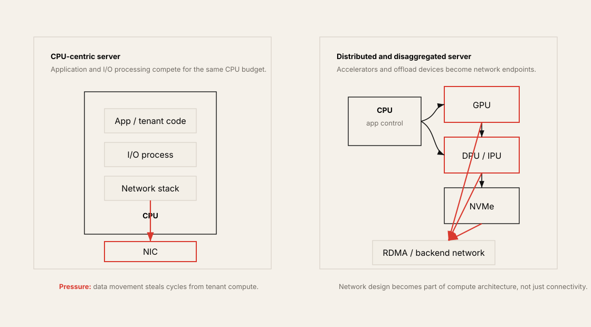
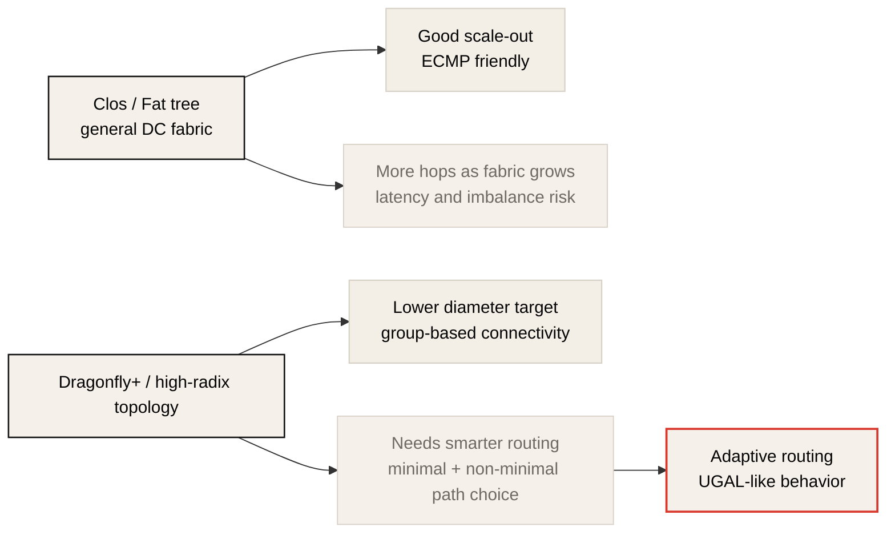

# The Present and Future of Cloud Data Center Networks

> Source: Masayuki Kobayashi, "The 'Present' and 'Future' of Cloud Data Center Networks", AI/ML/HPC Network Study Group, 2023-06-12.
> The original PDF is a non-published local reference; this document is a summary for the public site with added up-to-date context.

## One-Line Summary

Cloud-native web-scale networks have been optimized for handling many small TCP flows over commodity Ethernet/Clos/ECMP. However, AI/ML workloads require GPU-to-GPU synchronization, RDMA, collective communication, predictable bandwidth, and lossless congestion control, so they must be designed as a backend AI fabric separate from the ordinary frontend fabric.

## Why This Material Matters

The core of this talk is to find the cause of network evolution not in the network itself but in changes to computing and storage.

| Driver | Network pressure |
| --- | --- |
| Distributed machine learning | GPU collectives, all-to-all, shortening job completion time |
| Faster AI accelerators | the faster compute gets, the more expensive network stalls become |
| NVMe, SCM, PMEM | storage paths also bypass the CPU or extend onto the network |
| DPU/IPU | I/O, security, storage, and network functions move off the CPU |

Therefore, the AI data center network is no longer "plumbing that connects servers". As GPUs, NICs, DPUs, and NVMe devices become the main actors of the data path, network design becomes part of the compute architecture.

## From CPU-Centric to Distributed/Disaggregated

Traditional cloud data centers were fundamentally CPU-centric architectures. Applications, hypervisors, network stacks, and storage I/O processing ran on the CPU, and the NIC was close to a role of sending packets prepared by the CPU.

AI/ML and high-performance storage change this structure. The GPU becomes the main compute device for training/inference, the NIC accesses GPU memory directly via GPUDirect RDMA, and the DPU/IPU takes over network/security/storage offload. NVMe storage also becomes a disaggregated resource over the network.

The result of this change is clear.

- More of the CPU must be left for tenant applications.
- The network stack and storage I/O must not become a CPU bottleneck.
- GPUs/NICs/DPUs/NVMe devices participate directly in data movement.
- Frontend service traffic and backend AI/ML traffic change in nature.

## Web-Scale Fabric vs. AI/ML Scheduled Fabric

The talk describes the existing cloud-native DC network as a web-scale fabric. It is based on commodity Ethernet switches, Clos topology, IP-based ECMP, and bisection bandwidth utilization. Compute, storage, and control traffic mix in one fabric, and TCP absorbs some packet loss and reordering.

The AI/ML fabric is different. Many GPUs perform collective communication at synchronization points, and the slowest rank dominates the whole job completion time. A problem with a single flow amplifies into the cost of the entire job.

| Dimension | Web scale network | AI/ML network |
| --- | --- | --- |
| Flow shape | many small/medium heterogeneous flows | synchronized elephant flows, collective bursts |
| Transport tolerance | TCP absorbs loss/retransmission | RDMA is sensitive to loss and congestion |
| Main metric | aggregate service availability, average throughput | JCT, p99 collective latency, effective bandwidth |
| Load balancing | ECMP is often sufficient | flowlet/DLB/adaptive routing needed |
| Isolation | multi-tenant sharing centric | job/fabric isolation is important |
| Network role | general-purpose frontend fabric | scheduled backend compute fabric |

## RDMA and the Packet Loss Problem

On an ordinary IP network, a packet drop is recovered by TCP retransmission and congestion control. There is performance degradation, of course, but the application is usually restored as long as the connection is maintained.

RDMA is different. RDMA queues and the NIC offload path do not absorb loss as flexibly as the kernel TCP stack. In the case of RoCEv2, it provides RDMA over Ethernet, but it effectively requires PFC, ECN, and DCQCN tuning to build a lossless or near-lossless fabric.

The points the talk emphasizes are the following.

- RDMA retransmission depends on the hardware implementation.
- Go-Back-N-style retransmission can cause large performance degradation.
- RDMA is originally a communication method with a strong lossless-network assumption.
- In AI/ML collectives, loss and delay of one flow delay the entire job.

## Should Frontend and Backend Be Separated

One of the talk's strong claims is that RDMA networks and non-RDMA networks should be clearly separated. Build/operational cost goes up, but the trade-off is large.

If frontend web traffic, storage traffic, and AI/ML collective traffic all go into the same fabric, the following problems appear.

- The queue budget may not be sufficient.
- Lossless tuning conflicts with ordinary traffic.
- The congestion response of RDMA flows and TCP flows differs.
- An AI job becomes a noisy neighbor of ordinary service traffic, or is affected by it in return.
- It is hard to separate the fault domain and operational policy.

The talk's metaphor is that what is needed is not "an ordinary car and a highway" but "an F1 machine and a dedicated course". The metaphor may sound exaggerated, but it well describes the purpose of an AI training fabric. If the goal is to keep expensive GPUs fed, the backend network should prioritize predictability over general-purpose sharing.

## Rail-Optimized Topology and Rack Design Changes

Rail-optimized topology appears frequently in GPU clusters. It connects the same NIC/HCA rail to the same leaf switch so that the application or NCCL can predict traffic paths and easily select the optimal NIC.

The talk also explains that rack design changes. Because of power and cooling constraints, GPU server racks are occupied by GPUs and cooling equipment in large space. So instead of placing switches at the ToR (Top-of-Rack), it may be necessary to gather them in an EoR (End-of-Row) network rack and put patch panels in the server rack.

This perspective also matters in the latest AI data center designs.

- Rack power density goes up.
- The liquid cooling tipping point arrives.
- Copper/optics cable length and serviceability become part of the topology.
- The physical placement of network racks and compute racks affects latency, loss, and operability.

## InfiniBand vs. RoCEv2 Selection Criteria

The talk's distinction is still practically useful.

| Interconnect | Fit |
| --- | --- |
| InfiniBand | closed clusters, ultra-low latency, mature HPC/AI collective fabric, vendor-integrated management |
| RoCEv2 | reusing existing Ethernet assets, cloud multi-tenancy, IP/Ethernet operational model, scale-out flexibility |

However, as of 2026, this distinction needs updating. On the Ethernet side, it is evolving not into simple commodity Ethernet but into Ethernet for AI fabrics. NVIDIA Spectrum-X presents high effective bandwidth, performance isolation, SuperNIC, Spectrum switches, and telemetry/congestion features together as an Ethernet platform for AI clouds. UEC also aims to standardize an Ethernet-based AI/HPC communication stack.

Conversely, InfiniBand also emphasizes 800 Gb/s ports, SHARP v4, adaptive routing, telemetry-based congestion control, and performance isolation in generations like Quantum-X800. So the choice changes from "IB or Ethernet" to the following questions.

- What GPU scale and job size is the target?
- Is it a multi-tenant cloud or a dedicated training cluster?
- Can the operations team handle an IB fabric and the UFM/SHARP ecosystem?
- Must you preserve Ethernet assets, SONiC/Cumulus, and existing tooling?
- Can you verify congestion control and lossless tuning per workload?
- How do you view the trade-off between vendor lock-in and an open ecosystem?

## Limits of Clos and Dragonfly+/Adaptive Routing

Clos topology is a basic tool of data center networks. It is easy to scale bisection bandwidth and can use multiple paths with ECMP. It is a good choice for most cloud workloads.

But in very large HPC/GPU environments, hop count and latency, path imbalance, and synchronized collective traffic can become problems. The talk says that in such environments, Dragonfly+ topology and adaptive routing should be considered.

The talk's core question is "Is DLB, which reduces ECMP variance, sufficient?" It needs adaptive routing that uses minimal and non-minimal paths at the same time, and it proposes the direction of doing this autonomously and distributively in IP routing.

## 2026 Update

This talk is 2023 material. The direction is still valid, but the following trends must be read together.

| Area | 2026 update |
| --- | --- |
| AI Ethernet | Ethernet fabrics for AI workloads, like Spectrum-X, are productized |
| InfiniBand | The Quantum-X800/XDR family emphasizes 800G, SHARP v4, adaptive routing, and telemetry-based congestion control |
| Open Ethernet | The UEC Specification 1.0 was published in 2025, pushing standardization of the Ethernet stack for AI/HPC |
| Rack-scale systems | In the NVL72, GB200/GB300, and Rubin families, the rack becomes a compute/network/cooling product boundary |
| Co-packaged optics | Switch optics integration becomes more important because of power and cable density |

In other words, the talk's claim that "AI/ML networks now become a separate design target" has grown stronger. However, the detailed implementation is changing much faster than the 2023 RoCE/IB comparison.

## Design Checklist

| Question | Why it matters |
| --- | --- |
| Do you separate frontend and backend networks? | Reduces conflicts between RDMA/lossless tuning and ordinary service traffic. |
| Does the GPU/NIC rail topology match job placement? | Affects NCCL path selection and effective bandwidth. |
| Does the job need full bisection? | Oversubscription can break collective p99 and JCT. |
| Have you verified PFC/ECN/DCQCN parameters per workload? | In lossless Ethernet, configuration is performance. |
| Is there flowlet DLB or adaptive routing? | Reduces ECMP hash collisions and synchronized bursts. |
| Does rack power/cooling/cabling match the topology? | Network design cannot escape physical facility constraints. |
| Do you separate storage traffic and training traffic? | Checkpoints, dataset reads, and RDMA collectives can interfere with each other. |
| Can monitoring see flows, queues, ECN/PFC, and retransmissions? | Average bandwidth alone makes AI fabric problems hard to find. |

## Connections to This Repository

| Repository topic | Connection |
| --- | --- |
| Chapter 1: Wonders in the Workload | Explains the job completion time pressure AI workloads put on the network. |
| Chapter 3: Network Design Considerations | Connects to frontend/backend separation, rail topology, and dedicated backend fabric design. |
| Chapter 6: Effective Load Balancing | Directly connects to the discussion of ECMP limits, flowlet DLB, and adaptive routing. |
| Chapter 7: RoCEv2 Transport and Congestion Management | Background material explaining the need for PFC, ECN, and DCQCN tuning. |
| Chapter 8: IP Routing for AI/ML Fabrics | Connects to the Dragonfly+, minimal/non-minimal path, and adaptive routing issues. |
| Chapter 12: Ultra Ethernet Consortium | Connects to the latest trend of Ethernet absorbing AI/HPC fabric requirements. |
| AI Systems Performance Engineering Chapter 4 | Continues NCCL, RDMA, GPUDirect, and communication overlap from an infrastructure perspective. |

## References

| Resource | Link |
| --- | --- |
| NVIDIA Spectrum-X Ethernet Platform | <https://www.nvidia.com/en-us/networking/spectrumx/> |
| NVIDIA Quantum-X800 InfiniBand Platform | <https://www.nvidia.com/en-us/networking/products/infiniband/quantum-x800/> |
| Ultra Ethernet Consortium Specification 1.0 announcement | <https://ultraethernet.org/ultra-ethernet-consortium-uec-launches-specification-1-0-transforming-ethernet-for-ai-and-hpc-at-scale/> |
| UEC homepage | <https://ultraethernet.org/> |
| Meta: RoCE networks for distributed AI training at scale | <https://engineering.fb.com/2024/08/05/data-center-engineering/roce-network-distributed-ai-training-at-scale/> |
| NVIDIA DGX H100 user guide | <https://docs.nvidia.com/dgx/dgxh100-user-guide/introduction-to-dgxh100.html> |

## Follow-Up Questions

1. Is current AI/ML traffic separated between the frontend network and the backend RDMA network?
2. Are the GPU rail topology and scheduler placement connected to each other in a topology-aware way?
3. Does RoCEv2 lossless tuning have different profiles for general, HPC, and GPU workloads?
4. Is a training job's JCT regression analyzed together with network queues, ECN marks, PFC pauses, and retransmission counters?
5. Is the scale sufficient with Clos/ECMP, or is it a scale where Dragonfly+/adaptive routing should be reviewed?
