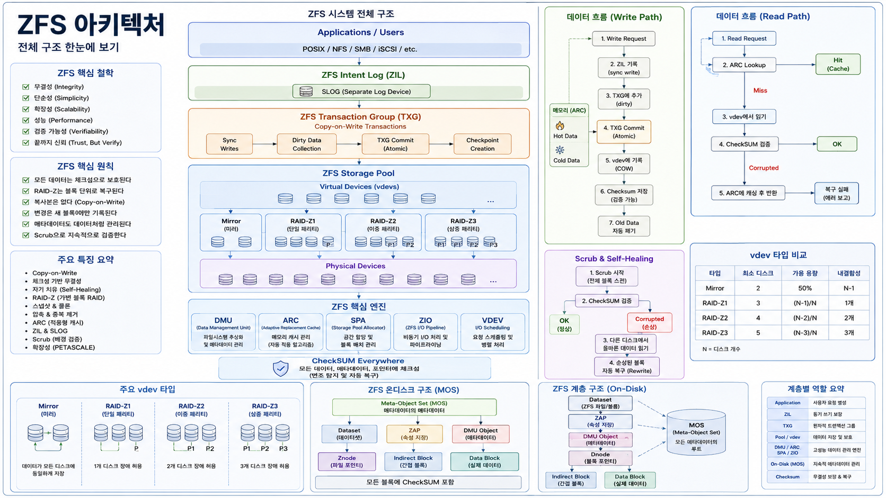
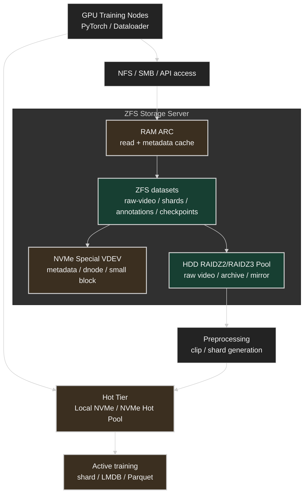
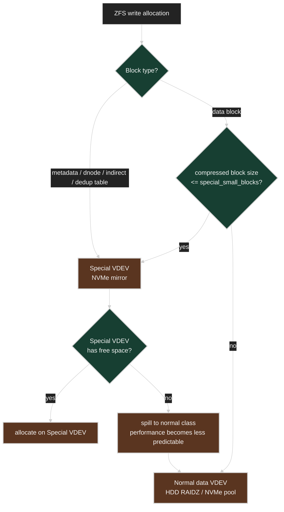
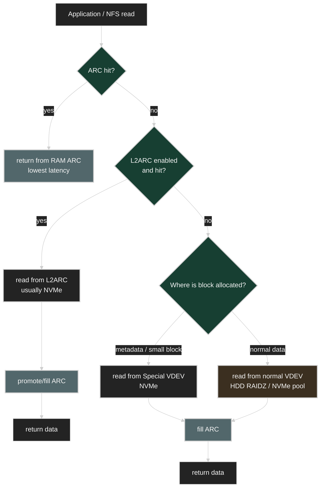
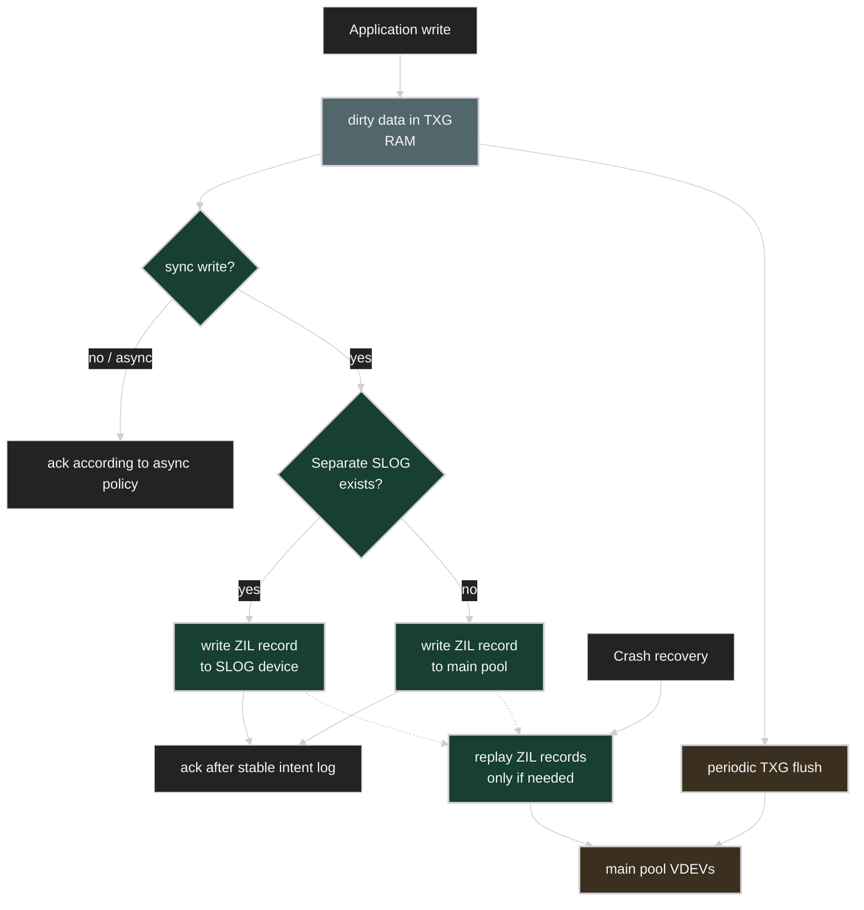
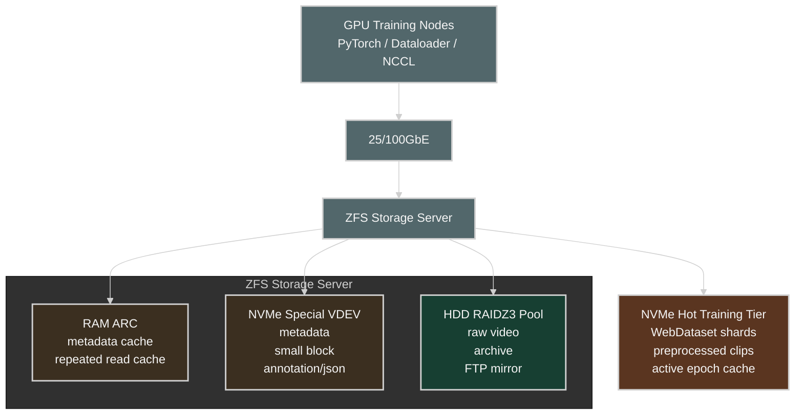
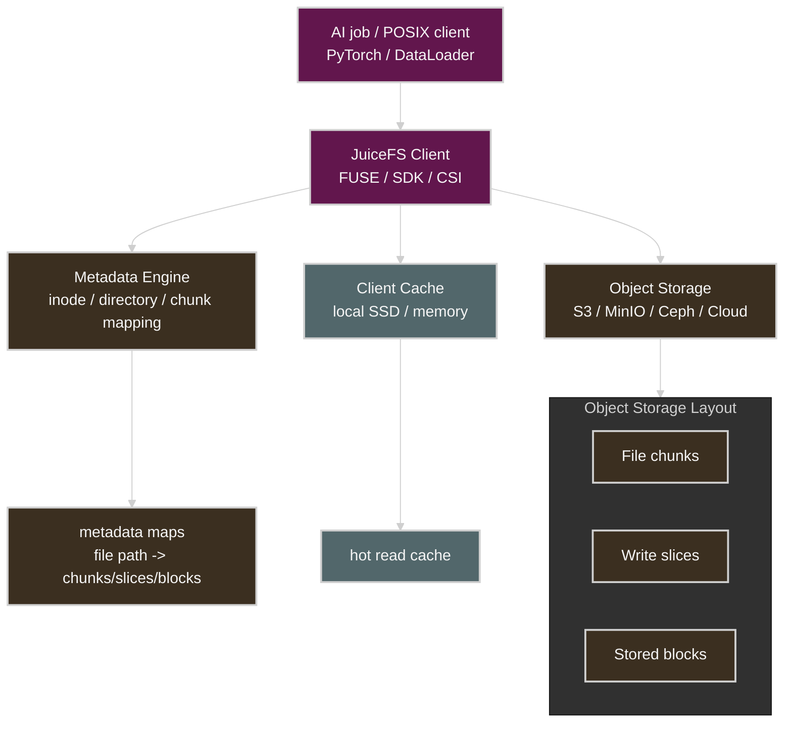

# ZFS Tuning Guide for AI Training Workloads

<p style="align-content: center;">

</p>

Design criteria for small-to-medium AI storage based on HDD + NVMe

> This document aims to help AI labs, university FTP/mirror operations teams, small-to-medium AI companies, and MLOps/Infra engineers judge how far HDD + NVMe + OpenZFS can carry AI training workloads when enterprise storage is hard to adopt directly, and to set the criteria for dataset formats, ZFS pool design, ARC/L2ARC/SLOG, and NFS operations.

Written as of: May 2026


## Table of Contents

- [Quick Decision Table](#quick-decision-table)

1. [Key Conclusions](#1-key-conclusions)
2. [I/O Characteristics of AI Training Workloads](#2-io-characteristics-of-ai-training-workloads)
3. [Storage Tier Comparison](#3-storage-tier-comparison)
4. [Comparing ASUSTOR/Synology NAS, QNAP, DIY ZFS, and Enterprise Storage](#4-comparing-asustorsynology-nas-qnap-diy-zfs-and-enterprise-storage)
5. [Why HDD Alone Is Not Enough for AI Workloads?](#5-why-hdd-alone-is-not-enough-for-ai-workloads)
6. [Why ZFS Has the Edge for AI Workloads](#6-why-zfs-has-the-edge-for-ai-workloads)
7. [Recommended Storage Architecture for AI Training](#7-recommended-storage-architecture-for-ai-training)
8. [Recommended Configurations by Scale](#8-recommended-configurations-by-scale)
   - [Small](#81-small)
   - [Medium](#82-medium)
   - [Large](#83-large)
9. [AI Dataset Format Strategy](#9-ai-dataset-format-strategy)
10. [ZFS Pool Design](#10-zfs-pool-design)
    - [HDD Capacity Pool](#101-hdd-capacity-pool)
    - [NVMe Special VDEV](#102-nvme-special-vdev)
    - [NVMe Hot Pool](#103-nvme-hot-pool)
11. [Dataset Design](#11-dataset-design)
12. [ARC Tuning](#12-arc-tuning)
13. [L2ARC Judgment](#13-l2arc-judgment)
14. [SLOG and Sync Settings](#14-slog-and-sync-settings)
15. [NFS / Network Design](#15-nfs--network-design)
16. [Recommended Training Pipeline Patterns](#16-recommended-training-pipeline-patterns)
17. [Monitoring](#17-monitoring)
18. [Failures and Operational Cautions](#18-failures-and-operational-cautions)
19. [Final Recommendations by Scale](#19-final-recommendations-by-scale)
20. [Final Architecture Example](#20-final-architecture-example)
21. [Appendix: JuiceFS Notes](#21-appendix-juicefs-notes)
22. [Conclusion](#22-conclusion)

<p style="align-content: center;">

</p>

## Quick Decision Table

| Situation | First choice | Core reason |
| --- | --- | --- |
| 1-2 GPUs, data in the tens of TB | NAS/QNAP/TrueNAS + local NVMe | operational simplicity; training runs on local NVMe |
| 2-8 GPUs, 100TB to hundreds of TB | HDD ZFS + NVMe Special VDEV | balance of capacity and metadata acceleration |
| millions of small files, dataloader stalls | sharding + local/NVMe hot tier | reduces metadata I/O and random reads |
| multiple teams / multi-GPU-node active training | consider an NVMe hot pool or a parallel FS | possible single ZFS/NFS head bottleneck |
| PB-class active datasets or center-scale operations | Lustre/GPFS/WEKA/Pure/ESS class | scale-out metadata/data path needed |
| already running an S3/MinIO/Ceph-based data lake | consider JuiceFS | exposes object storage as a POSIX/shared filesystem |

> [!TIP]
> This table is for initial judgment. The final choice must be decided by measuring the actual dataloader, GPU node count, NFS latency, metadata scans, and checkpoint write bursts.


## 1. Key Conclusions

From the perspective of AI training storage, the storage tiers can be viewed roughly in the following order.

```text
ordinary NAS
< HDD-based ZFS + NVMe Special VDEV
< NVMe-heavy ZFS
< GPFS / Lustre / WEKA / IBM ESS / Pure FlashBlade class
```

This classification matters because, in AI training workloads, the following elements are more important than simply "can store 200TB".

- sustained read performance where the GPU does not wait
- metadata performance handling a huge number of file open/stat calls
- small random read performance
- the ability to handle concurrent access from many training nodes
- handling of dataset scans / rsync / preprocessing / checkpoints
- data integrity and recoverability when a failure occurs

Ordinary NAS is operationally convenient, but its limits as active storage for AI training show up quickly.
OpenZFS, on the other hand, can compensate for HDD's weak metadata/random I/O with the RAM ARC and NVMe Special VDEV, making it a realistic middle ground for labs and small-to-medium companies.

However, there is an important premise.

```text
HDD ZFS is less a high-speed storage for AI training than a
low-cost capacity + metadata-accelerated storage that becomes usable
when combined with NVMe and dataset format optimization.
```

In other words, the most realistic structure is: **HDD for original/large-capacity storage**, **NVMe for hot data and metadata**, and **GPU training on local NVMe or an NVMe-heavy tier wherever possible**.

> [!TIP]
> The core judgment criterion of this document can be summarized as: "HDD is the capacity tier, NVMe is the metadata/hot tier, and training data is shards + NVMe."


## 2. I/O Characteristics of AI Training Workloads

AI training storage is different from an ordinary file server.

An ordinary NAS workload is roughly this.

```text
- opening documents
- file sharing
- backup
- video storage
- occasional downloads
```

An AI training workload, on the other hand, looks like this.

```text
- dataloader workers opening files concurrently
- stat on thousands to millions of files
- repeated dataset scans every epoch
- repeated reads of small images/labels/JSON
- random seeks over video clips
- bulk read/write by preprocessing jobs
- burst writes of checkpoints
- concurrent NFS access from several GPU servers
```

The bottleneck here is usually not raw disk capacity but occurs in the following order.

```text
1. metadata IOPS
2. small random reads
3. HDD seek latency
4. NFS server CPU
5. network bandwidth
6. directory traversal
7. Python dataloader parallelism
8. preprocessing decode CPU
```

So for AI storage, the following questions matter more than "how many TB".

```text
- How many files can it open per second?
- How many GB can it read continuously per second?
- Does latency hold up when several GPU nodes read at once?
- Is the metadata scan fast?
- Do checkpoint writes interfere with training reads?
```

> [!TIP]
> A storage benchmark that only looks at `fio` sequential throughput is not enough. Reproduce the `open/stat/read` pattern with the real dataloader, and at the same time watch `iostat -x`, `pidstat`, `nfsstat`, GPU utilization, and dataloader wait time. If "the disks are idle but the GPUs are resting," the bottleneck may be metadata latency, Python workers, decode CPU, or NFS server CPU rather than storage bandwidth.


## 3. Storage Tier Comparison

| Tier                              | Examples                                                    | Suitable use case                                             | Limit                   |
| ------------------------------- | ----------------------------------------------------- | -------------------------------------------------- | -------------------- |
| Ordinary NAS                          | some ASUSTOR/Synology/QNAP models                            | internal file sharing, backup, small research data                           | weak for AI training active I/O |
| ZFS NAS Appliance               | QNAP QuTS hero, TrueNAS Appliance                     | ZFS-based NAS, snapshots, integrity, small-to-medium research storage            | tied to product design and GUI policy    |
| DIY HDD ZFS + NVMe Special VDEV | Supermicro/ordinary server + HDD + NVMe + OpenZFS               | large AI datasets for labs/SMBs, FTP mirrors, NFS          | operator must design/handle failures directly  |
| NVMe-heavy ZFS                  | All-NVMe or NVMe mirror/RAIDZ                         | active training datasets, small-file-heavy workloads | higher cost, scale-out limits  |
| Parallel/enterprise storage                  | GPFS/IBM Storage Scale, Lustre, WEKA, Pure FlashBlade | large GPU clusters, HPC, institutional AI centers                        | high cost and operational difficulty        |

The ASUSTOR line is strong in Btrfs-snapshot-based management convenience, while QNAP QuTS hero, as a ZFS-based OS, emphasizes data integrity, SSD utilization, and HDD+SSD hybrid configurations. QNAP describes QuTS hero as a ZFS-based OS and touts HDD+SSD hybrid storage and data integrity as its main advantages. ([QNAP NAS][1])

The Pure FlashBlade, WEKA, and IBM Storage Scale lines are not ordinary NAS but high-performance file/object or parallel filesystems for AI/HPC. Pure describes FlashBlade as scale-out file/object storage, WEKA emphasizes a high-performance data platform for AI/ML/HPC pipelines, and IBM Storage Scale has the character of a parallel filesystem for large datasets and AI training/inference. ([purestorage.com][2])

> [!NOTE]
> What matters more than the product family name is real workload validation. Even two "10GbE NAS" units can differ greatly in AI training performance depending on CPU, RAM, filesystem, NFS implementation, SSD cache policy, and snapshot state. Before adoption, the safest path is a PoC with a representative dataset, the actual dataloader worker count, and the actual GPU node count.


## 4. Comparing ASUSTOR/Synology NAS, QNAP, DIY ZFS, and Enterprise Storage

The core judgment criteria are as follows.

```text
If centered on operational convenience, NAS.
If centered on data integrity and tuning, ZFS.
If GPU utilization must be sustained continuously, NVMe-heavy or a parallel filesystem.
```

| Item                 | ASUSTOR/Synology NAS | QNAP QuTS hero   | DIY OpenZFS          | Pure / WEKA / IBM / Lustre |
| ------------------ | --------------------- | ---------------- | -------------------- | -------------------------- |
| Operational difficulty             | low                    | medium               | medium~high                | high                         |
| Filesystem              | Btrfs/ext4 family         | ZFS              | OpenZFS              | dedicated/parallel/distributed FS                |
| AI active training | weak                    | limited capability           | possible depending on configuration            | strong                         |
| Metadata performance        | limited                   | can leverage SSD/ZFS features | direct optimization via Special VDEV | scale-out metadata structure      |
| Small file performance      | limited                   | varies by model           | improvable with an NVMe tier     | strong                         |
| Scalability                | bay/expansion unit limits            | product family limits           | scale-up centered          | scale-out                  |
| Cost                 | low~medium                 | medium               | medium                   | high                         |
| Suitable organization              | small team/ordinary internal           | SMB/lab         | lab/company with technical staff      | large research institute/HPC/AI center            |
| Core strength              | convenience                   | ZFS appliance    | tuning freedom/cost efficiency         | performance/scalability/support                  |
| Core weakness              | AI I/O limits             | vendor constraints            | operational responsibility                | cost                         |


> [!TIP]
> Even when choosing a NAS appliance, it is better to judge "convenience" and "performance" separately. GUI snapshots, user management, and SMB/NFS sharing are easier on a NAS, but if you separate the active training path onto local NVMe or a dedicated NVMe hot tier, the perceived performance is much more stable even on small equipment.

## 5. Why HDD Alone Is Not Enough for AI Workloads?

HDDs are still the cheapest per TB and are suitable for storing large video originals.
But in AI training, the HDD's weaknesses show up immediately.

What HDDs are good at:

```text
- large-capacity storage
- sequential reads of big files
- archive / cold data retention
- FTP mirror / raw video storage
```

What HDDs are weak at:

```text
- open/stat on a huge number of files
- small random reads
- random seeks
- directory traversal
- concurrent access from many workers
```

In video training, the difference by data format is also large.

### Cases where HDD is enough

```text
- reading large mp4/tar/parquet/webdataset shards sequentially
- preprocessing jobs centered on sequential reads
- staging in to local NVMe before active training
```

### Cases where the HDD becomes the bottleneck

```text
- millions of jpg/png frames
- many small JSON annotations
- ffmpeg random seeks over NFS
- several GPU nodes directly decoding original video concurrently
- scanning the whole directory tree every epoch
```

So to use HDD ZFS for AI training, design it treating the HDD as a **capacity tier** rather than a "high-speed tier for direct training".

> [!TIP]
> "Big files are fine on HDD" only holds when the access pattern is sequential. Even with mp4, if many workers random-seek to different offsets, HDD seeks accumulate. Conversely, even with big files like tar/WebDataset shards, if you split the shard range per worker well, the HDD and readahead behave much more predictably.


## 6. Why ZFS Has the Edge for AI Workloads

ZFS's advantage is not simply "RAID is good".
In AI workloads, the following features matter especially.

```text
- ARC: RAM-based read/metadata cache
- Special VDEV: separates metadata and some small blocks onto NVMe
- per-dataset recordsize tuning
- per-dataset compression/atime/sync policy separation
- snapshots/clones
- end-to-end checksums
- silent corruption detection via scrub
- combining an HDD capacity tier + an NVMe performance tier
```

OpenZFS's Special Allocation Class places metadata, indirect blocks, dedup tables, and so on in the special class by default, and the per-dataset `special_small_blocks` setting can also place small data blocks in the special class. ([OpenZFS][3])

This structure is very important in AI training storage.

```text
large video originals       → HDD RAIDZ2/RAIDZ3
metadata / inode       → NVMe Special VDEV
label / json / small   → NVMe Special VDEV
current training shard        → NVMe-only dataset or local NVMe
```

In other words, it is a structure that combines the capacity economics of the HDD with the metadata/random I/O performance of NVMe.

> [!WARNING]
> Snapshots and checksums do not replace backup. ZFS is strong at detecting silent corruption and rolling back, but it does not single-handedly resolve operator mistakes, whole-pool failures, ransomware, or a wrong `zfs destroy`. Important research data must be replicated to a separate pool, a separate server, or object storage.


## 7. Recommended Storage Architecture for AI Training

The most realistic structure is 3-tier.

```text
[Cold / Capacity Tier]
HDD RAIDZ2/RAIDZ3 ZFS
- original video
- old datasets
- FTP mirrors
- regenerable data
- long-term retention data

[Warm / Metadata + Small File Tier]
NVMe Special VDEV
- metadata
- inode/dnode
- directory lookups
- label/json
- small blocks
- thumbnails

[Hot / Active Training Tier]
Local NVMe or an NVMe-only ZFS dataset
- current training shards
- preprocessed clips
- WebDataset tar
- LMDB / Parquet / Arrow
- temporary cache
```

The structure diagrammed is as follows.



The operational flow is best set up like this.

```text
1. Store raw video on the HDD ZFS
2. Separate the annotation/metadata dataset so it benefits from the Special VDEV
3. Generate shards via preprocessing before training
4. Stage the current epoch/training set in to local NVMe or an NVMe-heavy tier
5. Store training results/checkpoints in a separate dataset
6. Move old checkpoints and raw data to the HDD tier
```

> [!TIP]
> Datasets should be split not only by performance tier but also by retention policy. Separating `raw-video`, `preprocessed`, `dataset-shards`, `checkpoints`, and `scratch` lets you apply different recordsize, snapshot retention, compression, and sync policies to each, and makes failure handling easier.


## 8. Recommended Configurations by Scale

### 8.1 Small

Target:

```text
- an individual researcher or a small lab/startup
- 1-2 GPU servers
- 1-8 GPUs in total
- datasets in the tens of TB
- 10GbE class
- no dedicated storage engineer
```

Recommended:

```text
- an ordinary NAS like ASUSTOR/Synology/QNAP is fine
- QNAP/TrueNAS or a simple ZFS server is fine
- active training uses the GPU server's local NVMe
- NAS/ZFS is used for raw data and backup storage
- small files on the training hot path should be sharded
```

Configuration example:

```text
GPU Server
  - Local NVMe 4-16TB
  - stores the hot training dataset

NAS/ZFS
  - HDD RAID6/RAIDZ2
  - raw video / backup / dataset archive
  - 10GbE
```

At this scale you do not need to go as far as a complex Special VDEV.
But if the file count is high or rsync scans are frequent, an NVMe Special VDEV can be felt.

> [!TIP]
> At small scale, the most effective optimization is often "copy to local NVMe before training". Keep the originals and archives on the NAS, and when a training job starts, stage in only the needed shards to local NVMe based on the manifest/checksum — good stability for the cost.


### 8.2 Medium

Target:

```text
- small-to-medium AI companies, large labs, FTP/package mirror operations teams
- 2-8 GPU servers
- 8-64 GPUs in total
- datasets of 100TB to hundreds of TB
- up to near 1PB if archive/mirror-centric
- 10/25GbE; consider 100GbE for multi-node training
- an MLOps/Infra owner exists
- multiple research teams or training jobs used concurrently
```

Recommended:

```text
- a DIY OpenZFS server is recommended
- HDD RAIDZ2/RAIDZ3 + NVMe Special VDEV
- 128-512GB RAM
- 25GbE or higher recommended
- stage active datasets in to NVMe
- consider a separate NVMe-only hot pool as the scale grows
- separate read-only mirror datasets from active training datasets
- WebDataset/Parquet/Arrow/LMDB recommended for the dataset format
- Prometheus/Grafana monitoring recommended
- a failure response runbook is needed
```

Configuration example:

```text
Storage Server
  - 16-72 HDDs
  - 2-6 RAIDZ3 vdevs
  - Enterprise NVMe Special VDEV 3-way mirror
  - 256GB+ RAM
  - 25/100GbE NIC
  - OpenZFS

GPU Nodes
  - Local NVMe cache
  - NFS mount
  - stage-in before the training job starts

NVMe Hot Pool
  - NVMe mirror or RAIDZ if needed
  - active training shards
  - preprocessing output
```

This scale is **the sweet spot of HDD + NVMe ZFS**.
Not to the point of buying IBM ESS or WEKA, but beyond what an ordinary NAS can carry.
However, if there are 8+ GPU servers, or many users attach at once like an FTP mirror, you must keep measuring the single ZFS head's CPU, metadata throughput, NFS throughput, and NIC utilization.

> [!IMPORTANT]
> The ceiling of the medium scale is determined by concurrency, not capacity. Even if you can operate an archive/mirror near 1PB on ZFS, if several GPU nodes run active training concurrently, the single ZFS/NFS head can become the bottleneck first.

> [!TIP]
> From the medium scale up, it is better to first decide "how slow is slow enough to count as an incident?" rather than "is it fast?". For example, if you set an internal SLO based on dataloader wait time, NFS p95 latency, Special VDEV utilization, checkpoint write time, and the performance drop during a scrub, you can judge the expansion point much earlier.


### 8.3 Large

Target:

```text
- department/center-class shared storage
- a large AI center or HPC-class environment
- dozens of GPU servers or more
- dozens to hundreds of GPUs in total
- PB-class active datasets or PB-class archive + high concurrency
- many users training concurrently
- large checkpoint burst writes
- hard to carry with a single NFS/ZFS head
```

Recommended:

```text
- use ZFS as the archive/capacity tier
- consider a parallel filesystem or scale-out storage for the active training path
- IBM Storage Scale / GPFS
- Lustre
- WEKA
- Pure FlashBlade
- VAST / DDN class
- object storage + high-performance cache layer
```

Transition criteria:

```text
- In the early large scale, multi-vdev ZFS + Special VDEV + an NVMe hot pool can carry a certain level.
- But if several GPU nodes run active training concurrently, the single ZFS/NFS head becomes the bottleneck.
- From that point, move to a parallel filesystem or scale-out storage rather than designing around a single ZFS/NFS head.
```

IBM Storage Scale provides concurrent data access and a large-scale parallel filesystem character, emphasizing high-performance access for AI training/simulation/large dataset processing. Lustre is a widely used open-source parallel filesystem in HPC environments, described as a high-performance shared filesystem for large Linux clusters. ([IBM][4])

At this stage it is safer not to assume a single OpenZFS server as the base.
ZFS can still be used as the archive/capacity tier, but a parallel filesystem is a better fit for the active training path.

> [!TIP]
> At large scale, separating the checkpoint path from the dataset read path matters. If dozens to hundreds of GPUs write checkpoints concurrently, the write bursts collide with the read-heavy training workload. Where possible, use a checkpoint-dedicated namespace, a separate pool, object storage, or a separate policy on the parallel FS.


## 9. AI Dataset Format Strategy

More important than ZFS tuning is the dataset format.

Structure to avoid:

```text
/dataset/
  video001/
    frame000001.jpg
    frame000002.jpg
    ...
    label000001.json
  video002/
    frame000001.jpg
    ...
```

This structure creates a large metadata I/O bottleneck.

> [!TIP]
> A metadata I/O bottleneck is usually closer to "too many tiny operations accumulate in latency and queues" than to "not enough disk bandwidth". At that point `iowait` rises on the server, and on the GPU servers the dataloader workers wait on file open/stat/read, making GPU utilization wobble.
>
> Attaching SSDs does not always fix it either. If small-file create/delete, metadata updates, and checkpoint writes are mixed, the SSD sees a mixed read/write workload, and internal GC, write amplification, SLC cache exhaustion, and spare area shortage can grow the tail latency. DRAM-less consumer SSDs and QLC SSDs can have larger performance variance in this situation, so for the metadata tier, enterprise NVMe with PLP, sufficient over-provisioning, and stable sustained write performance matter more. The TLC + DRAM + PLP combination is relatively predictable in this kind of mixed workload.
>
> There are software-level workarounds too. If parallel workers write small files concurrently, you can put a producer-consumer queue or ring buffer in place so each worker does not repeatedly write small files directly to the filesystem — batching the writes or having a shard writer bundle them sequentially. For example, instead of writing frames/labels straight out as millions of files, collect them in a memory or local NVMe ring buffer and flush in tar/WebDataset/Parquet/LMDB units, reducing metadata update counts and fsync pressure.
>
> However, a ring buffer is a cushion for backpressure and write coalescing, not a fundamental storage performance fix. Design it together with whether the data can be lost on failure, the flush period, checkpoint consistency, and the recovery procedure on restart.

Recommended structure:

```text
/dataset-shards/
  train-000000.tar
  train-000001.tar
  train-000002.tar
  ...
```

Or:

```text
/dataset/
  train.parquet
  train.arrow
  train.lmdb
```

For video training:

```text
/raw-video/
  original_video_001.mp4
  original_video_002.mp4

/preprocessed/
  clip-shard-000001.tar
  clip-shard-000002.tar
  frame-shard-000001.tar
```

Recommended formats:

| Data type     | Recommended format                                       |
| ---------- | ------------------------------------------- |
| many images     | WebDataset tar shards                        |
| video clips    | tar shards / chunked mp4 / preprocessed clips |
| annotations | Parquet / Arrow / SQLite / LMDB             |
| metadata   | Parquet / DB                                |
| checkpoints | big-file units, separate dataset                         |
| raw video  | HDD capacity pool                           |

The core principle is as follows.

> [!TIP]
> Do not train directly on millions of small files; bundle them into shards before training.

This is how you reduce the metadata bottleneck and random I/O load even on HDD ZFS.


## 10. ZFS Pool Design

### 10.1 HDD Capacity Pool

For AI video datasets, RAIDZ3 is safer than RAIDZ2.
Especially when using many 16TB+ HDDs, because the resilver time can grow long.

Example:

> [!WARNING]
> The command below is a structure example. On real hardware, verify the disk names, sector size, redundancy, spares, and backup state before running it.

The example below assumes 4K-sector HDDs.
On real hardware, check the physical sector and optimal I/O size with `lsblk -t` etc. before deciding `ashift`.

```bash
zpool create -o ashift=12 \
  -O compression=lz4 \
  -O atime=off \
  -O xattr=sa \
  -O dedup=off \
  ai-pool \
  raidz3 hdd1 hdd2 hdd3 hdd4 hdd5 hdd6 hdd7 hdd8 \
  raidz3 hdd9 hdd10 hdd11 hdd12 hdd13 hdd14 hdd15 hdd16
```

Recommended:

```text
- check the physical sector, then ashift=12; consider ashift=13 for 8Kn/some SSDs
- RAIDZ3 for a large HDD pool
- vdevs in units of 8-12 disks recommended
- 2+ vdevs for parallelism
- never use more than 80% of pool capacity
- keep dedup off unless there is clear justification
```

> [!TIP]
> RAIDZ vdev width is a trade-off between "capacity efficiency" and "failure recovery time". A too-wide vdev is efficient, but resilver and scrub times grow, and the response window shrinks when a second problem occurs during a failure. For a large pool, several vdevs of moderate width are more favorable for parallelism and operational stability than one huge vdev from the start.


### 10.2 NVMe Special VDEV

A Special VDEV is not a cache.
It is a real metadata/small block allocation class.
Pool metadata and, depending on configuration, small data blocks are actually placed on the Special VDEV.
So a Special VDEV failure can lead not to simple performance degradation but to whole-pool availability problems.

> [!IMPORTANT]
> A Special VDEV is not a "fast cache" but an actual storage component of the pool. Before adding one, verify backups, NVMe redundancy, PLP, capacity estimation, and the failure response procedure first.
> Also, adding a Special VDEV later does not automatically move existing blocks to NVMe, so the effect shows up mainly in new allocations.

Check before adding:

```text
- a full backup or recoverable originals secured
- enterprise NVMe with PLP used
- redundancy equal to or higher than the HDD pool
- estimated metadata + estimated small blocks + headroom calculated
- a way to monitor Special VDEV utilization and remaining capacity
- the effect scope on existing data and whether rewriting is needed
```

Recommended:

```bash
zpool add ai-pool special mirror nvme1 nvme2 nvme3
```

Minimum:

```bash
zpool add ai-pool special mirror nvme1 nvme2
```

Recommended principles:

```text
- use enterprise NVMe
- PLP support recommended
- 3-way mirror recommended
- no standalone consumer NVMe use
- Special VDEV capacity monitoring is mandatory
- if Special VDEV capacity runs short, performance becomes hard to predict
```

By default the Special VDEV holds metadata, and setting `special_small_blocks` also puts small data blocks there. According to the OpenZFS documentation, `special_small_blocks` places blocks at or below the specified size after compression/encryption in the special allocation class. ([OpenZFS][5])
If the special class fills up, allocations that should go there can spill into the normal class, so the `special_small_blocks` value should be set looking at NVMe capacity and failure headroom, not just the performance target.

The Special VDEV allocation path can be understood as follows.




### 10.3 NVMe Hot Pool

It is better to separate the active training dataset into a dedicated NVMe pool where possible.

Example:

```bash
zpool create -o ashift=12 \
  -O compression=lz4 \
  -O atime=off \
  -O dedup=off \
  nvme-hot \
  mirror nvmeA nvmeB \
  mirror nvmeC nvmeD
```

Uses:

```text
- current training shards
- preprocessing results
- temporary cache
- small-file-heavy datasets
```

This structure is often clearer than a Special VDEV.

```text
Special VDEV:
accelerates the HDD pool's metadata/small blocks

NVMe Hot Pool:
puts the training data on NVMe outright
```

If there is a lot of active training, the NVMe Hot Pool is more intuitive.

> [!TIP]
> The NVMe hot pool looks like a cache, but operationally it is better treated as "a separate storage tier with a short lifetime". If you do not define the eviction policy, maximum usage, cleanup after job completion, and regenerability, the hot pool fills up and training jobs fail instead.


## 11. Dataset Design

Recommended dataset structure:

```bash
zfs create ai-pool/raw-video
zfs create ai-pool/dataset-shards
zfs create ai-pool/annotations
zfs create ai-pool/checkpoints
zfs create ai-pool/mirror
zfs create nvme-hot/train-cache
zfs create nvme-hot/preprocessed
```

> [!TIP]
> Dataset names should reveal the data's nature and lifecycle. For example, names like `raw-*`, `shard-*`, `scratch-*`, `checkpoint-*` let you infer the snapshot, backup, and cleanup policies from the name alone, reducing mistakes even when the operator changes.

Property examples:

```bash
# original video: big-file centered
zfs set recordsize=1M ai-pool/raw-video
zfs set special_small_blocks=0 ai-pool/raw-video
zfs set dedup=off ai-pool/raw-video

# training shards: big sequential read centered
zfs set recordsize=1M ai-pool/dataset-shards
zfs set special_small_blocks=16K ai-pool/dataset-shards
zfs set dedup=off ai-pool/dataset-shards

# annotations: small file/metadata centered
zfs set recordsize=128K ai-pool/annotations
zfs set special_small_blocks=64K ai-pool/annotations
zfs set dedup=off ai-pool/annotations

# checkpoints: big files, important data
zfs set recordsize=1M ai-pool/checkpoints
zfs set sync=standard ai-pool/checkpoints
zfs set dedup=off ai-pool/checkpoints

# FTP/package mirror: regenerable data
zfs set recordsize=1M ai-pool/mirror
zfs set special_small_blocks=64K ai-pool/mirror
zfs set dedup=off ai-pool/mirror

# NVMe active training cache
zfs set recordsize=1M nvme-hot/train-cache
zfs set atime=off nvme-hot/train-cache
zfs set dedup=off nvme-hot/train-cache
```

recordsize should be tuned to the file access pattern. The Oracle ZFS documentation describes `recordsize` as the filesystem's suggested block size, which can help with databases doing fixed-size record access or specific access patterns on large files. ([Oracle Docs][6])

> [!NOTE]
> Changing `recordsize` does not automatically rewrite the block layout of existing files. The setting change applies mainly to data written afterwards. To change the layout of an already-loaded dataset, plan a separate rewrite procedure such as re-copying, send/receive, or rewriting.

For AI datasets, it is safer to keep dedup off by default.
Enabling dedup without clearly validated deduplication benefits increases the DDT and metadata burden, pressuring ARC, Special VDEV, and memory usage.
If deduplication is needed, measure the dedup ratio and memory usage on a separate test pool first.

> [!WARNING]
> On AI datasets, dedup is not a feature to enable as a default. Review it separately only when you have both a measurement showing the dedup ratio is high enough and memory headroom.

For AI, the following criteria are generally realistic.

| Dataset           |        recordsize | special_small_blocks |
| ----------------- | ----------------: | -------------------: |
| raw-video         |                1M |                    0 |
| WebDataset tar    |                1M |                0~16K |
| Parquet/Arrow     | test 1M or 128K-1M |                0-16K |
| annotation JSON   |              128K |              16K~64K |
| small image files |         128K~256K |              32K~64K |
| checkpoint        |                1M |                    0 |
| FTP mirror        |                1M |              16K~64K |


## 12. ARC Tuning

The ARC is the core of ZFS performance.

In AI workloads, the ARC helps with the following.

```text
- metadata cache for repeated epochs
- directory traversal cache
- small file read cache
- repeated dataloader access
- rsync scans
```

The read path of the ARC and L2ARC can be viewed as follows.



Recommended RAM:

| Scale                      |       RAM |
| ----------------------- | --------: |
| Small                     |  64-128GB |
| Medium                     | 128-512GB |
| Large metadata-heavy serving | 512GB or more |
| Metadata-heavy workload |   more is better |

If it is archive/capacity-only ZFS, the RAM requirement can be lower.
Conversely, if there is a lot of active NFS serving, massive file lookups, rsync scans, and Special VDEV use, it is better to provision more RAM for the same capacity.

Example:

```bash
# cap the ARC at 160GB on a 256GB-RAM server
cat >/etc/modprobe.d/zfs.conf <<'EOF'
options zfs zfs_arc_max=171798691840
EOF
```

Monitoring:

```bash
arc_summary
arcstat 1
```

Key metrics:

```text
- ARC hit ratio
- Metadata hit ratio
- Dnode cache hit
- ARC size / target size
- MFU/MRU ratio
```

In AI training, the **metadata hit ratio** and **whether the dataloader stalls** matter more than the overall hit ratio.

> [!NOTE]
> A bigger ARC is not always better. The NFS server, page cache, monitoring agents, backup jobs, and compression/checksum processing also use memory. If `zfs_arc_max` is set too aggressively, ZFS may look fine while the whole OS's latency wobbles, so watch memory pressure and swap usage under real load.


## 13. L2ARC Judgment

L2ARC is not a device you always add.

Cases where L2ARC helps:

```text
- the working set is larger than RAM
- the same dataset is trained on repeatedly
- random reads repeat
- there is headroom to use NVMe as a cache
```

Cases where it helps little:

```text
- read-once-and-discard sequential workloads
- you already stage in to local NVMe
- the Special VDEV already resolves the metadata bottleneck
- RAM is sufficient
```

Recommended judgment order:

```text
1st: add RAM
2nd: Special VDEV
3rd: shard the dataset
4th: stage in to local NVMe
5th: if repeated reads are still heavy, consider L2ARC
```

> [!TIP]
> L2ARC is closer to "an auxiliary cache for the reused read working set" than to "slow RAM". In sections with many cold reads, like the first epoch, the effect can be limited, and if the workload changes every time, the hit ratio stays low. Verify that the ARC/L2ARC hit ratio and dataloader wait time actually dropped before and after adoption.


## 14. SLOG and Sync Settings

The SLOG is not a device that speeds up all writes.
The SLOG affects synchronous writes.

The relationship between the SLOG and the ZIL is safest viewed as follows.



> [!IMPORTANT]
> The SLOG is not an ordinary write-back cache. It does not read the SLOG on the normal read path; it is closer to quickly and safely recording the intent log of sync writes and replaying it on failure recovery only when needed.

Cases where the SLOG matters in AI workloads:

```text
- NFS sync exports
- cases where checkpoints must be guaranteed with sync semantics
- DB/metadata services
- VM images
```

Cases where it matters little:

```text
- ordinary async bulk writes
- raw dataset copies
- rsync mirrors
- preprocessing output
```

`sync=disabled` requires great care.

> [!WARNING]
> `sync=disabled` increases the chance of losing recently written data on failure. Use it only in a limited way on datasets that can tolerate loss, such as regenerable data or a temporary cache.

Allowed:

```text
- regenerable FTP mirrors
- raw datasets that can be received again
- temporary preprocessing cache
```

Forbidden:

```text
- checkpoint originals
- the only research data
- DBs
- user upload originals
- the only copy of a backup
```

Example:

```bash
# use in a limited way only on a regenerable mirror dataset
zfs set sync=disabled ai-pool/mirror

# keep checkpoints conservative
zfs set sync=standard ai-pool/checkpoints
```

> [!TIP]
> For a good SLOG, low latency, PLP, and durability matter more than large capacity. The SLOG is not an ordinary write cache, so it does not make async bulk writes faster. Verify the effect only on workloads that actually have many synchronous writes, like NFS sync exports, VMs, and DBs.


## 15. NFS / Network Design

From the perspective of GPU active training storage, 1GbE is generally insufficient.
There may be exceptions for small tabular datasets, slow experiments, and management/backup traffic.

| Network       |   Theoretical bandwidth | Realistic judgment        |
| ---------- | -------: | ------------- |
| 1GbE       |  125MB/s | generally unsuitable for active training |
| 10GbE      | 1.25GB/s | the minimum bar         |
| 25GbE      |  3.1GB/s | recommended for small-to-medium GPU servers |
| 100GbE     | 12.5GB/s | recommended for multiple GPU nodes  |
| 200/400GbE | high-performance clusters | consider a parallel FS      |

On a single ZFS head, a fast NIC alone does not solve it.

```text
- if the HDD vdev throughput is insufficient, NIC bandwidth goes unused
- if the NFS server CPU is the bottleneck, disk utilization stays low
- if the dataloader is slow, GPU utilization drops
- without an NVMe tier in a random small-file workload, HDD latency spikes
```

Recommended:

```text
- at least 10GbE
- 25GbE for 2-4+ GPU servers
- consider 100GbE for 8+
- test NFS mount options and nconnect
- actively stage in to local NVMe before training
```

The effect and support range of `nconnect` vary by NFS client, kernel, NFS version, and NAS/server implementation.
When mounting multiple mounts to the same endpoint, the connection settings of the first mount can have an effect, so before operational adoption you must measure throughput, latency, and CPU utilization together on the same client/server combination.

> [!TIP]
> Do not look at network bandwidth alone; you must view GPU utilization, dataloader wait time, NFS latency, and zpool iostat on the same time axis to judge the bottleneck location properly.

> [!NOTE]
> Jumbo frames only make sense when the MTU matches end-to-end. If the MTU does not match on any of the switch, NIC, bond, VLAN, storage server, or GPU node, packet drops or fragmentation can actually worsen latency. When changing the MTU, run `ping -M do -s ...`, `iperf3`, and NFS read/write tests together.


## 16. Recommended Training Pipeline Patterns

Not recommended:

```text
GPU training job
  → directly reading millions of jpg/json on NFS
  → HDD random I/O
  → GPU starvation
```

Recommended:

```text
Raw data on HDD ZFS
  → preprocessing
  → WebDataset/Parquet/Arrow/LMDB shards
  → NVMe hot pool or local NVMe stage-in
  → training
  → checkpoint/results write-back
```

Concrete flow:

```text
1. Store originals in ai-pool/raw-video
2. A preprocessing job generates clips/shards
3. Copy to nvme-hot/train-cache or the GPU node's local NVMe
4. Training runs on NVMe
5. Checkpoints are stored in ai-pool/checkpoints
6. Final results and metadata are archived to ai-pool
```

This reduces the share of direct random I/O that the HDD ZFS handles on the active training path.

> [!TIP]
> When creating shards, use the atomic publish pattern. For example, write `train-000123.tar.tmp` and rename it to `train-000123.tar` after checksum/manifest verification completes, reducing the chance of a training job reading a half-written shard. Leave the shard name, sample count, checksum, generating code version, and source dataset version together in the manifest.


## 17. Monitoring

Essential monitoring:

```bash
zpool status -x
zpool iostat -v 1
arcstat 1
arc_summary
zfs list -o name,used,avail,refer,compressratio
zpool list -o name,size,allocated,free,frag,capacity
```

Things to check:

```text
- GPU utilization
- dataloader wait time
- NFS latency
- per-vdev bottlenecks in zpool iostat
- Special VDEV utilization
- ARC metadata hit ratio
- HDD iowait
- network throughput
- checkpoint write bursts
- fragmentation
```

When performance degrades, it is practical to check in the following order.

```text
1. Confirm whether GPU utilization actually dropped
2. Check dataloader wait time / batch loading time
3. Check NFS latency, nfsd CPU, and mount options
4. Check the ARC metadata hit ratio and dnode cache hits
5. Check HDD vdev, Special VDEV, and NVMe hot pool bottlenecks with zpool iostat -v
6. Check network throughput, packet errors, and MTU mismatch
7. Check whether checkpoint write bursts and preprocessing jobs interfere with training reads
8. Check whether the dataset layout is small-file-heavy or a shard/manifest structure
```

> [!TIP]
> Following this order lets you quickly narrow the "storage is slow" symptom down to which layer — GPU, dataloader, NFS, ARC, vdev, network, or dataset format — the problem is in.

Recommended exporters for a Prometheus/Grafana setup:

```text
- node_exporter
- zfs_exporter
- nvidia_dcgm_exporter
- nfsd metrics
- blackbox_exporter
```

The core dashboard must not look at "storage" alone.
You must view **GPU utilization + dataloader time + storage latency** together.

> [!TIP]
> It is useful to put one synthetic canary job on the operations dashboard. Periodically running shard reads, metadata scans, and checkpoint writes similar to real training lets you detect "slower than usual" before user complaints arrive.

> [!TIP]
> For failure analysis, it is good to leave the job ID, dataset version, mount target, GPU node, storage pool, and checkpoint path in the logs. Storage metrics alone make it hard to connect which training job read which dataset.


## 18. Failures and Operational Cautions

A Special VDEV is not a cache.
So it must have redundancy.

```text
Forbidden:
- a single consumer NVMe special vdev
- an SSD SLOG without PLP
- sync=disabled without a backup
- unjustified dedup enablement
- a ZFS pool more than 90% full
- unlimited snapshot accumulation
```

Recommended:

```text
- 3-way mirror for the Special VDEV
- backup and capacity estimation before adding a Special VDEV
- a monthly scrub
- SMART monitoring
- UPS
- spare disks ready
- zpool status alerts
- a snapshot retention policy
- a failure response runbook
```

For a large HDD pool, a monthly scrub or one every 4-6 weeks is more realistic than a daily scrub.
It is better to run it during low service load.

> [!WARNING]
> The bar for backups and failure response is not "it exists" but "it has been restored". Run restore drills regularly against a representative dataset, checkpoints, and the metadata DB, and document the recovery time and procedure.

> [!TIP]
> Snapshot retention should differ per dataset. Keep raw data long, scratch/cache short, and checkpoints for the experiment reproduction period. If snapshots accumulate without limit, deleted files keep holding space, growing the pool capacity and fragmentation problems.


## 19. Final Recommendations by Scale

| Scale  | Recommended storage                                                | Core strategy                                          |
| --- | ------------------------------------------------------ | ---------------------------------------------- |
| Small | NAS/QNAP/TrueNAS or simple ZFS + local NVMe              | training on local NVMe; NAS/ZFS for raw data and backup          |
| Medium | HDD ZFS + NVMe Special VDEV + an NVMe hot pool if needed       | capacity + metadata acceleration, shard/stage-in, monitoring |
| Large | ZFS archive + scale-out class like Lustre/GPFS/WEKA/Pure/ESS | separate the active training path, parallel FS / scale-out     |

> [!TIP]
> The final choice must be decided including "who will respond to the next failure", not just "the performance needed now". DIY ZFS is cost-efficient but the operational responsibility is internal; enterprise storage is expensive but has support and a failure escalation system.


## 20. Final Architecture Example



> [!TIP]
> The diagram above is a logical architecture. In an actual deployment, the management network, backup path, monitoring path, out-of-band management network, UPS/PDU, and rack-level failure domains must be designed separately.


## 21. Appendix: JuiceFS Notes

JuiceFS is a distributed filesystem class that provides a POSIX-compatible filesystem on top of object storage.
According to the official documentation, JuiceFS consists of a client, a metadata engine, and data storage: file data is stored in object storage and metadata is stored in a separate metadata engine. The Community Edition can use metadata engines such as Redis, MySQL/MariaDB, PostgreSQL, TiKV, and SQLite, and the Cloud/Enterprise class provides a separate metadata service. ([JuiceFS][11])

Compared with ZFS, the role is different.

```text
ZFS:
- strong on a single server or scale-up storage
- centered on local disks, NVMe, HDD pools, checksums, snapshots, and the ARC
- suitable for raw datasets / archives / lab-scale NAS

JuiceFS:
- object storage + metadata engine based
- offers access methods such as POSIX mount, Kubernetes CSI, and a Hadoop/S3 gateway
- a structure that leverages object storage's capacity scalability and the client cache
```

Cases where JuiceFS may fit, from the perspective of AI workloads:

```text
- already operating object storage like S3/MinIO/Ceph
- a shared filesystem is needed for Kubernetes-based training jobs
- datasets must be shared across multiple nodes/regions/clusters
- cold/warm datasets sit in object storage and are supplemented with a client cache
- HDFS/S3/POSIX access must be provided together
```

Cautions:

```text
- metadata engine latency and stability directly affect overall performance
- object storage PUT/GET latency, request cost, and rate limits must be considered
- it looks like POSIX, but do not expect the same latency as a local NVMe filesystem
- in small-file-heavy active training, the metadata engine and client cache design matter
- checkpoint burst writes can load both the object storage and the metadata engine
```

JuiceFS's file storage structure uses the concepts of chunk, slice, and block.
According to the official documentation, a file is divided into chunks, a write creates a slice, and it is stored in the object storage in block units. In other words, the user accesses it like a POSIX file, but internally the metadata engine manages the file name, inode, and chunk/slice mapping, while the object storage keeps the actual data blocks. ([JuiceFS Architecture][12])



> [!TIP]
> JuiceFS is more accurately seen as a layer for using object storage like a POSIX filesystem, rather than a replacement for the ZFS Special VDEV. ZFS's core is "local-disk-based pool design", while JuiceFS's core is "object storage + metadata service + client cache design".

> [!IMPORTANT]
> When putting JuiceFS on the AI active training path, you must measure metadata latency, cache hit ratio, object storage request latency, and checkpoint write bursts with the real dataloader. The fact that object storage capacity is sufficient alone does not guarantee GPU feeding performance.

A realistic combination is as follows.

```text
ZFS:
- raw data ingest
- local archive
- FTP/package mirror
- NVMe hot pool
- primary storage for labs/SMBs

JuiceFS:
- object-storage-based shared datasets
- Kubernetes/Ray/Hadoop-class workloads
- warm datasets accessed from multiple clusters
- a layer exposing cloud/on-prem object storage as POSIX
```

So while maintaining this document's basic strategy, if you already have an S3/MinIO/Ceph-based data lake or a Kubernetes-centered training environment, you can consider JuiceFS as a separate shared filesystem candidate.


## 22. Conclusion

From the perspective of AI training workloads, an ordinary NAS is usable as a "repository" but hard to see as "high-speed storage for training".
HDD-based OpenZFS becomes a very realistic alternative for labs/SMBs when combined with an NVMe Special VDEV, a sufficient ARC, dataset separation, a shard-based data format, and local NVMe stage-in.

The most important design principle is the following.

```text
HDD is the capacity tier.
NVMe is the metadata/hot tier.
RAM is the ARC.
Train on shards + NVMe where possible.
Large-scale scale-out goes to the GPFS/Lustre/WEKA/IBM/Pure class.
```

So the practical choices can be summarized as follows.

```text
Small:
NAS/QNAP/TrueNAS or simple ZFS + local NVMe

Medium:
HDD RAIDZ3 + NVMe Special VDEV + large ARC + NVMe stage-in

Large:
ZFS archive/capacity tier + IBM Storage Scale / Lustre / WEKA / Pure FlashBlade / ESS class
```

In one sentence:

**For labs/SMBs that cannot buy IBM ESS or WEKA, the most realistic AI storage strategy is "use HDD ZFS as the original repository, attach NVMe as the metadata/hot tier, and shard the training data so it is read from NVMe".**


## References

* OpenZFS Special Allocation Class: a structure that places metadata and small blocks in the special class. ([OpenZFS][3])
* QNAP QuTS hero: a ZFS-based NAS OS, HDD+SSD hybrid storage, emphasizing data integrity. ([QNAP NAS][1])
* ASUSTOR Snapshot Center: Btrfs-snapshot-based NAS features. ([ASUSTOR NAS][7])
* Pure FlashBlade: scale-out file/object storage and unstructured data storage for AI/HPC/analytics. ([purestorage.com][2])
* WEKA AI/ML Data Platform: a high-performance data platform for AI/ML/HPC pipelines. ([WEKA][8])
* IBM Storage Scale: high-performance storage for large datasets, AI training/inference, with a parallel filesystem character. ([IBM][9])
* Lustre: an open-source parallel filesystem for large HPC Linux clusters. ([Lustre][10])
* JuiceFS: a POSIX-compatible distributed filesystem that separates object storage from the metadata engine. ([JuiceFS][11], [JuiceFS Architecture][12])

[1]: https://www.qnap.com/en/operating-system/quts-hero "the preferred choice for highly reliable ZFS storage solutions"
[2]: https://www.purestorage.com/au/products/unstructured-data-storage.html "Unstructured Data Storage - FlashBlade"
[3]: https://openzfs.github.io/openzfs-docs/man/master/7/zpoolconcepts.7.html "zpoolconcepts.7"
[4]: https://www.ibm.com/products/storage-scale "IBM Storage Scale"
[5]: https://openzfs.github.io/openzfs-docs/man/master/7/zfsprops.7.html "zfsprops.7"
[6]: https://docs.oracle.com/en/operating-systems/solaris/oracle-solaris/11.4/manage-zfs/recordsize-property.html "The recordsize Property"
[7]: https://www.asustor.com/admv2?lan=kor&sub=144&subject=9&type=2 "ASUSTOR NAS - Snapshot Center"
[8]: https://www.weka.io/solutions/ai-machine-learning/ "Data Platform for AI, Machine Learning, & Deep Learning"
[9]: https://www.ibm.com/products/storage-scale-system "IBM Storage Scale System"
[10]: https://www.lustre.org/ "Lustre"
[11]: https://juicefs.com/docs/community/introduction/ "Introduction to JuiceFS"
[12]: https://juicefs.com/docs/community/architecture "JuiceFS Architecture"
