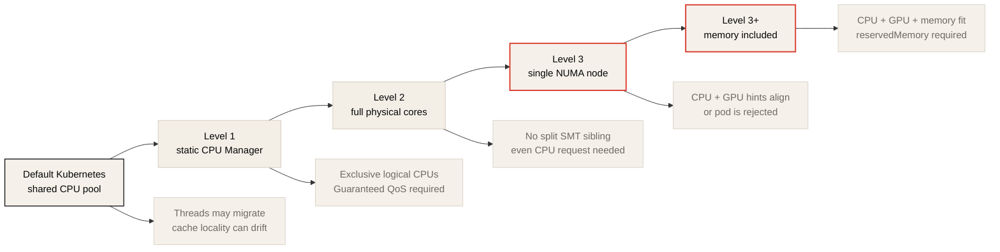
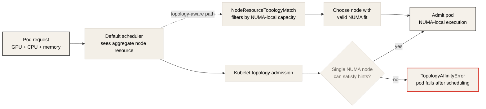

# Keeping GPU Workloads NUMA-Local in Kubernetes

> Summary notes for Ronak Nathani, "Keeping GPU Workloads NUMA-Local in Kubernetes".
> Original: <https://ronaknathani.com/blog/2026/05/keeping-gpu-workloads-numa-local-in-kubernetes/>

## One-Line Summary

If the CPU sits on the data path to the GPU in a GPU workload — request preparation, batching, dataloader, pinned memory staging — then Kubernetes' default resource scheduling is not enough. Kubelet policy, topology-aware scheduling, and workload sizing must be designed together so that CPU, GPU, and memory land in the same NUMA domain.

## Where This Article Sits

This article focuses less on the theory of NUMA architecture and more on operational methods for actually enforcing NUMA locality in Kubernetes. The core questions are the following.

- Are the GPU and CPU on the same NUMA node?
- Is the CPU request in a form that can receive exclusive CPU allocation?
- Does the GPU device plugin provide NUMA topology hints?
- When a pod does not fit in one NUMA node, does it quietly get slower, or does it fail at admission?
- Does the scheduler place pods by looking at per-NUMA-node remaining resources rather than node aggregate resources?

These questions apply to both inference and training. In inference they show up as p99 tail latency; in training as dataloader wait time, H2D copy time, and step time variance.

## NUMA and the GPU Data Path

NUMA is a structure where access latency and bandwidth vary depending on which memory a CPU core accesses. In a 2-socket server each socket has local memory, and accessing the other socket's memory requires crossing the socket interconnect. On AMD EPYC, a single socket can be further split into multiple NUMA nodes depending on the BIOS NPS (Nodes Per Socket) setting.

What matters for GPU workloads is that PCIe devices are also physically attached to a specific CPU socket or root complex. When a GPU reads host memory via DMA, the path is close to local if that memory is on a NUMA node near the GPU, but it crosses the interconnect if it is on another socket's memory.

```text
Good path:
CPU cores + host memory on NUMA 0
GPU attached to NUMA 0
H2D / DMA stays local

Bad path:
CPU cores or host memory on NUMA 1
GPU attached to NUMA 0
H2D / DMA crosses socket interconnect
```


The original describes an inference workload where pods whose CPU spanned two sockets had 30%+ higher p99 tail latency under load than pods that stayed within a single socket. Kubernetes does not surface this automatically. The pod is Running and passes health checks, but it processes the same traffic more slowly.

Training has the same principle. If remote memory access and inter-socket bandwidth contention occur while data loader workers build batches on the CPU and hand them to the GPU, the GPU feeding cadence becomes unstable. The PyTorch performance tuning guide also recommends binding the training process to a single NUMA node.

## Kubernetes CPU Isolation Levels

The original describes CPU isolation and NUMA alignment in Kubernetes as strengthening in stages. Each stage provides stronger performance isolation but also adds workload sizing constraints and failure modes.

| Level | Setting | What it gives | Main requirement |
| --- | --- | --- | --- |
| 1 | `cpuManagerPolicy: static` | exclusive logical CPU pinning | Guaranteed QoS, integer CPU request |
| 2 | `cpuManagerPolicyOptions: full-pcpus-only=true` | allocation at physical core granularity | CPU request that is a multiple of the SMT thread count |
| 3 | `topologyManagerPolicy: single-numa-node` | align CPU/device/hugepage topology hints to a single NUMA node | critical resources must fit in one NUMA node |
| 3+ | `memoryManagerPolicy: Static` | memory requests also included in topology admission | `reservedMemory`, per-NUMA memory capacity planning |



## Level 1: `cpuManagerPolicy: static`

By Kubernetes default, the OS scheduler freely migrates container processes across the available CPUs. This can be efficient from a total CPU utilization standpoint, but it works against cache affinity and latency consistency.

```yaml
cpuManagerPolicy: static
```

With the `static` policy enabled, containers in Guaranteed QoS pods that have an integer CPU request can receive exclusive logical CPUs. The kubelet restricts the container's cpuset cgroup so that its processes only run within the assigned CPU list.

The requirements are the following.

| Requirement | Notes |
| --- | --- |
| `requests == limits` | every container must satisfy the Guaranteed QoS condition |
| integer CPU request | fractional CPUs like `5.5` are not eligible for exclusive CPUs |
| check init containers and sidecars | pod QoS is not determined by the main container alone |
| account for OS reserved CPUs separately | host daemons and kernel threads must not interfere with pinned CPUs |

This stage alone can reduce thread migration and inter-container CPU contention, improving performance consistency. However, logical CPU pinning alone does not guarantee isolation at the physical core level.

## Level 2: `full-pcpus-only`

On a system with SMT enabled, one physical core usually appears as two logical cores. If two containers each take one sibling hyperthread of the same physical core, they share the L1/L2 cache and execution resources.

```yaml
cpuManagerPolicyOptions:
  full-pcpus-only: "true"
```

`full-pcpus-only=true` gives containers whole physical cores rather than fragments of logical cores. In other words, the SMT siblings of a physical core go to the same container.

There is a price. Containers receiving exclusive CPUs must request CPUs in multiples of the SMT thread count. With common 2-way SMT, an even CPU request such as 2, 4, 6 is needed. A pinned container with an odd CPU request can fail with an `SMTAlignmentError`.

Operationally, the CPU requests of existing workloads should be audited before enabling this option.

## Level 3: `single-numa-node`

`cpuManagerPolicy: static` and `full-pcpus-only` provide CPU pinning and physical core isolation, but they do not guarantee that all CPUs come from the same NUMA node. The kubelet CPU Manager's default packed allocation tries to place CPUs as NUMA-locally as possible, but if node fragmentation occurs, one container's CPUs can span multiple NUMA nodes.

```yaml
topologyManagerPolicy: single-numa-node
```

The Topology Manager collects topology hints from components such as the CPU Manager, Device Manager, and Memory Manager and checks whether the resource allocation can be satisfied within the same NUMA node. Under `single-numa-node`, if no single NUMA node can satisfy the required hinted resources, pod admission is rejected.

There are important caveats.

| Caveat | Meaning |
| --- | --- |
| GPU plugin topology hint required | a device plugin such as the NVIDIA device plugin must provide NUMA `TopologyInfo` for CPU-GPU locality to be enforced |
| scope selection required | `container` scope aligns per container, `pod` scope aligns the pod's entire effective request |
| sidecar caution | binding logging/metrics sidecars into the pod scope can make admission unnecessarily harder |
| memory is separate | guaranteeing memory as well requires `memoryManagerPolicy: Static` |

## Why Enable the Memory Manager Too

Even if the CPU and GPU are on the same NUMA node, if host memory allocation lands on a remote NUMA node the DMA path can become longer. So for strong NUMA alignment, memory requests must also be included in topology admission.

```yaml
memoryManagerPolicy: Static
```

To use this setting, the kubelet's `reservedMemory` must also be configured. In addition, the workload's memory request must fit inside the target NUMA node. Otherwise, even with the CPU and GPU aligned, admission can fail because of memory, or locality can break at actual runtime.

## Minimal Kubelet Configuration

If you operate a separate NUMA-aligned GPU node pool, the original presents a kubelet configuration of the following family.

```yaml
cpuManagerPolicy: static
cpuManagerPolicyOptions:
  full-pcpus-only: "true"
topologyManagerPolicy: single-numa-node
# Default is container. Use pod only when the whole pod should fit on one NUMA node.
# topologyManagerScope: pod
memoryManagerPolicy: Static
# memoryManagerPolicy: Static requires reservedMemory to be configured.
```

When changing the CPU Manager or Memory Manager policy, apply it on a drained node. In some cases the CPU/memory manager state files must be removed before restarting the kubelet. Enabling it directly on a live mixed-workload node can collide with existing pod sizing.

## The Quiet Performance Degradation Kubelet CPU Allocation Creates

The packed allocation of `cpuManagerPolicy: static` is a generally good direction. The kubelet takes CPUs in the order of full NUMA node, full physical core, and individual logical core, and tries to fill the most heavily used NUMA node first to reduce fragmentation.

But "local if possible" is not a guarantee.

For example, suppose there is a 2-socket machine with 48 physical cores per socket, 96 vCPUs including SMT. After reservations, assume each NUMA node has 90 allocatable vCPUs and 4 GPUs. If one pod requests 1 GPU and 22 vCPUs, the first 4 pods fit NUMA 0 nicely.

```text
4 pods x 22 vCPU = 88 vCPU
NUMA 0 remaining = 2 vCPU
```

When the 5th pod requests 22 vCPUs, only 2 vCPUs remain on NUMA 0. Without `single-numa-node`, the CPU Manager can take 2 vCPUs from NUMA 0 and the remaining 20 vCPUs from NUMA 1. The pod runs normally, but its CPUs span the NUMA boundary.

This is the most dangerous failure mode. The pod does not fail. Kubernetes events do not report the performance degradation either. Users discover the problem only after seeing p99 latency or throughput variance.

## Failure Mode 1: `SMTAlignmentError`

With `full-pcpus-only=true`, if a container receiving exclusive CPUs has a CPU request that is not a multiple of the SMT thread count, the kubelet rejects the pod.

For example, in a 2-way SMT environment, if a pinned container requests 3 CPUs, a whole physical core cannot be given. In this case an `SMTAlignmentError` occurs. Even if the Deployment or StatefulSet controller recreates the pod, it keeps failing for the same reason on the same node pool.

The response is simple but requires preparation in advance.

- Adjust the pinned container's CPU request to an even number.
- Check that sidecar and init container request/limits do not break the pod QoS.
- Create a separate node pool with `full-pcpus-only` enabled.

## Failure Mode 2: `TopologyAffinityError`

With `topologyManagerPolicy: single-numa-node`, the kubelet collects CPU, device, and memory topology hints and checks whether they can be satisfied on a single NUMA node. If not, the pod fails at admission with a `TopologyAffinityError`.

This failure is confusing at first. The node's aggregate resources can look sufficient.

```text
Node free CPU = 60 vCPU
NUMA 0 free = 20 vCPU
NUMA 1 free = 40 vCPU
Pod request = 48 vCPU
```

In total it looks like there are 60 vCPUs, but no single NUMA node can provide 48 vCPUs. Under `single-numa-node`, refusing such a pod is correct. For latency-sensitive GPU services, failing explicitly is better than quietly getting slower.

## Why Topology-aware Scheduling Is Needed

The default Kubernetes scheduler schedules by looking at the node's aggregate resources. It does not know the remaining CPU, memory, and GPU locality per NUMA node. As a result, the scheduler can send a pod to a node where the kubelet then rejects it at topology admission.

To close this gap, topology-aware scheduling is needed.



| Component | Role |
| --- | --- |
| `NodeResourceTopology` CRD | expresses per-node NUMA resource information as a cluster object |
| NFD Topology Updater | inspects the kubelet PodResources API and updates available resources per NUMA node |
| `NodeResourceTopologyMatch` scheduler plugin | the scheduler filters/scores nodes taking topology constraints into account |

With this setup, the scheduler can pre-filter nodes that "have enough in total but not enough on a single NUMA node". The downside is that the platform team has more components to operate. It must understand the DaemonSet, the CRD, the scheduler plugin cache, and the update interval.

## The Contract Between the Platform Team and the Workload Owner

The most practical part of the original is that NUMA alignment is not a problem the platform team can solve alone. Workload owners must also understand the sizing constraints.

Information the platform team must provide:

| Information | Why it matters |
| --- | --- |
| node pool SKU | core count, GPU count, and NIC placement differ per SKU |
| NUMA geometry | core, memory, and GPU mapping per NUMA node |
| NPS mode | determines how many NUMA nodes a socket is split into on AMD EPYC |
| system/kube reserved CPUs | computing the allocatable CPUs per NUMA node that workloads can actually use |
| recommended CPUs per GPU | steers pod sizing to fit inside a NUMA node |
| enabled constraints | `full-pcpus-only`, `single-numa-node`, topology scope, Memory Manager |
| expected failure modes | workload owners must understand `SMTAlignmentError` and `TopologyAffinityError` |

What the workload owner must do:

| Action | Why it matters |
| --- | --- |
| match CPU/memory requests to the actual peak | needed for Guaranteed QoS and admission success |
| choose a pod size that fits in one NUMA node | several small NUMA-local pods can be better than one large pod |
| use even CPU requests | required on `full-pcpus-only` node pools |
| check sidecar/init containers | affects pod QoS and topology scope |
| re-check sizing on SKU changes | NUMA geometry varies with hardware and BIOS settings |

## Verification Commands

Node topology:

```bash
lscpu -e=CPU,CORE,SOCKET,NODE
numactl -H
nvidia-smi topo -m
```

Container CPU affinity:

```bash
kubectl exec <pod-name> -c <container-name> -- taskset -cp 1
kubectl exec <pod-name> -c <container-name> -- grep Cpus_allowed_list /proc/1/status
```

Kubelet policy:

```bash
kubectl describe node <node-name>
```

Pod events:

```bash
kubectl describe pod <pod-name>
kubectl get events --sort-by=.lastTimestamp
```

The point is not simply whether the pod is Running. You must check whether the CPU affinity lands inside the expected NUMA node, whether the GPU is attached to that NUMA node, and whether the memory request can fit inside that NUMA node.

## DRA and Future Direction

The original mentions the Kubernetes DRA (Dynamic Resource Allocation) CPU driver as a future direction. DRA lifts resource allocation closer to the scheduling layer, which may reduce the problem of failing late at the kubelet admission stage.

However, the article does not present it as a recommendation because it has not yet been sufficiently validated. For current production decisions, the combination of CPU Manager, Topology Manager, Memory Manager, and a topology-aware scheduler plugin is the more direct choice.

## Applying This to Training Workloads

In training, review NUMA alignment first in the following situations.

| Symptom | First checks |
| --- | --- |
| GPU utilization sawtooth | dataloader wait time, CPU affinity, pinned memory NUMA locality |
| step time variance increase | CPU run queue, remote memory access, I/O wait |
| low NCCL bandwidth | GPU/NIC locality, `nvidia-smi topo -m`, selected interface |
| MoE all-to-all variance | GPU/NIC topology, CPU scheduling jitter, expert placement |
| host memory pressure | cgroup memory limit, Memory Manager, free memory per NUMA node |

Large training jobs usually look at GPU count and network topology first. But if the CPU and memory are not GPU-local inside the node, expensive accelerators can end up waiting for batches.

## Applying This to Inference Workloads

In inference, the following questions matter.

| Question | Why it matters |
| --- | --- |
| do the tokenizer and batching threads run on GPU-local CPUs? | affects TTFT and p99 latency |
| does the pod's CPU span two sockets? | the H2D path and cache locality can become unstable |
| does the GPU plugin provide NUMA topology hints? | the premise for the Topology Manager to enforce CPU-GPU locality |
| is p99 high only on specific nodes/pods? | a misaligned pod may be quietly serving |
| are several small replicas better than one large pod? | NUMA-local sizing and autoscaling efficiency |

In LLM serving, GPU kernel optimization alone cannot explain p99. CPU preprocessing, scheduling, memory copies, and postprocessing sit before and after the GPU, so NUMA locality is part of the serving path.

## Practical Conclusions

1. The CPU of a GPU workload is a data path, not just a control plane.
2. CPU pinning only becomes meaningful with `cpuManagerPolicy: static` and the Guaranteed QoS condition.
3. `full-pcpus-only` gives physical core isolation but creates CPU request constraints.
4. `single-numa-node` turns quiet performance degradation into an admission failure.
5. To cover memory locality as well, `memoryManagerPolicy: Static` and `reservedMemory` are needed.
6. If the device plugin does not provide topology hints, the Topology Manager cannot enforce CPU-GPU locality.
7. The default scheduler does not know per-NUMA remaining resources, so topology-aware scheduling may be needed.
8. The platform team must document the NUMA geometry and recommended pod sizes per node pool.
9. Workload owners must design requests as "a CPU/memory/GPU combination that fits inside one NUMA node", not as "how many CPUs".

## Connection to This Repo

| Topic | Connection |
| --- | --- |
| Chapter 3: OS, Docker, and Kubernetes Tuning | practical application of CPU Manager, Topology Manager, Memory Manager, and Guaranteed QoS |
| Chapter 4: Distributed Networking Communication | checking GPU/NIC locality and the RDMA/NCCL path |
| Training notes | dataloader, pinned memory, MoE, step time variance |
| Efficient LLM Inference Systems | tokenizer, batching, H2D copy, serving p99 tail latency |
| Never Underestimate Memory Architecture | background material explaining why NUMA and uncore are part of the performance model |

## Follow-up Questions

1. Is the per-NUMA-node CPU, memory, GPU, and NIC mapping of the current GPU node pool documented?
2. Does the `nvidia-device-plugin` provide NUMA `TopologyInfo`?
3. Do GPU pods satisfy the Guaranteed QoS, integer CPU request, and even CPU request conditions?
4. Are there workloads that would fail when `single-numa-node` is enabled?
5. Can a kubelet admission failure loop occur because the scheduler cannot see per-NUMA remaining resources?
6. Does the platform team provide workload owners with a recommended CPU-per-GPU sizing matrix?
