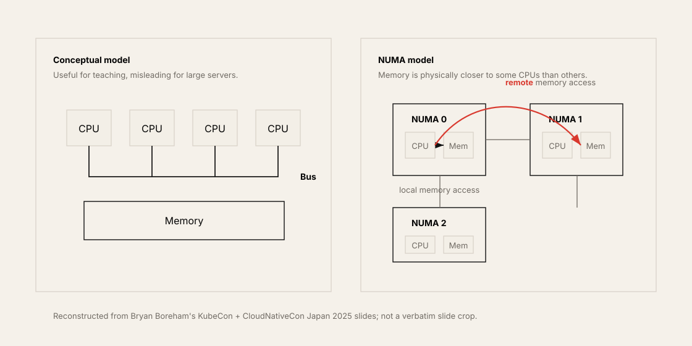
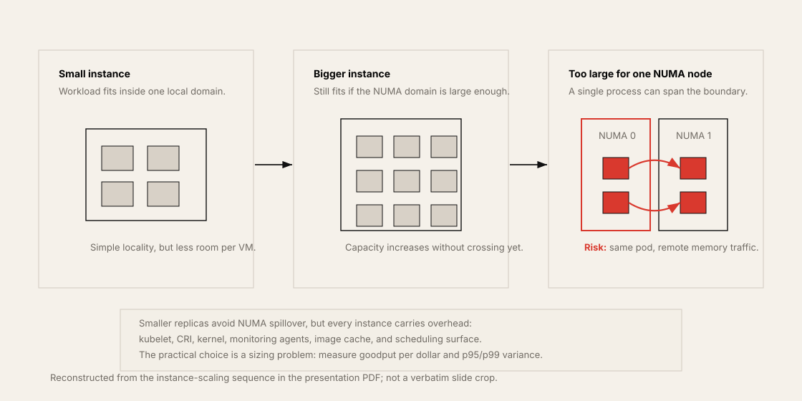
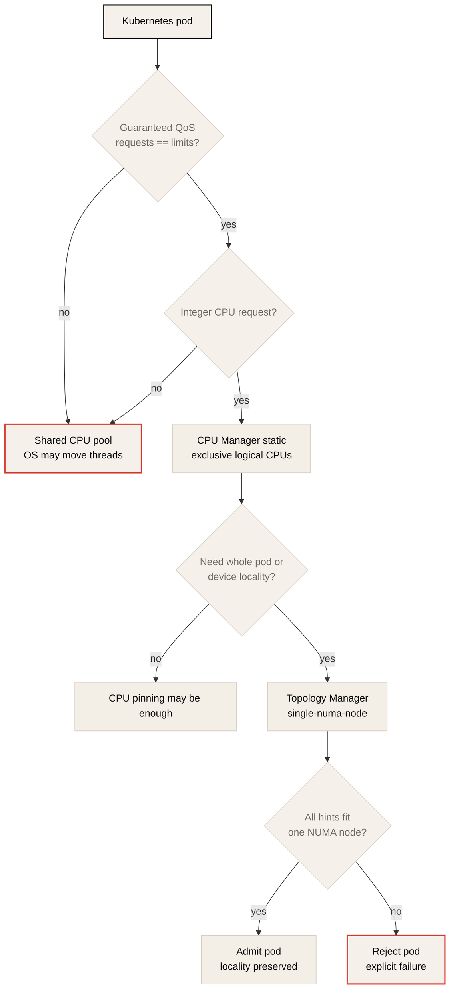
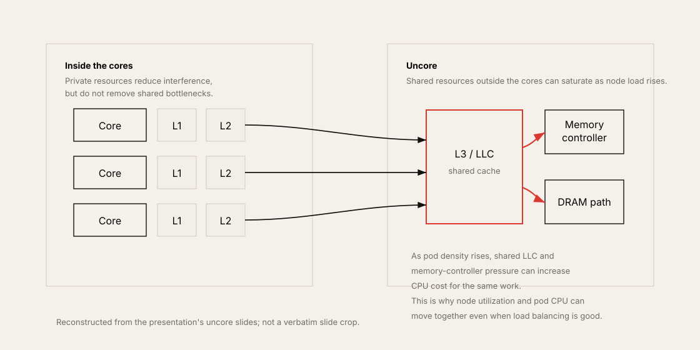

# Never Underestimate Memory Architecture

> Summary notes for Bryan Boreham, Grafana Labs, CNCF talk.
> Original video: [Never Underestimate Memory Architecture - Bryan Boreham, Grafana Labs](https://www.youtube.com/watch?v=C6aBa1vnYT4)
> Slides: [Never Underestimate Memory Architecture.pdf](https://hosted-files.sched.co/kccncjpn2025/c9/Never%20Underestimate%20Memory%20Architecture.pdf)

## One-Line Summary

On large servers and cloud VMs, CPU, memory, cache, and PCIe devices are not connected uniformly. When a workload crosses NUMA boundaries and shared uncore resources, it can do the same work with much worse CPU usage, step time, and p99 latency.

## Why This Talk Matters

A common mistake when looking at GPU workload performance is to look only at the GPU kernel, CUDA libraries, and NCCL. But in both training and inference, the host-side path outside the GPU feeds the GPU.

In training, the CPU dataloader, preprocessing, pinned memory staging, kernel launch, and checkpoint serialization matter. In inference, tokenization, request batching, the scheduler thread, the model server event loop, H2D copy, and postprocessing matter. If these CPU tasks and host memory are placed in a NUMA domain far from the GPU and NIC, the GPU waits for data even though it has compute resources.

Bryan Boreham's talk explains this problem starting from a real Grafana Cloud production case. The conclusion is simple. A big machine is not simply a scaled-up version of a small machine. Past a certain size, the memory architecture itself becomes part of the performance model.

## Grafana's Real NUMA Incident

The talk starts from the metrics ingest dashboard of Grafana Cloud. The metrics ingest workload should have very stable CPU usage, because customers repeatedly send the same shape of metrics. But one day, only three out of hundreds of machines were using far more CPU.

At first it looked like application imbalance, but plotting machine type together revealed the commonality. The problematic nodes were all AWS `m5a.12xlarge`. They were handling the same workload, but only that instance type was using more CPU.

The presenter tracked this cause for several days and explains that the NUMA topology was the core. In this case, a process that normally used about 8 CPUs started using the level of 14-15 CPUs. In the Q&A, he says the impact can be around 10% depending on the workload, or close to nearly 2x as in this case.

## What Is NUMA

NUMA stands for Non-Uniform Memory Access. The core meaning is that not every CPU can access every memory at the same cost.

In an introductory computer architecture diagram, several CPUs and memory appear to be connected to one bus. But real large servers cannot be built that way. If all CPUs and memory were connected by one bus, electrical signals would have to travel long paths, and bandwidth and latency would not be sustainable.

Real servers usually put a local memory controller and memory channels near the CPU socket, die, or chiplet. A CPU accesses memory near itself quickly and accesses memory near another CPU or chiplet through an interconnect.



The figure above is reconstructed based on the "Conceptually", "Reality", and "Non-Uniform Memory Access" slides of the talk material. It is not an original slide crop; it was redrawn in the repository style to explain these notes.

The example shown in the talk is as follows.

| Access type | Approximate latency |
| --- | ---: |
| local memory access | about 50 ns |
| remote memory access | about 140 ns |

In another AMD EPYC case, the access timing between cores ranged from about 32 ns at its fastest to about 220 ns at its slowest. This difference is not at the micro-optimization level. In a large in-memory workload, it can surface as application-level CPU cost and tail latency.

## Why Small Programs Hurt Less

The presenter emphasizes that not every program suffers from the NUMA problem. If a small program stays within one CPU region and a small memory footprint, Linux generally places memory near the CPU well enough.

The problem is programs that use many cores, have a large memory footprint, and have threads and allocations spanning multiple NUMA zones. The presenter cites Go services like Prometheus as an example. Such services use several GB of memory and many cores, so they can be affected by the NUMA topology.

This observation applies to AI workloads as-is. A small single-process experiment shows no problem, but the moment you increase the number of dataloader workers, use a large batch buffer, and move to a multi-GPU node, host-side locality appears as a performance variable.

## How to Check NUMA on a Cloud VM

It is hard to know the NUMA structure from a cloud provider's instance spec alone. AWS, Google Cloud, and Azure usually publish vCPU count, memory size, disk, and network performance, but do not clearly publish the number of NUMA zones and core mapping.

You must check directly.

```bash
lscpu
lscpu -e=CPU,CORE,SOCKET,NODE
numactl -H
```

If it is a GPU node, you should also look at the following.

```bash
nvidia-smi topo -m
```

Looking at the per-NUMA-node CPU list in `lscpu` output tells you which CPU set the process should be bound to. On a GPU server, you must also overlay the GPU/NIC PCIe topology here. In distributed training, if the GPU and NIC are far apart, the NCCL/RDMA path degrades; in inference, if the CPU worker is far from the GPU, request processing and H2D copy variance can grow.

```mermaid
flowchart LR
    A[Symptom<br/>same workload, higher CPU] --> B[Group by instance type]
    B --> C[Check NUMA shape<br/>lscpu / numactl]
    C --> D[Measure memory locality<br/>node-exporter zoneinfo]
    D --> E[If available<br/>perf / hardware counters]
    E --> F[Choose mitigation<br/>smaller VM / pinning / sizing]

    classDef primary fill:#F5F1EA,stroke:#111111,stroke-width:1.4px,color:#050505
    classDef secondary fill:#F3EFE7,stroke:#D8D1C7,stroke-width:1.2px,color:#050505
    classDef note fill:#F5F1EA,stroke:#D8D1C7,stroke-width:1px,color:#6F6A63
    classDef accent fill:#F5F1EA,stroke:#D9392E,stroke-width:2px,color:#050505
    class A primary
    class B,C,D,E secondary
    class F accent
```



## The Trap of Cloud Instance Selection

One axis of the problem Grafana experienced was the operating habit of naturally scaling up to large instances. Start with a small VM, and move to a bigger VM as the workload grows. But at some point the VM becomes larger than one NUMA zone. From then on, the program runs inside the same machine but on a non-uniform memory system.



The instance-size sequence in the talk material shows the operating pattern of "start with small instances and, as you move to larger instances, cross the NUMA boundary at some point". These notes reconstruct that flow so it also shows the cost/overhead trade-off.

The practical response the presenter gave was to avoid the problematic large `m5a.12xlarge`, `16xlarge` class. On the surface it is a simple fix, but the core principle is clear.

| Strategy | Meaning | Trade-off |
| --- | --- | --- |
| use smaller VMs | keep the program inside one NUMA zone | kernel, kubelet, and system overhead repeat per VM |
| horizontal scaling | split into many small replicas instead of one big process | load balancing and coordination are needed |
| change instance family | pick a VM with a larger NUMA zone or better topology | per-cloud-SKU measurement is needed |
| CPU affinity and memory binding | bind the process to a specific NUMA domain | operating complexity increases |

The same question must be asked in an AI cluster. Do not only ask "how many GPUs?"; also ask "how close are these GPUs to which CPU, memory, and NIC?".

## Kubernetes CPU Manager and Topology Manager

The Kubernetes default scheduler does not automatically guarantee the topology that application performance needs. You must enable the kubelet-side features before CPU placement starts to mean something.

The first feature emphasized in the talk is the CPU Manager.

```yaml
cpuManagerPolicy: "static"
```

With the `static` policy enabled, containers with integer CPU requests among Guaranteed QoS pods can be assigned exclusive CPUs. The important conditions here are the following.

| Requirement | Why it matters |
| --- | --- |
| CPU request and limit are equal | Guaranteed QoS condition |
| memory request and limit are also equal | affects pod-wide QoS and eviction risk |
| integer CPU request | target for exclusive CPU allocation |
| kubelet CPU Manager enabled | the default does not guarantee topology-aware allocation |

The Topology Manager is a feature that collects NUMA hints of resources such as CPU, devices, and hugepages and aligns them to the same NUMA node.

```yaml
topologyManagerPolicy: "single-numa-node"
```

The presenter describes the CPU Manager as a more general prescription and the Topology Manager as a more niche one. But on GPU training/inference nodes, the Topology Manager can become much more important. That is because if you do not align GPU, NIC, CPU core, and memory locality together, a GPU workload can have low goodput even in the Running state.



## Uncore: It Is Not Only Memory That Is Non-Uniform

An important concept in the second half of the talk is the uncore. It means the shared resources of the CPU package excluding the execution units and L1/L2 caches inside the core. For example, it includes the following.



| Resource | Why it matters |
| --- | --- |
| LLC/L3 cache | last-level cache shared by many cores |
| memory controller | DRAM access path |
| TLB-related structures | address translation cost |
| interconnect | traffic between socket, die, and chiplet |

In Grafana's observation, pods doing the same work showed a diagonal pattern where pod CPU usage rose as node-wide CPU utilization rose. This was not because load balancing was bad; the more the node was filled, the more the shared uncore resources became the bottleneck.

This shows that "noisy neighbor" does not mean only an external tenant. If replicas of the same service pressure each other's shared cache, memory controller, and interconnect within one node, you can become your own noisy neighbor.

## Connection to Training Workloads

In training, the NUMA problem appears through the following paths.

| Path | NUMA-sensitive reason |
| --- | --- |
| dataloader worker | CPU preprocessing and batch assembly must run on GPU-local CPUs |
| pinned memory | if page-locked host memory lands on a NUMA node far from the GPU, the H2D path degrades |
| NCCL/RDMA | if the GPU and NIC are in different NUMA/PCIe domains, collective latency and bandwidth degrade |
| checkpoint I/O | CPU memory, filesystem cache, and the storage/NIC path can create step time variance |
| MoE/expert parallel | all-to-all traffic and CPU scheduling variance can amplify expert load imbalance |

Therefore, the metrics to look at in distributed training are not the average of GPU utilization. You must look at step time variance, dataloader wait time, H2D copy time, NCCL collective time, CPU run queue, and remote memory access together.

## Connection to Inference Workloads

In inference, it often appears as p99 tail latency.

| Path | Possible symptom |
| --- | --- |
| tokenizer CPU thread | request preprocessing latency increase |
| dynamic batching scheduler | the batching window wobbles and GPU input cadence becomes unstable |
| H2D copy | prefill input or auxiliary tensor transfer delay |
| postprocessing | streaming response and sampling path jitter |
| colocated pods | CPU cache pollution, context switch, memory controller contention |

In LLM serving, looking only at the decode kernel can make the GPU look busy. But looking at TTFT, TPOT, queueing delay, and p99 reveals host-side jitter. NUMA locality is an operating condition that reduces this host-side jitter.

## Practical Checklist

### Node topology

```bash
lscpu -e=CPU,CORE,SOCKET,NODE
numactl -H
nvidia-smi topo -m
```

Questions to check:

- What is the CPU core to NUMA node mapping?
- Which CPU socket or NUMA node is the GPU close to?
- Which NUMA domain is the NIC close to?
- Is the GPU-GPU path NVLink, NVSwitch, or PCIe?

### Kubernetes placement

```bash
kubectl exec <pod> -c <container> -- taskset -cp 1
kubectl exec <pod> -c <container> -- grep Cpus_allowed_list /proc/1/status
```

Questions to check:

- Is the pod Guaranteed QoS?
- Is the CPU request an integer?
- Is `cpuManagerPolicy: static` enabled?
- Is it a workload that needs `topologyManagerPolicy: single-numa-node`?
- Does the CPU allocation fit inside one NUMA node?

### Performance counters

```bash
perf stat -e cache-misses,cache-references,cycles,instructions <command>
```

On a cloud VM, the hypervisor may hide hardware counters. On bare metal or newer instances, more counters may be visible. If L1/L2/LLC miss rate, memory bandwidth, and remote access counters are visible, you can check NUMA and uncore bottlenecks more directly.

## The Core Messages of the Talk

1. A big machine is not a uniform machine.
2. NUMA appears as a performance problem in workloads that use large programs, large memory footprints, and many cores.
3. It is hard to know the NUMA topology from a cloud instance spec alone.
4. Kubernetes does not automatically guarantee CPU locality.
5. CPU Manager, Guaranteed QoS, and integer CPU requests are the starting point of NUMA-aware placement.
6. Even in GPU workloads, you must look at host-side CPU, memory, and NIC locality.
7. Shared uncore resources such as cache, memory controller, and interconnect become shared bottlenecks, not just memory.
8. Sometimes a smaller replica that fits inside a NUMA zone gives a better performance/cost balance than a larger instance.

## Original and Link Materials

| Resource | Link |
| --- | --- |
| CNCF session page | <https://kccncjpn2025.sched.com/event/1x702/never-underestimate-memory-architecture-bryan-boreham-grafana-labs> |
| YouTube video | <https://www.youtube.com/watch?v=C6aBa1vnYT4> |
| PDF slides | <https://hosted-files.sched.co/kccncjpn2025/c9/Never%20Underestimate%20Memory%20Architecture.pdf> |
| Kubernetes Node Resource Managers | <https://kubernetes.io/docs/concepts/policy/node-resource-managers/> |
| Kubernetes Topology Manager | <https://kubernetes.io/docs/tasks/administer-cluster/topology-manager/> |
| Kubernetes CPU Management Policies | <https://kubernetes.io/docs/tasks/administer-cluster/cpu-management-policies/> |
| Prometheus node_exporter | <https://github.com/prometheus/node_exporter> |

### PDF slide mapping

| Topic in this note | Related PDF slides |
| --- | --- |
| Conceptual bus vs real NUMA | "Conceptually", "Reality", "Non-Uniform Memory Access" |
| NUMA latency | "Memory latency", "Memory latency, with hyperthreading", "Memory latency, m5a.12xlarge model" |
| Instance sizing trap | "Say you start with small instances", "Then you move to bigger instances", "And bigger", "You might be better off with multiple smaller instances" |
| Kubernetes controls | "CPU Manager", "Topology Manager" |
| Uncore | "Pods vs instances CPU plot", "`Uncore` = the parts outside of cores", CPU Manager `prefer-align-cpus-by-uncorecache` slide |

## Connections to This Repository

| Topic | Connection |
| --- | --- |
| Chapter 3: OS, Docker, and Kubernetes Tuning | a real case of NUMA, CPU Manager, Topology Manager, and the CPU feeding bottleneck |
| Chapter 4: Distributed Networking Communication | GPU/NIC locality, RDMA/NCCL path, collective communication variance |
| Training notes | dataloader, pinned memory, MoE all-to-all, step time variance |
| Efficient LLM Inference Systems | tokenization, batching, H2D copy, serving p99 latency |

## Follow-Up Questions

1. What NUMA/GPU/NIC structure do the current GPU node's `lscpu -e` and `nvidia-smi topo -m` results show?
2. Does the Kubernetes GPU pod satisfy the Guaranteed QoS and integer CPU request conditions?
3. Does training step time or inference p99 worsen as node utilization increases?
4. Which gives better goodput per dollar: one large instance or multiple small replicas?
5. If GPU utilization is high but useful throughput is low, can you suspect an uncore/cache/memory-controller bottleneck?
